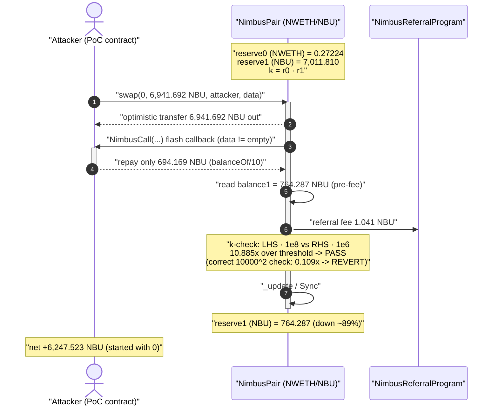
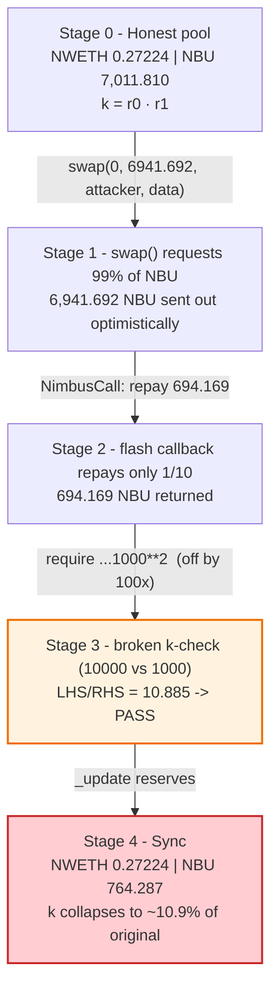
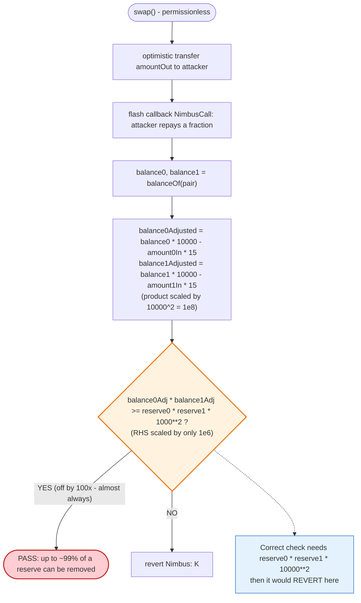
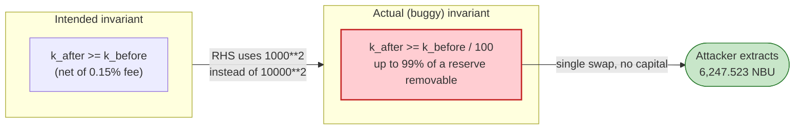

# NowSwap / Nimbus Exploit — Broken `k`-Invariant via a `10000` vs `1000` Scaling Mismatch

> **Reproduction:** the PoC compiles & runs in an isolated Foundry project at
> [this project folder](.) (the umbrella DeFiHackLabs repo contains many unrelated PoCs that
> do not whole-compile, so this one was extracted).
> Full verbose trace: [output.txt](output.txt).
> Verified vulnerable source: [NimbusPair.sol](sources/NimbusPair_A0Ff0e/NimbusPair.sol).

---

## Key info

| | |
|---|---|
| **Loss** | ~6,247.5 NBU drained from the NWETH/NBU pair in a single swap (the pool's NBU side was reduced ~89%) |
| **Vulnerable contract** | `NimbusPair` — [`0xA0Ff0e694275023f4986dC3CA12A6eb5D6056C62`](https://etherscan.io/address/0xA0Ff0e694275023f4986dC3CA12A6eb5D6056C62) |
| **Victim pool / tokens** | NWETH/NBU pair `0xA0Ff0e…56C62`; `token0` = NWETH-side `0x0BCd83DF58a1BfD25b1347F9c9dA1b7118b648a6`, `token1` = NBU `0xEB58343b36C7528F23CAAe63a150240241310049` |
| **Attacker contract** | `0x5676e585bf16387bc159fd4f82416434cda5f1a3` |
| **Vulnerable token (per PoC header)** | `0xa14660a33cc608b902f5bb49c8213bd4c8a4f4ca` (unverified at time of PoC) |
| **Chain / fork block / date** | Ethereum mainnet / 13,225,516 / September 2021 |
| **Compiler** | NimbusPair `v0.8.0+commit.c7dfd78e`, optimizer **on (999999 runs)** |
| **Bug class** | Broken constant-product (`x·y ≥ k`) check — dimensional/scaling mismatch in the swap invariant |

---

## TL;DR

`NimbusPair` is a Uniswap-V2 fork. Its `swap()` function ends with the usual "did `k` stay big enough?"
guard, but the two sides of that inequality are scaled by **different powers of ten**:

```solidity
uint balance0Adjusted = balance0.mul(10000).sub(amount0In.mul(15));   // LHS scaled by 10000
uint balance1Adjusted = balance1.mul(10000).sub(amount1In.mul(15));   // LHS scaled by 10000
require(balance0Adjusted.mul(balance1Adjusted)
        >= uint(_reserve0).mul(_reserve1).mul(1000**2), 'Nimbus: K');  // RHS scaled by 1000^2
```

The left-hand side scales each balance by `10000`, so the **product** is scaled by `10000² = 1e8`.
The right-hand side scales the reserve product by only `1000² = 1e6`. The two sides are off by a
factor of **100**. The net effect: the pair accepts any swap that leaves the pool with as little as
**1/100 of its original `k`**. In other words, a single swap may legally extract up to **~99%** of a
reserve.

The attacker simply called `pair.swap()` asking for **99% of the pool's NBU**, paid back only **1/10**
of what it received inside the swap callback, and walked away with the difference. The corrupted check
passed by a comfortable 10.9× margin; a correct Uniswap-V2 check would have reverted (it was short by
roughly 9×). Profit: **6,247.5 NBU** from an initial balance of **0**.

---

## Background — what NimbusPair is

`NimbusPair` ([source](sources/NimbusPair_A0Ff0e/NimbusPair.sol)) is the AMM pair contract of the
Nimbus / NowSwap ecosystem — a near-verbatim Uniswap-V2 `UniswapV2Pair` fork, with two notable
modifications:

1. A **referral program**: on every swap, a small fee (`amountIn × 3 / 1994`, ≈0.15%) of the input
   token is forwarded to `NimbusReferralProgram`
   ([NimbusPair.sol:386-401](sources/NimbusPair_A0Ff0e/NimbusPair.sol#L386-L401)).
2. A **lower swap fee** of `15 / 10000 = 0.15%` (Uniswap V2 uses `3 / 1000 = 0.30%`), which is what
   forced the developer to re-derive the `k`-check constants — and is where the bug was introduced.

Everything else — `mint`, `burn`, `swap`, `skim`, `sync`, the `lock` reentrancy modifier, the
optimistic-transfer + flash-swap callback pattern — is standard Uniswap V2.

In Uniswap V2 the swap invariant is written with a single consistent scale:

```solidity
// canonical UniswapV2Pair
uint balance0Adjusted = balance0 * 1000 - amount0In * 3;   // scale 1000, fee 3/1000
uint balance1Adjusted = balance1 * 1000 - amount1In * 3;
require(balance0Adjusted * balance1Adjusted >= reserve0 * reserve1 * 1000**2, 'UniswapV2: K');
```

Both sides are scaled by `1000²`, so the inequality is dimensionally homogeneous and reduces to the
true constraint `k_after ≥ k_before` (net of fees). When Nimbus changed the fee to `15/10000` it also
changed the balance scale from `1000` to `10000` on the LHS — but **forgot to change the RHS to match**
(it still uses `1000**2`). That single inconsistency is the entire vulnerability.

---

## The vulnerable code

[`NimbusPair.swap()` — sources/NimbusPair_A0Ff0e/NimbusPair.sol:365-410](sources/NimbusPair_A0Ff0e/NimbusPair.sol#L365-L410):

```solidity
function swap(uint amount0Out, uint amount1Out, address to, bytes calldata data) external override lock {
    require(amount0Out > 0 || amount1Out > 0, 'Nimbus: INSUFFICIENT_OUTPUT_AMOUNT');
    (uint112 _reserve0, uint112 _reserve1,) = getReserves();
    require(amount0Out < _reserve0 && amount1Out < _reserve1, 'Nimbus: INSUFFICIENT_LIQUIDITY');

    uint balance0;
    uint balance1;
    {
    address _token0 = token0;
    address _token1 = token1;
    require(to != _token0 && to != _token1, 'Nimbus: INVALID_TO');
    if (amount0Out > 0) _safeTransfer(_token0, to, amount0Out);   // optimistic transfer out
    if (amount1Out > 0) _safeTransfer(_token1, to, amount1Out);   // optimistic transfer out
    if (data.length > 0) INimbusCallee(to).NimbusCall(msg.sender, amount0Out, amount1Out, data); // ← attacker callback
    balance0 = IERC20(_token0).balanceOf(address(this));
    balance1 = IERC20(_token1).balanceOf(address(this));
    }
    uint amount0In = balance0 > _reserve0 - amount0Out ? balance0 - (_reserve0 - amount0Out) : 0;
    uint amount1In = balance1 > _reserve1 - amount1Out ? balance1 - (_reserve1 - amount1Out) : 0;
    require(amount0In > 0 || amount1In > 0, 'Nimbus: INSUFFICIENT_INPUT_AMOUNT');

    /* ... referral fee block, lines 386-401 ... */

    { // scope for reserve{0,1}Adjusted, avoids stack too deep errors
    uint balance0Adjusted = balance0.mul(10000).sub(amount0In.mul(15));   // ⚠️ LHS × 10000
    uint balance1Adjusted = balance1.mul(10000).sub(amount1In.mul(15));   // ⚠️ LHS × 10000
    require(balance0Adjusted.mul(balance1Adjusted)
            >= uint(_reserve0).mul(_reserve1).mul(1000**2), 'Nimbus: K');  // ⚠️ RHS × 1000^2
    }

    _update(balance0, balance1, _reserve0, _reserve1);
    emit Swap(msg.sender, amount0In, amount1In, amount0Out, amount1Out, to);
}
```

The offending lines are
[NimbusPair.sol:402-406](sources/NimbusPair_A0Ff0e/NimbusPair.sol#L402-L406).

---

## Root cause — why it was possible

The `k`-check is supposed to enforce, after fees, that the product of reserves does not shrink:

```
balance0Adjusted · balance1Adjusted  ≥  reserve0 · reserve1 · (scale²)
```

For the inequality to mean anything, the `scale` on the LHS (applied once per balance, so `scale²` in
the product) must equal the `scale²` on the RHS. Nimbus broke that:

| Side | Scale per term | Scale of product |
|---|---|---|
| LHS `balanceN.mul(10000)` | `10000` | `10000² = 1e8` |
| RHS `…mul(1000**2)` | — | `1000² = 1e6` |

LHS is `100×` larger than it should be for the comparison to be apples-to-apples. Concretely, the
require reduces (ignoring the tiny fee terms) to:

```
balance0 · balance1 · 1e8  ≥  reserve0 · reserve1 · 1e6
⇔ balance0 · balance1      ≥  reserve0 · reserve1 / 100
⇔ k_after                  ≥  k_before / 100
```

**A swap is accepted as long as it leaves at least 1% of `k` behind.** That allows a swapper to remove
up to ~99% of a reserve in a single call while still passing the guard. The fee terms (`amountIn·15`)
are negligible at these magnitudes and do not save the pool.

This is a pure dimensional-analysis bug: the developer changed the fee denominator from `1000` to
`10000` on the LHS to express a 0.15% fee, but left the RHS reference scale at the original Uniswap
`1000**2`. There is no economic or access-control prerequisite — the broken inequality is reachable by
*anyone* who can call `swap()`, which is permissionless by design.

---

## Preconditions

- **None beyond a funded, tradable pair.** `swap()` is permissionless. The attacker needs no roles, no
  prior position, and no capital up front — it uses the flash-swap callback (`NimbusCall`) to repay
  *out of the borrowed tokens themselves*.
- The pair must hold liquidity to drain (here ≈7,011.8 NBU on the NBU side).
- Because repayment happens inside the same `swap()` call from the borrowed funds, the attack is fully
  **atomic / self-financing** — no external flash loan is even required.

---

## Step-by-step attack walkthrough (numbers from the trace)

The PoC contract *is* the attacker contract. token0 = NWETH-side `0x0BCd…48a6`, token1 = NBU. The
attacker only ever touches the NBU (token1) side; the NWETH (token0) reserve is never moved.

All figures are taken directly from [output.txt](output.txt) (the swap call, the `Transfer`/`Sync`/`Swap`
events, and the pre/post `balanceOf` static-calls).

| # | Step | What happens | NBU figure |
|---|------|--------------|-----------:|
| 0 | **Start** | Attacker NBU balance = 0; pool NBU reserve (token1) = 7,011.810; pool NWETH reserve (token0) = 0.27224 | reserve1 = 7,011.810 |
| 1 | **Compute output** | `amount = balanceOf(pair) · 99/100` → ask for **99%** of the pool's NBU ([NowSwap_exp.sol:27](test/NowSwap_exp.sol#L27)) | 6,941.692 |
| 2 | **Call `swap(0, amount, attacker, data)`** | `amount1Out = 6,941.692` NBU optimistically transferred to attacker; non-empty `data` triggers the flash callback ([NowSwap_exp.sol:29](test/NowSwap_exp.sol#L29)) | out = 6,941.692 |
| 3 | **Flash callback `fallback()`** | Attacker repays only `balanceOf(this) / 10` NBU back to the pair ([NowSwap_exp.sol:34-36](test/NowSwap_exp.sol#L34-L36)) | repay = 694.169 |
| 4 | **Referral fee** | Pair forwards `amountIn·3/1994` ≈ 1.041 NBU to `NimbusReferralProgram` (after the balance read used by the k-check) | fee = 1.041 |
| 5 | **Broken `k`-check** | `balance0Adj·balance1Adj ≥ reserve0·reserve1·1000²` evaluates **10.885× over** the threshold → passes. A correct `…·10000²` check would have been **0.1089×** → revert | k_after ≈ 10.89% of k_before |
| 6 | **`Sync`** | New reserves committed: reserve0 (NWETH) = 0.27224 (unchanged), reserve1 (NBU) = **764.287** | reserve1 ↓ 7,011.8 → 764.3 |
| 7 | **Done** | Attacker final NBU = **6,247.523** (= 6,941.692 out − 694.169 repaid) | **profit = 6,247.523** |

Console proof from the run:

```
Before exploiting 0
After  exploiting 6247523144463060082611   (= 6,247.523 NBU)
```

### The decisive math (verified against the trace)

Using the exact balances `_update`/`swap` read at runtime
(`balance0 = 0.27224 NWETH`, `balance1 = 764.287 NBU`, `amount1In = 694.169`, `amount0In = 0`,
`reserve0 = 0.27224`, `reserve1 = 7,011.810`):

| Quantity | Value | Meaning |
|---|---:|---|
| LHS `balance0Adj · balance1Adj` | `2.075e46` | what the contract computed |
| RHS buggy `r0·r1·1000²` | `1.909e45` | what it compared against |
| **LHS / RHS_buggy** | **10.885** | ≥ 1 → **check passes** |
| RHS correct `r0·r1·10000²` | `1.909e47` | what a sound check needs |
| **LHS / RHS_correct** | **0.1089** | < 1 → **would have reverted** |
| `k_after / k_before` (raw reserves) | **0.1089** | attacker drained **89%** of `k` |

The 100× scaling gap is exactly the ratio between "passes" (10.885) and "should-have-failed" (0.1089).

---

## Profit / loss accounting

| Direction | NBU |
|---|---:|
| Received from pool (`amount1Out`) | +6,941.692 |
| Repaid into pool (flash callback, `balanceOf/10`) | −694.169 |
| **Net to attacker** | **+6,247.523** |

The pool's NBU reserve fell from **7,011.810 → 764.287** (the 1.041 NBU referral fee accounts for the
small remainder beyond the 694.169 repaid). The attacker's outlay was **zero** — the swap is
self-financing via the flash callback. In the real incident this swap pattern was repeated /
generalized across Nimbus pools; the PoC demonstrates the core primitive on the NWETH/NBU pair at the
fork block.

---

## Diagrams

### Sequence of the attack



### Pool reserve evolution



### The flaw inside the `k`-check



### Why it is theft: the inequality before vs after



---

## Why each magic number

- **`amount = balanceOf(pair) · 99/100`** — the attacker asks for as close to the *entire* pool as the
  `amount1Out < reserve1` guard ([:368](sources/NimbusPair_A0Ff0e/NimbusPair.sol#L368)) and the broken
  `k`-check together allow. 99% sits comfortably inside the ~99% ceiling the bug permits.
- **`balanceOf(this) / 10`** (the repayment) — the attacker only needs to put back enough that the
  *off-by-100* inequality still holds. Repaying ~10% of the received amount lands the post-swap `k` at
  ~10.9% of the original, which clears the `/100` threshold with room to spare. Repaying less would risk
  falling under 1% of `k`; repaying ~10% maximizes profit while guaranteeing the check passes.
- **LHS `10000`, fee `15`** — Nimbus's intended 0.15% fee (`15/10000`). Correct in isolation.
- **RHS `1000**2`** — copied unchanged from Uniswap V2's 0.30%-fee design. This is the bug: it should
  have been `10000**2` to match the LHS scale.

---

## Remediation

1. **Make the `k`-check dimensionally consistent.** The reference scale on the RHS must equal the
   per-term scale on the LHS. Since the LHS uses `× 10000`, the RHS must use `× 10000**2`:

   ```diff
   - require(balance0Adjusted.mul(balance1Adjusted) >= uint(_reserve0).mul(_reserve1).mul(1000**2), 'Nimbus: K');
   + require(balance0Adjusted.mul(balance1Adjusted) >= uint(_reserve0).mul(_reserve1).mul(10000**2), 'Nimbus: K');
   ```

   With `10000**2`, the example swap evaluates to LHS/RHS = 0.109 and correctly reverts.

2. **Derive constants from a single source of truth.** Define `FEE_DENOMINATOR = 10000` and
   `FEE_NUMERATOR = 15` once, and express both the adjusted balances and the reference product in terms
   of `FEE_DENOMINATOR` so the two sides can never drift apart again.

3. **Unit-test the invariant directly.** A property test that asserts "any swap which reduces `k` below
   `k_before` reverts" would have caught this immediately. Fork-test against a known UniswapV2Pair to
   confirm identical accept/reject behavior for a battery of swap sizes.

4. **Treat any deviation from a battle-tested fork as high-risk.** The single line that diverged from
   canonical Uniswap V2 was the one that broke. Changes to fee math in a forked AMM must be reviewed as
   if they were novel cryptographic code.

---

## How to reproduce

The PoC was extracted into a standalone Foundry project (the umbrella DeFiHackLabs repo has many
unrelated PoCs that fail to whole-compile under `forge test`):

```bash
_shared/run_poc.sh 2021-09-NowSwap_exp --match-test testExploit -vvvvv
```

- RPC: an **Ethereum mainnet archive** endpoint is required (fork block 13,225,516, Sept 2021).
  `foundry.toml`'s `mainnet` endpoint serves historical state at that block; pruned RPCs will fail with
  `header not found` / `missing trie node`.
- Result: `[PASS] testExploit()`.

Expected tail:

```
Ran 1 test for test/NowSwap_exp.sol:ContractTest
[PASS] testExploit() (gas: 145952)
Logs:
  Before exploiting 0
  After exploiting 6247523144463060082611

Suite result: ok. 1 passed; 0 failed; 0 skipped
```

`6247523144463060082611 wei = 6,247.523 NBU` is the attacker's net take from the single swap.

---

*Bug class: broken constant-product `k`-invariant from a `10000` vs `1000` scaling mismatch in a
Uniswap-V2 fork. Root cause confirmed both by source inspection
([NimbusPair.sol:402-406](sources/NimbusPair_A0Ff0e/NimbusPair.sol#L402-L406)) and by reconstructing
the on-chain `k`-check from the verbose trace (passes at 10.885×; a correct check fails at 0.109×).*
