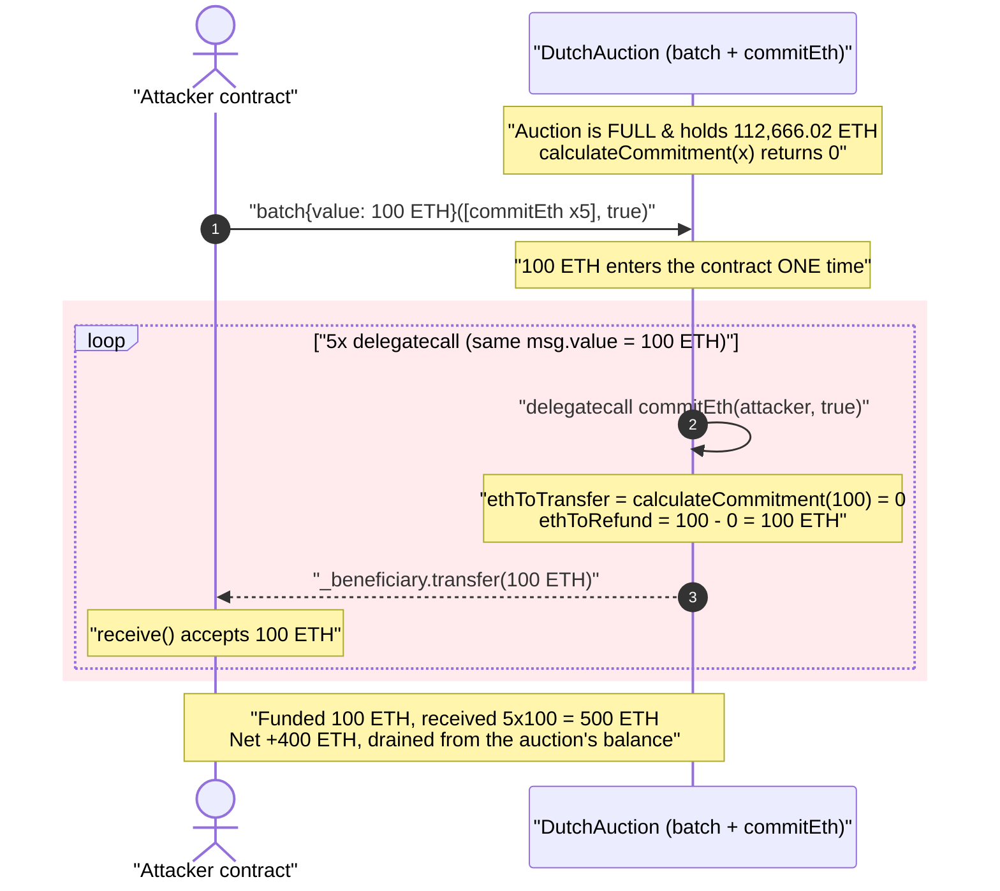
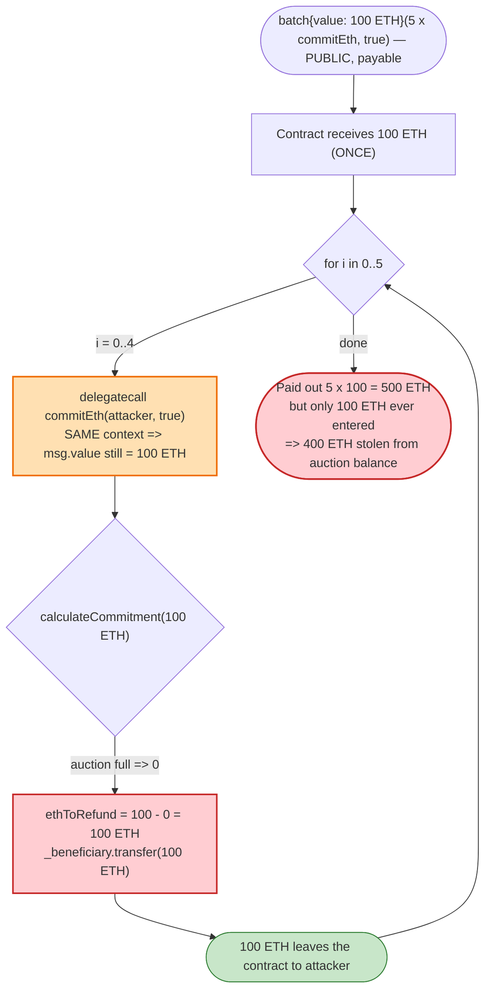
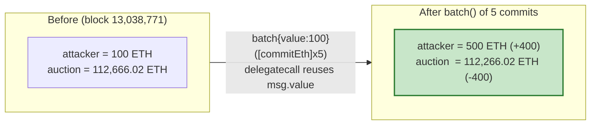

# MISO / SushiSwap Dutch Auction — `batch()` `delegatecall` Reuses `msg.value`

> **Reproduction:** the PoC compiles & runs in an isolated Foundry project at
> [this project folder](.) (the umbrella DeFiHackLabs repo contains many
> unrelated PoCs that do not whole-compile, so this one was extracted).
> Full verbose trace: [output.txt](output.txt).
> Verified vulnerable source: [contracts_Auctions_DutchAuction.sol](sources/DutchAuction_4c4564/contracts_Auctions_DutchAuction.sol)
> and [contracts_Utils_BoringBatchable.sol](sources/DutchAuction_4c4564/contracts_Utils_BoringBatchable.sol).

---

## Key info

| | |
|---|---|
| **Loss (PoC-reproduced)** | **400 ETH** drained from the live `DutchAuction` at fork block 13,038,771 (100 ETH committed → 500 ETH returned). The real Sept-2021 incident moved **~864.8 ETH (~$3M)**; it was a whitehat rescue by samczsun and the funds were returned. |
| **Vulnerable contract** | `DutchAuction` (MISO market template 2) — [`0x4c4564a1FE775D97297F9e3Dc2e762e0Ed5Dda0e`](https://etherscan.io/address/0x4c4564a1FE775D97297F9e3Dc2e762e0Ed5Dda0e#code) |
| **Root entry point** | `BoringBatchable.batch()` (inherited) + `commitEth()` |
| **Victim** | The auction contract's own ETH balance (LP/commitment funds held by the auction) |
| **Attacker (PoC)** | `ContractTest` test contract `0x7FA9385bE102ac3EAc297483Dd6233D62b3e1496` (Foundry default) |
| **Fork chain / block** | Ethereum mainnet / **13,038,771** |
| **Incident date** | September 17, 2021 |
| **Compiler** | Solidity **v0.6.12+commit.27d51765**, optimizer **on, 200 runs** |
| **Bug class** | `msg.value` reused across `delegatecall`s in a batched-call loop (value-double-counting / refund amplification) |

---

## TL;DR

`DutchAuction` inherits `BoringBatchable`, which exposes a public, `payable`
`batch(bytes[] calls, bool revertOnFail)` that executes each supplied calldata via
**`address(this).delegatecall(...)` in a loop**
([contracts_Utils_BoringBatchable.sol:35-44](sources/DutchAuction_4c4564/contracts_Utils_BoringBatchable.sol#L35-L44)).

Because `delegatecall` runs in the **same call context**, `msg.value` is **the same
value for every iteration of the loop**. So if you `batch()` five copies of
`commitEth(...)` while sending 100 ETH **once**, every one of the five inner
`commitEth` calls independently sees `msg.value == 100 ETH`.

At the fork block the auction is already full — `calculateCommitment(100 ETH)`
returns **0** — so each `commitEth` takes the "refund" branch and sends the entire
`msg.value` back to the caller:

```solidity
uint256 ethToRefund = msg.value.sub(ethToTransfer); // 100 ETH - 0 = 100 ETH
if (ethToRefund > 0) { _beneficiary.transfer(ethToRefund); } // refund 100 ETH
```

Five iterations refund **5 × 100 = 500 ETH** while the attacker funded the transaction
with only **100 ETH**. The extra **400 ETH** is paid out of the auction's existing
balance (other people's committed funds). The trace confirms it exactly: attacker ETH
`100 → 500`, auction ETH `112,666.02 → 112,266.02` (−400).

---

## Background — MISO Dutch Auction

`DutchAuction` ([source](sources/DutchAuction_4c4564/contracts_Auctions_DutchAuction.sol))
is Sushi's MISO launchpad market: a declining-price ("Dutch") auction where bidders
*commit* ETH (or an ERC20) and later claim a pro-rata share of the auctioned token.

The relevant pieces:

- **ETH commits** go through `commitEth(address payable _beneficiary, bool agreed)`
  ([:263-285](sources/DutchAuction_4c4564/contracts_Auctions_DutchAuction.sol#L263-L285)).
  It is `public payable` but, deliberately, **not** `nonReentrant` (the token-commit
  path `commitTokensFrom` *is* `nonReentrant`, but the ETH path is not).
- **Over-commit handling**: `calculateCommitment(_commitment)`
  ([:364-370](sources/DutchAuction_4c4564/contracts_Auctions_DutchAuction.sol#L364-L370))
  caps a commitment at the remaining headroom `maxCommitment - commitmentsTotal`. Once
  the auction is full this returns **0**, and `commitEth` refunds the whole `msg.value`.
- **Batching**: `DutchAuction` extends `BoringBatchable`
  ([:57](sources/DutchAuction_4c4564/contracts_Auctions_DutchAuction.sol#L57)),
  a convenience helper that lets a user bundle several calls to the contract into one
  transaction. The helper's design note explicitly assumes batch sub-calls only ever
  *consume* `msg.value`, not refund it.

The fatal interaction is between the **refund path** in `commitEth` and the
**`delegatecall` loop** in `batch`.

---

## The vulnerable code

### 1. `batch()` — `delegatecall` in a loop, all sharing `msg.value`

[contracts_Utils_BoringBatchable.sol:35-44](sources/DutchAuction_4c4564/contracts_Utils_BoringBatchable.sol#L35-L44):

```solidity
// F2: Calls in the batch may be payable, delegatecall operates in the same context,
//     so each call in the batch has access to msg.value
function batch(bytes[] calldata calls, bool revertOnFail)
    external payable
    returns (bool[] memory successes, bytes[] memory results)
{
    successes = new bool[](calls.length);
    results = new bytes[](calls.length);
    for (uint256 i = 0; i < calls.length; i++) {
        (bool success, bytes memory result) = address(this).delegatecall(calls[i]); // ⚠️
        require(success || !revertOnFail, _getRevertMsg(result));
        successes[i] = success;
        results[i] = result;
    }
}
```

The developer comment `F2` even *documents* that every batched call "has access to
`msg.value`" — treating that as a feature. It is the bug: for a function that **pays
ETH out based on `msg.value`**, re-exposing the same `msg.value` N times mints N×
refunds out of thin air.

### 2. `commitEth()` — refunds the full `msg.value` when the auction is full

[contracts_Auctions_DutchAuction.sol:263-285](sources/DutchAuction_4c4564/contracts_Auctions_DutchAuction.sol#L263-L285):

```solidity
function commitEth(address payable _beneficiary, bool readAndAgreed)
    public payable
{
    require(paymentCurrency == ETH_ADDRESS, "...not ETH address");
    if (readAndAgreed == false) { revertBecauseUserDidNotProvideAgreement(); }

    uint256 ethToTransfer = calculateCommitment(msg.value);   // == 0 when auction full
    uint256 ethToRefund   = msg.value.sub(ethToTransfer);     // == msg.value (100 ETH)

    if (ethToTransfer > 0) { _addCommitment(_beneficiary, ethToTransfer); }
    if (ethToRefund > 0)   { _beneficiary.transfer(ethToRefund); }   // ⚠️ pays 100 ETH each call
}
```

`commitEth` is **not** `nonReentrant`, and crucially it does not track how much ETH the
contract *actually received in this transaction*. It trusts `msg.value` as the source of
truth for "how much did this caller pay," which is false once `batch()` replays the value.

---

## Root cause — why it was possible

A normal external call gives each callee its own `msg.value` (and ETH actually moves).
`DELEGATECALL`, by EVM design, **preserves the caller's `msg.value`** without moving any
ETH — the callee executes "as if it were the same call." `batch()` issues N
`delegatecall`s in sequence, so all N sub-calls observe the identical `msg.value` even
though only **one** `msg.value` worth of ETH ever entered the contract.

`commitEth` then makes a fatal assumption:

> "`msg.value` is the amount this user just paid me, so refunding `msg.value − committed`
> simply returns their unused change."

Under `batch`+`delegatecall` that assumption breaks. The contract pays out
`msg.value` per iteration, but received `msg.value` **once**. The surplus is financed by
the auction's pre-existing ETH balance — funds belonging to other committers.

The four facts that compose into the exploit:

1. **`batch()` loops `delegatecall` and re-exposes `msg.value`** — by design, and even
   documented as intentional.
2. **`commitEth` refunds based on `msg.value`, not on actually-received ETH** — and there
   is no running "received so far" accounting within the transaction.
3. **`commitEth` is not `nonReentrant`** (unlike `commitTokensFrom`), so nothing stops it
   being called many times in one context.
4. **The auction was already full**, so every `commitEth` hit the pure-refund path with
   `ethToTransfer = 0`, making the refund maximal (the entire `msg.value`) each time.

Even if the auction were *not* full, an attacker could still extract value by sizing
`msg.value` so each call commits a little and refunds the rest — but the full-auction
state makes the math trivial: 100% of every `msg.value` is refunded.

---

## Preconditions

- The auction accepts ETH (`paymentCurrency == ETH_ADDRESS`) so `commitEth` is the live
  payment path.
- The contract holds ETH from prior honest commitments (here **112,666.02 ETH**) — this is
  the pool the surplus refunds are drawn from.
- `calculateCommitment(msg.value)` returns `0` (auction full / over the cap), so each
  `commitEth` refunds the entire `msg.value`. (Not strictly required for a profit, but it
  maximizes extraction per call.)
- The caller's address can receive ETH (the PoC's `ContractTest` has a `receive()` that
  accepts the refunds — visible in the trace).
- No reentrancy guard on `commitEth` and `batch` is public — both true here.

No flash loan, no oracle, no privileged role. The only working capital needed is the
single `msg.value` (100 ETH in the PoC), which is **fully returned** in the same
transaction — so the attack is effectively free / flash-loanable.

---

## Attack walkthrough (with on-chain numbers from the trace)

All figures are read directly from [output.txt](output.txt).

| # | Step | Trace evidence | ETH effect |
|---|------|----------------|-----------:|
| 0 | **Initial** — fork at block 13,038,771. Attacker funds itself with a huge ETH balance (PoC sends spare ETH to `address(0)`, leaving exactly 100 ETH). | `Before … attacker: 100e18`, `DutchAuction: 112666.02e18` | attacker 100 / auction 112,666.02 |
| 1 | **Build payload** — `commitEth.selector ++ uint256(attacker) ++ uint256(1)`, i.e. `commitEth(attacker, true)`. Push it **5 times** into `data`. | `0x29762960…2b3e1496…0001` (selector `0x29762960`, beneficiary = attacker, agreed = 1) | — |
| 2 | **`batch{value: 100 ETH}(data, true)`** — one transaction, 100 ETH attached once. | `DutchAuction::batch{value: 100e18}([…5 identical payloads…], true)` | auction receives **100 ETH** (one time) |
| 3 | **Loop iter 1** — `delegatecall commitEth(attacker, true)`; sees `msg.value = 100 ETH`; auction full ⇒ refund 100 ETH to attacker. | `commitEth{value: 100e18}(…)` → `ContractTest::receive{value: 100e18}()` | auction → attacker: 100 ETH |
| 4 | **Loop iter 2** — same; refund 100 ETH again. | second `commitEth{value: 100e18}` → `receive{value: 100e18}` | auction → attacker: 100 ETH |
| 5 | **Loop iter 3** | third `commitEth{value: 100e18}` → `receive{value: 100e18}` | auction → attacker: 100 ETH |
| 6 | **Loop iter 4** | fourth `commitEth{value: 100e18}` → `receive{value: 100e18}` | auction → attacker: 100 ETH |
| 7 | **Loop iter 5** | fifth `commitEth{value: 100e18}` → `receive{value: 100e18}` | auction → attacker: 100 ETH |
| 8 | **End** — attacker funded 100 ETH, received 5×100 = 500 ETH. | `After … attacker: 500e18`, `DutchAuction: 112266.02e18` | **attacker +400 / auction −400** |

Each inner `commitEth` returns `[Stop]` after the `transfer` lands in
`ContractTest::receive`, confirming the pure-refund branch (`ethToTransfer = 0`,
`ethToRefund = msg.value`).

### Profit accounting (ETH)

| Direction | Amount |
|---|---:|
| Funded into `batch` (msg.value, once) | 100.00 |
| Refunded back, iter 1 | 100.00 |
| Refunded back, iter 2 | 100.00 |
| Refunded back, iter 3 | 100.00 |
| Refunded back, iter 4 | 100.00 |
| Refunded back, iter 5 | 100.00 |
| **Total received** | **500.00** |
| **Net profit** | **+400.00** |

`auction balance: 112,666.02 → 112,266.02 ETH` (−400.00) — the surplus is paid straight
out of the auction's committed funds. Scaling the batch length linearly scales the theft;
in the live incident the attacker pushed far more iterations to extract ~864.8 ETH before
the contract ran dry / was rescued.

---

## Diagrams

### Sequence of the attack



### Why one `msg.value` becomes five refunds



### State: ETH balances before vs after



---

## Why each magic number

- **`100 ETH` (`msg.value`):** the single funding amount. Since the auction is full it is
  refunded in its entirety on every iteration; its size sets the per-iteration theft.
- **5 copies of `commitEth`:** the batch length. Profit = `(N − 1) × msg.value`, so
  `N = 5` yields `4 × 100 = 400 ETH`. The cap is the auction's remaining ETH balance.
- **Payload `0x29762960 ++ pad(attacker) ++ pad(1)`:** ABI-encoded
  `commitEth(address,bool)` with `_beneficiary = attacker` and
  `readAndAgreedToMarketParticipationAgreement = true` (so the agreement check at
  [:270-272](sources/DutchAuction_4c4564/contracts_Auctions_DutchAuction.sol#L270-L272)
  passes). The selector `0x29762960` matches `commitEth(address,bool)`.
- **`payable(address(0)).transfer(7.92e28)`:** PoC bookkeeping only — it sheds the
  Foundry default 2^96-wei balance so the "before" attacker balance reads a clean
  100 ETH and the +400 ETH profit is unambiguous.

---

## Remediation

1. **Do not reuse `msg.value` across batched sub-calls.** `BoringBatchable.batch` must not
   be combined with any `payable` function that *refunds* or otherwise pays out based on
   `msg.value`. Either (a) forbid `payable` sub-calls in `batch`, or (b) track a running
   "ETH consumed so far" and pass each sub-call only its remaining share, reverting if the
   sum exceeds the actual `msg.value`.
2. **Refund based on actually-received ETH, not `msg.value`.** Compute the contract's ETH
   delta for the transaction (or accept commitments against an explicit, tracked deposit)
   rather than trusting `msg.value`, which is not unique under `delegatecall` batching.
3. **Add `nonReentrant` to `commitEth`** (as `commitTokensFrom` already has). It would not
   fully fix `delegatecall` value-reuse, but it removes the broader class of re-entrant
   refund abuse and is a cheap defense-in-depth.
4. **Make the contract single-`delegatecall`-context-safe.** Functions that move ETH should
   assert they are not being invoked inside a `batch`/`multicall` that has already consumed
   `msg.value` (e.g., a transient "value spent" guard cleared at transaction end).
5. **Audit every `multicall`/`batch`-style helper for value double-spend.** This exact
   pattern (Multicall/`delegatecall` + `msg.value`-reading payable function) has caused
   repeated incidents; treat any `payable` + `delegatecall`-loop combination as a finding.

---

## How to reproduce

The PoC was extracted into a standalone Foundry project (the umbrella DeFiHackLabs repo
does not whole-compile under `forge test`):

```bash
_shared/run_poc.sh 2021-09-Sushimiso_exp --mt testExploit -vvvvv
```

- RPC: an Ethereum **mainnet** endpoint with state at block **13,038,771** (`foundry.toml`
  uses an Infura mainnet URL under the `mainnet` alias). Any archive-capable mainnet RPC
  works for this ~4-year-old block.
- Result: `[PASS] testExploit()` — attacker balance `100 → 500 ETH`, auction balance
  `112,666.02 → 112,266.02 ETH`.

Expected tail:

```
Ran 1 test for test/Sushimiso_exp.sol:ContractTest
[PASS] testExploit() (gas: 596151)
Logs:
  Before exploit, ETH balance of attacker:: 100000000000000000000
  Before exploit, ETH balance of DutchAuction:: 112666020243246720000000
  After exploit, ETH balance of attacker:: 500000000000000000000
  After exploit, ETH balance of DutchAuction:: 112266020243246720000000

Suite result: ok. 1 passed; 0 failed; 0 skipped
```

---

*References: SushiSwap MISO Dutch Auction incident (Sept 17, 2021), whitehat rescue by
samczsun (~864.8 ETH / ~$3M). DeFiHackLabs PoC: `src/test/2021-09/Sushimiso_exp.sol`.*
