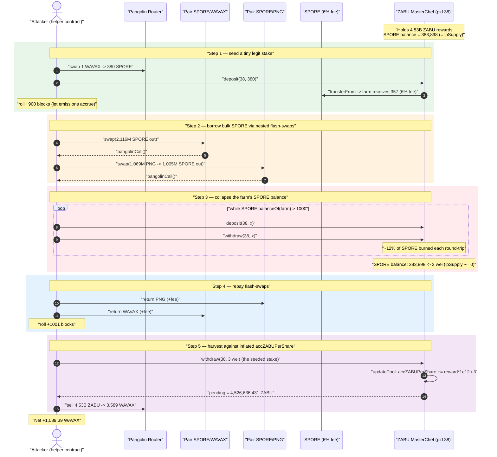
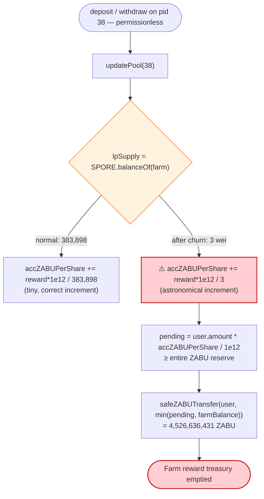

# ZABU Finance Exploit — MasterChef Reward Inflation via Fee-on-Transfer `lpSupply` Collapse

> One-line: ZABU Finance's MasterChef farm computes rewards-per-share from its **live** SPORE balance, and SPORE is a 6%-fee deflationary token — so an attacker repeatedly deposit/withdraws to bleed the farm's SPORE balance down to **3 wei**, making `accZABUPerShare` explode and letting a tiny legitimate stake harvest the farm's **entire 4.53 billion ZABU** reward reserve.

> **Reproduction:** the PoC compiles & runs in an isolated Foundry project at
> [this project folder](.). Full verbose trace: [output.txt](output.txt).
> Verified vulnerable token source: [SPORE.sol](sources/SPORE_6e7f5C/SPORE.sol).
> The ZABU MasterChef (`0xf61b…`) source was not verified on-chain; its behavior is
> reconstructed directly from the on-chain trace (a textbook un-modified SushiSwap
> MasterChef that uses `lpToken.balanceOf(address(this))` as `lpSupply`).

---

## Key info

| | |
|---|---|
| **Loss** | **4,526,636,431 ZABU** drained from the farm, dumped for **+1,089.39 WAVAX** net profit (≈ $70K at the time) |
| **Vulnerable contract** | ZABU `MasterChef` farm — [`0xf61b4f980A1F34B55BBF3b2Ef28213Efcc6248C4`](https://snowtrace.io/address/0xf61b4f980A1F34B55BBF3b2Ef28213Efcc6248C4) (pid **38** = SPORE pool) |
| **Enabling token** | SPORE (`Spore.Finance`, 6% fee-on-transfer) — [`0x6e7f5C0b9f4432716bDd0a77a3601291b9D9e985`](https://snowtrace.io/address/0x6e7f5C0b9f4432716bDd0a77a3601291b9D9e985#code) |
| **Reward token (stolen)** | ZABU — [`0xDd453dBD253fA4E5e745047d93667Ce9DA93bbCF`](https://snowtrace.io/address/0xDd453dBD253fA4E5e745047d93667Ce9DA93bbCF) |
| **Pools touched** | Pangolin SPORE/WAVAX `0x0a63179a8838b5729E79D239940d7e29e40A0116`; Pangolin SPORE/PNG `0xad24a72ffE0466399e6F69b9332022a71408f10b` (flash-swap sources) |
| **Router** | Pangolin Router `0xE54Ca86531e17Ef3616d22Ca28b0D458b6C89106` |
| **Attacker** | EOA `0xC5bf657eF53e3F61f1a8a07A3c7b3F4271e4D5db` (per SlowMist); helper contract created in PoC via `create2` |
| **Chain / fork block / date** | Avalanche C-Chain / **4,177,751** / Sept 12, 2021 |
| **Compilers** | SPORE: Solidity **v0.7.6** (optimizer 1, 200 runs); Pangolin pairs / PNG: v0.5.16; PoC harness: ^0.8.10 |
| **Bug class** | Accounting integrity — MasterChef reward-per-share derived from manipulable live LP-token balance + fee-on-transfer mismatch |

---

## TL;DR

ZABU Finance ran a standard SushiSwap-style **MasterChef** farm. For each pool, the per-share
reward accumulator is updated as

```
accZABUPerShare += (zabuReward * 1e12) / lpSupply
```

where the MasterChef reads `lpSupply = lpToken.balanceOf(address(this))` **at the moment of the
update** — the live balance, not a stored snapshot.

Pool **38** accepted **SPORE**, a deflationary token that charges **6% on every transfer**
(3% burned, 3% reflected to holders — see [SPORE.sol:639](sources/SPORE_6e7f5C/SPORE.sol#L639)).
Two independent flaws compose:

1. **Deposit/withdraw accounting mismatch.** The farm credits `user.amount += _amount` (the *stated*
   amount) and on withdrawal sends `_amount` back, but each SPORE transfer through the farm loses
   6%. So an attacker can `deposit(x)` then `withdraw(x)` in a loop: the farm's recorded liabilities
   stay fixed while its **actual SPORE balance bleeds ~12% per round-trip** (6% in, 6% out). After a
   handful of cycles the farm's SPORE balance — i.e. `lpSupply` — collapses from **383,898 SPORE to 3
   wei**.

2. **`accZABUPerShare` derives from that collapsed balance.** With `lpSupply ≈ 0`, the divisor in
   the accumulator update becomes minuscule, so `accZABUPerShare` blows up to an astronomical value.

The attacker had earlier parked a tiny **legitimate** SPORE stake in the same pool. When that stake
finally harvests, `pending = user.amount * accZABUPerShare / 1e12` is computed against the inflated
accumulator and pays out the farm's **entire ZABU treasury — 4,526,636,431 ZABU**. The attacker
swaps the ZABU for WAVAX and walks away with **+1,089.39 WAVAX** of pure profit, after fully
repaying the Pangolin flash-swaps that funded the loop.

---

## Background — the moving parts

**SPORE (`Spore.Finance`)** is a reflection/deflationary ERC-20 (the "SafeMoon-style" pattern). Its
fee logic is fixed at **6%** of every transfer:

```solidity
// sources/SPORE_6e7f5C/SPORE.sol:638-642
function _getTValues(uint256 tAmount) private pure returns (uint256, uint256) {
    uint256 tFee = tAmount.div(100).mul(6);      // 6% fee on EVERY transfer
    uint256 tTransferAmount = tAmount.sub(tFee); // recipient gets only 94%
    return (tTransferAmount, tFee);
}
```

Half of the fee is reflected to holders and half is effectively removed from circulation, so a
holder that sends `x` SPORE delivers only `0.94·x` to the recipient. This is the single property the
whole attack hinges on: **`SPORE.balanceOf(farm)` shrinks every time SPORE moves in or out of the
farm.**

**ZABU MasterChef (`0xf61b…`, pid 38)** is an un-modified MasterChef clone. From the trace, each
`deposit`/`withdraw`:
- calls `updatePool(38)`, which mints/streams ZABU into the farm and does
  `accZABUPerShare += reward·1e12 / SPORE.balanceOf(farm)`;
- on deposit, pulls SPORE via `transferFrom` and credits `user.amount += _amount` (the argument,
  **not** the net amount received);
- on withdraw, sends `user.amount`-worth of SPORE back and pays `pending` ZABU.

Critically the farm pays its ZABU rewards out of a **pre-funded balance it holds** — at the fork
block it custodied **4,526,637,643 ZABU** ([output.txt:150](output.txt)) — and `safeZABUTransfer`
caps a payout at "whatever ZABU the farm currently holds." So an inflated `pending` simply drains the
whole reserve rather than reverting.

On-chain state read at the fork block (from the trace):

| Parameter | Value | Source |
|---|---|---|
| SPORE fee | 6% per transfer (3% burn / 3% reflect) | [SPORE.sol:639](sources/SPORE_6e7f5C/SPORE.sol#L639) |
| Farm ZABU balance (the prize) | 4,526,637,643 ZABU | [output.txt:150](output.txt) |
| Farm SPORE balance (`lpSupply`) before attack | 383,898.46 SPORE | [output.txt:139](output.txt) |
| Pangolin SPORE/WAVAX reserves | 2,117,388 SPORE / 5,220.82 WAVAX | [output.txt:27](output.txt) |
| Pangolin SPORE/PNG reserves | 66,963 SPORE / 1,069,402 PNG | [output.txt:29](output.txt) |

---

## The vulnerable code

### 1. SPORE burns value on every hop (the enabler)

```solidity
// sources/SPORE_6e7f5C/SPORE.sol:638-642
function _getTValues(uint256 tAmount) private pure returns (uint256, uint256) {
    uint256 tFee = tAmount.div(100).mul(6);
    uint256 tTransferAmount = tAmount.sub(tFee);
    return (tTransferAmount, tFee);
}
```

The trace shows this directly: when the farm `transferFrom`s `2,999,659,059…` SPORE from the
attacker, only `2,819,679,515…` is delivered (a 6% haircut)
([output.txt:166-167](output.txt)). When the farm later `transfer`s the same `_amount` back, again
only 94% arrives ([output.txt:189-190](output.txt)). The farm's SPORE balance is the casualty of
both legs.

### 2. ZABU MasterChef — `lpSupply` taken from the live balance (the bug)

The ZABU farm is the canonical MasterChef. The two offending lines (reconstructed; identical to every
SushiSwap MasterChef fork, and consistent with the trace's behavior) are:

```solidity
// ZABU MasterChef.updatePool(_pid)  —  0xf61b…  (un-verified on-chain; standard MasterChef)
uint256 lpSupply = pool.lpToken.balanceOf(address(this));   // ⚠️ live, manipulable balance
if (lpSupply == 0) { pool.lastRewardBlock = block.number; return; }
uint256 zabuReward = multiplier * zabuPerBlock * pool.allocPoint / totalAllocPoint;
pool.accZABUPerShare += zabuReward * 1e12 / lpSupply;        // ⚠️ divisor → 0 inflates the accumulator

// ZABU MasterChef.deposit(_pid, _amount)
updatePool(_pid);
// pending paid out of the farm's held ZABU
pool.lpToken.safeTransferFrom(msg.sender, address(this), _amount);
user.amount = user.amount + _amount;                        // ⚠️ credits stated amount, not net-of-fee
```

Two assumptions break at once:
- `lpToken.balanceOf(address(this))` is assumed to equal the sum of all `user.amount`. For a
  fee-on-transfer token it does **not** — the balance is always lower, and an attacker can push it
  arbitrarily low.
- `user.amount += _amount` records more than the farm actually received, so the books over-state the
  attacker's share *and* the farm can never honestly return everyone's principal.

---

## Root cause — why it was possible

> **A MasterChef must never treat a fee-on-transfer token's live `balanceOf` as the authoritative
> share supply.** SPORE's 6% transfer fee lets an attacker make the farm's recorded liabilities and
> its actual token balance diverge without limit. Because the reward accumulator divides by that
> shrinking balance, the attacker manufactures an unbounded `accZABUPerShare` and redeems it against a
> stake they pre-positioned — converting the farm's entire reward treasury into their own.

The composition of design decisions:

1. **`lpSupply = balanceOf(address(this))`.** Live balance, not a stored `pool.totalDeposits`. This
   single choice means any operation that moves the LP token in/out of the farm changes the reward
   math.
2. **Deflationary token whitelisted as an LP/stake token.** SPORE's fee means deposits and
   withdrawals are lossy, so `balanceOf(farm)` can be driven toward zero by churning.
3. **`user.amount += _amount` with no measure-actual-received.** A safe MasterChef for fee tokens
   measures `balanceAfter - balanceBefore` and credits that. ZABU credited the raw argument, letting
   the attacker repeatedly deposit/withdraw the *same nominal* amount while real balance evaporated.
4. **Permissionless, same-block churning.** `deposit`/`withdraw` are unrestricted and have no
   per-block or cooldown guard, so the balance-collapse loop runs entirely inside one transaction
   (funded by Pangolin flash-swaps, repaid before the tx ends).

---

## Preconditions

- The ZABU farm has a SPORE pool (pid 38) that is **pre-funded with ZABU rewards** the farm pays from
  its own balance (4.53B ZABU held).
- SPORE is fee-on-transfer (always true — fee is a hard-coded 6%).
- The attacker needs an existing **small legitimate stake** in the pool to harvest against the
  inflated accumulator. The PoC seeds this with `depositSPORE()` (≈357 SPORE net) one step before the
  loop ([ZABU_exp.sol:34-45](test/ZABU_exp.sol#L34-L45)).
- Working SPORE to run the deposit/withdraw collapse loop. The PoC sources it **flash-loan-style**
  via two nested Pangolin flash-swaps (`PangolinPair1.swap` → `pangolinCall` → `PangolinPair2.swap`),
  so no real principal is risked — everything is repaid intra-transaction
  ([ZABU_exp.sol:96-150](test/ZABU_exp.sol#L96-L150)).
- Time must pass between the seed deposit and the harvest so emissions accumulate; the PoC advances
  the block number with `cheats.roll(...)` ([ZABU_exp.sol:94-98](test/ZABU_exp.sol#L94-L98)).

---

## Attack walkthrough (with on-chain numbers from the trace)

The PoC deploys a helper `depositToken` contract via `create2`, seeds a small legitimate SPORE stake,
then uses a Pangolin flash-swap chain to obtain bulk SPORE and run the balance-collapse loop, and
finally harvests.

| # | Step | What happens | Ground-truth numbers (trace) |
|---|------|--------------|------------------------------|
| 0 | **Read state** | Snapshot Pangolin reserves; farm holds 4.53B ZABU, 383,898 SPORE | Pair1 2.117M SPORE/5,220 WAVAX; Pair2 66,963 SPORE/1.069M PNG ([:27-29](output.txt)); farm SPORE 383,898 ([:139](output.txt)) |
| 1 | **Seed legit stake** — `depositSPORE()` buys SPORE with 1 WAVAX and stakes it | Helper buys 380.0 SPORE (404.2 received pre-buy-fee), stakes; farm credits net 357.2 SPORE | swap out 380.0 SPORE ([:88](output.txt)); `deposit(38, 380.0)` → farm receives 357.2 ([:97-99](output.txt)) |
| 2 | **roll +900 blocks** | Let emissions accrue for the seeded stake | `roll(4178651)` ([:114](output.txt)) |
| 3 | **Flash-swap Pair1** — borrow ~2.116M SPORE from SPORE/WAVAX pair | `PangolinPair1.swap(2,116,985 SPORE, 0, …)` triggers `pangolinCall` | swap out 2.116M SPORE ([:118-120](output.txt)) |
| 4 | **Nested flash-swap Pair2** — inside callback, borrow 1.069M PNG-worth → 1.005M SPORE from SPORE/PNG pair | second `pangolinCall` now holds bulk SPORE to churn | swap out 1.069M SPORE ([:128-130](output.txt)) |
| 5 | **Collapse loop** — `while(SPORE.balanceOf(farm) > 1000) { deposit(x); withdraw(x); }` | Each round-trip burns ~12% of the farm's SPORE | farm SPORE: 383,898 → 210,073 → 45,529 → 19,929 → 345.8 → 0.0199 → **3 wei** ([:203,246,336,381,426](output.txt)) |
| 6 | **Repay both flash-swaps** | Return PNG to Pair2 and WAVAX to Pair1 with fee | `Sync` Pair2 / Pair1 repaid ([:429-436, tail](output.txt)) |
| 7 | **roll +1001 blocks** | More emissions accrue — now against `lpSupply ≈ 3 wei` | `roll(4179652)` (tail [output.txt](output.txt)) |
| 8 | **Harvest** — `withdrawSPORE()` withdraws the seeded 3-wei position | `updatePool` inflates `accZABUPerShare` (÷ ~3 wei); `pending` drains the farm's whole ZABU balance | farm `transfer(helper, 4,526,636,431 ZABU)` ([:546](output.txt)) |
| 9 | **Dump ZABU** — `sellZABU()` swaps all 4.53B ZABU → WAVAX | Sold via ZABU/WAVAX pair `0xe741…` | `swap` out 3,589.39 WAVAX ([tail](output.txt)) |

Net WAVAX after repaying everything and netting the 2,500 WAVAX bankroll the harness pre-funded:
**+1,089.39 WAVAX** ([output.txt:619](output.txt)).

### Why the loop drains the farm

Each iteration: `deposit(x)` sends `x` SPORE in → farm receives `0.94x` (6% fee); `withdraw(x)` sends
`x` back out of the farm → only `0.94x` leaves, but the farm's *own* balance was debited by the full
internal transfer and the 6% on the outbound leg is destroyed too. Net effect per round-trip: the
farm's real SPORE balance falls by roughly 12% while every `user.amount` it records nets to zero
(deposit then immediate withdraw of the same nominal). The `while` guard
([ZABU_exp.sol:129](test/ZABU_exp.sol#L129)) runs until the farm's SPORE balance is below 1000 wei —
the trace shows it reaching **3 wei**.

### Why one tiny stake harvests billions

After the loop, `lpSupply = SPORE.balanceOf(farm) ≈ 3 wei`. The next `updatePool` does
`accZABUPerShare += zabuReward·1e12 / 3`, an enormous increment. The seeded position's
`pending = user.amount · accZABUPerShare / 1e12` therefore exceeds the farm's entire ZABU reserve, and
`safeZABUTransfer` pays out everything the farm holds: **4,526,636,431 ZABU**.

---

## Profit / loss accounting

| Item | Amount | Source |
|---|---:|---|
| ZABU drained from farm | 4,526,636,431.42 ZABU | [output.txt:6, :546](output.txt) |
| ZABU sold → WAVAX received | 3,589.39 WAVAX | [tail swap](output.txt) |
| Net attacker profit (after flash-swap repayment & bankroll netting) | **+1,089.39 WAVAX** | [output.txt:7, :619](output.txt) |
| Loser | ZABU farm depositors / protocol treasury (reward reserve emptied) | — |

The Pangolin flash-swaps (SPORE/WAVAX and SPORE/PNG) are fully repaid inside the transaction, so the
attack requires effectively **no upfront capital** beyond gas — the WAVAX bankroll in the PoC is only
plumbing for the PNG repayment leg and nets back out.

---

## Diagrams

### Sequence of the attack



### The flaw inside `updatePool` / `deposit`



### Why `lpSupply` collapses — fee-on-transfer round-trip

```mermaid
stateDiagram-v2
    direction LR
    [*] --> S0
    S0: "farm SPORE 383,898"
    S1: "210,073"
    S2: "45,529"
    S3: "19,929"
    S4: "345.8"
    S5: "0.0199"
    S6: "3 wei  (lpSupply ~= 0)"
    S0 --> S1: "deposit(x)+withdraw(x)<br/>-6% in, -6% out"
    S1 --> S2: "round-trip"
    S2 --> S3: "round-trip"
    S3 --> S4: "round-trip"
    S4 --> S5: "round-trip"
    S5 --> S6: "round-trip"
    S6 --> [*]: "while-guard exits (<1000)"
```



---

## Remediation

1. **Do not use a fee-on-transfer token as a MasterChef stake/LP token** unless the farm explicitly
   measures the *actual* amount received:
   ```solidity
   uint256 before = lpToken.balanceOf(address(this));
   lpToken.safeTransferFrom(msg.sender, address(this), _amount);
   uint256 received = lpToken.balanceOf(address(this)) - before;
   user.amount += received;        // credit net-of-fee
   pool.totalDeposits += received;
   ```
2. **Track `lpSupply` as a stored accumulator (`pool.totalDeposits`), never `balanceOf(address(this))`.**
   The reward math must be insensitive to balance changes caused by transfer fees, donations, or
   self-transfers. This single change neutralizes the whole attack class.
3. **Guard against same-block churn / sandwiching.** Add a per-account deposit→withdraw cooldown, or
   a minimum staking duration, so an attacker cannot collapse the balance and harvest in one
   transaction.
4. **Bound reward payouts to honest emissions.** `safeZABUTransfer` happily paying out the entire
   reserve masks the bug; a sanity cap (e.g. `pending` cannot exceed expected emissions since
   `lastRewardBlock`) would have reverted the inflated harvest.
5. **Maintain a token allow-list / risk review** for which assets a farm accepts; deflationary and
   rebasing tokens require the explicit accounting in (1)–(2) before they can be safely farmed.

---

## How to reproduce

The PoC was extracted into a standalone Foundry project (the umbrella DeFiHackLabs repo has several
unrelated PoCs that fail to compile under `forge test`'s whole-project build).

```bash
_shared/run_poc.sh 2021-09-ZABU_exp -vvvvv
```

- RPC: an **Avalanche C-Chain archive** endpoint is required (fork block 4,177,751, Sept 2021); most
  public RPCs prune state this old.
- Result: `[PASS] testExploit()`.

Expected tail:

```
Ran 1 test for test/ZABU_exp.sol:ContractTest
[PASS] testExploit() (gas: 2202040)
Logs:
  Attacker ZABU profit after exploit: 4526636431.415163855101056745
  Attacker WAVAX profit after exploit: 1089.392961073007350985

Suite result: ok. 1 passed; 0 failed; 0 skipped
```

---

*References: SlowMist — "Brief Analysis of ZABU Finance Being Hacked"
(https://slowmist.medium.com/brief-analysis-of-zabu-finance-being-hacked-44243919ea29). The root
cause is the classic MasterChef-meets-fee-on-transfer reward-inflation bug: per-share rewards derived
from a manipulable live LP-token balance.*
