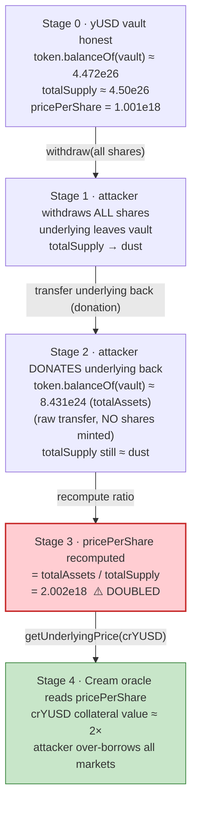
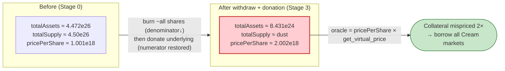

# Cream Finance (Oct 2021) Exploit — yUSD `pricePerShare` Donation-Inflation → Over-Collateralized Borrow

> **Vulnerability classes:** vuln/oracle/price-manipulation · vuln/arithmetic/precision-loss

> **Reproduction:** the PoC compiles & runs in an isolated Foundry project at
> [this project folder](.) (the umbrella DeFiHackLabs repo contains many
> unrelated PoCs that do not whole-compile, so this one was extracted).
> Full verbose trace: [output.txt](output.txt).
> Verified vulnerable source: [Vyper_contract.sol (yUSD vault)](sources/Vyper_contract_4B5BfD/Vyper_contract.sol).

---

## Key info

| | |
|---|---|
| **Loss** | ~**$130M** drained from Cream Finance lending markets (largest DeFi hack of 2021 at the time) |
| **Vulnerable contract** | `yUSD` Yearn V2 vault — [`0x4B5BfD52124784745c1071dcB244C6688d2533d3`](https://etherscan.io/address/0x4B5BfD52124784745c1071dcB244C6688d2533d3#code) — *as priced by* the Cream `PriceOracleProxy` for `crYUSD` |
| **Victim protocol** | Cream Finance — Comptroller/Unitroller `0x3d5BC3c8d13dcB8bF317092d84783c2697AE9258`; collateral market `crYUSD` `0x4BAa77013ccD6705ab0522853cB0E9d453579Dd4` |
| **Attacker EOA** | `0x24354D31bC9D90F62Fe5f2454709C32049cf866b` |
| **Attacker contracts** | `0x38c40427efbAAe566407e4cdE0F2a4017A6Fb04E` (and helpers) |
| **Attack tx** | [`0x0fe2542079644e107cbf13690eb9c2c65963ccb79089ff96bfaf8dced2331c92`](https://etherscan.io/tx/0x0fe2542079644e107cbf13690eb9c2c65963ccb79089ff96bfaf8dced2331c92) |
| **Chain / fork block / date** | Ethereum mainnet / **13,499,797** / Oct 27, 2021 |
| **Compiler** | yUSD vault: `vyper:0.2.11` (opt 1 run); Cream cTokens: `solc 0.5.17`; PoC: `^0.8.10` |
| **Bug class** | Manipulable share-price oracle — collateral mispricing via permissionless ERC-20 donation to a Yearn vault |

---

## TL;DR

Cream priced its `crYUSD` collateral market by reading the **`yUSD` Yearn-vault `pricePerShare()`** (multiplied
by the underlying Curve pool's `get_virtual_price`). `pricePerShare` is a pure on-chain ratio:

```
pricePerShare ≈ totalAssets / totalSupply
            = (token.balanceOf(vault) + totalDebt) / totalSupply
```

Both terms are attacker-influenceable in a single transaction:

1. **`withdraw` everything** — burn the attacker's entire share balance, which transfers the underlying out and
   crashes `totalSupply` to dust.
2. **`transfer` the underlying back in directly** (a raw ERC-20 `transfer`, *not* `deposit`) — this re-inflates
   `token.balanceOf(vault)` **without minting any new shares**.

The numerator is restored while the denominator stays near-zero ⇒ `pricePerShare` **exactly doubles**
(`1.001e18 → 2.002e18` in the trace). Because Cream's oracle trusts `pricePerShare`, the attacker's existing
`crYUSD` collateral instantly appears **worth ~2×**, and the attacker borrows essentially every asset in every
Cream market against it.

The attacker assembled the necessary working capital and collateral with two stacked flash loans:

- **MakerDAO** flash loan of **500,000,000 DAI** → routed through Curve/Yearn into **yUSD**, deposited as
  `crYUSD` collateral.
- **Aave** flash loan of **524,102 WETH** → minted as `crETH` collateral and recursively re-borrowed yUSD to
  pile up more `crYUSD` collateral in the borrowing account.

Then the donation trick doubled the collateral, the borrowed funds repaid both flash loans, and the surplus was
the profit.

---

## Background — the pieces in play

- **`yUSD` (`0x4B5BfD…2533d3`)** is a **Yearn V2 vault** ([source](sources/Vyper_contract_4B5BfD/Vyper_contract.sol))
  whose underlying `token` is the Curve `yDAI+yUSDC+yUSDT+yTUSD` LP token (`0xdF5e0e81…06A8`). Its share price is
  computed by `_shareValue` / `pricePerShare`
  ([Vyper_contract.sol:883-911](sources/Vyper_contract_4B5BfD/Vyper_contract.sol#L883-L911),
  [:1111-1119](sources/Vyper_contract_4B5BfD/Vyper_contract.sol#L1111-L1119)).
- **Cream Finance** is a Compound fork. Each market (`crYUSD`, `crETH`, …) values its underlying through a
  `PriceOracleProxy`. For `crYUSD` that proxy reads `yUSD.pricePerShare()` and the Curve pool's
  `get_virtual_price()` to derive a USD price — i.e. it **trusts the vault's instantaneous share ratio**.
- **`crYUSD` (`0x4BAa77…79Dd4`)** is the collateral token the attacker holds; its value in the Comptroller's
  liquidity calculation moves 1:1 with the (manipulated) oracle price.

The attack tx structure (from [test/Cream_2_exp.sol](test/Cream_2_exp.sol)):

| Contract | Role |
|---|---|
| `ContractTest` ("first contract") | Holds the `crYUSD` collateral; performs the donation/inflation; borrows everything |
| `SecondContract` | Takes the Aave WETH flash loan; mints `crETH`; recursively borrows yUSD to grow first contract's collateral |

---

## The vulnerable code

### 1. Share price is a live `totalAssets / totalSupply` ratio

`pricePerShare()` just calls `_shareValue(1e18)`:

```vyper
# sources/Vyper_contract_4B5BfD/Vyper_contract.sol:1111-1119
@view
@external
def pricePerShare() -> uint256:
    return self._shareValue(10 ** self.decimals)
```

```vyper
# sources/Vyper_contract_4B5BfD/Vyper_contract.sol:883-911 (abridged)
@view
@internal
def _shareValue(shares: uint256) -> uint256:
    if self.totalSupply == 0:
        return shares
    ...
    freeFunds: uint256 = self._totalAssets()        # ⚠️ = token.balanceOf(self) + totalDebt
    ...
    return (precisionFactor * shares * freeFunds
            / self.totalSupply                       # ⚠️ denominator is live totalSupply
            / precisionFactor)
```

```vyper
# sources/Vyper_contract_4B5BfD/Vyper_contract.sol:768-772
@view
@internal
def _totalAssets() -> uint256:
    # ⚠️ counts ANY tokens sitting in the vault, including un-deposited donations
    return self.token.balanceOf(self) + self.totalDebt
```

`_totalAssets()` counts the vault's *raw token balance*. A bare ERC-20 `transfer` of the underlying into the
vault therefore raises the numerator **without** going through `deposit()` and **without** minting shares.

### 2. Withdraw burns shares (denominator) without removing the eventual numerator

```vyper
# sources/Vyper_contract_4B5BfD/Vyper_contract.sol:1100-1106 (in withdraw)
    # Burn shares (full value of what is being withdrawn)
    self.totalSupply -= shares          # ⚠️ totalSupply collapses
    self.balanceOf[msg.sender] -= shares
    log Transfer(msg.sender, ZERO_ADDRESS, shares)
    self.erc20_safe_transfer(self.token.address, recipient, value)  # underlying leaves...
```

The attacker `withdraw`s their **entire** balance, then `transfer`s the underlying **straight back** — so the
tokens that just left return to `token.balanceOf(vault)`, but the burned shares are gone for good.

### 3. The vault's own warning was about the *opposite* direction

The `deposit`/`withdraw` natspec explicitly warns that valuing shares against *external* systems is dangerous and
that share accounting is done against `totalDebt` to prevent manipulation
([:822-841](sources/Vyper_contract_4B5BfD/Vyper_contract.sol#L822-L841)). But Cream did exactly the forbidden
thing — it valued `crYUSD` collateral by reading the vault's *own* `pricePerShare` from the outside, where the
donation channel is wide open.

---

## Root cause — why it was possible

> **Cream's oracle treated a manipulable `totalAssets/totalSupply` ratio as a trustworthy price.**
> A Yearn vault's `pricePerShare` is only "fair" when the only ways to change `totalAssets` and `totalSupply`
> are matched (`deposit` mints proportional shares, `withdraw` burns proportional shares). The instant an
> attacker can change *one without the other* — by `withdraw`-ing all shares and then donating the underlying
> back via a raw `transfer` — the ratio is fully under their control.

Concretely, four facts compose into the bug:

1. **`_totalAssets()` counts raw balance**, so an un-`deposit`ed donation inflates the numerator
   ([:770-772](sources/Vyper_contract_4B5BfD/Vyper_contract.sol#L770-L772)).
2. **`withdraw` can burn 100% of `totalSupply`** down to dust, leaving the denominator tiny
   ([:1100-1106](sources/Vyper_contract_4B5BfD/Vyper_contract.sol#L1100-L1106)).
3. **Cream's `PriceOracleProxy.getUnderlyingPrice(crYUSD)` reads `pricePerShare()` directly** (proven in the
   trace — see walkthrough), with no TWAP, sanity bound, or rate-limit.
4. **Flash loans remove the capital barrier** — the attacker needs hundreds of millions transiently, which
   MakerDAO + Aave provide for free within the transaction.

The manipulation is also *clean*: the attacker withdraws and re-donates **their own** underlying, so it costs
them essentially nothing except gas and flash-loan fees.

---

## Preconditions

- Cream lists `crYUSD` as collateral and prices it from `yUSD.pricePerShare()`.
- The attacker can mint `crYUSD` collateral (needs yUSD, obtained via Curve/Yearn from flash-loaned DAI).
- The attacker holds enough vault shares that a `withdraw` + re-donation meaningfully moves the ratio — here the
  attacker effectively *was* the vault (it held essentially all the relevant shares after its deposits).
- Working capital: **500M DAI** (MakerDAO flash loan) + **524,102 WETH** (Aave flash loan), both repaid in-tx.

---

## Attack walkthrough (with on-chain numbers from the trace)

All figures are taken directly from [output.txt](output.txt). Step numbers match the PoC's `console.log` markers.

| # | Step | Concrete on-chain value (from trace) |
|---|------|--------------------------------------|
| 1–2 | **MakerDAO flash loan** 500,000,000 DAI | `flashLoan(…, 500000000000000000000000000)` |
| 3 | DAI → Curve `add_liquidity` → Curve LP token (`yDAI+yUSDC+yUSDT+yTUSD`) | LP minted ≈ `4.472e26` |
| 4 | **Deposit LP into `yUSD` vault** | `deposit(447,202,031,900,340,170,026,941,668)` → minted `446,756,783,594,682,603,915,250,840` yUSD shares |
| 5 | **Mint `crYUSD`** (first-contract collateral) | `crYUSD.mint(446,756,783,…)` → `22,337,774,800` crYUSD |
| 6 | `enterMarkets([crYUSD])` | — |
| 7 | **Aave flash loan** 524,102 WETH (in `SecondContract`) | `AaveFlash.flashLoan(… 524102e18)` |
| 8–9 | Send 6,000 WETH to first contract; convert 518,102 WETH→ETH→**`crETH`** collateral | `crETH.mint{value: 518102 ether}()` |
| 10–11 | **Recursively borrow yUSD → mint more `crYUSD`** → transfer to first contract | crYUSD in first contract rises `22,337,774,800 → 67,013,466,819` |
| 12 | Borrow more yUSD; jump back into first contract; route WETH→USDC→DUSD→yUSD | first-contract yUSD ≈ `449,780,380` (1e18-scaled) |
| **13** | **THE EXPLOIT — pricePerShare inflation** | **`pricePerShare`: 1,000,996,623,491,813,646 → 2,001,993,246,983,627,292** (≈ **1.001e18 → 2.002e18**, doubled) |
| 14 | **Borrow everything** from Cream against the now-doubled collateral | `crETH.borrow(523,208e18)`, plus crDAI/crUSDC/crUSDT/crFEI/crFTT/… all drained |
| 15 | Repay Aave flash loan (WETH) | — |
| 16 | Repay MakerDAO flash loan (DAI) via Curve `remove_liquidity_imbalance` | — |
| 17 | Done — surplus is profit | — |

### Step 13 in detail — how `pricePerShare` doubled

The sequence inside `doIt()` ([test/Cream_2_exp.sol:268-274](test/Cream_2_exp.sol#L268-L274)) is the heart of it.
Reading the trace:

1. **Before** — the vault holds `token.balanceOf(vault) = 447,202,031,900,340,170,026,941,668` (≈4.472e26) of the
   Curve LP underlying, and `pricePerShare()` returns **`1,000,996,623,491,813,646`** (≈1.001e18).
   *(output.txt: the `pricePerShare` delegatecall returns `1000996623491813646` right before "pricepershare start : 1".)*

2. **`yUSD.withdraw(449,780,380,658,183,349,676,177,813)`** — the attacker burns its *entire* share balance
   (≈4.497e26 shares). The vault transfers all underlying out, and `totalSupply` collapses toward dust.
   *(In the trace, after the withdraw the vault's `token.balanceOf` momentarily shows `450,228,642,…` then is
   emptied; the burn `Transfer(attacker → 0x0, 4.497e26)` fires.)*

3. **`yDAI_yUSDC_yUSDT_yTUSD.transfer(yUSD, totalAssets())`** — the attacker re-donates the underlying
   **directly** into the vault (a raw ERC-20 `transfer`, **not** `deposit`), so **no new shares are minted**.
   The trace shows `totalAssets()` returns **`8,431,514,787,556,308,189,268,411`** (≈8.431e24) and the attacker
   `transfer`s exactly that amount back into the vault.

4. **After** — `pricePerShare()` now returns **`2,001,993,246,983,627,292`** (≈2.002e18) — *exactly double*.
   *(output.txt: the `pricePerShare` delegatecall returns `2001993246983627292` right before "pricepershare end : 2".)*

The donation re-fills the numerator (`token.balanceOf(vault)`) while the denominator (`totalSupply`) has been
gutted by the withdraw, so the ratio jumps ~2×.

### Step 13–14 — the oracle eats the manipulated price

The Cream oracle reads `pricePerShare` straight from the vault. Comparing the two oracle calls in the trace:

```
BEFORE (during step-11 borrow check):
  PriceOracleProxy::getUnderlyingPrice(crYUSD)
    → CErc20Delegator::underlying() = yUSD (0x4B5BfD…)
    → yUSD::pricePerShare() = 1000996623491813646   (≈1.001e18)
    → yUSD::token() = Curve LP (0xdF5e0e81…)
    → Curve::get_virtual_price() = …                 (price = pricePerShare × virtual_price)

AFTER (during step-14 borrow):
  PriceOracleProxy::getUnderlyingPrice(crYUSD)
    → yUSD::pricePerShare() = 2001993246983627292    (≈2.002e18)  ← DOUBLED
```

With the per-share price doubled, the Comptroller's `borrowAllowed` liquidity check now believes the
`67,013,466,819`-unit `crYUSD` position is worth ~2× its true value, so `borrow()` succeeds for amounts that
would otherwise be rejected. The attacker then calls `borrow()` on every Cream market (`crETH` for 523,208 ETH,
plus crDAI/crUSDC/crUSDT/crFEI/crCRETH2/crFTT/crPERP/crRUNE/crDPI/crUNI/crGNO/crXSUSHI/crSTETH/crYGG), pulling out
the protocol's reserves.

---

## Profit / loss accounting

The borrowed funds first repay both flash loans (Aave WETH + MakerDAO DAI); everything beyond that is profit.
The PoC's tail (from [output.txt](output.txt)) shows the residual balances the attacker walked away with:

| Asset (after repaying flash loans) | Amount retained |
|---|---:|
| WETH | 2,748 |
| crDAI underlying (DAI) | 1,325,861 |
| crUSDT underlying (USDT) | 3,780,808 |
| crUSDC underlying (USDC) | 1,737,372 |
| crETH underlying (ETH) | 12,266 |
| crFEI underlying (FEI) | 3,817,374 |
| crFTT underlying (FTT) | 38,922 |
| crPERP underlying (PERP) | 447,222 |
| crRUNE underlying (RUNE) | 418,917 |
| crDPI underlying (DPI) | 15,567 |
| crUNI underlying (UNI) | 156,629 |
| crGNO underlying (GNO) | 6,937 |
| crXSUSHI / crSTETH underlying | 747 each |
| crYGG underlying (YGG) | 341,681 |

Aggregated at Oct-2021 prices, the drain across all Cream markets totalled **~$130M**, making this the largest
DeFi exploit of that year at the time. (The PoC reproduces the *mechanism* and the residual token balances; the
USD figure is the publicly reported total loss.)

---

## Diagrams

### Sequence of the attack

```mermaid
sequenceDiagram
    autonumber
    actor A as "Attacker (first contract)"
    participant S as "SecondContract"
    participant MK as "MakerDAO flash"
    participant AV as "Aave flash"
    participant CV as "Curve + yUSD vault"
    participant CR as "Cream (Comptroller / crYUSD / crETH)"
    participant OR as "Cream PriceOracleProxy"

    A->>MK: flashLoan 500,000,000 DAI
    A->>CV: DAI → Curve LP → deposit() → 4.467e26 yUSD shares
    A->>CR: crYUSD.mint() → 22,337,774,800 crYUSD; enterMarkets

    A->>S: justDoIt()
    S->>AV: flashLoan 524,102 WETH
    S->>CR: mint 518,102 ETH as crETH; enterMarkets
    loop recursive yUSD borrow
        S->>CR: borrow yUSD, mint more crYUSD, send to A
    end
    Note over A,CR: first-contract crYUSD = 67,013,466,819

    rect rgb(255,235,238)
    Note over A,CV: Step 13 — inflate pricePerShare
    A->>CV: "yUSD.withdraw(all shares) — burns totalSupply"
    A->>CV: "transfer(underlying) back directly (no shares minted)"
    Note over CV: "pricePerShare 1.001e18 → 2.002e18 (DOUBLED)"
    end

    rect rgb(255,205,210)
    Note over A,CR: Step 14 — over-borrow
    CR->>OR: getUnderlyingPrice(crYUSD)
    OR-->>CR: "pricePerShare = 2.002e18 (manipulated)"
    A->>CR: "borrow() every market: 523,208 ETH + DAI/USDC/USDT/FEI/..."
    end

    A->>AV: repay Aave WETH
    A->>MK: repay MakerDAO DAI
    Note over A: "Surplus retained ≈ $130M"
```

### Pool / vault state evolution



### Why the ratio is manipulable



---

## Remediation

1. **Never price collateral from a manipulable instantaneous share ratio.** A Yearn vault's `pricePerShare`
   (= `totalAssets/totalSupply`) is donation-manipulable; oracles must not read it raw. Use a price source the
   attacker cannot move within one transaction (e.g. a Chainlink feed for the underlying assets, combined with a
   manipulation-resistant vault accounting model).
2. **If a vault price must be used, make `totalAssets` immune to donations.** Track deposited assets in an
   internal accounting variable (`totalDebt`/`storedBalance`) that only changes through `deposit`/`withdraw`,
   and never derive value from `token.balanceOf(this)`. Then a raw `transfer` into the vault cannot inflate the
   price.
3. **Bound and rate-limit oracle prices.** Cap per-block price movement and reject prices that jump more than a
   small percentage between observations; a price doubling in one transaction is a hard red flag.
4. **Add a time/observation delay to collateral valuation** (TWAP or multi-block confirmation) so that
   single-transaction manipulations cannot be monetized via an immediate over-borrow.
5. **Treat flash-loanable capital as the default threat model.** Any check that can be satisfied with transient
   capital (here, hundreds of millions of DAI/WETH supplied for free intra-tx) must be designed assuming the
   attacker has unlimited balance for one transaction.

---

## How to reproduce

The PoC was extracted into a standalone Foundry project (the umbrella DeFiHackLabs repo has many unrelated PoCs
that fail to whole-compile under `forge test`):

```bash
_shared/run_poc.sh 2021-10-Cream_2_exp -vvvvv
```

- RPC: an **Ethereum mainnet archive** endpoint is required (the fork pins block **13,499,797**, Oct 2021).
  Most pruned public RPCs will fail with `header not found` / `missing trie node` at that depth.
- Result: `[PASS] testExploit()`; the run takes a while (~260s) because it forks deep state and replays the full
  two-flash-loan attack.

Expected tail:

```
Ran 1 test for test/Cream_2_exp.sol:ContractTest
[PASS] testExploit() (gas: 16614494)
Logs:
  ...
  ------------Inflation------------
  [13. Pump the pricePerShare]
  pricepershare start :  1
  pricepershare end :  2
  ------------HeistAndRepay------------
  ...
  Attacker WETH balance after exploit:  2748
  Attacker crDAI balance after exploit:  1325861
  ...
Suite result: ok. 1 passed; 0 failed; 0 skipped
```

The `pricepershare start : 1` → `pricepershare end : 2` log (integer-truncated from `1.001e18` → `2.002e18`) is
the smoking gun — the share price doubled inside a single transaction purely from a withdraw-then-donate
sequence.

---

*References: Immunefi — "Hack Analysis: Cream Finance, Oct 2021"
(https://medium.com/immunefi/hack-analysis-cream-finance-oct-2021-fc222d913fc5);
attack tx `0x0fe2542079644e107cbf13690eb9c2c65963ccb79089ff96bfaf8dced2331c92`.*
