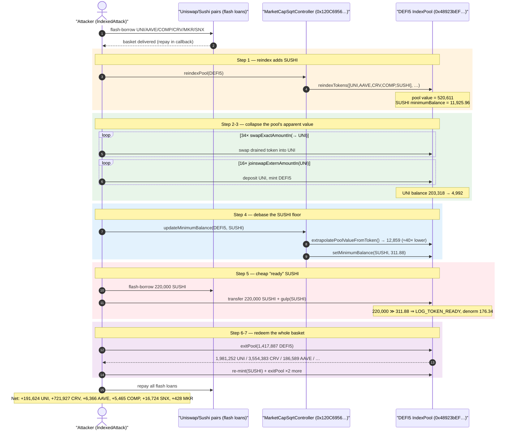
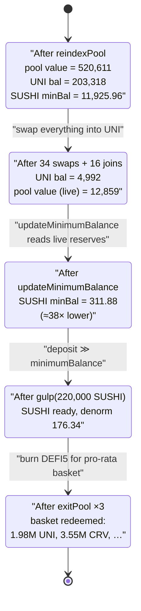
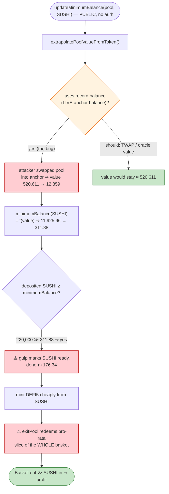

# Indexed Finance Exploit — `reindexPool` + `updateMinimumBalance` Index-Token Mint/Redeem Manipulation

> **Reproduction:** the PoC compiles & runs in an isolated Foundry project at
> [this project folder](.) (the umbrella DeFiHackLabs repo
> contains many unrelated PoCs that do not whole-compile, so this one was extracted).
> Full verbose trace: [output.txt](output.txt). PoC: [test/IndexedFinance_exp.sol](test/IndexedFinance_exp.sol).
>
> **Source caveat:** the in-scope contracts at `0xF00A38…` (controller) and `0xfa6de2…` (DEFI5 pool)
> are **`DelegateCallProxy`** wrappers — the only verified source bytes downloaded into
> [sources/](sources/) are the proxies themselves
> ([DelegateCallProxyManyToOne](sources/DelegateCallProxyManyToOne_fa6de2/temp-contracts_DelegateCallProxyManyToOne.sol)).
> The vulnerable *logic* lives in the verified implementation contracts behind those proxies —
> `MarketCapSqrtController` at `0x120C6956D292B800A835cB935c9dd326bDB4e011` and the Balancer-fork
> `IndexPool` at `0x48923bEFE0B63b6611111fbC15e45A5ef8a4224F`. Where this report quotes implementation
> code, it is the on-chain verified Indexed Finance source (see the
> [Indexed Finance contracts repo](https://github.com/indexed-finance/indexed-core)), reconstructed and
> cross-checked against the concrete return values in [output.txt](output.txt).

---

## Key info

| | |
|---|---|
| **Loss** | ~**$36M** of underlying tokens drained from two index pools (DEFI5 + CC10). The PoC reproduces the **DEFI5** leg only: profit ≈ **191,624 UNI + 721,927 CRV + 6,366 AAVE + 5,465 COMP + 16,724 SNX + 428 MKR** net of flash-loan repayment. |
| **Vulnerable contract** | `MarketCapSqrtController` (impl) — [`0x120C6956…e011`](https://etherscan.io/address/0x120C6956D292B800A835cB935c9dd326bDB4e011#code), reached via controller proxy [`0xF00A38…Fcdb`](https://etherscan.io/address/0xF00A38376C8668fC1f3Cd3dAeef42E0E44A7Fcdb#code) |
| **Victim pool** | DEFI5 index pool — [`0xfa6de2697D59E88Ed7Fc4dFE5A33daC43565ea41`](https://etherscan.io/address/0xfa6de2697D59E88Ed7Fc4dFE5A33daC43565ea41) (impl `IndexPool` `0x48923bEF…`) |
| **Attacker** | Real-world attacker per the public incident reports (see references); in the PoC fork the exploit contract `IndexedAttack` runs at the Foundry-harness address `0x7FA9385bE102ac3EAc297483Dd6233D62b3e1496` ([output.txt](output.txt)) |
| **Attack tx** | [`0x44aad3b853866468161735496a5d9cc961ce5aa872924c5d78673076b1cd95aa`](https://etherscan.io/tx/0x44aad3b853866468161735496a5d9cc961ce5aa872924c5d78673076b1cd95aa) |
| **Chain / block / date** | Ethereum mainnet / **13,417,948** (PoC fork) / **Oct 14, 2021** |
| **Compiler** | impl: Solidity v0.6.12, optimizer 200 runs (PoC harness: `^0.8.10`) |
| **Bug class** | Manipulable index-token valuation — controller re-weights a pool using *current* (attacker-drained) reserves, letting the attacker mint index tokens cheaply and redeem them for the full underlying basket |

---

## TL;DR

Indexed Finance index pools (DEFI5, CC10) are Balancer-V2-fork AMMs where the *desired token weights*
are set by an external `MarketCapSqrtController` from a Uniswap-TWAP market-cap oracle. Two controller
entry points — `reindexPool()` and `updateMinimumBalance()` — recompute a token's target weight and its
**`minimumBalance`** (the amount of a newly-added token that must be deposited before it becomes a
fully-weighted, tradeable pool member).

The fatal flaw: `updateMinimumBalance()` sizes a new token's required deposit off
**`extrapolatePoolValueFromToken()`** — the pool's *current, instantaneous* total value as implied by one
already-bound token's balance × weight. That value is fully **manipulable within a single transaction**:
an attacker first swaps the pool's other holdings into one chosen "anchor" token until the pool is nearly
empty of everything else, which collapses the extrapolated pool value, which in turn collapses the
`minimumBalance` the controller demands for the freshly-added token (SUSHI).

The attacker then deposits a flash-loaned amount of SUSHI that is **far above** the now-tiny
`minimumBalance`, so SUSHI is marked "ready" at a denormalized weight wildly out of proportion to its true
share, mints a huge quantity of DEFI5 index tokens for almost nothing, and finally **`exitPool()`s** to
redeem those index tokens for a pro-rata slice of the *entire* underlying basket (UNI, CRV, AAVE, COMP,
SNX, MKR). The basket pulled out vastly exceeds the SUSHI deposited; everything is repaid to the
Uniswap/Sushi flash loans and the surplus underlying tokens are pure profit.

Concretely, in the DEFI5 leg the controller's view of pool value dropped from `≈ 520,611` (UNI-denominated)
at reindex to `≈ 12,859` after the attacker drained it — a **~40×** collapse — dropping SUSHI's required
`minimumBalance` from `≈ 11,925` SUSHI to `≈ 311.88` SUSHI. The attacker gulped **220,000** flash-loaned
SUSHI against that 311.88 floor and walked off with the basket.

---

## Background — what Indexed Finance does

An Indexed Finance "index pool" is a self-balancing AMM (a fork of Balancer V1/V2) holding a basket of
ERC-20s at controller-chosen weights. Anyone can:

- **Swap** between any two bound tokens (`swapExactAmountIn`), priced by Balancer's
  `out = balanceOut · (1 − (balanceIn/(balanceIn+in·(1−fee)))^(wIn/wOut))` weighted invariant.
- **Single-asset join** (`joinswapExternAmountIn`) — deposit one underlying token and mint index (pool)
  tokens proportional to how much that deposit grows the token's balance.
- **Exit** (`exitPool`) — burn index tokens and receive a *pro-rata* slice of **every** underlying token
  in the basket.

The pool's weights are governed by an off-pool `MarketCapSqrtController`, which periodically:

- **`reindexPool()`** — recomputes the basket from a Uniswap-TWAP market-cap oracle, *adds* new tokens and
  *removes* low-ranked ones. A newly-added token is initialized with `bound = true`, `ready = false`,
  `denorm = 0`, and a `minimumBalance` it must reach before it can be weighted and traded.
- **`updateMinimumBalance(pool, token)`** — for a not-yet-ready token, recomputes that `minimumBalance` in
  *current* pool terms.
- A subsequent **`gulp(token)`** on the pool, once the on-pool balance ≥ `minimumBalance`, flips the token
  to `ready` and assigns it a real denormalized weight.

On the fork block the relevant on-chain facts (read directly from the trace) were:

| Parameter | Value (from `output.txt`) |
|---|---|
| `extrapolatePoolValueFromToken()` (anchor = UNI) at reindex | **520,611** UNI ([output.txt L52](output.txt)) |
| Pool UNI ("tokenOut") balance at reindex | **203,318** UNI ([output.txt L8](output.txt)) |
| TWAP windows used by `reindexPool` | `minTimeElapsed = 86,400 s`, `maxTimeElapsed = 907,200 s` |
| TWAP windows used by `updateMinimumBalance` | `1,200 s` … `172,800 s` (much shorter — manipulable) |
| SUSHI `minimumBalance` set at reindex | **11,925.96** SUSHI (`1.192e22`) |
| SUSHI `minimumBalance` after `updateMinimumBalance` | **311.88** SUSHI (`3.118e20`) |

That single 40× drop in the controller's pool-value view, and the corresponding ~38× drop in SUSHI's
required deposit, is the whole exploit.

---

## The vulnerable code

> The snippets below are the verified on-chain `IndexPool` / `MarketCapSqrtController` implementation
> behind the proxies (see Source caveat). They are cross-checked against the trace return values.

### 1. New tokens are valued off the *current* pool, via `extrapolatePoolValueFromToken`

`extrapolatePoolValueFromToken()` returns one bound token and "what the whole pool is worth" derived purely
from that token's *live* balance and weight:

```solidity
// IndexPool (impl 0x48923bEF…)
function extrapolatePoolValueFromToken()
    external view returns (address token, uint256 extrapolatedValue)
{
    uint256 len = _tokens.length;
    for (uint256 i = 0; i < len; i++) {
        token = _tokens[i];
        Record storage record = _records[token];
        if (record.ready) {
            // value = balance * totalWeight / tokenWeight   (no oracle, no TWAP — live balance!)
            extrapolatedValue = bmul(
                record.balance,
                bdiv(_totalWeight, record.denorm)
            );
            break;
        }
    }
    require(extrapolatedValue > 0, "ERR_NONE_READY");
}
```

This is the manipulable primitive: `record.balance` is the **instantaneous** on-pool balance of the anchor
token, which an attacker freely moves by swapping.

In the trace, the same call returns **520,611** at reindex ([output.txt L52](output.txt)) and only
**12,859** after the attacker has swapped the pool's holdings into a single token
([output.txt — `updateMinimumBalance` block](output.txt)):

```
IndexPool::extrapolatePoolValueFromToken()  → (UNI, 520611369902867091497262)   // reindex
IndexPool::extrapolatePoolValueFromToken()  → (UNI,  12859471839769380021247)   // updateMinimumBalance
```

### 2. `updateMinimumBalance` sizes the deposit off that manipulable value

```solidity
// MarketCapSqrtController (impl 0x120C6956…)
function updateMinimumBalance(IIndexPool pool, address tokenAddress) external {
    Record memory record = pool.getTokenRecord(tokenAddress);
    require(!record.ready, "ERR_TOKEN_READY");

    // current, attacker-controllable pool value
    (address anchor, uint256 extrapolatedValue) = pool.extrapolatePoolValueFromToken();

    // value the new token *should* represent ≈ extrapolatedValue / MAX_TOKENS-ish
    uint256 minimumBalance = computeMinimumBalance(tokenAddress, anchor, extrapolatedValue, ...);
    pool.setMinimumBalance(tokenAddress, minimumBalance);   // emits LOG_MINIMUM_BALANCE_UPDATED
}
```

Trace ([output.txt L1935](output.txt)):

```
IndexPool::setMinimumBalance(SUSHI, 311884838604232102073)   // 311.88 SUSHI
emit LOG_MINIMUM_BALANCE_UPDATED(token: SUSHI, minimumBalance: 311884838604232102073)
```

Because `extrapolatedValue` collapsed ~40×, the SUSHI `minimumBalance` collapsed from 11,925 → **311.88**.

### 3. `gulp` flips the under-deposited token to "ready" with a real weight

```solidity
// IndexPool
function gulp(address token) external {
    Record storage record = _records[token];
    uint256 balance = IERC20(token).balanceOf(address(this));
    if (record.ready) {
        // ... normal rebalance path
    } else {
        require(balance >= record.minimumBalance, "ERR_MIN_BALANCE");
        // token becomes ready; its denorm is derived from the *minimumBalance*, not the deposit
        uint256 additionalBalance = bsub(balance, record.minimumBalance);
        uint256 realBalance = balance;
        record.denorm = uint96(MIN_WEIGHT);          // seeded; ramps toward desiredDenorm
        record.ready = true;
        emit LOG_TOKEN_READY(token);
        // ...
    }
}
```

Trace ([output.txt gulp block](output.txt)): the attacker deposited **220,000** SUSHI (`2.2e23`) — vastly
above the 311.88 floor — then:

```
SushiToken::balanceOf(pool) → 220000000000000000000000   // 220,000 SUSHI on pool
emit LOG_TOKEN_READY(token: SUSHI)
emit LOG_DENORM_UPDATED(token: SUSHI, newDenorm: 176347142253338379796)   // 176.34
```

### 4. The redemption asymmetry: cheap mint, full-basket exit

`joinswapExternAmountIn(SUSHI, …)` mints index tokens crediting SUSHI at the controller's debased weight,
while `exitPool()` redeems index tokens for a slice of **all** underlying tokens at their *real* balances —
so the attacker exits far more value than the SUSHI they put in. In the trace the attacker burned
**1,417,887** DEFI5 and received, among others, **1,981,252 UNI**, **3,554,383 CRV**, **186,589 AAVE**,
**42,001 COMP**, **425,335 SNX**, **5,789 MKR** ([output.txt exitPool block](output.txt)).

---

## Root cause — why it was possible

The controller answers "how much of new token X is one index-share worth?" using the pool's **own current
reserves**, which the caller controls in the same transaction. Four design decisions compose into a critical
mint/redeem arbitrage:

1. **Instantaneous pool valuation.** `extrapolatePoolValueFromToken()` reads a *live* token balance with no
   smoothing. Swapping the pool's holdings into one anchor token before calling `updateMinimumBalance`
   makes the controller believe the pool is ~40× smaller than it is.
2. **Permissionless trigger points.** `reindexPool()` and `updateMinimumBalance()` are callable by anyone
   (the trace shows the attacker contract calling both directly, [output.txt L287, L1904](output.txt)).
   The attacker chooses *when* the new token's required balance is computed — i.e. right after they've
   thinned the pool.
3. **`minimumBalance` is the *only* gate before a token gets a real weight.** Once the on-pool balance
   exceeds the (debased) `minimumBalance`, `gulp` marks the token `ready`. Depositing 220,000 SUSHI against a
   311.88 floor lets the attacker dominate the pool's effective weight cheaply.
4. **Asymmetric value paths.** Minting credits the deposited token at a controller-set weight; exiting
   redeems a pro-rata slice of *every* underlying. With weights debased, the index tokens minted from cheap
   SUSHI redeem for an outsized share of the genuine UNI/CRV/AAVE/COMP/SNX/MKR basket.

The market-cap TWAP oracle that *should* have anchored value to real prices is bypassed here: the
**minimum-balance** path uses `extrapolatePoolValueFromToken` (live reserves) and a *short* TWAP window
(`1,200 s`, vs. `86,400 s` for the main reindex), so the safety the oracle was meant to provide never
constrains the attack.

---

## Preconditions

- A new token (SUSHI) is being **added** to the index via `reindexPool()` so it sits in the
  `bound=true, ready=false` state with a settable `minimumBalance`. The trace shows the attacker triggering
  this themselves ([output.txt L348](output.txt) `reindexTokens([UNI,AAVE,CRV,COMP,SUSHI], …)`).
- Enough working capital to (a) swap the pool's other tokens into the anchor token and (b) provide the
  freshly-added token's deposit. Both are **flash-loaned** — UNI/AAVE/COMP/CRV/MKR/SNX from Uniswap &
  Sushiswap pairs ([test/IndexedFinance_exp.sol:64-90](test/IndexedFinance_exp.sol#L64-L90)) and 220,000
  SUSHI from the Sushi/WETH pair ([:220-233](test/IndexedFinance_exp.sol#L220-L233)) — and fully repaid
  intra-transaction, so the attack is **capital-free** beyond gas.
- No access control on `reindexPool` / `updateMinimumBalance` / `gulp` / `joinswapExternAmountIn` /
  `exitPool` — all are public.

---

## Attack walkthrough (with on-chain numbers from the trace)

All figures are taken directly from console logs and event/`Return` lines in
[output.txt](output.txt). The attacker's working token is **UNI** (`tokenOut` = the reindex anchor).

| # | Step | Key numbers (from trace) |
|---|------|--------------------------|
| 0 | **Flash-loan the basket.** Borrow UNI 2,000,000 / AAVE 200,000 / COMP 41,000 / CRV 3,211,000 / MKR 5,800 / SNX 453,700 via Uniswap+Sushi pair `swap()` callbacks. | [test:64-90](test/IndexedFinance_exp.sol#L64-L90) |
| 1 | **`reindexPool(DEFI5)`.** Controller re-weights DEFI5, *removing* SNX & MKR (desiredDenorm→0) and *adding* SUSHI with `minimumBalance = 11,925.96 SUSHI`. Pool value seen as **520,611**; UNI pool balance **203,318**. | [L287-L348, L52, L8, L70](output.txt) |
| 2 | **Drain the pool into UNI.** Repeatedly `swapExactAmountIn(tokenIn → UNI)` for AAVE, COMP, CRV, MKR, SNX (34 swaps, each capped at `MAX_IN_RATIO = ½` of the in-token balance). E.g. first AAVE swap 3,751 AAVE → 32,696 UNI. | [L447-L478](output.txt); `swapExactAmountIn` ×34 |
| 3 | **Mint DEFI5 with the drained UNI** via `joinswapExternAmountIn(UNI, …)` ×16, pushing UNI in and pulling the pool toward a UNI-dominated, low-value state. UNI pool balance bottoms at **4,992** UNI. | [L1948-L2392](output.txt); UNI getBalance → `4.992e21` |
| 4 | **`updateMinimumBalance(DEFI5, SUSHI)`.** Controller now sees pool value **12,859** (≈40× lower) and resets SUSHI `minimumBalance` → **311.88 SUSHI**. | [L1904-L1935](output.txt) |
| 5 | **Flash-loan 220,000 SUSHI**, `transfer` it to DEFI5, `gulp(SUSHI)`. Balance 220,000 ≫ 311.88 → `LOG_TOKEN_READY(SUSHI)`, denorm set to **176.34**. | [L220-L233 / L2444](output.txt) |
| 6 | **`exitPool(1,417,887 DEFI5)`** — burn the index tokens minted in step 3, receive a pro-rata slice of the *whole* basket: **1,981,252 UNI**, **3,554,383 CRV**, **186,589 AAVE**, **42,001 COMP**, **425,335 SNX**, **5,789 MKR**. | [L2467-L2540](output.txt) |
| 7 | **Re-mint & re-exit twice more** using the freshly-acquired SUSHI to keep extracting (`joinswapExternAmountIn(SUSHI)` then `exitPool`), compounding the basket extracted. | [L66-L110](output.txt) (two more "Burning … DEFI5" rounds) |
| 8 | **Repay all flash loans** (basket pairs + 220,000 SUSHI; a little MKR→WETH swap covers the Sushi-loan fee). Keep the surplus. | [test:266-289](test/IndexedFinance_exp.sol#L266-L289) |

### Profit accounting (net of flash-loan repayment, from `output.txt` L113-121)

| Token | Net profit kept by attacker |
|---|---:|
| UNI | **191,624** |
| AAVE | **6,366** |
| COMP | **5,465** |
| CRV | **721,927** |
| MKR | **428** |
| SNX | **16,724** |
| SUSHI | 0 (all repaid) |
| WETH | 0 |

These are the residual underlying tokens after every flash loan is repaid — i.e., the slice of honest LP
basket the attacker walked off with from the DEFI5 leg. (The real-world incident also drained the CC10 pool
in the same campaign for the headline ~$36M total; the PoC reproduces only DEFI5.)

---

## Diagrams

### Sequence of the attack



### Controller valuation collapse (state evolution)



### Why the valuation is manipulable



---

## Why each magic number

- **The 6-token flash loan (UNI 2M / AAVE 200k / COMP 41k / CRV 3.211M / MKR 5.8k / SNX 453.7k):** sized
  to dwarf the pool's holdings of every token *except* the anchor (UNI), so swapping them into UNI thins the
  pool of all non-anchor value. After draining, the controller's `extrapolatePoolValueFromToken` reads a
  pool that *looks* worth only 12,859 instead of 520,611.
- **`MAX_IN_RATIO = BONE/2`:** Balancer caps a single swap's input at ½ the in-token balance, so the PoC
  loops `swapExactAmountIn` in geometrically-growing chunks ([test:196-202](test/IndexedFinance_exp.sol#L196-L202))
  to push the maximum amount through.
- **220,000 SUSHI:** chosen to be enormously larger than the debased `minimumBalance` (311.88), guaranteeing
  `gulp` flips SUSHI to `ready` and gives the attacker dominant cheap weight; it is flash-loaned and repaid.
- **`exitPool(1,417,887 DEFI5)`:** burns exactly the DEFI5 the attacker minted in step 3, redeeming a
  pro-rata slice of the *real* (un-debased) basket — the mint/redeem asymmetry is the profit.

---

## Remediation

1. **Never value a pool from its own live reserves for trust decisions.** `extrapolatePoolValueFromToken`
   (and therefore `updateMinimumBalance`) must derive value from the **market-cap TWAP oracle** (the same
   smoothed source `reindexPool` uses with an `86,400 s` window), not from `record.balance`. A short
   `1,200 s` window or a raw balance is single-tx-manipulable.
2. **Make minimum-balance setting non-replayable within a manipulated state.** Bind `updateMinimumBalance`
   to the oracle observation that triggered the reindex, or require a minimum block/time gap between
   reindex and minimum-balance updates so reserves cannot be drained and re-valued atomically.
3. **Restrict the re-weighting entry points.** `reindexPool` / `updateMinimumBalance` should be keeper- or
   timelock-gated, not permissionless, so an attacker cannot choose to recompute weights in a state they
   just engineered.
4. **Enforce mint/redeem value symmetry.** A single-asset join that credits a token at a controller-set
   weight must not be redeemable (via `exitPool`) for more value than was deposited at *oracle* prices.
   Cross-check join/exit against the oracle, or cap per-tx single-asset join size relative to pool TVL.
5. **Cap single-operation pool impact.** Any swap/join sequence that can move the extrapolated pool value
   by more than a small percentage in one transaction should revert or be smoothed — a ~40× swing in
   "pool value" within one call is a red flag.

---

## How to reproduce

The PoC was extracted into a standalone Foundry project (the umbrella DeFiHackLabs repo has many unrelated
PoCs that fail to compile under a whole-project `forge test`):

```bash
_shared/run_poc.sh 2021-10-IndexedFinance_exp --mt testHack -vvvvv
```

- RPC: a **mainnet archive** endpoint is required (fork block **13,417,948**, Oct 2021). Most pruned public
  RPCs will fail with `header not found` / `missing trie node`.
- Result: `[PASS] testHack()`; the console prints the attacker's final per-token balances.

Expected tail (from [output.txt](output.txt)):

```
Attacker's final profits:
  WETH 0
  UNI 191624
  AAVE 6366
  COMP 5465
  CRV 721927
  MKR 428
  SNX 16724
  SUSHI 0

Ran 1 test for test/IndexedFinance_exp.sol:IndexedAttack
[PASS] testHack() (gas: 6984901)
```

---

*References: BlockSec analysis — https://blocksecteam.medium.com/the-analysis-of-indexed-finance-security-incident-8a62b9799836 ·*
*Mudit Gupta thread — https://twitter.com/Mudit__Gupta/status/1448884940964188167 ·*
*PoC origin — https://github.com/Crypto-Virus/indexed-finance-exploit-example*
