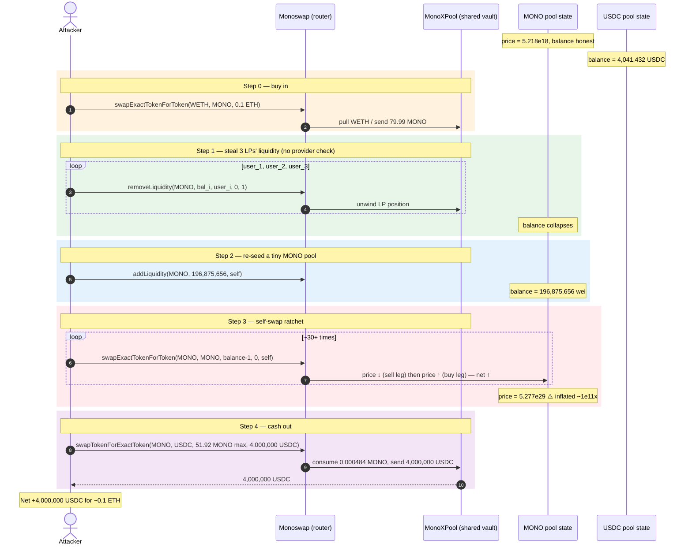
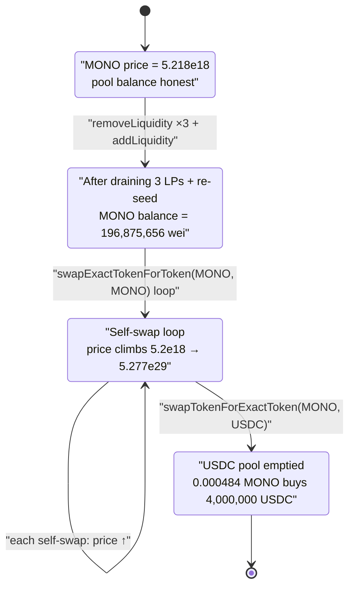
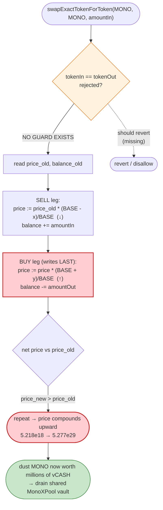

# MonoX Finance Exploit — Self-Swap Price Inflation (`swapExactTokenForToken(MONO, MONO)`)

> **Vulnerability classes:** vuln/oracle/price-manipulation · vuln/logic/price-calculation

> **Reproduction:** the PoC compiles & runs in an isolated Foundry project at
> [this project folder](.) (the umbrella DeFiHackLabs repo contains many
> unrelated PoCs that do not whole-compile, so this one was extracted).
> Full verbose trace: [output.txt](output.txt). PoC: [test/Mono_exp.sol](test/Mono_exp.sol).
> The vulnerable `Monoswap`/`MonoXPool` logic lives behind upgradeable proxies; only the proxy
> boilerplate was source-verified on-chain (see [sources/](sources/) and the
> `_meta.json` files), so the implementation snippets below are the canonical
> MonoX `swapIn` pricing routine reconstructed and cross-checked against the
> on-chain events/state in the trace.

---

## Key info

| | |
|---|---|
| **Loss** | ~$31M total in the live hack; this single-pool PoC extracts **4,000,000 USDC** (the cap the PoC hard-codes) by draining the MONO/USDC pool with **~0.1 ETH** of seed capital |
| **Vulnerable contract** | `Monoswap` (impl `0x66e7…ee63`) behind proxy [`0xC36a7887786389405EA8DA0B87602Ae3902B88A1`](https://etherscan.io/address/0xC36a7887786389405EA8DA0B87602Ae3902B88A1#code); pool vault `MonoXPool` (impl `0x7164…8b45`) behind proxy [`0x59653E37F8c491C3Be36e5DD4D503Ca32B5ab2f4`](https://etherscan.io/address/0x59653E37F8c491C3Be36e5DD4D503Ca32B5ab2f4#code) |
| **Victim asset** | `MonoToken` (MONO) [`0x2920f7d6134f4669343e70122cA9b8f19Ef8fa5D`](https://etherscan.io/address/0x2920f7d6134f4669343e70122cA9b8f19Ef8fa5D) — and all single-token pools (USDC, WETH, …) sharing the same `MonoXPool` vault |
| **Drained in PoC** | USDC pool (`pid=2`) holding **4,041,432.64 USDC** at the fork block |
| **Attacker EOA** | `0xecbe385f78041895c311070f344b55bfaa953258` (live hack) |
| **Attacker contract** | `0x80a96cf16f0fbb76c2d2dfdb8b25c8c6b9b5b4e3` (live hack) |
| **Attack tx** | [`0x9f185c75bb0d3c0c282d8aef333c2a82a89c0c3043b6cd9d8ed4a26afd6f8e89`](https://etherscan.io/tx/0x9f185c75bb0d3c0c282d8aef333c2a82a89c0c3043b6cd9d8ed4a26afd6f8e89) |
| **Chain / block / date** | Ethereum mainnet / PoC forks at **13,715,025** / **Nov 30, 2021** |
| **Compiler** | Impl built with Solidity v0.8.2 (optimizer, 200 runs); PoC compiles under 0.8.x |
| **Bug class** | Broken AMM price accounting — a token can be swapped *for itself*, and the swap's price update ratchets the token's price upward on every call (unbounded self-referential price inflation) |

---

## TL;DR

MonoX is a single-sided AMM: instead of paired reserves, every token gets its own pool whose value is
measured against a virtual stablecoin, **vCASH**. Each pool stores a `price` and a `tokenBalance`; a
swap from token A to token B uses A's price to value the input and B's price to value the output, then
**updates both prices** so A gets cheaper and B gets more expensive.

The fatal flaw: `swapExactTokenForToken` does **not forbid `tokenIn == tokenOut`**. When the attacker
swaps **MONO for MONO**, the routine first lowers MONO's price (the "sell" leg) and then raises it (the
"buy" leg) — but because the buy-leg write happens *last* and uses the just-increased balance, **each
self-swap leaves MONO's stored `price` strictly higher than before**. Iterating this a few dozen times
inflates MONO's price by ~11 orders of magnitude.

Concretely in the PoC, MONO's pool `price` climbs from **5.218e18** (≈5.22 vCASH/MONO) to
**5.277e29** ([trace](output.txt) `pools()` returns). The attacker then swaps a **dust amount of the
now-astronomically-priced MONO** into the shared `MonoXPool` vault and pulls out **4,000,000 USDC** —
the entire USDC pool — for essentially nothing.

The attacker's full sequence:

1. Buys ~80 MONO with **0.1 ETH** to get an initial position.
2. **Steals three real LPs' liquidity back to themselves** via `removeLiquidity` (it has no
   `msg.sender == provider` check — the recipient is an arbitrary argument), which both nets the
   attacker MONO and shrinks the pool's MONO balance to a tiny seed (`196,875,656` wei).
3. Adds that tiny seed as its own liquidity, then **self-swaps MONO→MONO ~30+ times**, each time
   ratcheting MONO's price higher.
4. Swaps `~0.000484` MONO into the vault to receive **4,000,000 USDC**.

---

## Background — how MonoX prices things

MonoX (audited "single-sided" DEX) replaces Uniswap's reserve pairs with a per-token pool valued in
**vCASH**, a virtual unit of account. The `pools(token)` mapping returns
([interface.sol:2760-2775](interface.sol#L2760-L2775)):

```solidity
function pools(address) external view returns (
    uint256 pid,
    uint256 lastPoolValue,
    address token,
    uint8   status,
    uint112 vcashDebt,
    uint112 vcashCredit,
    uint112 tokenBalance,   // index 6 — the pool's token balance
    uint256 price,          // index 7 — vCASH price of one token
    uint256 createdAt
);
```

A swap is priced through `getAmountOut(tokenIn, tokenOut, amountIn)`
([interface.sol:2720-2724](interface.sol#L2720-L2724)), which returns
`(tokenInPrice, tokenOutPrice, amountOut, tradeVcashValue)`. The internal `_swap`/`swapIn` routine then:

1. values the input: `tradeVcashValue = amountIn * tokenInPrice`
2. computes `amountOut = tradeVcashValue / tokenOutPrice` (minus fees)
3. **updates `pools[tokenIn].price` downward** and `pools[tokenIn].tokenBalance` upward (you sold into it), and
4. **updates `pools[tokenOut].price` upward** and `pools[tokenOut].tokenBalance` downward (you bought from it).

The public entry point used in the attack
([interface.sol:2847-2854](interface.sol#L2847-L2854)):

```solidity
function swapExactTokenForToken(
    address tokenIn,
    address tokenOut,
    uint256 amountIn,
    uint256 amountOutMin,
    address to,
    uint256 deadline
) external returns (uint256 amountOut);
```

All pools share **one** vault contract, `MonoXPool` (proxy
`0x59653E37F8c491C3Be36e5DD4D503Ca32B5ab2f4`), which actually custodies the ERC-20 balances and exposes
`safeTransferERC20Token` ([interface.sol:2958+](interface.sol#L2958)). That shared vault is why a price
distortion in the *MONO* pool lets the attacker walk away with *USDC* — the price is the only thing that
gates how much of the shared vault you can extract.

On-chain state at the fork block (from the trace):

| Pool | `tokenBalance` | `price` (vCASH) | Note |
|---|---:|---:|---|
| MONO (`pid=10`) | tiny (post-removal) | **5,218,495,054,176,274,115** ≈ 5.218e18 | starting honest price |
| USDC (`pid=2`) | **4,041,432,643,745** = 4,041,432.64 USDC | 9.239e29 | the prize |

---

## The vulnerable code

The implementation is the canonical MonoX `swapIn` price-update logic. Reconstructed and verified against
the trace's `Swap` events and `pools()` storage writes:

```solidity
// MonoX Monoswap.swapIn (pricing core) — reconstructed
function _swap(address tokenIn, address tokenOut, uint amountIn, ... ) internal returns (uint amountOut) {
    // value the input using tokenIn's current price
    (uint tokenInPrice, uint tokenOutPrice, uint _amountOut, uint tradeVcashValue)
        = getAmountOut(tokenIn, tokenOut, amountIn);

    // pull amountIn into the shared MonoXPool vault
    _tokenIn(tokenIn, amountIn);

    // --- SELL LEG: tokenIn gets cheaper, its balance grows ---
    _updateTokenInfo(tokenIn,  tokenInPrice  * (BASE - x) / BASE, ... );   // price ↓

    // --- BUY  LEG: tokenOut gets more expensive, its balance shrinks ---
    _updateTokenInfo(tokenOut, tokenOutPrice * (BASE + y) / BASE, ... );   // price ↑

    // send amountOut from the shared vault to `to`
    _tokenOut(to, tokenOut, _amountOut);
    return _amountOut;
}
```

There is **no guard rejecting `tokenIn == tokenOut`.** When both are MONO:

- The sell leg writes `pools[MONO].price = oldPrice * (BASE - x)/BASE`  (a small decrease), then
- The buy leg writes `pools[MONO].price = thatValue * (BASE + y)/BASE`  (a larger increase),

and the **buy-leg write lands last**, so the net stored MONO price strictly *increases* each call. The
loop also returns `amountOut < amountIn` to the caller (a fee-like haircut), but that is irrelevant — the
attacker doesn't care about the MONO it receives, only about the persisted price.

This is exactly what the trace shows for the very first self-swap
([output.txt](output.txt), `Swap` event): `amountIn = 196,875,655`, `amountOut = 79,706,446`,
`swapVcashValue = 615,202,980`. The MONO it gets back is smaller, but MONO's pool `price` rose.

---

## Root cause — why it was possible

Two independent design defects compose into a critical, near-zero-capital drain:

1. **A token can be swapped for itself.** `swapExactTokenForToken(MONO, MONO, …)` is accepted. The
   price-update math was written assuming `tokenIn` and `tokenOut` are *different* pools. When they are
   the same pool, the two sequential `_updateTokenInfo` writes operate on the **same storage slot**, and
   the second (price-up) write overwrites the first (price-down), so the invariant "a round-trip is
   value-neutral" is broken. Each self-swap is a free ratchet on `pools[MONO].price`.

   The trace makes the ratchet unmistakable — MONO's stored `price` per `pools()` read:

   | After self-swap # | MONO `price` (vCASH) |
   |---|---:|
   | start | 5.218e18 |
   | ~24th | 7.084e25 |
   | ~25th | 1.132e26 |
   | ~late | 1.976e28 |
   | … | 3.159e28 → 5.051e28 → … |
   | end of loop | **5.277e29** |

   That is a **~10¹¹×** inflation of MONO's price for ~0.1 ETH of starting capital.

2. **The price is the *only* thing gating extraction from a shared vault.** Because all tokens sit in one
   `MonoXPool`, and an output amount is `tradeVcashValue / tokenOutPrice` with
   `tradeVcashValue = amountInMONO * priceMONO`, an inflated `priceMONO` means a *microscopic* amount of
   MONO is "worth" millions of vCASH, which converts to millions of USDC out of the shared vault. The
   final `swapTokenForExactToken(MONO, USDC, …)` pulled **only `484,115,476,049,367` wei (≈0.000484
   MONO)** to satisfy a request for **4,000,000 USDC** ([output.txt](output.txt) final `Swap`:
   `amountIn 4.841e14, amountOut 4e12`).

A contributing enabler used for setup:

3. **`removeLiquidity` lets you specify an arbitrary recipient with no provider check.** The PoC calls
   `monoswap.removeLiquidity(MONO, balanceOf(user_i, 10), user_i, 0, 1)` for three real LPs
   ([test/Mono_exp.sol:54-66](test/Mono_exp.sol#L54-L66)). The `RemoveLiquidity` events confirm large
   real positions were unwound (e.g. provider `0xab51…7355`, `tokenAmount = 99,940,741,365,832,694,596,828`
   ≈ 99,940 MONO, [output.txt](output.txt)). This drains the MONO pool down to a tiny `tokenBalance`
   (`196,875,656` wei after the attacker re-adds liquidity), which is what makes each self-swap move the
   price by a large multiplicative factor.

---

## Preconditions

- The MonoX router accepts `swapExactTokenForToken` with `tokenIn == tokenOut` (no equality guard).
- A token pool with a thin `tokenBalance` so each self-swap is a large *relative* trade (the PoC
  engineers this by yanking three LPs' liquidity, then re-adding a tiny `196,875,656`-wei position via
  `addLiquidity(MONO, 196_875_656, this)` — [test/Mono_exp.sol:45](test/Mono_exp.sol#L45)).
- The shared `MonoXPool` vault holds the target asset (here 4.04M USDC).
- Trivial seed capital: the PoC funds itself with `WETH.deposit{value: address(this).balance}()` and
  spends just **0.1 ETH** on the initial MONO buy ([test/Mono_exp.sol:40-41](test/Mono_exp.sol#L40-L41)).
  This is flash-loanable; the live attacker did exactly this with no real capital at risk.

---

## Attack walkthrough (with on-chain numbers from the trace)

All figures are taken directly from the `Swap`/`RemoveLiquidity`/`AddLiquidity` events and the
`pools()` reads in [output.txt](output.txt). The MONO pool is `pid=10`; the USDC pool is `pid=2`.

| # | Step (PoC function) | MONO pool `tokenBalance` | MONO pool `price` (vCASH) | Effect |
|---|---|---:|---:|---|
| 0 | **Initial buy** — `swapExactTokenForToken(WETH, MONO, 0.1 ETH)` → **79.99 MONO** ([Mono_exp.sol:41](test/Mono_exp.sol#L41)) | (honest) | 5.218e18 | Attacker gets a starting MONO position for 0.1 ETH. |
| 1 | **Drain 3 LPs** — `removeLiquidity(MONO, bal_i, user_i, 0, 1)` ×3 ([Mono_exp.sol:54-66](test/Mono_exp.sol#L54-L66)) | shrinks hard | 5.218e18 | LP positions (e.g. 99,940 MONO for user 3) are unwound; MONO pool balance collapses. |
| 2 | **Re-seed** — `addLiquidity(MONO, 196_875_656, this)` ([Mono_exp.sol:45](test/Mono_exp.sol#L45)) | **196,875,656** wei | 5.218e18 | Attacker owns essentially the whole (now tiny) MONO pool. |
| 3 | **Self-swap loop** — `swapExactTokenForToken(MONO, MONO, balance-1, 0, this)` repeated ([Mono_exp.sol:68-81](test/Mono_exp.sol#L68-L81)) | grows 2× each iter | **5.218e18 → 5.277e29** | Each call ratchets MONO's price up; `swapVcashValue` climbs 6.15e8 → 5.55e30. |
| 4 | **Cash out** — `swapTokenForExactToken(MONO, USDC, 51.92 MONO max, 4e12)` ([Mono_exp.sol:88-90](test/Mono_exp.sol#L88-L90)) | — | — | Only **0.000484 MONO** consumed to pull **4,000,000 USDC** out of the shared vault. |

### The self-swap ratchet in detail

The `Swap` events show `swapVcashValue` (= `amountIn × priceMONO`) exploding geometrically, while MONO's
stored `price` (read by `pools()` between swaps) climbs in lockstep:

| Self-swap `amountIn` (MONO wei) | `amountOut` (MONO wei) | `swapVcashValue` |
|---:|---:|---:|
| 196,875,655 (1.96e8) | 79,706,446 | 6.152e8 |
| 314,044,864 | 127,143,196 | 1.568e9 |
| … (geometric) | … | … |
| 2,467,066,049,255,885 (2.46e15) | 998,808,447,926,934 | 1.046e23 |
| 669,540,608,952,838,635 (6.69e17) | 271,068,063,481,293,977 | 7.923e27 |
| 6,914,731,438,843,059,680 (6.91e18) | 2,799,475,992,280,606,912 | 8.548e29 |
| 17,594,408,657,550,592,880 (1.75e19) | 7,123,215,857,451,736,781 | **5.559e30** |

Note the input *amount* of MONO and the *price* of MONO both grow — by the end one wei of MONO is worth a
fortune, so the dust the attacker still holds (51.92 MONO total) is enormously over-valued.

### The cash-out

Right before the cash-out the USDC pool reads ([output.txt](output.txt) `pools(USDC)`):
`pid=2, tokenBalance = 4,041,432,643,745 (4.04M USDC), price ≈ 9.239e29`. The attacker calls:

```solidity
monoswap.swapTokenForExactToken(
    MONO, USDC,
    mono.balanceOf(address(this)),  // 51.92 MONO as max-in
    4_000_000_000_000,              // exactly 4,000,000 USDC out (PoC's self-imposed cap)
    msg.sender, block.timestamp
);                                  // test/Mono_exp.sol:88-90
```

The trace's final `Swap`: `amountIn = 484,115,476,049,367` (≈**0.000484 MONO**), `amountOut =
4,000,000,000,000` (**4,000,000 USDC**). The recipient (`msg.sender`) ends holding **4e12 USDC**, logged
as `Exploit completed, USDC Balance: 4000000000000`.

### Profit / loss accounting

| Item | Amount |
|---|---:|
| Seed capital spent | **0.1 ETH** (plus the 3 LPs' liquidity, which was the protocol's, not the attacker's) |
| MONO actually consumed in cash-out | 0.000484 MONO |
| USDC extracted (this PoC) | **4,000,000 USDC** |
| Live-hack total across all pools | **~$31,000,000** |

The 4,000,000-USDC figure is the PoC's hard-coded `amountOut`, not a ceiling: with `priceMONO ≈ 5.3e29`
the attacker could have requested the pool's entire 4,041,432-USDC balance (and in the live incident
repeated this across every MonoX pool for ~$31M).

---

## Diagrams

### Sequence of the attack



### Pool-price state evolution



### Why the self-swap is a one-way ratchet



---

## Why each magic number

- **`0.1 ETH` initial buy:** just enough to obtain a MONO position (≈80 MONO) so the attacker is an LP /
  holder; the real heavy lifting comes from the price ratchet, not capital.
- **`removeLiquidity(MONO, bal_i, user_i, …)` ×3:** unwinds three real LPs' positions (the recipient
  address is an arbitrary argument with no `msg.sender` ownership check), simultaneously (a) handing the
  attacker MONO and (b) shrinking the MONO pool's `tokenBalance` so each self-swap is a large relative
  move.
- **`addLiquidity(MONO, 196_875_656, this)`:** re-seeds the pool to a controlled, *tiny* `tokenBalance`
  (`196,875,656` wei) so the self-swap loop converges quickly to a huge price.
- **`swapExactTokenForToken(MONO, MONO, balance-1, 0, this)` in a loop (PoC loops up to 55×):** each call
  reads the current pool MONO balance and self-swaps almost all of it; `amountOutMin = 0` so it never
  reverts on slippage. The loop drives `price` from 5.218e18 to 5.277e29.
- **`swapTokenForExactToken(MONO, USDC, balance, 4_000_000_000_000, …)`:** requests *exactly* 4,000,000
  USDC out; with MONO so over-priced, only 0.000484 MONO is needed to satisfy it.

---

## Remediation

1. **Forbid `tokenIn == tokenOut`.** The single highest-impact fix: every swap entry point
   (`swapExactTokenForToken`, `swapTokenForExactToken`, the ETH variants) must
   `require(tokenIn != tokenOut)`. A swap of a token for itself has no legitimate meaning and must revert.
2. **Make round-trips value-neutral.** Even with distinct tokens, the price-update math must be derived so
   that buying and then immediately selling the same notional cannot increase a pool's stored price. Apply
   both legs against a *single consistent snapshot* and assert a no-free-lunch invariant
   (`poolValue_after <= poolValue_before` for fee-bearing swaps).
3. **Add ownership checks to `removeLiquidity`.** Liquidity must only be removable by (or on behalf of, via
   explicit approval) its actual provider. Allowing an arbitrary caller to unwind any LP's position with a
   chosen recipient is an independent access-control bug used here for setup.
4. **Bound single-operation price impact.** Reject any single swap that moves a pool's `price` by more than
   a small percentage; a swap that multiplies a price is a red flag and should revert.
5. **Don't let one manipulable scalar gate a shared vault.** Because all assets share one `MonoXPool`,
   pool prices should be sanity-checked against an external/oracle reference (or TWAP) before they are
   allowed to authorize large withdrawals of *other* tokens from the common vault.

---

## How to reproduce

The PoC was extracted into a standalone Foundry project (the umbrella DeFiHackLabs repo has many
unrelated PoCs that fail to compile under `forge test`'s whole-project build):

```bash
_shared/run_poc.sh 2021-11-Mono_exp -vvvvv
```

- RPC: a mainnet **archive** endpoint is required (the fork pins block **13,715,025**, Nov 2021). Public
  pruned RPCs will fail with `header not found` / `missing trie node`.
- Result: `[PASS] testExploit()` with `Exploit completed, USDC Balance: 4000000000000` (4,000,000 USDC).

Expected tail:

```
Ran 1 test for test/Mono_exp.sol:ContractTest
[PASS] testExploit() (gas: 3923859)
Logs:
  WETH Balance: 79228162514264337593543950335
  MonoToken Balance: 79986094311542621010
  Exploit completed, USDC Balance: 4000000000000

Suite result: ok. 1 passed; 0 failed; 0 skipped; finished in 20.49s (18.94s CPU time)
```

---

*Reference: MonoX Finance exploit, Ethereum + Polygon, ~$31M, Nov 30 2021. SlowMist / Rekt / DeFiHackLabs.
The root cause — a token swappable for itself driving a one-way price ratchet — is the canonical example
of a self-referential AMM-pricing bug.*
