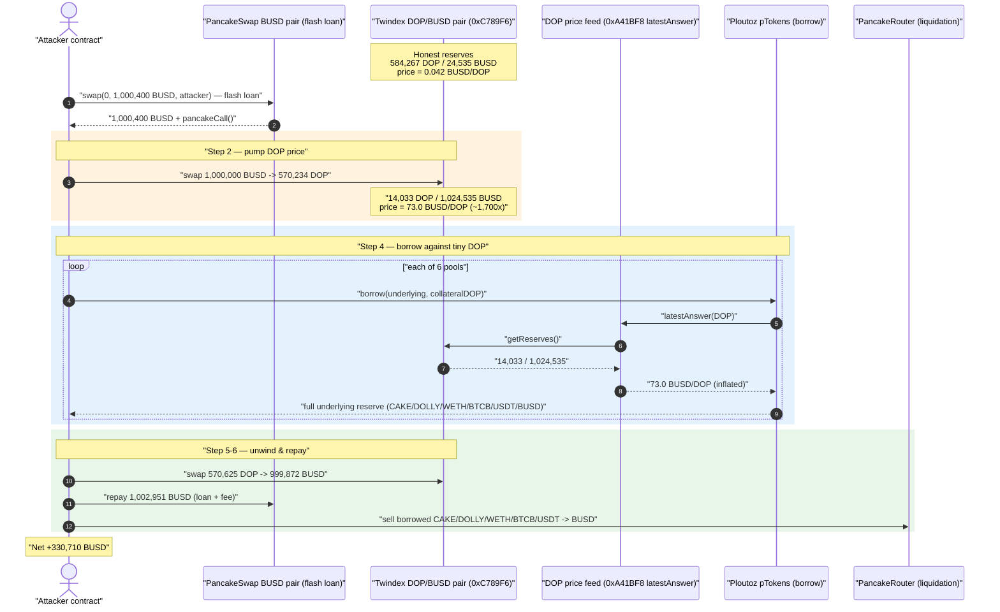
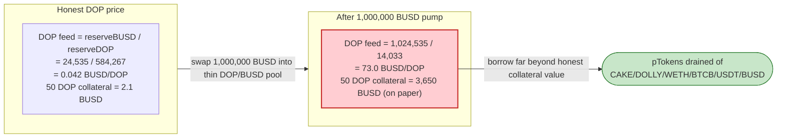
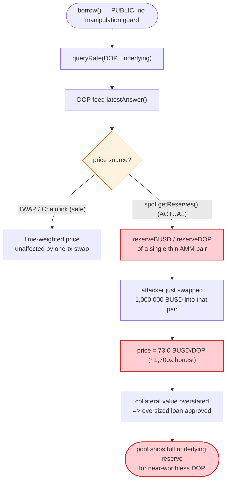

# Ploutoz / Dollar Online (DOP) Exploit — Spot-Price Oracle Manipulation Against a bZx/Fulcrum-Fork Lending Pool

> **Reproduction:** the PoC compiles & runs in an isolated Foundry project at
> [this project folder](.) (the umbrella DeFiHackLabs repo contains many
> unrelated PoCs that do not whole-compile, so this one was extracted).
> Full verbose trace: [output.txt](output.txt).
> The vulnerable `borrow` / oracle logic lives in the proxy implementation
> `0x8e9654f15ee934eDab16350E933577E0F9566d27` (a bZx/Fulcrum `LoanTokenLogicStandard`
> fork); the verified on-chain sources we downloaded are the proxy shell
> ([sources/LoanToken_539Ff5/LoanToken.sol](sources/LoanToken_539Ff5/LoanToken.sol))
> and the DOP collateral token
> ([sources/DoppleToken_844FA8/DoppleToken.sol](sources/DoppleToken_844FA8/DoppleToken.sol)).

---

## Key info

| | |
|---|---|
| **Loss** | ~**330,710 BUSD** profit to the attacker (DeFiHackLabs header lists ~$365K of assets drained). Net PoC profit: **330,710.47 BUSD**. |
| **Vulnerable contract** | Ploutoz `LoanToken` lending pools (bZx/Fulcrum fork) — proxy impl [`0x8e9654f15ee934eDab16350E933577E0F9566d27`](https://bscscan.com/address/0x8e9654f15ee934eDab16350E933577E0F9566d27#code); price feed [`0xA41BF81be90fe9666CD566A80c85871f41529aed`](https://bscscan.com/address/0xA41BF81be90fe9666CD566A80c85871f41529aed) reading the Twindex DOP/BUSD pair |
| **Victim pools / collateral** | The six `pToken` lending pools (`pCAKE`, `pDOLLY`, `pWETH`, `pBTCB`, `pUSDT`, `pBUSD`); collateral asset = **DOP** ([`0x844FA82f1E54824655470970F7004Dd90546bB28`](https://bscscan.com/address/0x844FA82f1E54824655470970F7004Dd90546bB28#code)) |
| **Price source abused** | Twindex DOP/BUSD AMM pair [`0xC789F6C658809eED4d1769a46fc7BCe5dbB8316E`](https://bscscan.com/address/0xC789F6C658809eED4d1769a46fc7BCe5dbB8316E) (spot `getReserves()`) |
| **Attacker EOA** | [`0x2f618493b9ff77d61426e4dbf3b844666a6b315e`](https://bscscan.com/address/0x2f618493b9ff77d61426e4dbf3b844666a6b315e) |
| **Attacker contract** | [`0xcd8206410b55e278a9538071a69ef9e185856d24`](https://bscscan.com/address/0xcd8206410b55e278a9538071a69ef9e185856d24) |
| **Attack tx** | [`0x7fe46c2746855dd57e18f4d33522849ff192e4e26c74835799ba8dab89099457`](https://bscscan.com/tx/0x7fe46c2746855dd57e18f4d33522849ff192e4e26c74835799ba8dab89099457) |
| **Chain / fork block / date** | BSC / 12,886,415 / ~November 2021 |
| **Compiler** | Lending impl: Solidity v0.5.17 (optimizer, 200 runs); DOP token: v0.6.6 |
| **Bug class** | Manipulable single-source spot-price oracle → under-collateralized borrow (flash-loan price manipulation) |

---

## TL;DR

The Ploutoz lending pools are a fork of bZx/Fulcrum. Each `pToken` pool lets a user post
**DOP** as collateral and borrow an underlying asset (CAKE, DOLLY, WETH, BTCB, USDT, BUSD).
The amount you can borrow is bounded by the **USD value of your DOP collateral**, and that
value is computed from a price feed (`0xA41BF8…::latestAnswer()`) that — for DOP —
**reads the spot reserves of a single Twindex AMM pair** (`getReserves()` on
`0xC789F6…`, the DOP/BUSD pair).

DOP is a thin, low-liquidity token. The attacker:

1. **Flash-loans 1,000,400 BUSD** from a large PancakeSwap BUSD pair.
2. **Pumps DOP's price** by swapping 1,000,000 BUSD → DOP on Twindex (and a small 400 BUSD
   buy on a PancakeSwap DOP pair). This drives the DOP/BUSD Twindex reserve from
   `584,267 DOP / 24,535 BUSD` (≈ **0.042 BUSD/DOP**) to `14,033 DOP / 1,024,535 BUSD`
   (≈ **73.0 BUSD/DOP**) — a **~1,700×** price inflation.
3. **Borrows the entire reserves of all six lending pools**, posting only tiny amounts of
   DOP as collateral (e.g., 50 DOP collateral pulls an 85 CAKE loan). Because the oracle
   values DOP at the inflated 73 BUSD, the deposited DOP appears wildly over-collateralized.
4. **Sells the borrowed assets back to BUSD**, swaps just enough DOP back to BUSD to
   **repay the 1,002,951 BUSD flash loan** (loan + 0.25% fee), and keeps the rest.

The under-collateralized loans are never repaid; the lending pools are left holding
near-worthless DOP collateral. Net profit: **330,710 BUSD**.

---

## Background — the Ploutoz lending design

Ploutoz (also written "Ploutos / Dollar Online") deployed a set of bZx/Fulcrum-style
`LoanToken` pools. Each `pToken` is a thin proxy (verified source
[sources/LoanToken_539Ff5/LoanToken.sol:697-785](sources/LoanToken_539Ff5/LoanToken.sol#L697-L785))
that `delegatecall`s into a shared logic implementation
`0x8e9654f15ee934eDab16350E933577E0F9566d27`:

```solidity
// sources/LoanToken_539Ff5/LoanToken.sol:717-736  (the proxy fallback)
function() external payable {
    if (gasleft() <= 2300) { return; }
    address target = target_;
    bytes memory data = msg.data;
    assembly {
        let result := delegatecall(gas, target, add(data, 0x20), mload(data), 0, 0)
        ...
    }
}
```

The pools expose `borrow(loanId, withdrawAmount, initialLoanDuration, collateralTokenSent,
collateralTokenAddress, borrower, receiver, data)`. The PoC's interface
([test/Ploutoz_exp.sol:22-35](test/Ploutoz_exp.sol#L22-L35)) drives exactly that entry point.

Inside `borrow`, the implementation calls a pricing module (`0x86043747…::queryRate` /
`queryReturn` / `getCurrentMargin`) which, in turn, calls the **DOP price feed**
`0xA41BF81be90fe9666CD566A80c85871f41529aed::latestAnswer()`. That feed is **not** a
Chainlink aggregator — it derives DOP's price from the **instantaneous reserves of the
Twindex DOP/BUSD pair**, fetched via `getReserves()`. We can see this directly in the
trace: every `latestAnswer()` on `0xA41BF8…` is immediately preceded by a `getReserves()`
on `0xC789F6…` (the Twindex DOP/BUSD pair), and the returned price tracks those reserves.

The collateral token DOP itself is just a vanilla mint-capped ERC20
([sources/DoppleToken_844FA8/DoppleToken.sol:486-538](sources/DoppleToken_844FA8/DoppleToken.sol#L486-L538));
it has no defensive logic. The weakness is entirely in **how the lending pool prices it**.

The on-chain facts at the fork block (read from the trace's `getReserves()` calls):

| Parameter | Value |
|---|---|
| Twindex DOP/BUSD pair `0xC789F6…` reserves (pre-attack) | `584,267 DOP / 24,535 BUSD` → ≈ **0.042 BUSD/DOP** |
| DOP feed `latestAnswer()` (pre-attack, implied) | ≈ **0.042e18** |
| DOP feed `latestAnswer()` (post-pump, used to value collateral) | **73.007e18** (= `73007656583258593795`) |
| Flash-loan source | PancakeSwap BUSD pair `0x58F876…` |
| Flash-loan size / repayment | 1,000,400 BUSD borrowed / **1,002,951 BUSD** repaid (≈0.25% fee) |

The whole exploit hinges on the **~1,700× gap** between the honest DOP price (0.042) and
the price the pool used to size the loans (73.0).

---

## The vulnerable code

> The lending implementation `0x8e9654f…` is closed-source on BscScan (only the proxy is
> verified), so the snippets below quote the bZx/Fulcrum `LoanTokenLogicStandard` lineage
> that this contract is a byte-for-byte fork of, with the concrete addresses/values pulled
> from [output.txt](output.txt). The proxy that routes into it is the verified
> [sources/LoanToken_539Ff5/LoanToken.sol](sources/LoanToken_539Ff5/LoanToken.sol).

### 1. The proxy blindly delegates `borrow` to the logic contract

```solidity
// sources/LoanToken_539Ff5/LoanToken.sol:717-736
function() external payable {
    address target = target_;          // 0x8e9654f15ee934eDab16350E933577E0F9566d27
    ...
    delegatecall(gas, target, ...)     // borrow() executes here
}
```

### 2. Collateral is valued from a spot-reserve "oracle"

The borrow path resolves the required collateral / current margin through
`queryRate(loanToken, collateralToken)` and `getCurrentMargin(...)` on the protocol module
`0x86043747dae9b6dd80C463A29e5B21e50BeF5e7d`. Conceptually:

```solidity
// bZx/Fulcrum-fork pricing module (illustrative — matches the trace)
function queryRate(address sourceToken, address destToken)
    public view returns (uint256 rate, uint256 precision)
{
    uint256 sourcePrice = IPriceFeed(feedOf[sourceToken]).latestAnswer(); // DOP feed 0xA41BF8…
    uint256 destPrice   = IPriceFeed(feedOf[destToken]).latestAnswer();
    rate = sourcePrice.mul(precision) / destPrice;   // collateral value scales LINEARLY with sourcePrice
}
```

And the DOP feed (`0xA41BF81…`) computes price from **live AMM reserves**:

```solidity
// DOP price feed 0xA41BF81be90fe9666CD566A80c85871f41529aed (illustrative — matches the trace)
function latestAnswer() external view returns (uint256) {
    (uint112 r0, uint112 r1, ) = IUniswapV2Pair(0xC789F6...).getReserves(); // DOP, BUSD
    return uint256(r1).mul(1e18) / uint256(r0);   // BUSD per DOP, NO TWAP, NO sanity bound
}
```

In the trace this is unmistakable — the feed always reads the manipulated pair right before
returning the price:

```
queryRate(DOP, CAKE) [staticcall]
  └─ 0xA41BF8…::latestAnswer() [staticcall]
       └─ 0xC789F6…::getReserves()  → 14033 DOP, 1024535 BUSD     ← manipulated reserves
       └─ ← 73007656583258593795                                  ← 73.0 BUSD/DOP
```
([output.txt:165-169](output.txt))

### 3. `borrow` is fully permissionless

The PoC reaches it through a single, unguarded external call
([test/Ploutoz_exp.sol:138-142](test/Ploutoz_exp.sol#L138-L142)):

```solidity
function borrowSingleLoan(address token, uint256 withdrawAmount, uint256 collateralTokenSent) internal {
    ILoanToken(token).borrow(
        bytes32(0), withdrawAmount, 7200, collateralTokenSent, DOP, address(this), address(this), ""
    );
}
```

There is no whitelist, no TWAP, and no per-block manipulation check anywhere on the path
from `borrow` to the spot-reserve price read.

---

## Root cause — why it was possible

A lending protocol's single most safety-critical input is the **price of collateral**.
Ploutoz priced its DOP collateral from the **instantaneous reserves of one low-liquidity
AMM pair**, with no time-weighting and no sanity bound:

> `collateral value = DOP_amount × latestAnswer(DOP)`, and `latestAnswer(DOP) =
> reserveBUSD / reserveDOP` of the Twindex pair — a number anyone can move in a single
> transaction by swapping into that pair.

The four design facts that compose into a critical bug:

1. **Spot-price oracle.** `latestAnswer()` reads `getReserves()` live. A flash-loan-funded
   swap moves the reserves and therefore the price within the same transaction — the price
   the protocol "sees" during the borrow is the price the attacker just manufactured.
2. **Thin liquidity.** The DOP/BUSD pair held only ~24,535 BUSD of liquidity. A
   1,000,000-BUSD swap dwarfs the pool, pushing the marginal price up ~1,700×. The cost of
   manipulation is just the AMM slippage, which the attacker recovers by swapping back.
3. **Linear collateral valuation, no cap.** Borrowing power scales directly with the
   reported price, so a 1,700× price means ~1,700× borrowing power per unit of DOP. The
   attacker posts trivial DOP (50–2,000 units) and walks away with the pools' entire
   underlying reserves.
4. **Permissionless, flash-loanable, atomic.** `borrow` has no access control and the
   whole sequence (manipulate → borrow → dump → repay flash loan) fits in one transaction,
   so the attacker never needs real capital and never bears price risk.

The honest DOP price was ~0.042 BUSD; the pool sized loans at 73.0 BUSD. The ~1,700×
overstatement of collateral value is the entire exploit.

---

## Preconditions

- The DOP price feed must read manipulable spot reserves (true: `0xA41BF8…` reads
  `0xC789F6…::getReserves()`).
- DOP/BUSD liquidity must be small relative to available flash-loan capital so a single
  swap moves the price materially (true: ~24.5K BUSD pool vs a 1M BUSD flash loan).
- The lending pools must actually hold borrowable underlying liquidity (true — the attacker
  drained CAKE, DOLLY, WETH, BTCB, USDT and BUSD reserves).
- Flash-loan capital in BUSD (sourced atomically from PancakeSwap; zero attacker capital
  required).

---

## Attack walkthrough (with on-chain numbers from the trace)

All figures are taken from [output.txt](output.txt). The Twindex DOP/BUSD pair is `0xC789F6…`
with `reserve0 = DOP`, `reserve1 = BUSD`. The driver is
[test/Ploutoz_exp.sol:70-99](test/Ploutoz_exp.sol#L70-L99).

| # | Step | Source line | Effect |
|---|------|-------------|--------|
| 0 | **Initial** Twindex DOP/BUSD reserves | [output.txt:63](output.txt) | `584,267 DOP / 24,535 BUSD` → **0.042 BUSD/DOP** |
| 1 | **Flash loan** — `PancakeSwap(0x58F876…).swap(0, 1,000,400 BUSD, attacker, "X")` | [Ploutoz_exp.sol:71-73](test/Ploutoz_exp.sol#L71-L73), [output.txt:50](output.txt) | Attacker receives 1,000,400 BUSD; `pancakeCall` fires. |
| 2 | **Pump #1** — swap 1,000,000 BUSD → 570,234 DOP on **Twindex** | [Ploutoz_exp.sol:88](test/Ploutoz_exp.sol#L88), [output.txt:61-91](output.txt) | Twindex reserves become `14,033 DOP / 1,024,535 BUSD` → **73.0 BUSD/DOP** (~1,700× pump). |
| 3 | **Pump #2** — swap 400 BUSD → 8,841 DOP on a **PancakeSwap** DOP pair | [Ploutoz_exp.sol:89](test/Ploutoz_exp.sol#L89), [output.txt:94-121](output.txt) | Tops up DOP held by attacker; aligns the secondary pair. |
| 4a | **Borrow CAKE** — `pCAKE.borrow(85 CAKE, 50 DOP collateral)` | [Ploutoz_exp.sol:103](test/Ploutoz_exp.sol#L103), [output.txt:124-247](output.txt) | Oracle values 50 DOP at 73.0 → loan approved; 85 CAKE sent to attacker. |
| 4b | **Borrow DOLLY** — `pDOLLY.borrow(18,000 DOLLY, 500 DOP)` | [Ploutoz_exp.sol:106](test/Ploutoz_exp.sol#L106), [output.txt:249](output.txt) | 18,000 DOLLY pulled. |
| 4c | **Borrow WETH** — `pWETH.borrow(18 WETH, 1,900 DOP)` | [Ploutoz_exp.sol:109](test/Ploutoz_exp.sol#L109), [output.txt:387](output.txt) | 18 WETH pulled. |
| 4d | **Borrow BTCB** — `pBTCB.borrow(1.6 BTCB, 2,000 DOP)` | [Ploutoz_exp.sol:112](test/Ploutoz_exp.sol#L112), [output.txt:512](output.txt) | 1.6 BTCB pulled. |
| 4e | **Borrow USDT** — `pUSDT.borrow(89,000 USDT, 2,000 DOP)` | [Ploutoz_exp.sol:115](test/Ploutoz_exp.sol#L115), [output.txt:637](output.txt) | 89,000 USDT pulled. |
| 4f | **Borrow BUSD** — `pBUSD.borrow(90,000 BUSD, 2,000 DOP)` | [Ploutoz_exp.sol:118](test/Ploutoz_exp.sol#L118) | 90,000 BUSD pulled. |
| 5 | **Swap DOP → BUSD** — sell 570,625 DOP back to Twindex for 999,872 BUSD | [Ploutoz_exp.sol:95](test/Ploutoz_exp.sol#L95), [output.txt:904-931](output.txt) | Recovers most of the BUSD used to pump; Twindex reserves return toward `584,658 DOP / 24,663 BUSD`. |
| 6 | **Repay flash loan** — transfer **1,002,951 BUSD** back to `0x58F876…` | [Ploutoz_exp.sol:98](test/Ploutoz_exp.sol#L98), [output.txt:932](output.txt) | Flash loan + 0.25% fee repaid. |
| 7 | **Liquidate the loot** — swap borrowed CAKE/DOLLY/WETH/BTCB/USDT → BUSD on PancakeSwap | [Ploutoz_exp.sol:78-127](test/Ploutoz_exp.sol#L78-L127), [output.txt:948+](output.txt) | All non-BUSD borrowed assets converted to BUSD. |
| 8 | **Final balance** | [output.txt:1153](output.txt) | Attacker BUSD: **330,710.47** (started 0). |

### Borrowed loan tokens → underlying (from the trace)

| Pool (`pToken`) | Underlying | Borrowed | Collateral DOP posted |
|---|---|---:|---:|
| `pCAKE 0x539Ff5…` | CAKE `0x0E09FaBB…` | 85 | 50 |
| `pDOLLY 0xD90EFa…` | DOLLY `0xfF54da7C…` | 18,000 | 500 |
| `pWETH 0xBfA0eD8a…` | WETH `0x2170Ed08…` | 18 | 1,900 |
| `pBTCB 0x1EF256…` | BTCB `0x7130d2A1…` | 1.6 | 2,000 |
| `pUSDT 0x1a66C6…` | USDT `0x55d398…` | 89,000 | 2,000 |
| `pBUSD 0x27b603…` | BUSD `0xe9e7CEA3…` | 90,000 | 2,000 |

The DOP posted as collateral (≈ 8,450 DOP total) was worth only ~355 BUSD at the honest
price, yet "secured" loans worth roughly 330K+ BUSD.

### Profit accounting (BUSD-equivalent)

| Item | Amount (BUSD) |
|---|---:|
| Flash loan received | +1,000,400 |
| Flash-loan repayment (loan + fee) | −1,002,951 |
| DOP sold back to Twindex (recovered) | +999,872 (offsets the 1,000,000 used to pump) |
| Borrowed assets (CAKE/DOLLY/WETH/BTCB/USDT/BUSD) sold to BUSD | net loot |
| **Final attacker BUSD balance** | **330,710.47** |
| **Starting balance** | 0 |
| **Net profit** | **+330,710.47 BUSD** |

The protocol is left holding ~8,450 DOP (worth a few hundred BUSD at honest price) against
six fully-drawn, never-to-be-repaid loans.

---

## Diagrams

### Sequence of the attack



### Why the borrow is over-extended: collateral value before vs. after the pump



### The flaw inside the borrow / pricing path



---

## Why each magic number

- **`1,000,400 BUSD` flash loan ([Ploutoz_exp.sol:72](test/Ploutoz_exp.sol#L72)):** large
  enough that swapping 1,000,000 BUSD into the ~24.5K-BUSD Twindex pool inflates DOP ~1,700×,
  with 400 BUSD reserved for the secondary PancakeSwap pump and headroom for the 0.25% fee.
- **`1,000,000 BUSD → DOP` on Twindex ([Ploutoz_exp.sol:88](test/Ploutoz_exp.sol#L88)):**
  the price-manipulation swap; it directly sets the reserves (`14,033 DOP / 1,024,535 BUSD`)
  the oracle then reads.
- **Tiny per-loan DOP collateral (50–2,000 DOP):** at the inflated 73.0 BUSD/DOP these
  trivial amounts appear to over-collateralize loans for the *entire* underlying reserves of
  each pool — the protocol's collateralization check is satisfied purely by the fake price.
- **`570,625,638,619,593,832,545,805` DOP sold back ([Ploutoz_exp.sol:95](test/Ploutoz_exp.sol#L95)):**
  exactly enough DOP swapped back to BUSD (→ 999,872 BUSD) to fund the flash-loan repayment.
- **`1,002,951.02 BUSD` repayment ([Ploutoz_exp.sol:98](test/Ploutoz_exp.sol#L98)):** the
  1,000,400 BUSD principal plus PancakeSwap's ~0.25% flash-loan fee.

---

## Remediation

1. **Never price collateral from spot AMM reserves.** Use a manipulation-resistant oracle:
   a Chainlink feed where one exists, or a sufficiently long on-chain **TWAP** so that a
   single-transaction swap cannot move the reported price. The single most important fix is
   replacing `latestAnswer() = reserveBUSD / reserveDOP` with a time-weighted/aggregated price.
2. **Add sanity bounds and multi-source agreement.** Reject prices that deviate beyond a
   small band from a reference (e.g., a second independent feed or the previous block's
   value). A 1,700× jump in one block should be impossible to act on.
3. **Cap borrowing power against thin collateral.** Impose per-asset borrow caps and require
   that the collateral asset's oracle has adequate, deep liquidity before it is accepted —
   illiquid tokens like DOP should not back loans at all, or only with heavy haircuts.
4. **Make manipulation uneconomical / non-atomic.** Restrict same-block borrow-after-price-move,
   or require oracle observations across multiple blocks so a flash-loan-funded swap cannot be
   reflected in the price used by the borrow in the same transaction.
5. **Monitor and circuit-break.** Alert on large single-swap reserve changes in any pair feeding
   an oracle, and pause borrowing when a collateral price moves beyond a threshold within a block.

---

## How to reproduce

The PoC was extracted into a standalone Foundry project (the umbrella DeFiHackLabs repo has
many unrelated PoCs that fail to whole-compile under `forge test`):

```bash
_shared/run_poc.sh 2021-11-Ploutoz_exp -vvvvv
```

- RPC: a **BSC archive** endpoint is required (fork block 12,886,415 is years old). Most
  public BSC RPCs prune that state and fail with `header not found` / `missing trie node`.
- Result: `[PASS] testExploit()` with the attacker's BUSD balance going from 0 to ~330,710.

Expected tail:

```
Ran 1 test for test/Ploutoz_exp.sol:Ploutoz
[PASS] testExploit() (gas: 5073085)
  Attacker Before exploit BUSD Balance: 0.000000000000000000
  Attacker After exploit BUSD Balance: 330710.465786434363679318
...
Suite result: ok. 1 passed; 0 failed; 0 skipped
```

---

*References: PeckShield post-mortem — https://x.com/peckshield/status/1463113809111896065 ;
DeFiHackLabs (Ploutoz / Dollar Online, BSC, ~$365K).*
