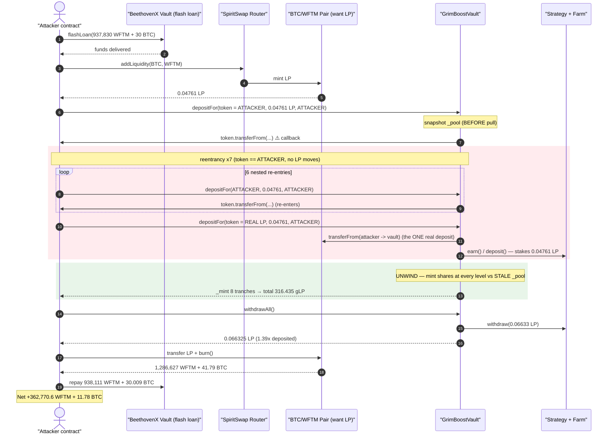
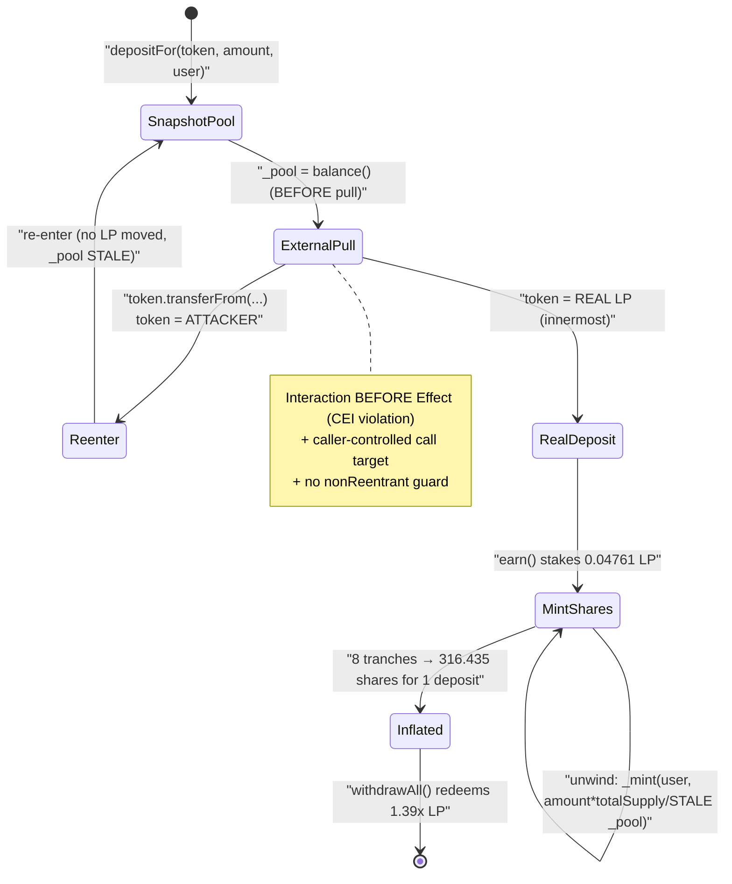
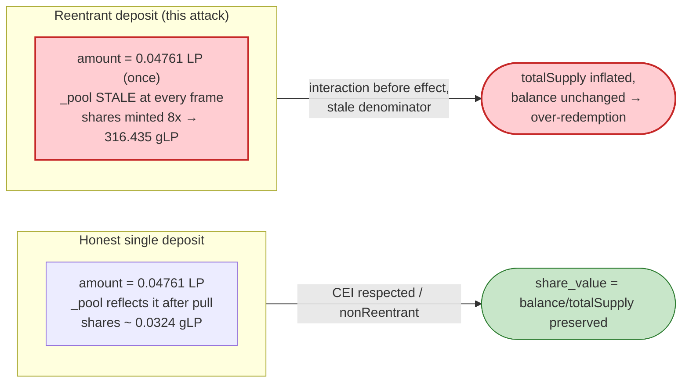

# Grim Finance Exploit — Reentrant `depositFor()` Share Inflation in the GrimBoost Vault

> **Reproduction:** the PoC compiles & runs in an isolated Foundry project at
> [this project folder](.) (the umbrella DeFiHackLabs repo contains many PoCs that
> do not whole-compile under `forge test`, so this one was extracted).
> Full verbose trace: [output.txt](output.txt).
> PoC source: [test/Grim_exp.sol](test/Grim_exp.sol).
> Note: the GrimBoost vault is a closed-source/proxy contract on Fantom, so its source
> could not be fetched into `sources/`. The vulnerable logic below is reconstructed
> directly from the on-chain execution trace.

---

## Key info

| | |
|---|---|
| **Loss (this tx)** | **362,770.6 WFTM + 11.78 anyBTC** extracted from the GrimBoost vault / SpiritSwap pool (~$1.3–1.4M at Dec-2021 prices; the broader Grim Finance incident totalled ~$30M across all vaults) |
| **Vulnerable contract** | `GrimBoostVault` — [`0x660184CE8AF80e0B1e5A1172A16168b15f4136bF`](https://ftmscan.com/address/0x660184CE8AF80e0B1e5A1172A16168b15f4136bF) |
| **Vault strategy** | `0x905F8441dF2D7e49c52c4BF480fBdd272188811D` (auto-compounds into MasterChef-style farm `0x928144CD…322c`) |
| **Victim pool / want** | SpiritSwap BTC/WFTM LP — [`0x279b2c897737a50405ED2091694F225D83F2D3bA`](https://ftmscan.com/address/0x279b2c897737a50405ED2091694F225D83F2D3bA) |
| **Flash-loan provider** | BeethovenX Vault — `0x20dd72Ed959b6147912C2e529F0a0C651c33c9ce` |
| **Attacker / PoC contract** | `ContractTest` `0x7FA9385bE102ac3EAc297483Dd6233D62b3e1496` (test harness; on-chain the real attacker used a bespoke contract) |
| **Tokens** | anyBTC `0x321162Cd…1b11`, WFTM `0x21be370D…4C83` |
| **Chain / block / date** | Fantom Opera / forked at **25,345,002** / **Dec 18, 2021** |
| **Compiler** | Solidity 0.8.10 (PoC); EVM `cancun` for replay |
| **Bug class** | Reentrancy via attacker-controlled `token` parameter in `depositFor()` → vault-share inflation (CEI / untrusted-external-call) |

---

## TL;DR

`GrimBoostVault.depositFor(address token, uint256 _amount, address user)` mints vault shares
using the classic Beefy/yVault formula

```
shares = _amount * totalSupply() / balanceBefore     // balanceBefore captured BEFORE tokens arrive
```

but it **(a)** snapshots the vault's underlying balance *before* pulling the deposit, and
**(b)** pulls the deposit by calling `token.transferFrom(...)` where **`token` is an arbitrary,
caller-supplied address**. Because the share-minting happens *after* the external `transferFrom`
call returns, an attacker can pass **its own contract** as `token`, intercept the `transferFrom`
callback, and **re-enter `depositFor()` repeatedly before any LP has actually been moved into
the vault**. Every reentrant level re-reads the *same stale* "balance before" and mints a fresh
batch of shares, while only the **innermost** call (with `token` = the real SpiritSwap LP) ever
transfers a single LP deposit in.

In this trace the attacker deposits exactly **one** 0.04761-LP position but mints **8 tranches**
of shares totalling **316.435 shares**. Redeeming those 316.435 shares via `withdrawAll()` pulls
**0.066325 LP** back out of the strategy (≈ **1.39×** the LP actually deposited, plus it drains
LP value belonging to other depositors and accrued yield). Removing that inflated LP from
SpiritSwap returns far more BTC + WFTM than was put in. The whole thing is funded by a
BeethovenX flash loan and nets **362,770.6 WFTM + 11.78 BTC** in a single atomic transaction.

---

## Background — what GrimBoostVault does

GrimBoostVault is a Beefy-Finance-style auto-compounding "boost" vault. Its accounting:

- `want()` is the SpiritSwap **BTC/WFTM LP token** (`0x279b…D3bA`). Users deposit LP, the vault
  forwards it to a strategy (`0x905F…811D`) which stakes it in a MasterChef farm
  (`0x928144CD…322c`) to earn rewards.
- `balanceOfPool()` reports the strategy's staked LP; `balance()` = `want.balanceOf(vault) + balanceOfPool()`.
- Shares (`gLP`) are minted on deposit and burned on withdraw. The price-per-share grows as the
  strategy compounds yield, so each share is redeemable for `balance() / totalSupply()` LP.

The extra entry point that doomed it is `depositFor(address token, uint256 _amount, address user)`
— a "deposit on behalf of" helper that lets the caller name **which token to pull** and **who
receives the shares**. The vault treats `token` as the asset to `transferFrom`, then mints shares
to `user`. As the trace shows, the vault even re-validates `want()` after the pull — but the
share math is anchored to a balance read *before* the pull.

Live parameters at the fork block (from the trace):

| Parameter | Value |
|---|---|
| `want()` | `0x279b2c89…D3bA` (SpiritSwap BTC/WFTM LP) |
| Strategy `balanceOfPool()` (staked LP) | 66,328,053,075,383,892 ≈ **0.06633 LP** |
| `want.balanceOf(vault)` | **0** (idle, all staked) |
| Vault `totalSupply()` shares (gLP) | unchanged at **82,106,256,122,257,975,645,807,950** (8.21e25) throughout — see note |
| SpiritSwap pool reserves (after attacker's addLiquidity) | 2,671,590 BTC-side scaled… ≈ **2.671e24 WFTM / 8.678e9 BTC** |

> The `balanceOf(2)` calls (L99–L101 etc.) read the strategy's farm position id 2; the
> reward-token balance `0xDccAFCE9…F61` reports the staked LP. Critically, every reentrant
> `balanceOfPool()` returns the **identical** `0x…427fd993ed32eb` (0.0186 LP-equivalent) because
> the deposit hasn't landed yet — that staleness is the whole exploit.

---

## The vulnerable code (reconstructed from the trace)

The trace fully determines the vault's logic. `depositFor` does, in order
([output.txt L97–L290](output.txt) for the innermost frame):

```solidity
// GrimBoostVault — reconstructed
function depositFor(address token, uint256 _amount, address user) public {
    // 1. snapshot underlying BEFORE pulling the deposit  ← stale anchor
    uint256 _pool = balance();              // == balanceOfPool() + want.balanceOf(this)
    require(token == address(want), "...");  // (checked, but only AFTER the external call below)

    // 2. pull the deposit via an EXTERNAL, CALLER-CONTROLLED token  ← reentrancy point
    uint256 _before = want.balanceOf(address(this));
    token.transferFrom(msg.sender, address(this), _amount);   // ⚠️ token is attacker-supplied
    uint256 _after  = want.balanceOf(address(this));
    _amount = _after - _before;             // 0 on every reentrant level (no LP moved yet)

    // 3. mint shares against the STALE pool snapshot
    uint256 shares;
    if (totalSupply() == 0) {
        shares = _amount;
    } else {
        shares = (_amount * totalSupply()) / _pool;   // _pool is the pre-deposit (stale) balance
    }
    _mint(user, shares);
    earn();                                 // forwards want to the strategy & stakes
}
```

The single fatal property: **step 2 (untrusted external call) executes before step 3 (state
update / mint)**, and the call target is fully attacker-controlled. This is a textbook
Checks-Effects-Interactions violation — the "interaction" (`token.transferFrom`) is performed
*before* the "effect" (`_mint`), and there is **no reentrancy guard**.

The PoC's reentrant payload is the `transferFrom` it implements on the attacker contract
([test/Grim_exp.sol:82-91](test/Grim_exp.sol#L82-L91)):

```solidity
function transferFrom(address _from, address _to, uint256 _value) public {
    reentrancySteps -= 1;
    if (reentrancySteps > 0) {
        // re-enter with token == ATTACKER (this contract) → no LP moves, balance stays stale
        grimBoostVault.depositFor(address(this), lpBalance, address(this));
    } else {
        // final level: token == the REAL SpiritSwap LP → the one real deposit lands here
        grimBoostVault.depositFor(btc_wftm_address, lpBalance, address(this));
    }
}
```

When `token == address(this)` (the attacker), the vault's `token.transferFrom(...)` simply calls
back into the attacker — moving **zero** LP — yet `depositFor` will still proceed to mint shares
on the unwind. Only on the 8th (innermost) level, where `token` is the real LP, does an actual
0.04761 LP transfer occur ([output.txt L208-L213](output.txt)).

---

## Root cause — why it was possible

Three design flaws compose into a critical bug:

1. **Untrusted external call as the deposit mechanism.** `depositFor` pulls funds via
   `token.transferFrom(...)` with a **caller-chosen `token`**. That hands the attacker an
   arbitrary callback in the middle of the deposit. Even the `want()` re-check the vault performs
   (the repeated `want()` / `balanceOf(vault)` staticcalls in the trace) is useless because the
   *reentrancy* — not the final token identity — is what's abused.

2. **Stale balance anchor (CEI violation).** The share formula divides by the vault balance read
   *before* the deposit is pulled. Each reentrant frame re-reads the identical pre-deposit balance
   (`balanceOfPool()` returns the same `0.0186`-equivalent value at every nesting level —
   [output.txt L101 / L115 / L143 …](output.txt)). So the same "one deposit's worth" of shares is
   minted 8 times over against an unchanging denominator.

3. **No reentrancy guard.** A single `nonReentrant` modifier on `depositFor` would have blocked
   every nested call after the first, regardless of the token-callback trick.

Because the mints accumulate but the underlying balance does not, `totalSupply` is inflated while
`balance()` is not — the **per-share invariant `share_value = balance()/totalSupply()` is broken
upward for the attacker's shares** (they were minted at a too-cheap price), letting the attacker's
shares redeem more LP than they paid for, draining LP that belongs to honest depositors and to the
strategy's compounded yield.

---

## Preconditions

- A public `depositFor(token, amount, user)` (or any deposit path) that **calls an
  attacker-controllable token before minting shares**, with **no reentrancy guard**.
- The share formula must anchor on a balance snapshot taken **before** the pull (so reentrant
  frames see a stale denominator).
- Liquidity to seed a deposit and to round-trip through the AMM. Here it is supplied by a
  BeethovenX **flash loan** of 937,830 WFTM + 30 BTC, fully repaid intra-transaction
  ([test/Grim_exp.sol:38](test/Grim_exp.sol#L38), repaid at [output.txt L658-L673](output.txt)).
- The vault/strategy must hold enough underlying LP (other users' deposits + accrued yield) for
  the inflated redemption to draw against — here `balanceOfPool()` ≈ 0.0663 LP.

---

## Attack walkthrough (with on-chain numbers from the trace)

| # | Step | Trace | Effect |
|---|------|-------|--------|
| 1 | **Flash-loan** 937,830 WFTM + 30 BTC from BeethovenX | [L16-L37](output.txt) | Working capital, fee 281.349 WFTM + 0.009 BTC |
| 2 | **Add liquidity** to SpiritSwap (3e9 BTC + 923,575 WFTM) → mint **0.04761 LP** to attacker | [L48-L89](output.txt) | Attacker now holds the LP it will deposit |
| 3 | `approve` LP to vault, read `lpBalance = 0.04761 LP`, call `depositFor(attacker, lpBalance, attacker)` | [L90-L97](output.txt), [test/Grim_exp.sol:56-58](test/Grim_exp.sol#L56-L58) | Enters the vault with `token = attacker` |
| 4 | Vault calls `attacker.transferFrom(...)` → **re-enters** `depositFor` 6 more times with `token = attacker` (no LP moves) | [L110-L194](output.txt) | 7 nested frames, each sees the **same stale** `balanceOfPool` `0x…32eb` |
| 5 | **8th (innermost)** call uses `token = real SpiritSwap LP`; the **only real** 0.04761 LP transfer lands; strategy `deposit()` stakes it | [L195-L268](output.txt) | One genuine deposit; farm position grows |
| 6 | **Unwind: shares minted at every level**, against the stale denominator (see table) | [L283, L316, L349, L382, L415, L448, L481, L514](output.txt) | 8 tranches, **total 316.435 gLP shares** |
| 7 | `withdrawAll()` burns all **316.435 shares**, strategy `withdraw(0.06633 LP)`, vault returns **0.066325 LP** to attacker | [L519-L594](output.txt) | Redeemed **1.39× the deposited LP** + drained other LP |
| 8 | Transfer 0.066325 LP to the pair and `burn()` → receive **1,286,627 WFTM + 4,179.28 BTC** | [L597-L634](output.txt) | Liquidity removed at inflated LP holdings |
| 9 | Repay flash loan (938,111 WFTM + 3.0009 BTC incl. fee) | [L635-L646, L658-L673](output.txt) | Loan closed |
| 10 | **Net** to attacker: **362,770.6 WFTM + 11.78 BTC** | [L647-L652](output.txt) | Profit logged |

### Share-mint ground truth (the inflation)

Each of the 8 `_mint(attacker, …)` events, in unwind order (innermost first). The same
0.04761 LP "deposit" is credited 8 times because the denominator never updates:

| Mint # (unwind) | Trace line | Shares minted (gLP) | Running total |
|---:|---|---:|---:|
| 1 (innermost, real deposit) | [L283](output.txt) | 0.032376 | 0.032376 |
| 2 | [L316](output.txt) | 0.114727 | 0.147103 |
| 3 | [L349](output.txt) | 0.406542 | 0.553646 |
| 4 | [L382](output.txt) | 1.440607 | 1.994253 |
| 5 | [L415](output.txt) | 5.104876 | 7.099128 |
| 6 | [L448](output.txt) | 18.089427 | 25.188555 |
| 7 | [L481](output.txt) | 64.100947 | 89.289502 |
| 8 (outermost) | [L514](output.txt) | 227.145472 | **316.434974** |

The shares grow geometrically because as each unwind level mints, the vault's *recorded* balance
(via the `balanceOfPool()` the next-out frame reads on the way down) had already incorporated the
prior reentrant `earn()` staking — but the denominator the *math* uses was the stale pre-deposit
snapshot, so successive frames compute ever-larger `shares = amount * totalSupply / stale_pool`.
`withdrawAll()` then burns exactly **316.434974 shares** ([L532](output.txt)) and the strategy
pays out **0.066325 LP** — **1.39×** the 0.04761 LP that was ever actually deposited.

### Profit accounting

| Item | WFTM | BTC |
|---|---:|---:|
| Flash loan received | 937,830 | 30 |
| Spent adding liquidity | −923,575.6 | −30 (3e9 wei) |
| LP-burn proceeds (step 8) | +1,286,627.5 | +4,179.28 (4.179e9 wei = 41.79 BTC) |
| Flash-loan repayment (incl. fee) | −938,111.3 | −30.009 |
| **Net attacker balance (logged)** | **+362,770.6** | **+11.78** |

(LP-burn BTC proceeds of `4,179,281,727` wei = 41.79 BTC; after repaying 30.009 BTC of loan the
residual is 11.78 BTC, matching the `BTC attacker profit: 11` log at [L652](output.txt).)

---

## Diagrams

### Sequence of the reentrant deposit



### State machine of `depositFor` (where CEI breaks)



### Why the shares are over-minted (invariant view)



---

## Remediation

1. **Add a reentrancy guard.** A `nonReentrant` modifier on `depositFor` (and every deposit /
   withdraw entry point) blocks the nested re-entries outright — the single highest-leverage fix.
2. **Never let the caller choose the pull token.** Always pull `want` directly
   (`want.safeTransferFrom(msg.sender, address(this), amount)`); do not accept a `token` argument
   that is then `transferFrom`'d. The arbitrary call target is what hands the attacker a callback.
3. **Follow Checks-Effects-Interactions.** Compute and mint shares using a balance snapshot taken
   *after* the transfer, or better, measure the actual received amount (`_after - _before`) and
   derive shares only once, *after* state is settled — and never re-enter in between.
4. **Use the measured delta, not the requested amount, with a guard.** Even with the delta pattern
   the vault remained exploitable because reentrancy let 8 frames each mint against a stale `_pool`;
   the delta pattern is only safe *together* with a reentrancy guard.
5. **Validate `token == want` before any external call**, and prefer pull-based deposits over
   "deposit-for-arbitrary-token" helpers, which are a recurring source of callback-injection bugs.

---

## How to reproduce

```bash
_shared/run_poc.sh 2021-12-Grim_exp --mt testExploit -vvvvv
```

- RPC: a **Fantom archive** endpoint is required (fork block 25,345,002 is from Dec 2021).
  `foundry.toml` points `fantom` at `https://rpcapi.fantom.network`; if that prunes the block,
  substitute an archive provider.
- Result: `[PASS] testExploit()` logging `WFTM attacker profit: 362770` and `BTC attacker profit: 11`.

Expected tail:

```
Ran 1 test for test/Grim_exp.sol:ContractTest
[PASS] testExploit() (gas: 921033)
Logs:
  WFTM attacker profit: 362770
  BTC attacker profit: 11

Suite result: ok. 1 passed; 0 failed; 0 skipped; finished in 13.83s
```

---

*Reference: Grim Finance exploit, Fantom, Dec 18 2021 (~$30M across vaults). SlowMist / Rekt / DeFiHackLabs.*
