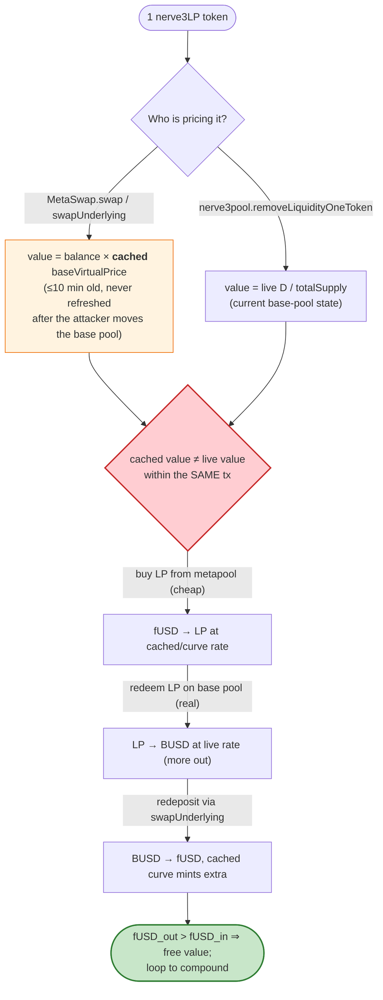
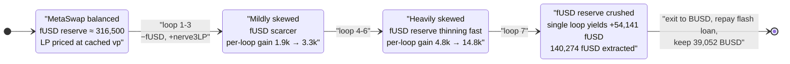

# Nerve Bridge (Saddle/MetaSwap) Exploit — Stale `baseVirtualPrice` Cache Lets a Round-Trip Mint Free fUSD

> **Vulnerability classes:** vuln/oracle/stale-price · vuln/logic/state-update

> **Reproduction:** the PoC compiles & runs in an isolated Foundry project at
> [this project folder](.) (the umbrella DeFiHackLabs repo contains many
> unrelated PoCs that fail to whole-compile, so this one was extracted).
> Full verbose trace: [output.txt](output.txt).
> Verified vulnerable source: [contracts_meta_MetaSwapUtils.sol](sources/MetaSwap_d0fBF0/contracts_meta_MetaSwapUtils.sol).

---

## Key info

| | |
|---|---|
| **Loss** | **~39,052 BUSD** net profit per attack run (flash-loaned, so ~100% margin); the real-world Nerve incident drained ~$8M across the affected pools |
| **Vulnerable contract** | `MetaSwap` (Saddle fork) — [`0xd0fBF0A224563D5fFc8A57e4fdA6Ae080EbCf3D3`](https://bscscan.com/address/0xd0fBF0A224563D5fFc8A57e4fdA6Ae080EbCf3D3#code) (logic at `0xf642f2A626a8B732619606C493aBFc2433dd2D35`) |
| **Victim pool** | `MetaSwap` fUSD/nerve3LP pool + its base `nerve3pool` [`0x1B3771a66ee31180906972580adE9b81AFc5fCDc`](https://bscscan.com/address/0x1B3771a66ee31180906972580adE9b81AFc5fCDc#code) |
| **Tokens** | meta token0 = **fUSD** `0x049d68029688eAbF473097a2fC38ef61633A3C7A` (6 dec); token1 = **nerve3LP** `0xf2511b5E4FB0e5E2d123004b672BA14850478C14` (18 dec, base-pool LP); base underlying = **BUSD** `0xe9e7CEA3DedcA5984780Bafc599bD69ADd087D56` |
| **Flash-loan source** | ForTube / BSC Vault — `0x0cEA0832e9cdBb5D476040D58Ea07ecfbeBB7672` (50,000 BUSD, fee 40 BUSD) |
| **BUSD↔fUSD on-ramp** | Ellipsis fUSD Vyper pool `0x556ea0b4c06D043806859c9490072FaadC104b63` |
| **Attacker** | Single attacker contract executes the whole flash-loan round trip atomically; PoC runs from the Foundry test EOA `0x7FA9385bE102ac3EAc297483Dd6233D62b3e1496` |
| **Attack tx** | `0xea95925eb0438e04d0d81dc270a99ca9fa18b94ca8c6e34272fc9e09266fcf1d` |
| **Chain / block / date** | BSC / fork **12,653,565** / December 2021 |
| **Compiler** | MetaSwap/Swap/LPToken: Solidity **0.6.12** (optimizer, 10000 runs); base curve pool: Vyper 0.2.11 |
| **Bug class** | Stale cached oracle/virtual-price (price-cache desync) → broken StableSwap invariant via asymmetric round-trip |

> Reference: BlockSec — *"The analysis of Nerve Bridge security incident"*
> https://blocksecteam.medium.com/the-analysis-of-nerve-bridge-security-incident-ead361a21025

---

## TL;DR

Nerve's `MetaSwap` is a Saddle-style metapool: it pools the meta token **fUSD** against the
**LP token of a base StableSwap pool** (`nerve3LP`, the receipt for the BUSD/USDT/USDC `nerve3pool`).
To price the LP token, MetaSwap multiplies the LP balance by the base pool's *virtual price*. For gas
reasons that virtual price is **cached** and only refreshed when the cache is older than
`BASE_CACHE_EXPIRE_TIME = 10 minutes`
([MetaSwapUtils.sol:175-191](sources/MetaSwap_d0fBF0/contracts_meta_MetaSwapUtils.sol#L175-L191)).

The attacker round-trips value through the metapool inside a single transaction:

1. `MetaSwap.swap(fUSD → nerve3LP)` — buys the base LP token. The LP is priced with the **stale**
   cached `baseVirtualPrice`.
2. `nerve3pool.removeLiquidityOneToken(nerve3LP → BUSD)` — redeems that LP on the **real** base pool,
   getting *more* underlying than the metapool charged for the LP.
3. `MetaSwap.swapUnderlying(BUSD → fUSD)` — deposits the BUSD back into the base pool to obtain LP, then
   sells that LP to the metapool for fUSD, **again** priced with the stale cache.

Because the metapool's swap math and the base pool's real redemption math use a *different* valuation
of the same LP token (cached vs. live virtual price, and the metapool's StableSwap curve never sees the
underlying redemption slippage), each round trip returns **more fUSD than it consumed**. Looping it 7×
turns 51,192 fUSD into 140,274 fUSD, then the attacker swaps back to BUSD on Ellipsis, repays the
flash loan, and keeps **39,052 BUSD**.

The PoC ends with: `[PASS] testExp()` / `final busd profit: 39052`.

---

## Background — Saddle/Nerve MetaSwap and the virtual-price cache

A **base StableSwap pool** (`nerve3pool`, `0x1B3771…`) holds BUSD/USDT/USDC and issues an LP receipt
token, `nerve3LP` (`0xf2511b…`). The LP's fair value relative to the underlying stablecoins is the
pool's **virtual price** = `D / totalSupply`, where `D` is the StableSwap invariant. The virtual price
drifts slowly upward as swap fees accrue, and is `> 1.0`.

A **MetaSwap pool** (`d0fBF0…`) lets that LP token trade against a fresh stablecoin, **fUSD**, as if it
were just another asset in a 2-token StableSwap. The catch: to run the StableSwap math, MetaSwap must
express both balances in the same precision. fUSD is taken at face value, but the LP balance is scaled
by the base pool's virtual price:

```solidity
// MetaSwapUtils._xp — scale the base-LP balance by the (cached) virtual price
uint256 baseLPTokenIndex = numTokens - 1;
xp[baseLPTokenIndex] = xp[baseLPTokenIndex]
    .mul(baseVirtualPrice)
    .div(BASE_VIRTUAL_PRICE_PRECISION);
```
([MetaSwapUtils.sol:466-485](sources/MetaSwap_d0fBF0/contracts_meta_MetaSwapUtils.sol#L466-L485))

Reading the base pool's live virtual price every call is expensive, so MetaSwap caches it:

```solidity
function _updateBaseVirtualPrice(MetaSwap storage metaSwapStorage) internal returns (uint256) {
    if (block.timestamp > metaSwapStorage.baseCacheLastUpdated + BASE_CACHE_EXPIRE_TIME) {
        uint256 baseVirtualPrice = ISwap(metaSwapStorage.baseSwap).getVirtualPrice();
        metaSwapStorage.baseVirtualPrice = baseVirtualPrice;
        metaSwapStorage.baseCacheLastUpdated = block.timestamp;
        return baseVirtualPrice;
    } else {
        return metaSwapStorage.baseVirtualPrice;   // ← serves a value up to 10 minutes old
    }
}
```
([MetaSwapUtils.sol:175-191](sources/MetaSwap_d0fBF0/contracts_meta_MetaSwapUtils.sol#L175-L191),
constant at [:135](sources/MetaSwap_d0fBF0/contracts_meta_MetaSwapUtils.sol#L135))

On-chain parameters at the fork block (from the trace):

| Parameter | Value |
|---|---|
| `BASE_CACHE_EXPIRE_TIME` | **10 minutes** |
| MetaSwap token0 (fUSD) reserve | ~316,500.53 fUSD (6 dec) |
| nerve3pool BUSD reserve | ~40,929.94 BUSD before the attack's first deposit |
| nerve3LP `totalSupply` | ~5.347e24 (≈ 5.35M LP) |

---

## The vulnerable code

### 1. `swap()` and `swapUnderlying()` value the LP token with the **cached** virtual price

Both state-mutating entry points pull `baseVirtualPrice` from `_updateBaseVirtualPrice` (i.e. the cache,
not a fresh read) and feed it into the StableSwap `xp` scaling and `getY`:

```solidity
// MetaSwap forward swap: fUSD (index 0) -> nerve3LP (index 1)
function swap(... ) external returns (uint256) {
    ...
    (uint256 dy, uint256 dyFee) =
        _calculateSwap(self, tokenIndexFrom, tokenIndexTo, transferredDx,
                       _updateBaseVirtualPrice(metaSwapStorage));   // ← cached price
    ...
}
```
([MetaSwapUtils.sol:867-928](sources/MetaSwap_d0fBF0/contracts_meta_MetaSwapUtils.sol#L867-L928))

```solidity
function swapUnderlying(...) external returns (uint256) {
    SwapUnderlyingInfo memory v = SwapUnderlyingInfo(
        0,0,0,0,0, self.balances, metaSwapStorage.baseTokens,
        IERC20(address(0)), IERC20(address(0)),
        _updateBaseVirtualPrice(metaSwapStorage)   // ← cached price again
    );
    ...
    // when tokenFrom is a base underlying (e.g. BUSD), the metapool deposits it
    // into the REAL base pool to obtain LP, then runs the cached-price StableSwap math:
    baseSwap.addLiquidity(baseAmounts, 0, block.timestamp);          // real base-pool state
    v.dx = baseLPToken.balanceOf(address(this)).sub(v.x);            // real LP received
    v.x = v.dx.mul(v.baseVirtualPrice).div(BASE_VIRTUAL_PRICE_PRECISION).add(xp[baseLPTokenIndex]);
    ...
    uint256 y = getY(getAPrecise(self), v.metaIndexFrom, v.metaIndexTo, v.x, xp);  // cached-price curve
    v.dy = xp[v.metaIndexTo].sub(y).sub(1);                          // fUSD out
}
```
([MetaSwapUtils.sol:930-1086](sources/MetaSwap_d0fBF0/contracts_meta_MetaSwapUtils.sol#L930-L1086))

### 2. The base pool prices the same LP with its **live** virtual price

When the attacker redeems LP outside the metapool, the base `nerve3pool` uses its *actual* current
state (live `D`, live `totalSupply`) to compute the payout — there is no cache:

```solidity
// nerve3pool.removeLiquidityOneToken(nerve3LP -> BUSD): real, current-state withdrawal
(dy, dyFee) = calculateWithdrawOneToken(self, msg.sender, tokenAmount, tokenIndex,
                                         _updateBaseVirtualPrice(...), totalSupply);
lpToken.burnFrom(msg.sender, tokenAmount);
self.pooledTokens[tokenIndex].safeTransfer(msg.sender, dy);
```
([contracts_SwapUtils.sol](sources/Swap_1B3771/contracts_SwapUtils.sol), `removeLiquidityOneToken`)

### 3. Why the round trip leaks value

The metapool treats the LP token as a constant-price asset (`1 LP ≈ cachedVirtualPrice` of stable
value) inside its 2-asset StableSwap. But the **real** value of `1 LP` differs from the cached number,
*and* the metapool's curve gives the LP-buyer a near-1:1 rate (StableSwap is built to keep pegged
assets near parity). So:

- Buying LP from the metapool with fUSD is cheap (curve + stale cache undervalue the LP relative to
  what the base pool will actually redeem it for).
- Redeeming that LP on the real base pool returns more underlying than the metapool charged.
- Depositing the underlying back via `swapUnderlying` re-enters the same undervalued curve, minting
  more fUSD than was originally spent.

The metapool's own `addLiquidity`/`swap` invariant check (`require(d1 > d0)`) is satisfied at each step
because it is computed with the *same* stale price on both sides — the invariant is internally
consistent but **wrong relative to the live base pool**, which is exactly the gap the attacker harvests.

---

## Root cause

> **MetaSwap values the base-pool LP token with a cached `baseVirtualPrice` (up to 10 minutes stale),
> while the base pool itself values the very same LP with its live, current-state virtual price.
> A single transaction can therefore buy LP cheap inside the metapool and redeem/redeposit it at the
> real price, pocketing the difference — repeatedly.**

Three design decisions compose into the bug:

1. **Cross-contract price desync.** The metapool and base pool disagree on `value(1 LP)` within the same
   block. Any time two contracts must agree on a price and one of them caches it, an atomic round trip
   between them is an arbitrage that pays the attacker, not the LPs.
2. **The cache is never invalidated by relevant state changes.** `_updateBaseVirtualPrice` keys solely
   off `block.timestamp`; a `swapUnderlying` that *itself* moves the base pool (via `addLiquidity` /
   `removeLiquidityOneToken`) does not refresh the cache it just invalidated.
3. **StableSwap's near-parity pricing hides the leak.** Because the metapool's curve quotes LP↔fUSD near
   1:1, the small but compounding mispricing per loop is not blocked by slippage — and as the loop
   drains fUSD and accumulates LP in the metapool, the imbalance makes *later* loops far more profitable
   (the 7th loop alone nets +54,141 fUSD vs. +1,896 on the first).

This is the canonical "metapool virtual-price cache" issue; the same root cause underlies several
Saddle/Curve-metapool incidents.

---

## Preconditions

- A MetaSwap-style metapool whose base-LP token is priced from a **cached** virtual price, deployed with
  a non-trivial fUSD reserve (here ~316,500 fUSD available to drain).
- The cache must be **stale within the attack transaction** — trivially true: `_updateBaseVirtualPrice`
  only refreshes after 10 minutes, so any call inside a single block reuses the stored value, and the
  attacker's own base-pool operations move the live price *away* from the cache.
- Working capital to seed the round trip. The attack is **flash-loanable**: the PoC borrows
  **50,000 BUSD** from ForTube and repays `50,000 + 40` fee in the same tx.
- A BUSD↔fUSD venue to enter/exit the meta token (the Ellipsis fUSD Vyper pool `0x556ea0…`).

---

## Step-by-step attack walkthrough (on-chain numbers from the trace)

All values below are from the `emit` events in [output.txt](output.txt). fUSD has 6 decimals; nerve3LP
and BUSD have 18. The MetaSwap indices are `0 = fUSD`, `1 = nerve3LP`; in `swapUnderlying`'s flattened
underlying space, `1 = BUSD` (first base-pool token), `0 = fUSD`.

1. **Flash-loan 50,000 BUSD** from ForTube ([test/NerveBridge_exp.sol:55](test/NerveBridge_exp.sol#L55)),
   `executeOperation` receives it.
2. **Enter fUSD on Ellipsis:** `fusdPool.exchange_underlying(1→0, 50,000 BUSD)` →
   **51,192.778296 fUSD** ([NerveBridge_exp.sol:67](test/NerveBridge_exp.sol#L67), trace TokenExchangeUnderlying L1687).
3. **Loop 7×** ([NerveBridge_exp.sol:69-71](test/NerveBridge_exp.sol#L69-L71)), each iteration:
   - `MetaSwap.swap(0→1)`: fUSD → nerve3LP (cached-price curve).
   - `nerve3pool.removeLiquidityOneToken(LP, 0)`: nerve3LP → BUSD (live base-pool state).
   - `MetaSwap.swapUnderlying(1→0)`: BUSD → fUSD (deposits BUSD to base pool, cached-price curve again).
4. **Exit to BUSD on Ellipsis:** `fusdPool.exchange_underlying(0→1, 140,274.691208 fUSD)` →
   **89,092.281274 BUSD** (trace L3167-3221).
5. **Repay flash loan:** transfer `50,040 BUSD` back to ForTube
   ([NerveBridge_exp.sol:77](test/NerveBridge_exp.sol#L77)).
6. **Keep the rest:** `89,092.28 − 50,040 = 39,052.28 BUSD` profit → console prints `39052`.

### Ground-truth ledger — the 7 round-trip loops

Each row: fUSD spent into `MetaSwap.swap`, LP obtained, BUSD redeemed from `nerve3pool`, fUSD returned by
`MetaSwap.swapUnderlying`, and the net fUSD gained that loop.

| # | fUSD in (swap) | nerve3LP out | BUSD out (removeLiq) | fUSD out (swapUnderlying) | Net fUSD this loop |
|--:|--------------:|-------------:|---------------------:|--------------------------:|-------------------:|
| 1 | 51,192.778296 | 37,061.85417 | 37,174.205332 | 53,088.985734 | **+1,896.207** |
| 2 | 53,088.985734 | 37,133.96529 | 37,246.534460 | 55,545.473752 | **+2,456.488** |
| 3 | 55,545.473752 | 37,206.61748 | 37,319.406291 | 58,873.780156 | **+3,328.306** |
| 4 | 58,873.780156 | 37,279.77789 | 37,392.787878 | 63,680.429636 | **+4,806.649** |
| 5 | 63,680.429636 | 37,353.40965 | 37,466.642229 | 71,352.160607 | **+7,671.731** |
| 6 | 71,352.160607 | 37,427.47218 | 37,540.928656 | 86,133.145879 | **+14,780.985** |
| 7 | 86,133.145879 | 37,501.92199 | 37,615.603537 | 140,274.691208 | **+54,141.545** |

The per-loop gain **accelerates**: each round trip pulls fUSD out of the metapool and pushes nerve3LP in,
skewing the metapool further from balance. Because the curve quotes the increasingly-scarce fUSD at an
ever-better rate for the (cached-undervalued) LP being deposited, the 7th loop alone extracts more than
the first six combined. (The trace's swap values L1694, L1907, L2117, L2327, L2537, L2747, L2957 confirm
the fUSD inputs; the `RemoveLiquidityOne` and `TokenSwapUnderlying` events confirm the BUSD and fUSD
outputs.)

### Profit/loss accounting (BUSD)

| Item | Amount (BUSD) |
|---|---:|
| Flash-loaned in | 50,000.00 |
| Flash-loan fee owed | 40.00 |
| fUSD held after loops (140,274.69 fUSD) → BUSD via Ellipsis | **89,092.28** |
| Repaid to ForTube | −50,040.00 |
| **Net profit** | **+39,052.28 BUSD** |

The harvested ~39,052 BUSD is value taken from the MetaSwap LPs (the metapool's fUSD reserve was drained
and replaced with over-counted LP), realized as BUSD out of the base pool.

---

## Diagrams

### Sequence of one round-trip loop (×7)

```mermaid
sequenceDiagram
    autonumber
    actor A as Attacker
    participant E as "Ellipsis fUSD pool (556ea0)"
    participant M as "MetaSwap (d0fBF0)"
    participant B as "nerve3pool base (1B3771)"
    participant L as "nerve3LP (f2511b)"

    Note over M,B: MetaSwap caches baseVirtualPrice (≤10 min stale).<br/>Base pool uses LIVE virtual price.

    A->>E: exchange_underlying(BUSD → fUSD)
    E-->>A: 51,192.78 fUSD

    rect rgb(255,243,224)
    Note over A,L: Loop step 1 — buy LP cheap (cached price)
    A->>M: swap(fUSD → nerve3LP)
    M-->>A: 37,061.85 nerve3LP
    end

    rect rgb(232,245,233)
    Note over A,L: Loop step 2 — redeem LP at the REAL price
    A->>B: removeLiquidityOneToken(LP → BUSD)
    B->>L: burnFrom(LP)
    B-->>A: 37,174.21 BUSD  (more value than metapool charged)
    end

    rect rgb(227,242,253)
    Note over A,L: Loop step 3 — redeposit, mint extra fUSD (cached price)
    A->>M: swapUnderlying(BUSD → fUSD)
    M->>B: addLiquidity(BUSD) → LP
    M-->>A: 53,088.99 fUSD  (> the 51,192.78 we started with)
    end

    Note over A: Net +1,896 fUSD this loop;<br/>gain accelerates each iteration (7th = +54,141)

    A->>E: exchange_underlying(140,274.69 fUSD → BUSD)
    E-->>A: 89,092.28 BUSD
    A->>A: repay 50,040 BUSD, keep 39,052 BUSD
```

### Why the round trip leaks: cached vs. live LP valuation



### MetaSwap reserve drift across the 7 loops (qualitative)



---

## Remediation

1. **Do not cache the base virtual price across operations that move the base pool.** Read
   `baseSwap.getVirtualPrice()` live inside `swap`/`swapUnderlying`/`removeLiquidityOneToken`, or at
   minimum force a refresh whenever the same transaction has called `addLiquidity` /
   `removeLiquidityOneToken` on the base pool. The 10-minute time-only cache
   ([MetaSwapUtils.sol:175-205](sources/MetaSwap_d0fBF0/contracts_meta_MetaSwapUtils.sol#L175-L205)) must
   not be the price used for value-bearing math.
2. **Make the two contracts agree on `value(1 LP)` atomically.** If a cache is unavoidable for gas,
   route the LP valuation through a single source (e.g. always compute LP value from the live base-pool
   `D`/supply that the redemption path will use), so an atomic buy-here/redeem-there round trip cannot
   be profitable.
3. **Invalidate the cache on writes, not just on time.** Update `baseCacheLastUpdated`/`baseVirtualPrice`
   inside any path that mutates the base pool (the metapool itself calls `addLiquidity` /
   `removeLiquidityOneToken` during `swapUnderlying`).
4. **Bound single-transaction value extraction.** Track the metapool's invariant `D` against a *live*
   base valuation across the whole call and revert if a swap leaves the pool with a `D` lower than a
   live-priced recomputation would allow (defense-in-depth against curve/cache desync).
5. **Manipulation-resistant pricing.** Prefer an EMA/TWAP of the base virtual price (Curve-style) over a
   raw point value so that an attacker cannot exploit the instantaneous gap between cached and live
   prices.

---

## How to reproduce

The PoC was extracted into a standalone Foundry project (the umbrella DeFiHackLabs repo has several
unrelated PoCs that fail under a whole-project `forge build`):

```bash
_shared/run_poc.sh 2021-12-NerveBridge_exp --mt testExp -vvvvv
```

- RPC: a **BSC archive** endpoint serving historical state at block **12,653,565** is required.
  `foundry.toml` aliases `bsc = https://bsc-mainnet.public.blastapi.io`; most pruned public BSC RPCs fail
  with `header not found` / `missing trie node` at this old block.
- Result: `[PASS] testExp()` with `final busd profit: 39052`.

Expected tail:

```
Ran 1 test for test/NerveBridge_exp.sol:ContractTest
[PASS] testExp() (gas: 2835700)
Logs:
  final busd profit:  39052

Suite result: ok. 1 passed; 0 failed; 0 skipped
```

---

*Reference: BlockSec — "The analysis of Nerve Bridge security incident" — https://blocksecteam.medium.com/the-analysis-of-nerve-bridge-security-incident-ead361a21025*
