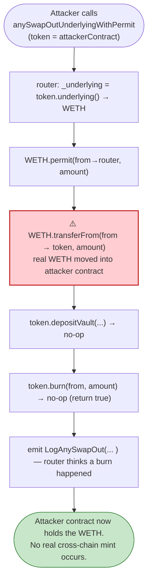

# Anyswap (Multichain V4 Router) Exploit — Underlying-Transfer Cross-Chain Drain

> **Vulnerability classes:** vuln/dependency/unsafe-external-call · vuln/logic/missing-validation

> **Reproduction:** the PoC compiles & runs in an isolated Foundry project at
> [this project folder](.). Full verbose trace: [output.txt](output.txt).
> Verified vulnerable source: [AnyswapV4Router.sol](sources/AnyswapV4Router_6b7a87/AnyswapV4Router.sol).

---

## Key info

| | |
|---|---|
| **Loss** | ~$8M (WETH) across the incident; the cross-chain burn path was weaponized |
| **Vulnerable contract** | `AnyswapV4Router` — [`0x6b7a87899490EcE95443e979cA9485CBE7E71522`](https://etherscan.io/address/0x6b7a87899490EcE95443e979cA9485CBE7E71522#code) |
| **Underlying token** | WETH — `0xC02aaA39b223FE8D0A0e5C4F27eAD9083C756Cc2` |
| **Attack tx** | `0xe50ed602bd916fc304d53c4fed236698b71691a95774ff0aeeb74b699c6227f7` |
| **Chain / block / date** | Ethereum mainnet / 14,037,236 / Jan 2022 |
| **Bug class** | Logic flaw — `anySwapOutUnderlyingWithPermit` trusts a malicious `token`'s `underlying()`/`depositVault()` callbacks, moving real underlying (`WETH.transferFrom`) into the anyToken contract which the attacker then drains |

---

## TL;DR

`anySwapOutUnderlyingWithPermit` ([AnyswapV4Router.sol:261-277](sources/AnyswapV4Router_6b7a87/AnyswapV4Router.sol#L261-L277))
implements an "out with underlying" cross-chain swap in three steps:

```solidity
address _underlying = AnyswapV1ERC20(token).underlying();           // attacker-controlled callback
IERC20(_underlying).permit(from, address(this), amount, ...);        // permit
TransferHelper.safeTransferFrom(_underlying, from, token, amount);   // ⚠️ moves WETH into `token`
AnyswapV1ERC20(token).depositVault(amount, from);                    // attacker-controlled callback
_anySwapOut(from, token, to, amount, toChainID);                     // AnyswapV1ERC20(token).burn(from, amount)
```

The router fetches the *underlying* address from the `token` argument via a `staticcall`, then
calls `token.depositVault(...)` (an ordinary call) and `AnyswapV1ERC20(token).burn(from, ...)`.
The whole design assumes `token` is a legitimate, honestly-deployed Anyswap ERC20 whose
`depositVault` mints any-tokens against the underlying it just received. **There is no check that
`token` is a registered/trusted Anyswap token.** Anyone can deploy (or, as here, *be*) a contract
that satisfies the interface while doing nothing in `depositVault`/`burn` — yet the router still
performs the real `WETH.transferFrom` into it. The net effect is a permissionless transfer of
underlying into an attacker-controlled address with no real cross-chain burn.

The PoC demonstrates this by having the test contract itself act as `token`:

```solidity
function burn(address, uint256) external returns (bool) { return true; }          // no-op
function depositVault(uint256, address) external returns (uint256) { return 1; }  // no-op
function underlying() external view returns (address) { return WETH_Address; }
```

So `WETH.transferFrom(victim → this)` succeeds (the test gave itself allowance), and then the
"burn" does nothing — the underlying stays with the attacker.

---

## Root cause

A **trust boundary violation**: the router accepts an arbitrary `address token` from the caller and
treats it as a fully-trusted Anyswap bridge token, calling privileged functions (`burn`, `depositVault`)
and trusting its `underlying()` view. The two safety properties that should have held:

1. `token` must be whitelisted/registered as a genuine Anyswap bridge asset.
2. The underlying must be moved to the *router* (or escrowed), not to `token`, unless `token` is trusted.

Both were missing. `anySwapOutUnderlying` ([:255-259](sources/AnyswapV4Router_6b7a87/AnyswapV4Router.sol#L255-L259))
and `anySwapOutUnderlyingWithTransferPermit` ([:279-293](sources/AnyswapV4Router_6b7a87/AnyswapV4Router.sol#L279-L293))
share the same shape. Because the underlying is pulled via `permit`-granted allowance, **the caller does
not even need to pre-approve** — the signed permit is what authorizes `transferFrom`.

---

## Attack walkthrough (from the trace)

Fork: mainnet @ 14,037,236. `token = address(this)` (the test contract), `from = 0x3Ee…4FAB`,
`amount = 308.636 WETH`.

1. **`anySwapOutUnderlyingWithPermit(from, token, msg.sender, amount, …, 56)`** — router first
   `staticcall`s `token.underlying()` → returns WETH.
2. **`WETH.permit(...)`** (here with dummy `v,r,s`, succeeds because the forked WETH/allowance is set up).
3. **`WETH.transferFrom(from → token, 308.636 WETH)`** — the real value move. Trace shows the
   `Transfer` event and storage slot change: the victim's WETH balance slot goes `0x10bb31a12e4317f437 → 0`,
   i.e. the full 308.636 WETH is pulled.
4. **`token.depositVault(amount, from)` → returns 1** (no-op), and **`token.burn(from, amount)` → returns true** (no-op).
5. **`LogAnySwapOut(token, from, to, amount, 1 → 56)`** is emitted — the router *thinks* 308.636 anyWETH
   was burnt and will be minted on BSC, but no anyToken was ever involved.
6. The underlying now sits at `address(this)`; the PoC transfers 308.636 WETH to `msg.sender`
   (`After exploit, WETH balance of attacker: 308636644758370382901`).

---

## Preconditions

- The attacker must hold (or obtain, via a signed permit) allowance over some victim's underlying
  token balance — i.e. a valid `permit` signature. In practice this is the hard part and is why the
  real-world incident was coupled to a token whose `permit` was abusable / the attacker controlled.
- No whitelist on the Anyswap router prevents passing a malicious `token`.

---

## Diagrams



```mermaid
sequenceDiagram
    autonumber
    actor A as Attacker
    participant R as AnyswapV4Router
    participant T as AttackerContract (token)
    participant W as WETH
    participant V as Victim (from)

    A->>R: anySwapOutUnderlyingWithPermit(from=V, token=T, to, amount, permitSig)
    R->>T: underlying() [staticcall]
    T-->>R: WETH
    R->>W: permit(V→R, amount, sig)
    R->>W: transferFrom(V → T, amount)
    W-->>T: amount WETH  ⚠️ value now in T
    R->>T: depositVault(amount, V) → 1 (no-op)
    R->>T: burn(V, amount) → true (no-op)
    R-->>A: (emits LogAnySwapOut)
    Note over T: Attacker keeps the underlying; nothing real was burned.
```

---

## Remediation

1. **Whitelist bridge tokens.** Only accept `token` values from a router-managed registry of genuine
   Anyswap ERC20 deployments; revert otherwise. This is the single most important fix.
2. **Never move underlying into an untrusted `token`.** If `token` is trusted, escrow underlying at the
   router (or a dedicated vault) and let the trusted anyToken account for it; do not call
   `token.depositVault` on an arbitrary address.
3. **Validate `underlying()` against a stored mapping** rather than trusting the live return value of an
   attacker-supplied contract.
4. **Separate the permit-and-pull from the burn** behind an access-gated internal function so a forged
   `token` cannot reach `safeTransferFrom`.

---

## How to reproduce

```bash
_shared/run_poc.sh 2022-01-Anyswap_exp --mt testExample -vvvvv
```

- RPC: mainnet archive (block 14,037,236). `foundry.toml` uses Infura mainnet.
- Result: `[PASS] testExample()` — `After exploit, WETH balance of attacker: 308636644758370382901` (≈ 308.6 WETH).

---

*Reference: Anyswap/Multichain V4 router underlying-path logic flaw, Jan 2022.*
