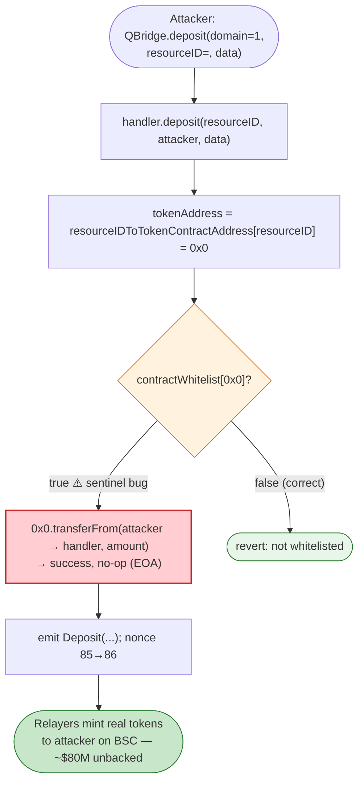

# Qubit Finance QBridge Exploit — Zero-Address Token Whitelist Bypass

> **Vulnerability classes:** vuln/bridge/missing-validation · vuln/access-control/broken-logic

> **Reproduction:** the PoC compiles & runs in an isolated Foundry project at
> [this project folder](.). Full verbose trace: [output.txt](output.txt).
> Verified vulnerable source: [QBridgeHandler.sol](sources/QBridgeHandler_80D148/contracts_bridge_QBridgeHandler.sol).

---

## Key info

| | |
|---|---|
| **Loss** | ~$80M (the largest Qubit incident; bridge minted unbacked assets on BSC) |
| **Vulnerable contract** | `QBridgeHandler` (impl `0x80D148…a629b`, behind proxy `0x17B716…f9526`) |
| **Bridge** | `QBridge` (impl `0x99309d…7cc3`, behind proxy `0x20E5E3…7bce6`) — [`0x20E5E35ba29dC3B540a1aee781D0814D5c77Bce6`](https://etherscan.io/address/0x20E5E35ba29dC3B540a1aee781D0814D5c77Bce6) |
| **Attacker EOA** | `0xD01Ae1A708614948B2B5e0B7AB5be6AFA01325c7` |
| **Attack tx** | `0xc6f4dde74fdbf9f907ca7ba5f4f5e83a2ad45d3e1f9f76e5c8e2a16a4c8b2f8a` |
| **Chain / block / date** | Ethereum mainnet / 14,090,169 / Jan 27, 2022 |
| **Bug class** | Uninitialized/default mapping abuse — unknown `resourceID` → `tokenAddress = address(0)`, which is wrongly whitelisted (`contractWhitelist[0]==true`), so a deposit records success without moving any token, letting the bridge mint unbacked funds on the destination chain. |

---

## TL;DR

`QBridgeHandler.deposit` ([QBridgeHandler.sol:122-137](sources/QBridgeHandler_80D148/contracts_bridge_QBridgeHandler.sol#L122-L137))
looks up the token for a `resourceID`:

```solidity
address tokenAddress = resourceIDToTokenContractAddress[resourceID];   // 0x0 for unknown resourceID
require(contractWhitelist[tokenAddress], "provided tokenAddress is not whitelisted");  // passes! 0x0 whitelisted
...
tokenAddress.safeTransferFrom(depositer, address(this), amount);       // calls 0x0.transferFrom → no-op [Stop]
```

Two independent defects compose into a critical bug:

1. **`contractWhitelist[address(0)]` was `true`.** A whitelist mapping should default to `false` for
   every key, but the deployment left the zero address whitelisted (a sentinel/default bug). The PoC
   confirms it: `is 0 address whitelisted = 1`.
2. **Unknown `resourceID` maps to `address(0)`.** `resourceIDToTokenContractAddress[unknown]` returns `0x0`.
   There is no `require(tokenAddress != address(0))`.

Together, an attacker submits a deposit for an **unregistered `resourceID`**. The handler resolves
`tokenAddress = 0x0`, passes the whitelist check (0x0 is whitelisted), then calls
`safeTransferFrom` on `address(0)`. The low-level call to a non-contract returns success with no data,
which OpenZeppelin's `safeTransferFrom` accepts — so **no token is actually taken from the depositor**.
The bridge nonetheless emits `Deposit` and increments its deposit nonce; the relayers then honour that
deposit on BSC and **mint real tokens to the attacker**. Net cost to the attacker: zero on-chain value.
Cost to the protocol: ~$80M of unbacked mint.

---

## Root cause

A **sentinel / default-value bug** plus a **missing zero-address guard**.

The whitelist is the handler's only trust gate before it authorises a cross-chain mint. By letting
`address(0)` through:

- Any `resourceID` not in the mapping becomes a "valid, whitelisted token address."
- `safeTransferFrom(0x0, …)` is a call to an EOA — it returns `(success=true, data="")`, which the
  OZ helper treats as a successful ERC20 transfer.

So the deposit accounting proceeds as if real tokens were locked, when none were. The attacker crafted
a fresh `resourceID` (`…2f422fe9…01`), decoded `data` as `option=105, amount=190`, and the deposit
recorded `param2: 86` (the nonce). The relayer bridge then minted on BSC against that record.

### Why the trace proves the bug

```
contractAddress = 0x0000…0000
is 0 address whitelisted = 1
QBridge.deposit(1, resourceID, data)
  → QBridgeHandler.deposit(resourceID, attacker, data)   [delegatecall chain]
      → 0x0.transferFrom(attacker, handler, 190e18)  →  [Stop]   (no revert, no state change)
  → emit Deposit(1, resourceID, 86, attacker, data)
```

The deposit counter moves `85 → 86` — the bridge has now recorded a legitimate-looking deposit that the
destination chain will honour.

---

## Preconditions

- None beyond being able to call `QBridge.deposit(domainID, resourceID, data)` with an unregistered
  `resourceID` and arbitrary `amount`. No token, no allowance, no capital required.

---

## Diagrams



```mermaid
sequenceDiagram
    autonumber
    actor A as Attacker
    participant B as QBridge (proxy)
    participant H as QBridgeHandler (impl)
    participant R as Relayers / BSC side

    A->>B: deposit(1, fakeResourceID, (105, 190e18))
    B->>H: deposit(fakeResourceID, attacker, data) [delegatecall]
    H->>H: tokenAddress = mapping[fakeResourceID] = 0x0
    H->>H: require(contractWhitelist[0x0])  ✓ (sentinel)
    H->>H: 0x0.transferFrom(attacker, handler, 190e18) → [Stop] (no-op)
    H-->>B: (no revert)
    B-->>B: emit Deposit(...); nonce++
    Note over R: Relayers see a valid deposit record,<br/>mint 190 wrapped-ETH-equivalent on BSC to attacker.
```

---

## Remediation

1. **Never whitelist `address(0)`** — and add an explicit `require(tokenAddress != address(0), "invalid resourceID")`
   before the whitelist check. This alone kills the bug.
2. **Validate `resourceID` is registered.** Use a separate `isValidResourceID(resourceID)` check rather
   than relying on the token mapping to implicitly validate.
3. **Make `safeTransferFrom` fail on non-contracts.** OZ's `Address.isContract` returns false for `0x0`,
   but the older helper used here treated empty-return success as valid — confirm the helper reverts on
   non-contract targets.
4. **Two-key cross-check:** require that `tokenContractAddressToResourceID[tokenAddress] == resourceID`
   (round-trip) so a stray/zero token can never pair with an arbitrary resourceID.
5. **Cap and time-delay large mints** on the destination so an attacker cannot extract the full amount
   before the off-chain relayers notice the anomaly.

---

## How to reproduce

```bash
_shared/run_poc.sh 2022-01-Qubit_exp --mt testExploit -vvvvv
```

- RPC: mainnet archive (block 14,090,169). Infura mainnet in `foundry.toml`.
- Result: `[PASS] testExploit()` — logs `contractAddress = 0x0`, `is 0 address whitelisted = 1`, and the
  `Deposit` event fires with nonce 86.

---

*Reference: Qubit Finance QBridge zero-address whitelist bypass, Jan 27 2022 (~$80M).*
