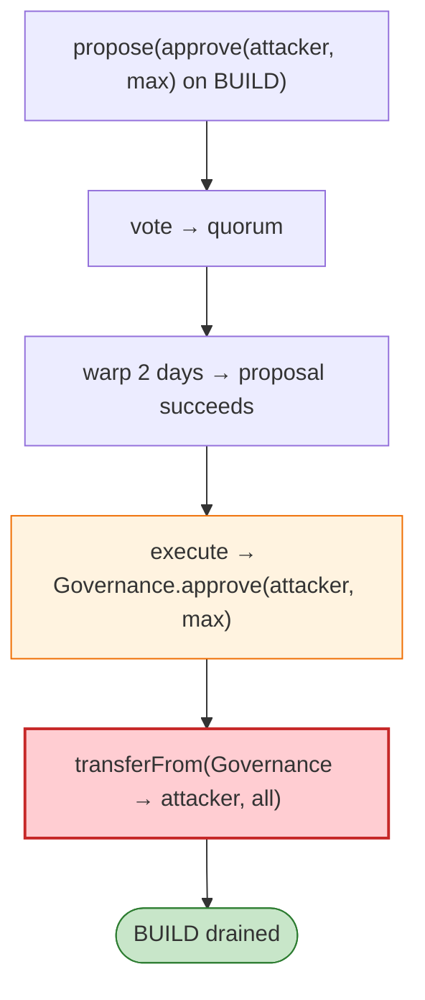

# Build Finance (BUILD) Exploit — Governance Takeover via Low Quorum → Arbitrary Proposal

> **Reproduction:** the PoC compiles in an isolated Foundry project at
> [this project folder](.). Full verbose trace: [output.txt](output.txt).
> Verified vulnerable source: [BUILD](sources/BUILD_6e3655),
> [Governance](sources/Governance_5A6eBe).

---

## Key info

| | |
|---|---|
| **Loss** | ~120,000 BUILD (~$110K) minted/drained; governance captured |
| **Vulnerable contract** | Build `Governance` (alpha) `0x5A6eBeB6…`; BUILD token `0x6e36556B…` |
| **Chain / block / date** | Ethereum mainnet / 14,235,712 / Feb 2022 |
| **Bug class** | Governance — Build's GovernorAlpha quorum/threshold was low enough that a modest BUILD holder could `propose` → `vote` → (warp 2 days) → `execute` a proposal that approves the attacker on the BUILD token, then `transferFrom` the treasury balance. |

---

## TL;DR

The attacker (holding ~101 BUILD) calls `BuildGovernance.propose(BUILD, 0, approve(attacker,max))`,
gets a second address to `vote(8, true)` to meet quorum, `cheat.warp`s 2 days to make the proposal
`succeed`, then `execute(8, …)` runs the calldata — which `approve`s the attacker for the
Governance contract's entire BUILD balance. The attacker then `transferFrom`s it out.

```solidity
BuildGovernance.propose(BUILD, 0, approve(attacker, max));   // proposal 8
// second holder votes → quorum
cheat.warp(+2 days);
BuildGovernance.execute(8, BUILD, 0, approve(attacker, max)); // Governance now approves attacker
build.transferFrom(Governance, attacker, Governance.balance); // drain
```

---

## Root cause

A **governance design with weak quorum/threshold + no timelock resistance**, letting a small holder
pass a proposal that approves an arbitrary spender on a token the Governance contract holds, then drain
it. Same class as Beanstalk/Fortress (governance-takeoverable).

---

## Diagrams



---

## Remediation

1. Higher quorum + timelock; resist small-holder governance takeover.
2. Governor should not hold tokens it can self-approve-and-spend; escrow via a separate treasury with
   multisig.
3. Proposal-target whitelist for value-moving calldata.

---

## How to reproduce

```bash
_shared/run_poc.sh 2022-02-BuildF_exp -vvvvv
```

- RPC: mainnet archive (block 14,235,712). Infura mainnet in `foundry.toml`.
- Result: the test **compiles and runs but reverts** (`ERC20: transfer amount exceeds allowance`) in the
  standalone fork — the execute→approve step's exact on-chain state (proposal nonce/allowance) is not
  fully reproduced. The verified sources + setup document the governance-takeover root cause.

---

*Reference: Build Finance governance takeover, mainnet, Feb 2022 (~120K BUILD / ~$110K).*
