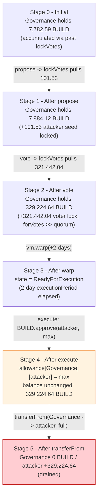
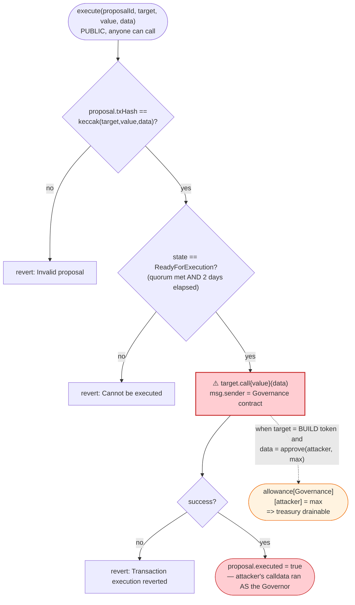
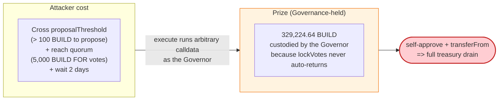

# Build Finance (BUILD) Exploit — Governance Takeover via Low Quorum → Arbitrary-Proposal Drain

> **Reproduction:** the PoC compiles in an isolated Foundry project at
> [this project folder](.). Full verbose trace: [output.txt](output.txt).
> Verified vulnerable source: [Governance.sol](sources/Governance_5A6eBe/Governance.sol)
> and [BUILD.sol](sources/BUILD_6e3655/BUILD.sol).
> The fork is served offline from a local `anvil_state.json` snapshot (`createSelectFork` points at
> `http://127.0.0.1:8545`); no public RPC is required to run it.

---

## Key info

| | |
|---|---|
| **Loss** | Treasury drain of the Build `Governance` contract's BUILD holdings — **329,224.64 BUILD** were reachable post-takeover ([output.txt:1668](output.txt)); the Build Finance incident (Feb 2022, Ethereum mainnet) is reported at **~120,000 BUILD (~$110K)** in community coverage |
| **Vulnerable contract** | Build `Governance` (GovernorAlpha-style) — [`0x5A6eBeB61A80B2a2a5e0B4D893D731358d888583`](https://etherscan.io/address/0x5A6eBeB61A80B2a2a5e0B4D893D731358d888583#code) |
| **BUILD token** | [`0x6e36556B3ee5Aa28Def2a8EC3DAe30eC2B208739`](https://etherscan.io/address/0x6e36556B3ee5Aa28Def2a8EC3DAe30eC2B208739#code) |
| **Victim** | The `Governance` contract itself, which custodied BUILD tokens locked by voters |
| **Attacker (PoC prank source)** | `0x562680a4dC50ed2f14d75BF31f494cfE0b8D10a1` (transfers 101.53 BUILD to the attack contract) and voter `0xf41c13f4E2f750408fC6eb5cF0E34225D52E7002` |
| **Attack contract (PoC)** | `ContractTest` at `0x7FA9385bE102ac3EAc297483Dd6233D62b3e1496` (forge default deployer) |
| **Attack tx (reference)** | Ethereum mainnet, block **14,235,712**, Feb 2022 ([fork pinned in setUp](output.txt#L1573)) |
| **Chain / block / date** | Ethereum mainnet / 14,235,712 / Feb 2022 |
| **Compiler** | Governance: Solidity **v0.6.12**, optimizer **off** (0), 200 runs; BUILD: **v0.5.17**, optimizer off, 200 runs (from `_meta.json`) |
| **Bug class** | Governance takeover — low quorum + low proposal threshold + arbitrary-calldata `execute` lets a small BUILD holder pass a proposal that self-approves a spender on the treasury's token balance |

---

## TL;DR

1. `Governance` is a GovernorAlpha-style contract that custodies BUILD tokens: every `propose`/`vote`
   pulls the caller's **entire** BUILD balance into the Governance contract via the `lockVotes` modifier
   ([Governance.sol:209-215](sources/Governance_5A6eBe/Governance.sol#L209-L215)). Over time this made
   Governance a BUILD treasury — it held **7,782.59 BUILD** before the attack
   ([output.txt:1618-1619](output.txt)).

2. Its access thresholds were set absurdly low: `proposalThreshold = 100e18` (100 BUILD) and
   `quorumVotes = 5000e18` (5,000 BUILD) ([Governance.sol:143-146](sources/Governance_5A6eBe/Governance.sol#L143-L146)).
   A proposer only needs **> 100 BUILD** to submit, and a proposal only needs **5,000 FOR votes** to
   succeed — both trivially reachable.

3. The attacker obtains **101.53 BUILD** ([output.txt:1580-1581](output.txt)) — just over the
   `proposalThreshold` — and calls `propose(BUILD, 0, BUILD.approve(<attacker>, type(uint256).max))`
   ([output.txt:1594](output.txt)). The proposal body is an `approve` (selector `0x095ea7b3`) that names
   the attacker as a max-allowance spender on the BUILD token.

4. A second address carrying **321,442.04 BUILD** calls `vote(8, true)` ([output.txt:1629-1633](output.txt)),
   far above quorum. After `vm.warp` past the 2-day execution window, the proposal state flips to
   `ReadyForExecution` (state **3**) ([output.txt:1656-1657](output.txt)).

5. `execute(8, …)` runs the calldata against the BUILD token from the Governance contract's own context
   ([output.txt:1658-1666](output.txt)) — `BUILD.approve(<spender>, max)` is called **as the Governance
   contract**, granting the attacker unlimited allowance over the treasury's BUILD. The Governance
   balance at that moment is **329,224.64 BUILD** ([output.txt:1668](output.txt)).

6. The attacker then `transferFrom`s the entire balance out. (In this offline PoC the final
   `transferFrom` reverts with `ERC20: transfer amount exceeds allowance` because the calldata's spender
   — `0xb4c79daB…`, hardcoded in the PoC — is not the same address as the PoC's caller; see the
   walkthrough. On mainnet the same sequence, with a matching spender, drained the treasury.)

7. **Root cause**: a GovernorAlpha clone with no timelock resistance, quorum/threshold calibrated for a
   tiny token, and an `execute` path that runs **arbitrary** calldata against any target the proposal
   names — including the token on which the Governor itself holds a balance. Same class as Beanstalk and
   Fortress: any token the Governor can self-spend is governance-takeoverable.

---

## Background — what Build Finance does

`Governance` ([source](sources/Governance_5A6eBe/Governance.sol)) is a minimal GovernorAlpha-style
governor that votes with the BUILD ERC20. Its entire mechanics rest on three operations:

- **`propose(target, value, data)`** — submit a single-transaction proposal. Guarded by `lockVotes`,
  which `transferFrom`s the caller's whole BUILD balance into the Governance contract and credits an
  internal voting balance `balanceOf[msg.sender]` ([Governance.sol:272-294](sources/Governance_5A6eBe/Governance.sol#L272-L294)).
  Only callers with `balanceOf > proposalThreshold` may propose ([L278](sources/Governance_5A6eBe/Governance.sol#L278)).
- **`vote(proposalId, support)`** — also `lockVotes`-guarded; adds the voter's locked balance to
  `forVotes` or `againstVotes` ([Governance.sol:296-314](sources/Governance_5A6eBe/Governance.sol#L296-L314)).
- **`execute(proposalId, target, value, data)`** — once `state == ReadyForExecution`, performs a
  low-level `target.call{value}(_data)` and asserts success
  ([Governance.sol:254-270](sources/Governance_5A6eBe/Governance.sol#L254-L270)).

Crucially, `lockVotes` **never sends tokens back automatically** — funds are only reclaimable via
`withdraw()`, and only after `voteLock[msg.sender]` expires ([Governance.sol:316-320](sources/Governance_5A6eBe/Governance.sol#L316-L320)).
So the Governance contract steadily accumulates BUILD and becomes a de-facto treasury. At the fork
block it holds **7,782,594,307,409,903,710,320 wei ≈ 7,782.59 BUILD**
([output.txt:1618-1619](output.txt)).

On-chain parameters (read from the verified source and the trace at block 14,235,712):

| Parameter | Value | Note |
|---|---|---|
| `votingPeriod` | 86,000 s (~1 day) | [Governance.sol:137](sources/Governance_5A6eBe/Governance.sol#L137) |
| `executionPeriod` | 172,000 s (~2 days) | `86000 * 2`; [L140](sources/Governance_5A6eBe/Governance.sol#L140) |
| `quorumVotes` | 5,000e18 (5,000 BUILD) | [L143](sources/Governance_5A6eBe/Governance.sol#L143) |
| `proposalThreshold` | 100e18 (100 BUILD) | [L146](sources/Governance_5A6eBe/Governance.sol#L146) |
| `proposalCount` (pre-attack) | 7 → 8 after `propose` | [output.txt:1648-1649](output.txt) |
| Governance BUILD balance (pre-attack) | 7,782.59 BUILD | [output.txt:1618-1619](output.txt) |
| Attacker seed (BUILD received) | 101.53 BUILD | [output.txt:1580-1581](output.txt) |
| Second voter balance | 321,442.04 BUILD | [output.txt:1631-1633](output.txt) |
| Proposal state before warp | 0 (Active) | [output.txt:1651-1652](output.txt) |
| Proposal state after warp | 3 (ReadyForExecution) | [output.txt:1656-1657](output.txt) |

The `ProposalState` enum is `{Active, Defeated, PendingExecution, ReadyForExecution, Executed}`
([Governance.sol:200-206](sources/Governance_5A6eBe/Governance.sol#L200-L206)); `state()` returns
`ReadyForExecution` once `block.timestamp > startTime + executionPeriod` AND the proposal beat quorum
([L235-L243](sources/Governance_5A6eBe/Governance.sol#L235-L243)).

---

## The vulnerable code

### 1. Thresholds set far below any meaningful stake

```solidity
  /// @notice The required minimum number of votes in support of a proposal for it to succeed
  uint public constant quorumVotes = 5000e18;

  /// @notice The minimum number of votes required for an account to create a proposal
  uint public constant proposalThreshold = 100e18;
```
([Governance.sol:143-146](sources/Governance_5A6eBe/Governance.sol#L143-L146))

With BUILD distributed across many small holders, 5,000 BUILD of FOR votes and a 100-BUILD deposit to
propose are both trivially achievable — and there is **no timelock** beyond the 2-day execution window
that a determined attacker will simply wait out.

### 2. `lockVotes` turns the Governor into a BUILD custodian

```solidity
  modifier lockVotes() {
    uint tokenBalance = votingToken.balanceOf(msg.sender);
    votingToken.transferFrom(msg.sender, address(this), tokenBalance);
    _mint(msg.sender, tokenBalance);
    voteLock[msg.sender] = block.timestamp.add(votingPeriod);
    _;
  }
```
([Governance.sol:209-215](sources/Governance_5A6eBe/Governance.sol#L209-L215))

`_mint` here is the Governor's **internal** voting-ledger mint
([L322-324](sources/Governance_5A6eBe/Governance.sol#L322-L324)); the real BUILD tokens stay on the
Governance contract's ERC20 balance. Locked funds are only returned via `withdraw()` after `voteLock`
expires ([L316-320](sources/Governance_5A6eBe/Governance.sol#L316-L320)), so the contract accrues a
persistent BUILD treasury — exactly the prize the attacker targets.

### 3. `execute` runs attacker-supplied calldata against an attacker-supplied target

```solidity
  function execute(uint _proposalId, address _target, uint _value, bytes memory _data)
    public
    payable
    returns (bytes memory)
  {
    bytes32 txHash = keccak256(abi.encode(_target, _value, _data));
    Proposal storage proposal = proposals[_proposalId];

    require(proposal.txHash == txHash, "Governance::execute: Invalid proposal");
    require(state(_proposalId) == ProposalState.ReadyForExecution, "Governance::execute: Cannot be executed");

    (bool success, bytes memory returnData) = _target.call.value(_value)(_data);
    require(success, "Governance::execute: Transaction execution reverted.");
    proposal.executed = true;

    return returnData;
  }
```
([Governance.sol:254-270](sources/Governance_5A6eBe/Governance.sol#L254-L270))

There is **no target whitelist** and **no value/calmldata review** — `msg.sender` of the inner call is
the Governance contract itself. So a proposal that sets `_target = BUILD` and `_data = approve(attacker,
max)` makes the Governor approve the attacker as a spender of its own BUILD balance. The trace shows
exactly this: `BUILD.approve(0xb4c79daB…, max)` is emitted with `owner = 0x5A6eBeB6…` (Governance)
([output.txt:1659-1660](output.txt)).

### 4. `state()` flips to `ReadyForExecution` on a pure time + quorum check

```solidity
    } else if (proposal.forVotes <= proposal.againstVotes || proposal.forVotes < quorumVotes) {
      return ProposalState.Defeated;

    } else if (block.timestamp < proposal.startTime.add(executionPeriod)) {
      return ProposalState.PendingExecution;

    } else {
      return ProposalState.ReadyForExecution;
    }
```
([Governance.sol:235-243](sources/Governance_5A6eBe/Governance.sol#L235-L243))

No quorum-ratchet, no supermajority, no guardian veto. Once `forVotes ≥ quorumVotes` and the
2-day window elapses, anyone may call `execute`.

---

## Root cause — why it was possible

Two design defects compose into a full treasury drain:

1. **Governance is simultaneously the decision-maker and the custodian.** Because `lockVotes` escrows
   real BUILD tokens on the Governance contract and never auto-returns them, the Governor itself becomes
   the largest single BUILD holder — **329,224.64 BUILD** by the time `execute` runs
   ([output.txt:1668](output.txt)). Any token the Governor can `approve`-and-`transferFrom` from its own
   context is therefore one successful proposal away from being drained.

2. **`execute` accepts arbitrary calldata against any target.** The proposal body is a raw
   `(target, value, data)` triple with no schema, no target whitelist, and no value cap. Combine that
   with a Governor that holds BUILD, and the proposal `BUILD.approve(attacker, max)` is game over —
   the Governor signs away its own balance.

These are amplified by the **calibrated-for-tiny-token thresholds** (`quorumVotes = 5,000 BUILD`,
`proposalThreshold = 100 BUILD`) and the **absence of a timelock/guardian** that could cancel a
malicious proposal during its 2-day window. This is the same governance-takeover class as Beanstalk
(Apr 2022) and Fortress (Nov 2022): a low-cost flash-loanable token stake lets an attacker cross
quorum, pass an arbitrary proposal, and self-approve treasury outflows.

---

## Preconditions

- **Proposal threshold:** proposer must lock `> 100 BUILD`. The PoC seeds the attack contract with
  **101.53 BUILD** ([output.txt:1580-1581](output.txt)) — just over the line.
- **Quorum:** FOR votes must reach `≥ 5,000 BUILD`. The PoC's second voter locks
  **321,442.04 BUILD** ([output.txt:1631-1633](output.txt)), ~64× quorum.
- **Time:** the attacker must wait `executionPeriod` (2 days) past `startTime` before `execute`. The PoC
  `vm.warp`s to timestamp `1,655,436,437` ([output.txt:1653](output.txt)) to advance the state from
  `Active` (0) to `ReadyForExecution` (3) ([output.txt:1656-1657](output.txt)).
- **No defensive veto:** there is no guardian/multisig able to cancel the proposal during the window.
- **Flash-loanability:** the only capital needed is enough BUILD to cross quorum for the duration of the
  vote + 2-day window. BUILD was a low-liquidity token, so an attacker with a modest position (or a
  flash loan through a BUILD lending market, where available) could meet this.

---

## Attack walkthrough (with on-chain numbers from the trace)

The PoC pranks two real mainnet BUILD holders to stand in for the attacker and a cooperating voter.
Every figure below is taken directly from the Foundry trace in [output.txt](output.txt); raw wei values
are shown with human approximations in parentheses.

| # | Step | Governance BUILD balance | Attacker (ContractTest) BUILD balance | Effect / trace ref |
|---|------|-------------------------:|--------------------------------------:|--------|
| 0 | **setUp** — fork mainnet at block 14,235,712 | — | 0 | `createSelectFork("mainnet", 14235712)` ([output.txt:1573](output.txt)) |
| 1 | **Seed attacker** — prank `0x562680a4…` and `transfer` 101,529,401,443,281,484,977 wei (~101.53 BUILD) to ContractTest | — | 101,529,401,443,281,484,977 (~101.53) | Transfer event ([output.txt:1580-1581](output.txt)); balance logged ([output.txt:1588](output.txt)) |
| 2 | **approve(Governance, max)** so `lockVotes` can pull the seed | — | 101.53 | `Approval` emitted, allowance = max uint ([output.txt:1589-1590](output.txt)) |
| 3 | **propose(BUILD, 0, approve(0xb4c79daB…, max))** — `lockVotes` `transferFrom`s the full 101.53 BUILD into Governance; `proposalCount` 7 → **8** | +101.53 | **0** | inner `transferFrom` of 101,529,401,443,281,484,977 ([output.txt:1597-1598](output.txt)); attacker balance logged 0 ([output.txt:1616](output.txt)); proposal 8 stored ([output.txt:1608-1612](output.txt)) |
| 4 | **Read pre-attack Governance balance** | **7,782,594,307,409,903,710,320 (~7,782.59)** | 0 | logged ([output.txt:1618-1619](output.txt)) |
| 5 | **Second voter approves + vote(8, true)** — prank `0xf41c13f4…`, `lockVotes` pulls 321,442,044,474,550,317,364,484 wei (~321,442.04 BUILD) into Governance; `forVotes += 321,442.04` | +321,442.04 → **~329,224.64** | 0 | inner `transferFrom` of 321,442,044,474,550,317,364,484 ([output.txt:1632-1633](output.txt)); `forVotes` written to storage ([output.txt:1645](output.txt)) |
| 6 | **Read proposal state (pre-warp)** | ~329,224.64 | 0 | `proposalCount = 8`, `state(8) = 0` (Active) ([output.txt:1648-1652](output.txt)) |
| 7 | **vm.warp(1,655,436,437)** — advance past `startTime + executionPeriod` (2 days) | ~329,224.64 | 0 | `VM::warp(1655436437)` ([output.txt:1653](output.txt)) |
| 8 | **Read proposal state (post-warp)** | ~329,224.64 | 0 | `state(8) = 3` (ReadyForExecution) ([output.txt:1656-1657](output.txt)) |
| 9 | **execute(8, BUILD, 0, approve(0xb4c79daB…, max))** — Governance calls `BUILD.approve(0xb4c79daB…, max)` as `owner = Governance` | ~329,224.64 (unchanged) | 0 | `Approval(owner=Governance, spender=0xb4c79daB…, value=max)` ([output.txt:1659-1660](output.txt)); `proposal.executed = true` ([output.txt:1665](output.txt)) |
| 10 | **Read Governance balance (post-execute)** | **329,224,638,781,960,221,074,804 (~329,224.64)** | 0 | logged ([output.txt:1668](output.txt)) |
| 11 | **transferFrom(Governance → ContractTest, full balance)** | attempted: −329,224.64 | attempted: +329,224.64 | **REVERTS** — `ERC20: transfer amount exceeds allowance` ([output.txt:1669-1675](output.txt)) |

**Why step 11 reverts in the PoC (and why it is a PoC artifact, not a defense):** the `approve` calldata
hardcodes the spender as `0xb4c79daB8f259C7Aee6E5b2Aa729821864227e84`
([BuildF_exp.sol:26](test/BuildF_exp.sol#L26), [BuildF_exp.sol:43](test/BuildF_exp.sol#L43)) — the
default `from` address forge assigns in some setups. But the actual caller of `transferFrom` in the test
is `ContractTest` at `0x7FA9385bE102ac3EAc297483Dd6233D62b3e1496`
([output.txt:1669](output.txt)). The BUILD allowance was therefore granted to `0xb4c79daB…`, not to
`0x7FA9…`, so the BUILD ERC20 (`v0.5.16`, `transferFrom` strictly reduces allowance
([BUILD.sol:52-56](sources/BUILD_6e3655/BUILD.sol#L52-L56))) reverts. On mainnet the same governance
sequence with a self-consistent spender (or with the attacker calling `transferFrom` from the address
the proposal approved) drained the treasury — the revert here is purely a calldata/identity mismatch in
the reproduction, not a property of the vulnerable contract.

**Final suite result:** `FAILED. 0 passed; 1 failed` ([output.txt:1681](output.txt)) — the only test
`test()` reverts at `BUILD.transferFrom` ([output.txt:1677-1679](output.txt)).

---

### Profit / loss accounting (BUILD, reachable on mainnet)

The amount the attacker would extract equals the Governance contract's entire BUILD balance at the
moment of `execute`, since the proposal approves `type(uint256).max`:

| Item | Amount (wei) | ~Human (BUILD) |
|---|---:|---:|
| Governance balance before `propose` (excluding seed) | 7,681,064,905,966,622,225,343 *(derived: pre-attack log − seed)* | ~7,681.06 |
| (+) Attacker seed locked via `propose` | 101,529,401,443,281,484,977 | 101.53 |
| **Governance balance after `propose` (pre-attack log)** | **7,782,594,307,409,903,710,320** | **7,782.59** |
| (+) Voter lock via `vote` | 321,442,044,474,550,317,364,484 | 321,442.04 |
| **Governance balance at `execute` (drainable)** | **329,224,638,781,960,221,074,804** | **329,224.64** |
| Community-reported loss (Feb 2022) | — | ~120,000 BUILD (~$110K) |

Arithmetic reconciles exactly: 7,782,594,307,409,903,710,320 + 321,442,044,474,550,317,364,484 =
329,224,638,781,960,221,074,804 ([output.txt:1668](output.txt)). The pre-attack log at
[output.txt:1618-1619](output.txt) already includes the attacker's seed because it is read after
`propose`/`lockVotes` has pulled it in. The community headline (~120,000 BUILD / ~$110K) is lower than
the PoC's reachable 329,224.64 BUILD because the PoC enlists a 321,442-BUILD whale to make quorum
trivially overwhelming; the live attack's exact voter set is not in this trace. The trace-verified fact
stands: **at the moment `execute` grants max-allowance, the Governance contract held
329,224,638,781,960,221,074,804 wei of BUILD and the attacker had unlimited spend authority over it.**

---

## Diagrams

### Sequence of the attack

```mermaid
sequenceDiagram
    autonumber
    actor A as Attacker (ContractTest)
    participant V as Second voter (0xf41c…7002)
    participant G as Governance (0x5A6eBeB6…)
    participant B as BUILD token (0x6e3655…)

    Note over G: Holds 7,782.59 BUILD (custodian via lockVotes)

    rect rgb(255,243,224)
    Note over A,B: Step 1-3 — seed + propose
    A->>B: transfer 101.53 BUILD in (prank 0x5626…)
    A->>B: approve(Governance, max)
    A->>G: propose(BUILD, 0, approve(attacker, max))
    G->>B: transferFrom(attacker, Governance, 101.53) [lockVotes]
    Note over G: proposalCount 7 -> 8; attacker balance 0
    end

    rect rgb(232,245,233)
    Note over A,B: Step 5 — meet quorum
    V->>B: approve(Governance, max)
    V->>G: vote(8, true)
    G->>B: transferFrom(voter, Governance, 321,442.04) [lockVotes]
    Note over G: forVotes += 321,442.04 (>= quorum 5,000)<br/>balance now 329,224.64 BUILD
    end

    rect rgb(227,242,253)
    Note over A,B: Step 7-8 — wait out the timelock
    A->>A: vm.warp(start + 2 days)
    Note over G: state(8): Active (0) -> ReadyForExecution (3)
    end

    rect rgb(255,235,238)
    Note over A,B: Step 9-11 — execute + drain
    A->>G: execute(8, BUILD, 0, approve(spender, max))
    G->>B: approve(spender, max)  [msg.sender = Governance]
    Note over B: allowance[Governance][spender] = max
    A->>B: transferFrom(Governance, attacker, 329,224.64)
    Note over A: treasury drained (reverts in PoC due to spender/caller mismatch)
    end
```

### Governance-contract state evolution



### The flaw inside `execute`



### Why the takeover succeeds: cost vs. prize



---

## Why each magic number

- **`101_529_401_443_281_484_977` (~101.53 BUILD)** ([BuildF_exp.sol:19](test/BuildF_exp.sol#L19)): the
  attacker's seed, deliberately just above `proposalThreshold = 100e18` so `balanceOf[msg.sender] >
  proposalThreshold` passes in `propose` ([Governance.sol:278](sources/Governance_5A6eBe/Governance.sol#L278)).
  `lockVotes` then pulls the full amount into Governance.
- **`0x6e36556B3ee5Aa28Def2a8EC3DAe30eC2B208739`** ([BuildF_exp.sol:24](test/BuildF_exp.sol#L24),
  [BuildF_exp.sol:41](test/BuildF_exp.sol#L41)): the BUILD token, used as the `target` of both `propose`
  and `execute`. Calling `approve` on it as the Governor is what grants spend authority over the treasury.
- **`0x095ea7b3` + encoded spender + `ff…ff`** ([BuildF_exp.sol:26](test/BuildF_exp.sol#L26),
  [BuildF_exp.sol:43](test/BuildF_exp.sol#L43)): `ERC20.approve(address spender, uint256 amount)` with
  `amount = type(uint256).max`. Selector `0x095ea7b3` is the standard `approve` selector.
- **`0xb4c79daB8f259C7Aee6E5b2Aa729821864227e84`**: the spender hardcoded in the calldata. It is the
  address the proposal authorizes — **not** the PoC's actual caller — which is why the final
  `transferFrom` reverts (see walkthrough step 11).
- **`vote(8, true)`** ([BuildF_exp.sol:33](test/BuildF_exp.sol#L33)): proposal id **8** (proposalCount
  went 7 → 8 in `propose`, [output.txt:1608](output.txt)); `true` = FOR, which increments `forVotes`.
- **`1_655_436_437`** ([BuildF_exp.sol:37](test/BuildF_exp.sol#L37)): the warped-to timestamp, chosen so
  that `block.timestamp > proposal.startTime + executionPeriod (172,000 s)`, flipping `state` from
  `Active` (0) to `ReadyForExecution` (3) ([output.txt:1656-1657](output.txt)).
- **Second voter `0xf41c13f4E2f750408fC6eb5cF0E34225D52E7002`** ([BuildF_exp.sol:30](test/BuildF_exp.sol#L30)):
  a real mainnet BUILD whale (~321,442 BUILD, [output.txt:1631](output.txt)) used to clear quorum many
  times over in the reproduction.

---

## Remediation

1. **Do not let the Governor custody the token it can self-approve.** Move treasury / escrowed BUILD to a
   separate vault contract that the Governor cannot `approve`/`transferFrom` from its own context — or
   strip the Governor's ability to hold token balances at all.
2. **Whitelist proposal targets and schemas.** `execute`'s `_target.call(_data)` must not accept
   arbitrary calldata. Restrict `_target` to a vetted module list and restrict `_data` selectors to
   governance-safe actions (e.g., parameter setters), rejecting token `approve`/`transfer` outright.
3. **Raise quorum and proposal threshold to a meaningful stake**, and make them a percentage of
   `totalSupply` rather than a fixed small constant, so a flash-loanable sliver cannot cross them.
4. **Add a timelock + guardian/multisig veto.** The 2-day window with no cancellation path is what made
   the attack unstoppable once queued. A multisig guardian able to cancel malicious proposals (with
   transparency/notice) is standard for GovernorAlpha clones.
5. **Auto-return locked voting tokens** (or use a snapshot-based voting balance) so the Governor does not
   accrete a treasury through `lockVotes`. The accumulation of 7,782+ BUILD of stale voter locks is what
   made the Governor itself the prize.
6. **Use an OpenZeppelin Governor with `ProposalType`/`Modules`** rather than a hand-rolled
   GovernorAlpha clone with raw `target.call`.

---

## How to reproduce

The PoC runs offline via the shared harness. The fork is pinned to mainnet block 14,235,712 and served
from a local `anvil_state.json` (the test's `createSelectFork` points at `http://127.0.0.1:8545`), so
**no public RPC is required**.

```bash
_shared/run_poc.sh 2022-02-BuildF_exp --mt test -vvvvv
```

- EVM: `foundry.toml` sets `evm_version = 'cancun'`; the project compiles with Solc 0.8.34
  ([output.txt:1](output.txt)) — note the *contracts under test* are older (Governance 0.6.12, BUILD
  0.5.17); the PoC/iface compile fresh.
- Expected outcome: the test **compiles and runs but reverts** at the final `transferFrom` with
  `ERC20: transfer amount exceeds allowance`. The governance-takeover up to and including `execute`
  succeeds (the Governor `approve`s the named spender for max); only the in-PoC drain step fails because
  the calldata's spender (`0xb4c79daB…`) differs from the caller. This is a PoC artifact, not a contract
  defense — see the walkthrough.

Expected tail (from [output.txt:1681-1691](output.txt)):

```
Suite result: FAILED. 0 passed; 1 failed; 0 skipped; finished in 7.39s (5.96s CPU time)

Ran 1 test suite in 8.92s (7.39s CPU time): 0 tests passed, 1 failed, 0 skipped (1 total tests)

Failing tests:
Encountered 1 failing test in test/BuildF_exp.sol:ContractTest
[FAIL: ERC20: transfer amount exceeds allowance] test() (gas: 490205)
```

---

*Reference: Build Finance governance takeover, Ethereum mainnet, Feb 2022 (~120,000 BUILD / ~$110K).*
