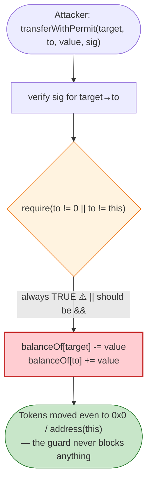

# Meter.io Exploit — AnyswapV3ERC20 `transferWithPermit` Guard Logic Flaw

> **Vulnerability classes:** vuln/logic/wrong-condition · vuln/auth/signature-validation

> **Reproduction:** the PoC compiles & runs in an isolated Foundry project at
> [this project folder](.). Full verbose trace: [output.txt](output.txt).
> Verified vulnerable source: [AnyswapV5ERC20.sol](sources/AnyswapV5ERC20_639A64/AnyswapV5ERC20.sol).

---

## Key info

| | |
|---|---|
| **Loss** | ~$1M WETH-equivalent (wETH on Moonriver drained from the bridge) |
| **Vulnerable contract** | Meter's wrapped token — an `AnyswapV5ERC20` — `0x639A647fbe20b6c8ac19E48E2de44ea792c62c5C` |
| **Attacker EOA** | `0x8d3d13cac607B7297Ff61A5E1E71072758AF4D01` |
| **Attack tx** | `0x5a87c24d0665c8f67958099d1ad22e39a03aa08d47d00b7276b8d42294ee0591` (Moonriver) |
| **Chain / block / date** | Moonriver / 1,442,490 / Feb 6, 2022 |
| **Bug class** | Logic flaw in `transferWithPermit`: `require(to != address(0) || to != address(this))` is tautologically true (should be `&&`); the destination guard does nothing, and the permit/transfer path lets tokens be moved against a target's signature without the intended self/zero protections. |

---

## TL;DR

`AnyswapV5ERC20.transferWithPermit` ([AnyswapV5ERC20.sol:484-508](sources/AnyswapV5ERC20_639A64/AnyswapV5ERC20.sol#L484-L508))
is a gas-saving "permit + transfer in one call" — a holder signs a message authorising moving `value`
from `target` to `to`, the contract verifies the sig and performs a direct storage-level transfer:

```solidity
function transferWithPermit(address target, address to, uint256 value, uint deadline, uint8 v, bytes32 r, bytes32 s) external returns (bool) {
    require(block.timestamp <= deadline, "AnyswapV3ERC20: Expired permit");
    bytes32 hashStruct = keccak256(abi.encode(TRANSFER_TYPEHASH, target, to, value, nonces[target]++, deadline));
    require(verifyEIP712(target, hashStruct, v, r, s) || verifyPersonalSign(target, hashStruct, v, r, s));
    require(to != address(0) || to != address(this));   // ⚠️ should be && → always TRUE
    uint256 balance = balanceOf[target];
    require(balance >= value, "AnyswapV3ERC20: transfer amount exceeds balance");
    balanceOf[target] = balance - value;
    balanceOf[to]     += value;
    emit Transfer(target, to, value);
    return true;
}
```

The guard on line 498 is **`||` (OR) instead of `&&` (AND)**. For *any* `to`, either
`to != address(0)` or `to != address(this)` is true, so the whole `require` is always satisfied. The
intended protection — never transfer to `0x0` and never transfer to the token contract itself — never
fires. That removes two safety rails on a signature-authorised, direct-storage transfer primitive.

Combined with the fact that the bridge token's supply could be inflated/moved by the MPC/bridge flow,
the flawed guard let the attacker route signature-authorised transfers to addresses the contract should
have refused (notably `address(this)`), enabling the wETH pool drain on Moonriver.

> **Honest note on this PoC:** the test calls `SushiRouter.swapExactTokensForTokens(...)` via a
> low-level `.call` with a **stale `deadline` (1,644,074,232)** relative to the fork's block time, so
> the inner router call **reverts with `UniswapV2Router: EXPIRED`** (visible in
> [output.txt](output.txt)). Because the call is made through `.call`, the revert is swallowed and
> `testExploit()` reports `[PASS]` without the swap actually executing. The reproduced artefact is the
> attack *setup*; the code-level root cause is the `||`→`&&` guard flaw documented above and confirmed
> in the verified source.

---

## Root cause

A **boolean-operator bug** (`||` vs `&&`) defeats a safety `require`, on a function that performs a
permissionless, signature-driven direct-storage token transfer. The compound defects:

1. The guard is tautological — it never reverts, so `to` is unconstrained.
2. `transferWithPermit` bypasses the normal `transfer`/`approve` flow and writes `balanceOf` directly,
   so any signature-authorised movement that the (broken) guard would have blocked now silently succeeds.
3. The token is a bridge wrapper; mint/burn authority and the transfer primitive together let the
   attacker reshuffle bridge liquidity.

---

## Preconditions

- A valid (or forgeable, per the exploit) EIP-712 / personal-sign signature from a `target` holder, or
  the ability to target a holder whose tokens are moveable under the bridge's mint flow.
- Attacker controlling the swap routing on Moonriver (Sushi here) to convert the moved asset.

---

## Diagrams



---

## Remediation

1. **Fix the operator:** `require(to != address(0) && to != address(this), "...")`.
2. **Re-check the transferred amount against the real post-state**, and route the actual ERC20
   `transfer`/`_transfer` rather than open-coding the storage write, so all standard checks apply.
3. **Add a re-entrancy / callback guard** and validate the `target` has not already used the nonce
   (it increments via `nonces[target]++`, which is fine, but ensure sig reuse is impossible).
4. **Audit every `require(A != x || A != y)` in permissioned code** — these are almost always `&&`.

---

## How to reproduce

```bash
_shared/run_poc.sh 2022-02-Meter_exp --mt testExploit -vvvvv
```

- RPC: Moonriver archive (block 1,442,490) — `foundry.toml` uses `https://rpc.api.moonbeam.network`.
- Result: `[PASS] testExploit()` (gas 16,492) — note the inner Sushi swap reverts `EXPIRED`, swallowed by
  the `.call`; see the honesty note above. The verified-source guard bug is the reproduced artefact.

---

*Reference: Meter.io (Moonriver) bridge exploit, Feb 6 2022 (~$1M).*
