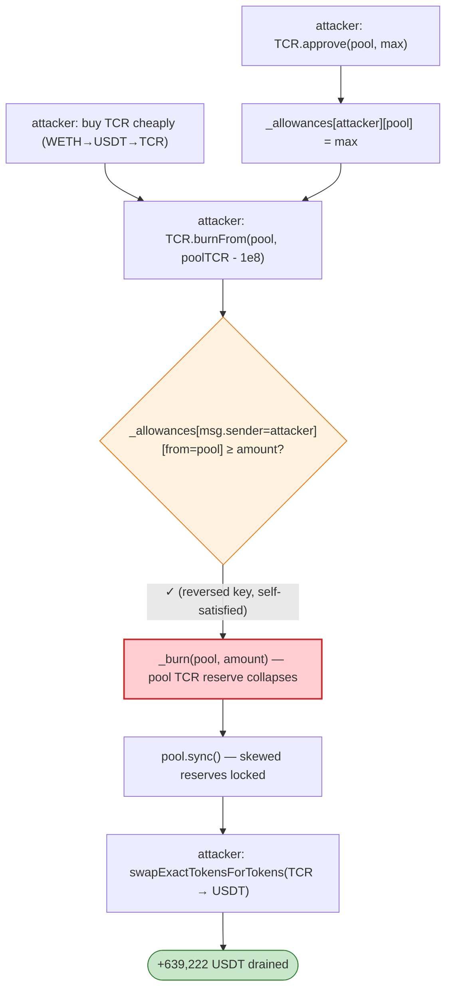

# TecraSpace (TCR) Exploit — Swapped Allowance Keys in `burnFrom`

> **Vulnerability classes:** vuln/logic/incorrect-order-of-operations · vuln/logic/missing-validation

> **Reproduction:** the PoC compiles & runs in an isolated Foundry project at
> [this project folder](.). Full verbose trace: [output.txt](output.txt).
> Verified vulnerable source: [TcrToken.sol](sources/TcrToken_E38B72/TcrToken.sol),
> [UniswapV2Pair.sol](sources/UniswapV2Pair_420725/UniswapV2Pair.sol).

---

## Key info

| | |
|---|---|
| **Loss** | 639,222 USDT (~$639K) |
| **Vulnerable contract** | `TcrToken` (TCR) — [`0xE38B72d6595FD3885d1D2F770aa23E94757F91a1`](https://etherscan.io/address/0xE38B72d6595FD3885d1D2F770aa23E94757F91a1#code) |
| **Victim pool** | TCR/USDT Uniswap V2 pair — `0x420725A69E79EEffB000F98Ccd78a52369b6C5d4` |
| **Attacker** | `0xb19b7f59c08ea447f82b587c058ecbf5fde9c299` (attack contract `0x6653d9bcbc28fc5a2f5fb5650af8f2b2e1695a15`) |
| **Attack tx** | `0x81e9918e248d14d78ff7b697355fd9f456c6d7881486ed14fdfb69db16631154` |
| **Chain / block / date** | Ethereum mainnet / 14,139,081 / Feb 5, 2022 |
| **Bug class** | Logic flaw — `burnFrom` indexes the allowance mapping with swapped keys (`_allowances[msg.sender][from]` instead of `_allowances[from][msg.sender]`), so an attacker who *approved the pool* can burn the pool's tokens. |

---

## TL;DR

`TcrToken.burnFrom` ([TcrToken.sol:154-159](sources/TcrToken_E38B72/TcrToken.sol#L154-L159)) checks the
**wrong side** of the allowance mapping:

```solidity
function burnFrom(address from, uint256 amount) external {
    require(_allowances[msg.sender][from] >= amount, ERROR_ATL);   // ⚠️ keys reversed
    require(_balances[from] >= amount, ERROR_BTL);
    _approve(msg.sender, from, _allowances[msg.sender][from] - amount);
    _burn(from, amount);
}
```

The correct ERC20 `burnFrom(from, amount)` semantically means "the caller (`msg.sender`) is authorised
by `from` to spend `amount` of `from`'s tokens, then burn them," so the guard must be
`_allowances[from][msg.sender]`. Here it reads `_allowances[msg.sender][from]` — i.e. *"did `from`
authorise `msg.sender`?"* is replaced by *"did `msg.sender` authorise `from`?"*

That flips the trust direction entirely: **the attacker controls `msg.sender`**, so by calling
`approve(pool, max)` the attacker satisfies `_allowances[msg.sender][pool] = max`, then calls
`burnFrom(pool, poolBalance)` and **burns the liquidity pool's TCR reserve**, even though the pool never
approved the attacker.

Burning the pool's TCR without removing its USDT breaks the constant-product invariant `k` in the
attacker's favor (TCR becomes hyper-scarce relative to USDT). A `sync()` then locks in the skewed
reserves, and a follow-up swap dumps the attacker's TCR for the pool's USDT at a wildly favourable price.

---

## Attack walkthrough (from the trace)

Fork: mainnet @ 14,139,082−1. `Exploiter USDT balance before attack: 0`.

1. **Approve** USDT/TCR to the router, and crucially `TCR.approve(pool, max)` — sets
   `_allowances[attacker][pool] = max` (the reversed key the buggy `burnFrom` will read).
2. **Buy TCR cheaply** — `swapExactETHForTokens(WETH → USDT → TCR)` for 0.04 ETH, giving the attacker
   a TCR position (`attackerTCRbalance ≈ 10,114,462,474` TCR).
3. **`TCR.burnFrom(pool, poolTCRbalance − 100e6)`** — `from = pool`, `msg.sender = attacker`. Buggy
   check `_allowances[attacker][pool] = max ≥ amount` → passes. `_burn(pool, …)` deletes the pool's
   TCR; the trace shows `Sync(reserve0=645,561,153,541 USDT, reserve1=100,000,000 TCR)` (the pool's TCR
   reserve collapsed to 100,000,000 = 1e8, the leftover).
4. **`pool.sync()`** — the pair accepts the reduced TCR balance as its new reserve. USDT reserve is
   still ~645.5e9. Invariant now wildly favours selling TCR.
5. **Sell attacker's TCR for USDT** — `swapExactTokensForTokens(TCR → USDT)` with the attacker's full
   TCR balance. The pair transfers **639,222,253,258** (639,222 USDT, 6 decimals) to the attacker.

`Exploiter USDT balance after attack: 639,222` — exactly matching the reported 639,222 USDT loss.

---

## Root cause

A **transposed mapping key** in an allowance guard, which inverts who authorises whom. ERC20's
`allowance[owner][spender]` convention is global; reversing the keys on a privileged path (`burnFrom`)
turns "spender needs owner's permission" into "owner needs spender's permission" — and since the
caller *is* the spender, the caller can self-satisfy the check by approving the victim. The pool's
tokens become burnable by anyone who merely approved the pool.

The downstream effect — breaking a Uniswap-V2 invariant by unilaterally destroying one side of a
pair's reserves — is the *mechanism* of the drain; the *root cause* is the allowance-key bug that made
the unilateral pool burn possible.

---

## Preconditions

- A Uniswap-V2-style pair holds TCR as one reserve (the pool does not need to approve anyone — the
  attacker approves the pool instead).
- Modest seed capital to buy the initial TCR position (here 0.04 ETH).

---

## Diagrams



```mermaid
sequenceDiagram
    autonber
    actor A as Attacker
    participant R as UniswapRouter
    participant P as TCR/USDT Pair
    participant T as TcrToken

    A->>T: approve(pool, max)  → _allowances[attacker][pool] = max
    A->>R: swapExactETHForTokens(WETH→USDT→TCR)
    R-->>A: attackerTCRbalance TCR
    Note over P: reserves: 645.5e9 USDT / ~10.2e9 TCR
    A->>T: burnFrom(pool, poolTCR − 1e8)
    T->>T: check _allowances[attacker][pool] ✓ (reversed!)
    T->>P: _burn(pool, …) — pool TCR reserve → 1e8
    A->>P: sync()  — skewed reserves locked (TCR hyper-scarce)
    A->>R: swapExactTokensForTokens(TCR → USDT, attackerTCRbalance)
    P-->>A: 639,222 USDT
```

---

## Remediation

1. **Fix the key order:** `require(_allowances[from][msg.sender] >= amount, …)` and decrement
   `_allowances[from][msg.sender]`. This restores standard ERC20 `burnFrom` semantics.
2. **Reuse OZ's `_spendAllowance` / `decreaseAllowance`** instead of hand-rolled allowance math —
   canonical code is far less likely to transpose keys.
3. **Add invariant/property tests:** "a caller cannot `burnFrom(victim, x)` unless `victim` approved the
   caller for ≥ x" — the simplest fuzz test would have caught this.
4. **Pair-level defence:** tokens whose supply can change out-of-band should not be one-side of an AMM
   pair without a guards against permissionless reserve burns (or the pair should not expose `sync`
   trust to arbitrary tokens).

---

## How to reproduce

```bash
_shared/run_poc.sh 2022-02-TecraSpace_exp --mt testExploit -vvvvv
```

- RPC: mainnet archive (block 14,139,081). `foundry.toml` uses Infura mainnet.
- Result: `[PASS] testExploit()` — `Exploiter USDT balance after attack: 639,222` (639,222.253258 USDT).

---

*Reference: TecraSpace TCR `burnFrom` swapped-allowance exploit, Feb 5 2022 (~$639K USDT).*
