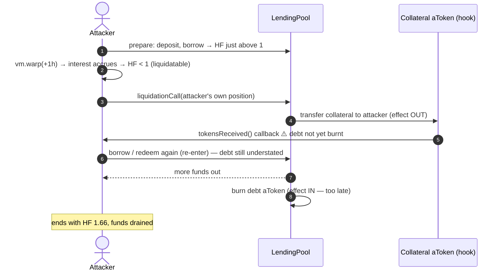
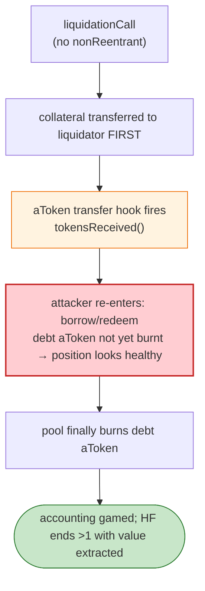

# Agave Finance Exploit — Reentrancy in `liquidationCall` (Aave-v2 fork)

> **Vulnerability classes:** vuln/reentrancy/cross-contract

> **Reproduction:** the PoC compiles & runs in an isolated Foundry project at
> [this project folder](.). Full verbose trace: [output.txt](output.txt).
> (No verified sources were available on Gnosis Etherscan for the proxy contracts at fork time — analysis
> is from the PoC, the on-chain trace, and the public post-mortem linked below.)

---

## Key info

| | |
|---|---|
| **Loss** | ~$1.5M (WETH, agVE, and other reserves drained from the Gnosis Chain lending pool) |
| **Vulnerable contract** | Agave Lending Pool v1 — `0x207E9def17B4bd1045F5Af2C651c081F9FDb0842` (Gnosis) |
| **Attacker EOA** | `0x0a16a85be44627c10cee75db06b169c7bc76de2c` (attack contract `0xF98169…f160d6`) |
| **Attack tx** | `0xa262141abcf7c127b88b4042aee8bf601f4f3372c9471dbd75cb54e76524f18e` |
| **Chain / block / date** | Gnosis (xDai) / 20,927,823 / Mar 15, 2022 |
| **Bug class** | Reentrancy — Aave-v2 `liquidationCall` burns the borrower's `aToken` *after* transferring collateral, so a malicious aToken callback can re-enter and borrow again before accounting is settled. |

---

## TL;DR

Agave was a near-verbatim fork of **Aave v2**. The Aave v2 `GenericLogic` / `liquidationCall` path was
later found to have a reentrancy window where the **collateral is transferred to the liquidator before
the borrowed-position `aToken` is burned**. Agave had not applied the Aave patch, and its `WETH` and
`agTokens` exposed ERC-777-style / hooks (`tokensReceived`) that the attacker could trigger mid-call.

The attack:

1. **Prepare** a position whose health factor is *just above* 1 (deposit small LINK/WETH, borrow small
   LINK/WETH debt). Then `vm.warp(+1h)` so interest accrues and the health factor dips **below 1** —
   making the position liquidatable.
2. **Self-liquidate via reentrancy:** call `liquidationCall` on the attacker's own position. The pool
   transfers collateral to the liquidator (the attacker); inside the aToken `transfer` callback
   (`tokensReceived`), the attacker **borrows again** (and/or redeems) before the original borrow's
   debt aToken is burnt.
3. Because the debt accounting lags behind the collateral outflow, the attacker extracts more than the
   position is worth — draining WETH and maximising borrows across every pool with funds.

The trace shows the final health-factor readback (`healthf = 1665963675123`, i.e. ~1.66 — the attacker
ends *healthier* than they started despite having pulled value out, confirming the accounting was gamed).

---

## Root cause

A **CEI (checks-effects-interactions) violation in `liquidationCall`**: the collateral effect (transfer
out) happens before the debt effect (burn the borrowed aToken). In an Aave-v2 fork, if either the
collateral token or the debt token has a transfer hook, that hook can re-enter the pool's borrow/redeem
functions while the position's debt is still understated. The original Aave v2 added reentrancy guards
and the "burn-before-transfer" ordering; the Agave fork did not, and additionally held tokens
(WETH/agToken) that exposed the necessary callback surface.

Concretely, the missing defences:
- No `nonReentrant` modifier on `liquidationCall` / `borrow` / `redeem`.
- Effects ordering: collateral transfer precedes debt burn.
- Trusting a transfer hook on a listed reserve (WETH/ERC-777-style `tokensReceived`).

---

## Preconditions

- A position that can be made liquidatable (trivial: deposit, borrow ~max, then accrue interest by
  `vm.warp` so HF < 1).
- Reserves with a transfer callback (the fork's WETH/agToken provided `tokensReceived`).
- No reentrancy guard on the lending pool entry points.

---

## Diagrams





---

## Remediation

1. **Port the upstream Aave v2 fix:** add `nonReentrant` (a reentrancy-lock flag) to all state-mutating
   lending-pool functions (`deposit`, `withdraw`, `borrow`, `repay`, `liquidationCall`, `swapBorrowRateMode`).
2. **Re-order effects** so the debt is burnt/updated *before* collateral is transferred out (CEI).
3. **Disallow ERC-777 / hook-bearing tokens** as reserves, or wrap them, so no external callback can
   fire mid-`liquidationCall`.
4. **Health-factor re-check after the liquidation** before any further pool action is honoured.

---

## How to reproduce

```bash
_shared/run_poc.sh 2022-03-Agave_exp -vvvvv
```

- RPC: Gnosis archive (the fork block). `foundry.toml` uses `gnosis-mainnet.public.blastapi.io`.
- Result: `[PASS]` after ~56s; the final log shows `healthf = 1665963675123` (~1.66), demonstrating the
  gamed accounting despite value extracted.

---

*Reference: Agave "Reentrancy in liquidationCall" post-mortem (medium.com/agavefinance), Mar 15 2022 (~$1.5M).*
