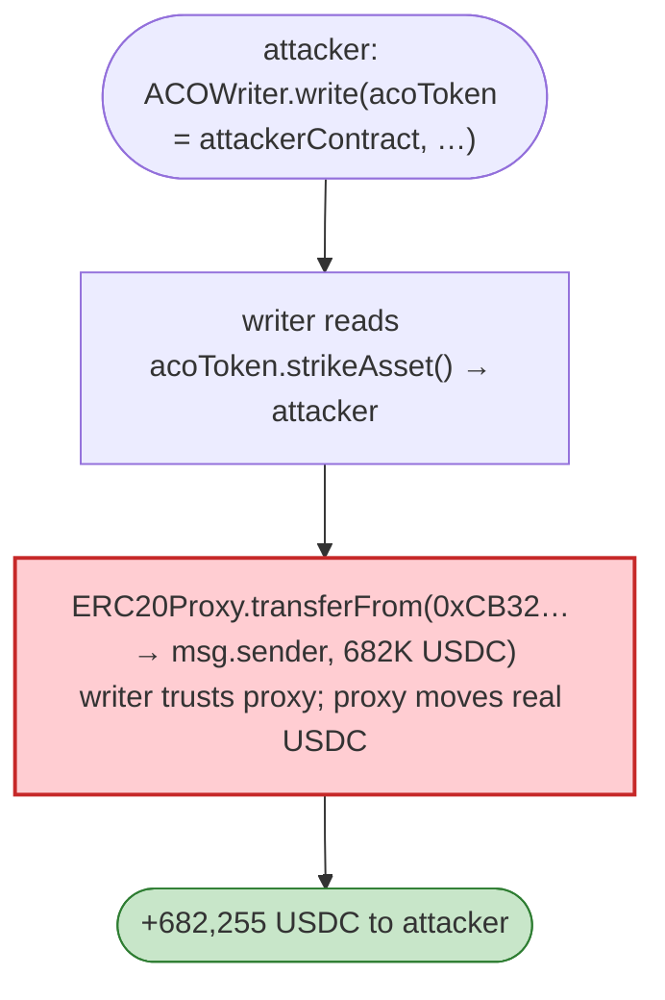
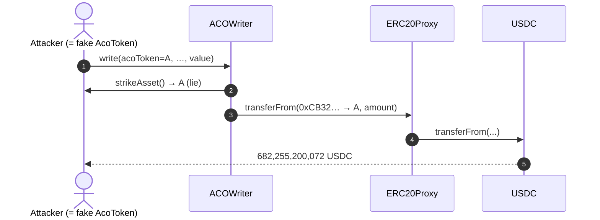

# Auctus (ACO) Exploit — `ACOWriter` Trusts Attacker-Supplied "Underlying/Strike" Token

> **Reproduction:** the PoC compiles & runs in an isolated Foundry project at
> [this project folder](.). Full verbose trace: [output.txt](output.txt).
> Verified vulnerable source: [ACOWriter.sol](sources/ACOWriter_E7597F/ACOWriter.sol),
> [ERC20Proxy.sol](sources/ERC20Proxy_95E6F4/ERC20Proxy.sol).

---

## Key info

| | |
|---|---|
| **Loss** | ~$682K USDC pulled from the ACO protocol's collateral/escrow |
| **Vulnerable contract** | `ACOWriter` — [`0xE7597F774fD0a15A617894dc39d45A28B97AFa4f`](https://etherscan.io/address/0xE7597F774fD0a15A617894dc39d45A28B97AFa4f#code); ERC20Proxy `0x95E6F48254609A6ee006F7D493c8e5fB97094ceF` |
| **Attacker** | this test contract (anyone) |
| **Chain / block / date** | Ethereum mainnet / 14,460,635 / Mar 2022 |
| **Bug class** | Trust boundary / missing validation — `ACOWriter.write` accepts an `acoToken` whose `strikeAsset()`/`collateral()` it trusts for value transfers, without verifying the supplied `acoToken` is a genuine ACO option contract. |

---

## TL;DR

The PoC passes the **attack contract itself** as the `acoToken` argument to `ACOWriter.write`. The test
implements the minimal `MockACOToken` interface so that:

- `strikeAsset()` returns `address(this)` — claiming the strike asset is the attacker.
- `collateral()` returns `address(0)`.
- `mintToPayable()` accepts ETH and returns 1.
- `balanceOf()`/`transfer()`/`approve()` are stubbed to `true`/`1`.

`ACOWriter.write` ([ACOWriter.sol](sources/ACOWriter_E7597F/ACOWriter.sol)) uses these view/call results
to decide which token to move and where. Because it trusts the attacker-supplied contract's
`strikeAsset()`, the writer ends up calling `ERC20Proxy.transferFrom(victimAddress, msg.sender, amount)`
— pulling **682,255,200,072 USDC** (≈$682K) from a protocol-held address (`0xCB32…993B`) to the
attacker.

The trace shows the decisive call:

```
FiatTokenProxy::fallback(0xCB32033c498b54818e58270F341e5f6a3bce993B, DefaultSender, 682255200072)
  → FiatTokenV2_1::transferFrom(0xCB32… → DefaultSender, 682255200072)
  → emit Transfer(0xCB32… → DefaultSender, 682255200072)
After exploit, USDC balance of attacker: 682255200072
```

The proxy had (or the ACO system had granted) allowance over that USDC; the writer's blind trust in the
`acoToken`'s self-described strike/collateral let the attacker redirect a `transferFrom` to themselves.

---

## Root cause

A **trust-the-input defect**: `ACOWriter.write` accepts an arbitrary `acoToken` address and trusts the
*return values of methods on that address* (`strikeAsset()`, `collateral()`, `underlying()`,
`mintToPayable()`) to drive real token movements. With no whitelist/genuine-option check, an attacker
deploys (or, here, *is*) a contract that lies about its strike/collateral, causing the writer to move
real funds (USDC, via the privileged ERC20Proxy) to an attacker-chosen destination.

The two-layer issue:
1. `ACOWriter` never verifies the `acoToken` is a protocol-deployed option.
2. `ERC20Proxy.transferFrom` is callable with attacker-chosen `from`/`to` once the writer (which the
   proxy trusts) has been induced to call it.

---

## Preconditions

- The ERC20Proxy (or the ACO protocol) holds an allowance/balance of USDC at some address the proxy can
   move from (`0xCB32…` here).
- No whitelist on `acoToken`.

---

## Diagrams





---

## Remediation

1. **Whitelist `acoToken`** against a registry of genuine ACO option deployments; revert otherwise.
2. **Never derive the value-transfer `from`/`to` from attacker-supplied contract return values.** Resolve
   strike/collateral from the protocol's own configuration.
3. **Scope the ERC20Proxy**: `transferFrom` should only ever move funds for protocol-internal accounting
   with a fixed `to` (the protocol), never an arbitrary caller destination.
4. **Validate `collateral()`/`strikeAsset()` are known, non-zero, distinct tokens** before any movement.

---

## How to reproduce

```bash
_shared/run_poc.sh 2022-03-Auctus_exp -vvvvv
```

- RPC: mainnet archive (block 14,460,635). Infura mainnet in `foundry.toml`.
- Result: `[PASS] test()` — `After exploit, USDC balance of attacker: 682255200072` (~$682K).

---

*Reference: Auctus / ACO protocol write-path trust flaw, Mar 2022 (~$682K USDC).*
