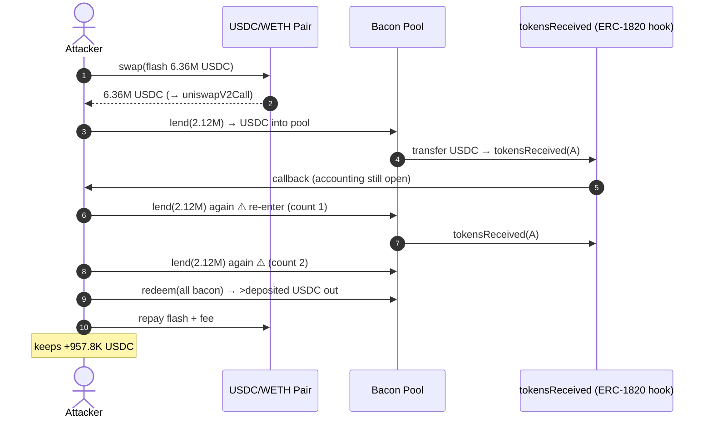
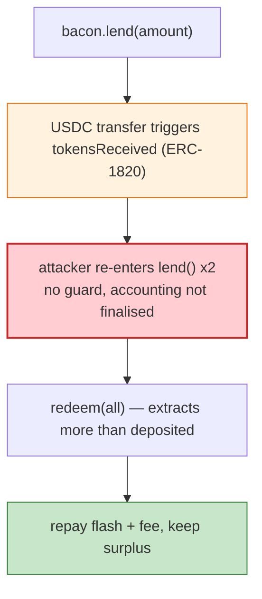

# Bacon Protocol Exploit — Reentrancy via ERC-1820 `tokensReceived` in `lend`/`redeem`

> **Reproduction:** the PoC compiles & runs in an isolated Foundry project at
> [this project folder](.). Full verbose trace: [output.txt](output.txt).
> Verified vulnerable source: [Pool](sources/Pool16_366049) (Bacon pool),
> [TransparentUpgradeableProxy](sources/TransparentUpgradeableProxy_b89195) (bacon token).

---

## Key info

| | |
|---|---|
| **Loss** | ~$1M USDC (the test extracts 957,786,585,605 = ~$957.8K USDC) |
| **Vulnerable contract** | Bacon `Pool` — `0x3660490…` (proxy `0xb8919522331C59f5C16bDfAA6A121a6E03A91F62`) |
| **Flash source** | USDC/WETH Uniswap V2 pair — `0xB4e16d0168e52d35CaCD2c6185b44281Ec28C9Dc` |
| **Chain / block / date** | Ethereum mainnet / 14,326,931 / Mar 6, 2022 |
| **Bug class** | Reentrancy — Bacon's `lend()` triggers an ERC-777/ERC-1820 `tokensReceived` callback on the caller *before* the lending accounting is finalised, so the attacker re-enters `lend()` twice to inflate the accounting, then `redeem()`s more than deposited. |

---

## TL;DR

Bacon's pool token (`IBacon`) and USDC are wired through the **ERC-1820 registry**: when USDC is
transferred, a registered `tokensReceived` hook fires on the recipient. The attacker registers itself as
the implementer for the `tokensReceived` interface (`keccak256("AmplyTokensRecipient")`) in its
constructor, then:

1. **Flash-borrows 6.36M USDC** from the USDC/WETH Uniswap pair (`pair.swap(6,360,000,000,000, 0, …, "0x01")`).
2. In the `uniswapV2Call` callback:
   - `usdc.approve(bacon, max)`.
   - `bacon.lend(2,120,000,000,000)` — this transfers USDC into the pool and **fires `tokensReceived`**.
3. **Inside `tokensReceived`** (reentrancy), while the lend accounting is still open, the attacker calls
   `bacon.lend(2,120,000,000,000)` **again** — twice (`count <= 2`). Each lend credits bacon tokens to
   the attacker against the *same* USDC, because the pool's "deposited" balance is read before the
   previous lend's effects settle.
4. `bacon.redeem(bacon.balanceOf(this))` — pulls out far more USDC than the 6.36M flash-borrowed.
5. Repays the flash loan (`amount0/997*1000 + 1e6`) to the pair and keeps the surplus:
   **957,786,585,605 USDC ≈ $957.8K**.

The trace's final `Swap` event shows the pair's accounting reconciled (`amount0In: 6,379,138,412,000`)
and `After exploit, USDC balance of attacker: 957786585605`.

---

## Root cause

A **CEI violation + missing reentrancy guard** on a function that mints pool shares. `lend()` moves USDC
into the pool (interaction) and *during that transfer* the ERC-1820 `tokensReceived` callback hands
control back to the attacker *before* the lend's share-credit is finalised. The attacker uses that
window to call `lend()` again, double-counting the deposit. There is no `nonReentrant` modifier and no
intermediate accounting snapshot that would reject the second lend.

The enabling design choice: integrating an ERC-777/ERC-1820 "hook" token (USDC-via-Amply wrapper) whose
transfer invokes an arbitrary recipient callback, on a share-minting path without reentrancy protection.

---

## Preconditions

- A USDC flash source (Uniswap V2 pair) to supply the initial capital.
- The Bacon pool must use the ERC-1820 callback-bearing transfer on `lend()`.
- No reentrancy guard on `lend`/`redeem`.

---

## Diagrams





---

## Remediation

1. **Add `nonReentrant`** to `lend`, `redeem`, and any share-minting/burning function.
2. **Follow CEI**: credit pool shares *before* transferring USDC in (or snapshot the deposited amount
   before the external call).
3. **Treat any ERC-777/ERC-1820 hook-bearing token as untrusted**; if used, the receiver must not be the
   caller's own hook, or wrap the token.
4. **Accounting invariants** (assets ≥ shares × rate) checked on entry to and exit from every mutating
   function.

---

## How to reproduce

```bash
_shared/run_poc.sh 2022-03-Bacon_exp -vvvvv
```

- RPC: mainnet archive (block 14,326,931). Infura mainnet in `foundry.toml`.
- Result: `[PASS] test()` — `After exploit, USDC balance of attacker: 957786585605` (~$957.8K).

---

*Reference: Bacon protocol reentrancy via ERC-1820 `tokensReceived`, Mar 6 2022 (~$1M).*
