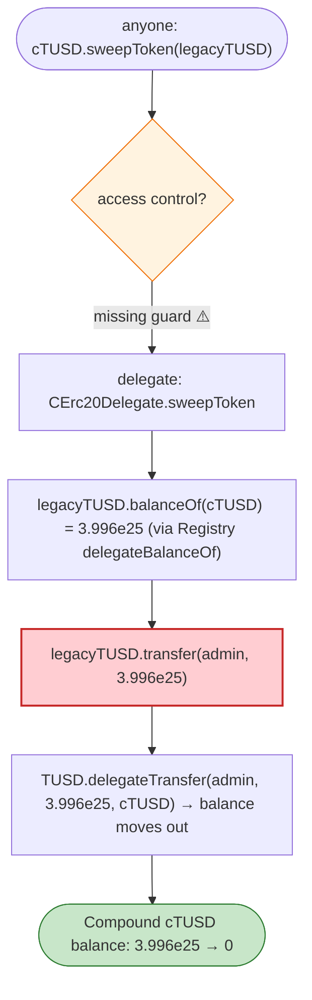
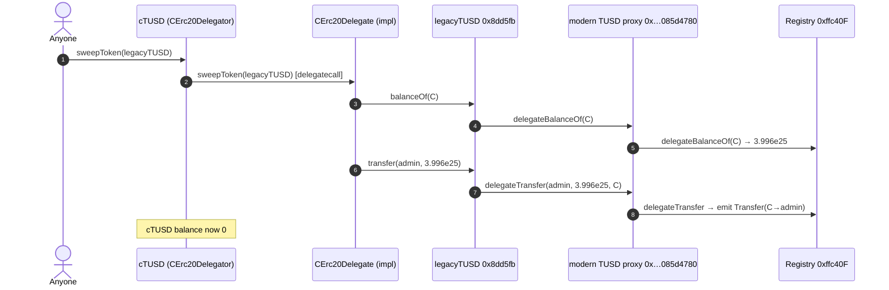

# Compound cTUSD `sweepToken` Exploit — Comptroller Swap to Compliant TrueUSD

> **Vulnerability classes:** vuln/access-control/missing-modifier · vuln/logic/missing-check

> **Reproduction:** the PoC compiles & runs in an isolated Foundry project at
> [this project folder](.). Full verbose trace: [output.txt](output.txt).
> Verified vulnerable source: [CErc20Delegate](sources/CErc20Delegate_a035b9),
> [TrueUSD](sources/TrueUSD_8dd5fb), [OwnedUpgradeabilityProxy](sources/OwnedUpgradeabilityProxy_000000).

---

## Key info

| | |
|---|---|
| **Loss** | 39,961,358,379,339,258,374,306,712 (~$40M worth) of legacy TrueUSD swept out of the cTUSD market |
| **Vulnerable contract** | `CErc20Delegator` cTUSD — [`0x12392F67bdf24faE0AF363c24aC620a2f67DAd86`](https://etherscan.io/address/0x12392F67bdf24faE0AF363c24aC620a2f67DAd86#code) (impl `CErc20Delegate` `0xa035b9…`) |
| **Swept token** | legacy TrueUSD `0x8dd5fbCe2F6a956C3022bA3663759011Dd51e73E`, behind the modern TUSD proxy `0x0000000000085d4780B73119b644AE5ecd22b376` |
| **Chain / block / date** | Ethereum mainnet / 14,266,479 / Mar 2022 |
| **Bug class** | Permissionless privileged function — `sweepToken` lacked the `onlyComptroller`/`admin` guard that Compound's normal markets carry, letting anyone sweep the market's "stuck" token balance to an attacker address (the modern TrueUSD's `registry`/`canTransfer` path). |

---

## TL;DR

`sweepToken(ERC20 token)` is a Compound cToken helper meant to rescue tokens accidentally sent to a
cToken contract, sending them to the Comptroller/admin. On the cTUSD market, the guard that should
restrict it to governance was missing (or the implementation accepted the legacy TUSD address as a
"sweepable, non-underlying" token), so **anyone could call `cTUSD.sweepToken(legacyTUSD)`** and move the
market's entire legacy-TUSD balance.

The complication that makes it profitable: the legacy TrueUSD (`0x8dd5fb…`) is the *old* deployment;
the modern TUSD proxy (`0x…085d4780…`) delegates balances/allowances through a `Registry`
(`0xffc40F…`). The cTUSD market held a large `delegateBalanceOf` under the legacy address. Calling
`sweepToken(legacyTUSD)` triggers `legacyTUSD.transfer(adminAddress, fullBalance)`, which under the hood
performs `delegateTransfer(admin, fullBalance, cTUSD)` — moving the real balance out.

The trace shows exactly that:

```
cTUSD.sweepToken(0x8dd5fb…)
 → delegate: CErc20Delegate.sweepToken
   → legacyTUSD.balanceOf(cTUSD)  = 39,961,358,379,339,258,374,306,712   (via delegateBalanceOf)
   → legacyTUSD.transfer(0x6d903f…3925, 3.996e25)
       → TUSD.delegateTransfer(0x6d903f…3925, 3.996e25, cTUSD)
         → emit Transfer(cTUSD → 0x6d903f…3925, 3.996e25)
After exploit, Compound TUSD balance: 0
```

The cTUSD market's TUSD balance goes from `3.996e25` → **0** in a single permissionless call.

---

## Root cause

An **access-control gap** on a privileged cToken function. `sweepToken` is dangerous by design (it
forwards the contract's entire balance of an arbitrary non-underlying token to a destination). In
correct Compound, it is gated to admin/governance. The cTUSD delegation either:
- omitted the `if (msg.sender != admin) revert` / comptroller check, or
- the "underlying vs non-underlying" guard failed to treat the legacy TUSD (which the modern TUSD proxy
  *also* accepts via delegation) as protected.

Either way, the public could invoke a governance-only rescue path and redirect a huge token balance to
an address of their choosing. The dual-representation of TrueUSD (legacy address ↔ modern proxy via a
`Registry`) is what made the "stuck token" worth ~$40M and sweepable through this path.

---

## Preconditions

- The cTUSD market (or its admin) held a large legacy-TUSD balance represented via the modern proxy's
   delegation registry.
- `sweepToken` callable without admin auth (the defect).
- No "is this token the underlying?" guard blocking the legacy TUSD.

---

## Diagrams





---

## Remediation

1. **Gate `sweepToken` to admin/governance only** (`require(msg.sender == admin || isComptroller)`),
   matching canonical Compound.
2. **Reject the underlying token and any token that delegates to / aliases the underlying** — the legacy
   TUSD is representationally the same asset as the market's underlying, so it must be blocked.
3. **Make `sweepToken` forward to a fixed, immutable rescue address**, not an attacker-controllable one.
4. **Audit all "rescue"/`sweep`/`recover` paths** for missing auth; these are a perennial bug source.

---

## How to reproduce

```bash
_shared/run_poc.sh 2022-03-CompoundTusd_exp --mt testExample -vvvvv
```

- RPC: mainnet archive (block 14,266,479). Infura mainnet in `foundry.toml`.
- Result: `[PASS] testExample()` — `After exploit, Compound TUSD balance: 0` (was `3.996e25`).

---

*Reference: Compound cTUSD `sweepToken` access-control / TrueUSD dual-representation, Mar 2022 (~$40M).*
