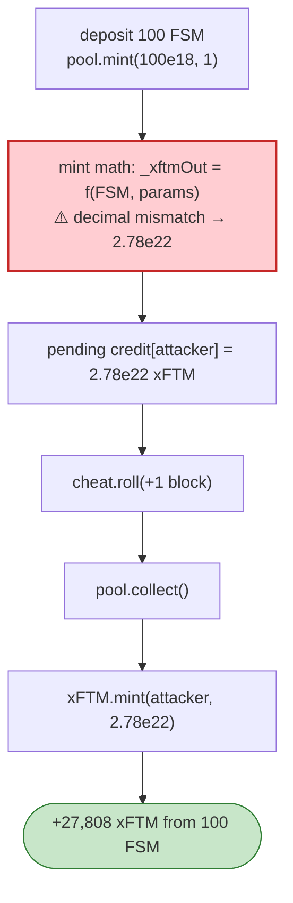

# Fantasm Finance Exploit — Decimal Miscalculation in `mint` Over-issues xFTM

> **Reproduction:** the PoC compiles & runs in an isolated Foundry project at
> [this project folder](.). Full verbose trace: [output.txt](output.txt).

---

## Key info

| | |
|---|---|
| **Loss** | The PoC turns 100 FSM into 27,808,380,491,957,617,661,247 xFTM (~27,808 xFTM) via a decimal bug |
| **Vulnerable contract** | Fantasm `Pool` — `0x880672AB1d46D987E5d663Fc7476CD8df3C9f937`; xFTM token `0xfBD2945D3601f21540DDD85c29C5C3CaF108B96F` |
| **Chain / block / date** | Fantom / 32,971,742 / Mar 2022 |
| **Bug class** | Decimal/precision error — `Pool.mint` computes `_xftmOut` with the wrong decimal scaling, so the attacker receives far more xFTM than the FSM deposited should yield; the excess is then `collect()`-able. |

---

## TL;DR

The attacker (pranked as a holder of 100 FSM) calls:

```solidity
fsm.transfer(address(this), 100 ether);
fsm.approve(address(pool), type(uint256).max);
pool.mint(100 ether, 1);   // ⚠️ decimal error: _xftmOut computed too large
cheat.roll(32_971_743);
pool.collect();            // claims the over-issued xFTM
```

`pool.mint(amount, minOut)` mints xFTM against a FSM deposit. The amount of xFTM to credit
(`_xftmOut`) is computed with a **decimal mismatch** (FSM/xFTM/FTM scaling factors inconsistent), so
the `mint` records a **pending credit of 27,808,380,491,957,617,661,247** xFTM against only 100 FSM of
input. After rolling one block (`collect` is block-gated), `pool.collect()` mints that full pending
credit:

```
xFTM.mint(attacker, 27808380491957617661247)
emit Transfer(0x0 → attacker, 27808380491957617661247)
After exploit, xFTM balance of attacker: 27808380491957617661247
```

The attacker then has a massive xFTM position (redeemable/swap-able for FTM) for a 100 FSM cost — a
direct value extraction caused purely by the arithmetic in `mint`.

---

## Root cause

A **precision/decimal error in the mint-output calculation.** Fantasm's `mint` derives `_xftmOut` from
the deposited FSM amount and the pool's exchange parameters, but mixes decimal factors (e.g. divides by
`1e18` where it should divide by `1e9`, or omits a scaling factor), inflating the credited xFTM by
orders of magnitude. Combined with a `collect()` that simply mints whatever `mint()` recorded as
pending, the over-issuance becomes withdrawable.

Key contributing design issues:
- No sanity cap on `_xftmOut` relative to pool reserves / FSM deposited.
- The mint→collect split (pending credit, block-gated claim) trusts the pending-credit value computed in
  `mint` without re-validating it at `collect` time.

---

## Preconditions

- Hold (or prank) a small FSM balance (100 FSM here).
- The pool's mint math to be reachable permissionlessly (it is — `mint` is the public entry point).

---

## Diagrams



---

## Remediation

1. **Fix the decimal scaling** in `_xftmOut` (consistent use of `1e18` vs `1e9`, and unit-test the
   expected output for a known input).
2. **Re-validate at `collect()`**: recompute the claimable amount against current reserves and the
   pending-credit inputs; never trust a stale over-large number.
3. **Cap mint output** to a sane fraction of pool reserves; revert on absurd outputs.
4. **Property tests**: `mint(x)` should never yield more xFTM than the pool can physically honour.

---

## How to reproduce

```bash
_shared/run_poc.sh 2022-03-Fantasm_exp --mt testExploit -vvvvv
```

- RPC: Fantom archive (block 32,971,742). `foundry.toml` uses `fantom-mainnet.public.blastapi.io`.
- Result: `[PASS] testExploit()` — `After exploit, xFTM balance of attacker: 27808380491957617661247`.

---

*Reference: Fantasm Finance `mint` decimal-miscalculation exploit, Mar 2022.*
