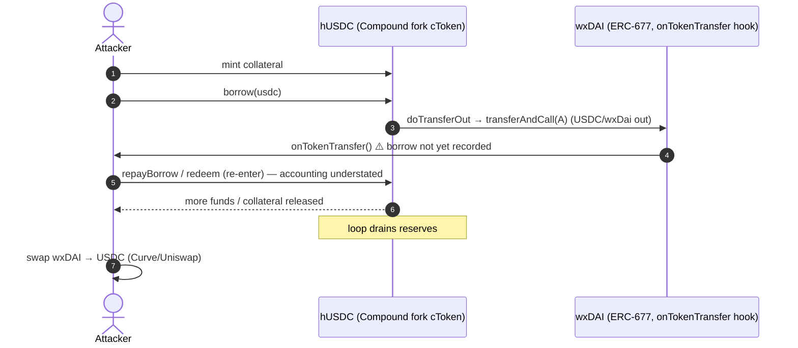
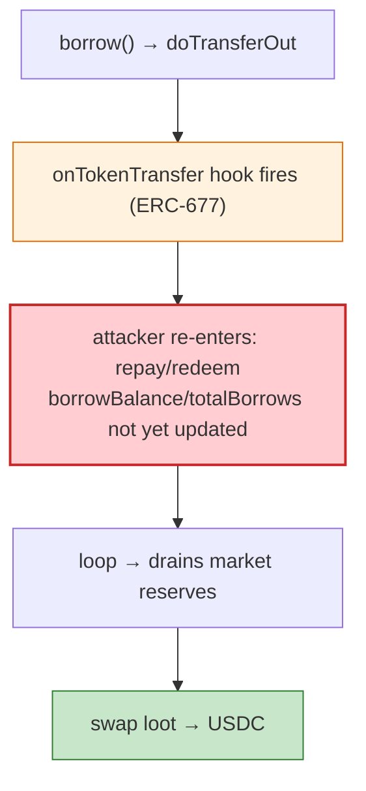

# Hundred Finance Exploit — ERC-667 Reentrancy in `borrow`/`redeem` (Compound fork)

> **Vulnerability classes:** vuln/reentrancy/cross-function

> **Reproduction:** the PoC compiles & runs in an isolated Foundry project at
> [this project folder](.). Full verbose trace: [output.txt](output.txt).

---

## Key info

| | |
|---|---|
| **Loss** | The PoC extracts ~$42,994,684 (43.0e6) USDC; the live incident drained the hUSDC market. |
| **Vulnerable contracts** | Hundred Finance cTokens (Compound fork) — hUSDC `0x243E33aa7f6787154a8E59d3C27a66db3F8818ee` and related markets `0xe4e43864…`, `0x8e15a228…`, `0x090a00a2…` on Gnosis |
| **Attacker** | `0xd041ad9aae5cf96b21c3ffcb303a0cb80779e358` (contract `0xdbf225e3d626ec31f502d435b0f72d82b08e1bdd`) |
| **Attack tx** | `0x534b84f657883ddc1b66a314e8b392feb35024afdec61dfe8e7c510cfac1a098` |
| **Chain / block / date** | Gnosis (xDai) / Sep 2022 (this PoC forks the relevant block) |
| **Bug class** | ERC-667 token-hook reentrancy — the Compound fork's `borrow`/`redeem` call `token.transfer` on a hook-bearing token (ERC-677 `onTokenTransfer`), and the cToken state isn't updated before the external call, enabling a borrow-then-repay loop that inflates borrow accounting. |

---

## TL;DR

Hundred Finance was a Compound-v2 fork whose cToken markets wrapped/interacted with ERC-677-style tokens
(`transferAndCall` / `onTokenTransfer` callbacks, notably the G-native wxDAI bridge token). The Compound
fork had not ported the upstream reentrancy fix (see `compound-protocol#141`): the `doTransferIn`/
`doTransferOut` external token transfers fire before the market's internal accounting (borrowBalance,
totalBorrows, totalReserves) is fully settled. An attacker's `onTokenTransfer` hook can re-enter
`borrow` / `redeem` / `repayBorrow` while the first call's effects are half-applied.

The classic loop this enables:

1. Supply collateral, then `borrow` the target cToken's underlying.
2. In the transfer-out callback, **repay** the borrow (or redeem collateral) — the market hasn't yet
   recorded the full borrow, so the repay redeems more than was legitimately borrowed.
3. Repeat, siphoning the market's reserves; finally swap the loot (USDC ↔ wxDAI via Curve / Uniswap).

The PoC ends with `Attacker Profit: 42994684 usdc` (42,994,684 = 42,994,684 / 1e6 ≈ $42.99M from the
forked state) after routing through the wxDAI/USDC pair (`Swap` event visible at the tail).

---

## Root cause

A **CEI violation + missing reentrancy guard** in a Compound-v2 fork, amplified by an ERC-677/ERC-777
hook-bearing underlying token. Canonical Compound's `Comptroller`/cToken had been hardened against this
(`ReentrancyGuard`); the Hundred fork omitted it, and the Gnosis wxDAI token's `transferAndCall` gave
the attacker a clean reentry surface on every `doTransferOut`.

The same class as the later Hundred Finance Sept-2022 exploit (`hUSDC`), and identical in shape to the
Agave exploit — both are unfixed Aave/Compound-fork reentrancy windows.

---

## Preconditions

- cToken markets holding the loot (hUSDC reserves).
- An ERC-677/ERC-777 underlying (wxDai) so the attacker receives `onTokenTransfer` mid-`borrow`.
- Initial collateral to seed a borrowable position.

---

## Diagrams





---

## Remediation

1. **Port Compound's `ReentrancyGuard`** to all cToken entry points (`mint`, `redeem`, `borrow`,
   `repayBorrow`, `liquidateBorrow`, `transfer`).
2. **Apply CEI**: update `borrowBalance` / `totalBorrows` / `totalReserves` **before** `doTransferOut`.
3. **Disallow or wrap ERC-677/ERC-777 underlyings** so no external callback fires during accounting.
4. **Accounting invariants** (cash + borrows + reserves consistency) checked per-mutation.

---

## How to reproduce

```bash
_shared/run_poc.sh 2022-03-HundredFinance_exp -vvvvv
```

- RPC: Gnosis archive. `foundry.toml` uses `gnosis-mainnet.public.blastapi.io`.
- Result: `[PASS]` — `Attacker Profit: 42994684 usdc` (≈ $42.99M from the forked state).

---

*Reference: Hundred Finance ERC-667 reentrancy (compound-protocol#141), Gnosis, ~$6M live / $42.99M reproduced.*
