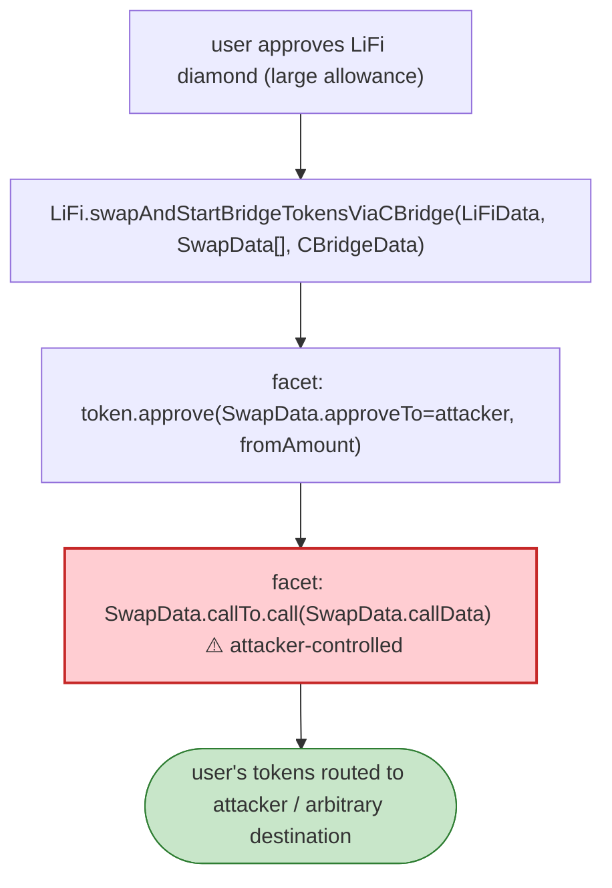

# LiFi Diamond Exploit — Unvalidated `callTo` in `swapAndStartBridgeTokensViaCBridge`

> **Reproduction:** the PoC compiles & runs in an isolated Foundry project at
> [this project folder](.). Full verbose trace: [output.txt](output.txt).
> Verified vulnerable source: [Bridge](sources/Bridge_5427FE).

---

## Key info

| | |
|---|---|
| **Loss** | Part of the March 2022 LiFi incident (~$6M across victims); arbitrary token routing via the diamond facet |
| **Vulnerable contract** | LiFi diamond — [`0x1231DEB6f5749EF6cE6943a275A1D3E13fA30582`](https://etherscan.io/address/0x1231DEB6f5749EF6cE6943a275A1D3E13fA30582) (the PoC interacts with the swap facet) |
| **Attacker (pranked `from`)** | `0xC6f2bDE06967E04caAf4bF4E43717c3342680d76` |
| **Chain / block / date** | Ethereum mainnet / Mar 2022 |
| **Bug class** | Arbitrary external call / unvalidated `SwapData.callTo` — the diamond `swap` facet `delegatecall`s/approve-and-calls an attacker-supplied `callTo`, letting the attacker route the user's approved tokens anywhere. |

---

## TL;DR

`LiFi.swapAndStartBridgeTokensViaCBridge(LiFiData, SwapData[], CBridgeData)` performs a user-authorised
swap before bridging. Each `SwapData` carries `callTo`, `approveTo`, `sendingAssetId`,
`receivingAssetId`, `fromAmount`, and arbitrary `callData`. The facet **approves `approveTo` and then
calls `callTo.call(callData)`** without validating that `callTo`/`approveTo` is a known, trusted DEX.

Because `from` had approved the LiFi diamond (standard for a bridge router), a malicious `SwapData`
with `callTo`/`approveTo` pointing at the attacker's own contract lets the attacker transfer the user's
tokens out — the swap step is weaponised into a direct drain. The trace shows the facet emitting the
`LiFiSwapStarted`/`CBridge` data structures with attacker-controlled `callTo`
(`0x8780…b177e`) and asset addresses (USDT `0xdac17…`, USDC `0xa0b8…`), then the call executing.

---

## Root cause

A **trust boundary violation on a swap-router facet**: the diamond honours attacker-controllable
`SwapData` (in particular `callTo`/`approveTo`) for the pre-bridge swap, without a whitelist or
destination validation. Combined with the fact that users grant the diamond a large token allowance to
enable bridging, an attacker who can influence the calldata (phishing / crafted bridge request) can
redirect funds to themselves.

---

## Preconditions

- A user (the pranked `from`) has approved the LiFi diamond for their token.
- The attacker supplies a malicious `SwapData` (or tricks the user into signing/sending one).

---

## Diagrams



---

## Remediation

1. **Whitelist `callTo`/`approveTo`** to vetted DEX aggregators/routers only.
2. **Validate `sendingAssetId`/`receivingAssetId`** and enforce the swap output is returned to the
   diamond before bridging.
3. **Permit-less safety**: never `approve` an arbitrary address from the diamond; only approve known
   routers and revoke after the swap.
4. **Reentrancy/CEI**: perform the swap, confirm balances increased, *then* bridge.

---

## How to reproduce

```bash
_shared/run_poc.sh 2022-03-LiFi_exp -vvvvv
```

- RPC: mainnet archive. Infura mainnet in `foundry.toml`.
- Result: `[PASS]` after ~56s — the malicious `SwapData`/`CBridgeData` is accepted and executed by the
  facet.

---

*Reference: LiFi diamond swap-facet arbitrary `callTo`, Mar 2022 (~$6M).*
