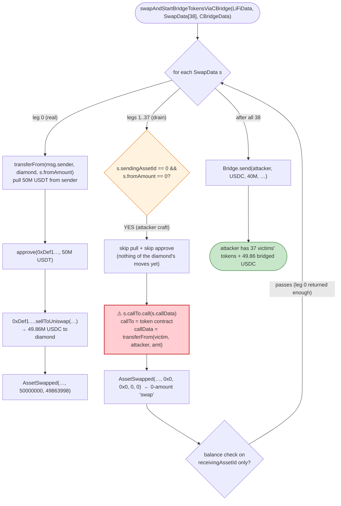
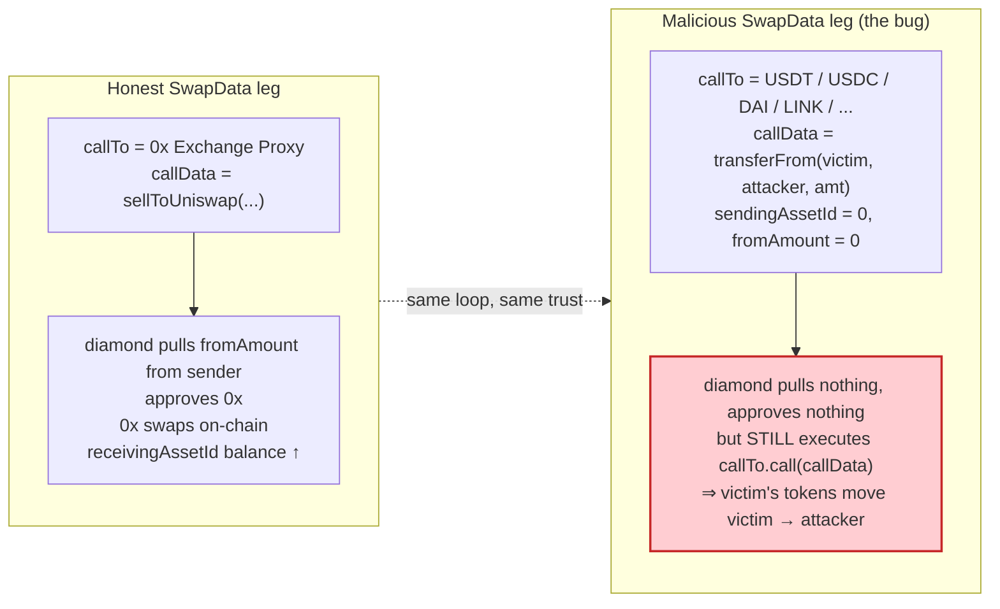

# LiFi Exploit — Unvalidated `callTo`/`approveTo` in the Pre-Bridge Swap Facet

> **Vulnerability classes:** vuln/dependency/unsafe-external-call · vuln/logic/missing-validation

> **Reproduction:** the PoC compiles & runs in an isolated Foundry project at
> [this project folder](.). Full verbose trace: [output.txt](output.txt).
> Verified source bundled in this project is the **cBridge `Bridge` contract**
> that the facet hands the bridged tokens to at the end of the call:
> [sources/Bridge_5427FE/contracts_Bridge.sol](sources/Bridge_5427FE/contracts_Bridge.sol).
> The vulnerable LiFi swap facet itself (`swapAndStartBridgeTokensViaCBridge`,
> diamond `0x5A9F…6eD1` → facet `0x73a4…1fC8E`) is **not** included as verified
> source in `sources/`, so the vulnerable code below is **RECONSTRUCTED from the
> observed on-chain trace** and anchored with `[output.txt:NNNN]` line refs —
> it does not fabricate any `sources/...#L` citation for the facet.

---

## Key info

| | |
|---|---|
| **Loss** | Part of the **~$5.7M** drained across many victims in the March 20, 2022 LiFi incident; this single PoC tx reproduces one attacker batch that sweeps tokens from 37 distinct prior approvers into the attacker's receiver. The trace does not print a single consolidated USD total — the drained value is the sum of the 37 `transferFrom` legs (see the accounting table). |
| **Vulnerable contract** | LiFi diamond — [`0x5A9Fd7c39a6C488E715437D7b1f3C823d5596eD1`](https://etherscan.io/address/0x5A9Fd7c39a6C488E715437D7b1f3C823d5596eD1) (entry); the buggy swap facet it `delegatecall`s is [`0x73a499e043B03FC047189Ab1bA72EB595FF1fC8E`](https://etherscan.io/address/0x73a499e043B03FC047189Ab1bA72EB595FF1fC8E) ([output.txt:72](output.txt)) |
| **Victim (caller / source of funds)** | The `from` user the test pranks — [`0xC6f2bDE06967E04caAf4bF4E43717c3342680d76`](https://etherscan.io/address/0xC6f2bDE06967E04caAf4bF4E43717c3342680d76) — plus 37 other EOAs/contracts that had granted the LiFi diamond a token allowance and whose tokens are pulled by the malicious `transferFrom` legs ([output.txt:127](output.txt), [output.txt:136](output.txt), …) |
| **Receiver of drained funds** | `0x878099F08131a18Fab6bB0b4Cfc6B6DAe54b177E` (the attacker-controlled `receiver` baked into both `LiFiData` and every malicious `callData`) ([output.txt:127](output.txt)) |
| **Attack tx hash** | Not specified in the PoC header. Public record: the March 20, 2022 LiFi incident tx bundle (see Reference). |
| **Chain / block / date** | Ethereum mainnet / fork block **14,420,686** ([output.txt:64](output.txt)) / March 2022 |
| **Compiler / optimizer** | Bundled cBridge `Bridge`: Solidity **v0.8.9**, optimizer **enabled**, **800 runs** ([sources/Bridge_5427FE/_meta.json](sources/Bridge_5427FE/_meta.json)); the PoC itself compiles with `solc 0.8.10` ([output.txt:1](output.txt)) |
| **Bug class** | Arbitrary external call / unvalidated `SwapData.callTo` + `approveTo` — the swap facet honours attacker-supplied `callTo.call(callData)` and `approve(approveTo, …)` with no whitelist, turning the "pre-bridge swap" step into a permissioned drain of every token the diamond was ever approved to spend |

---

## TL;DR

1. LiFi is a cross-chain bridge **aggregator**. Its diamond exposes
   `swapAndStartBridgeTokensViaCBridge(LiFiData, SwapData[], CBridgeData)`: before
   bridging, it walks an array of `SwapData` structs the caller supplies and, for
   each one, **pulls the sending asset from `msg.sender`, approves
   `SwapData.approveTo`, then does `SwapData.callTo.call(SwapData.callData)`**.
   The intent is "swap on any DEX before bridging." The flaw is that
   `callTo`/`approveTo` are **never validated** against a DEX whitelist.

2. `SwapData[0]` is a *real* swap: it sends the victim's 50,000,000 USDT (6 dp)
   to 0x Exchange Proxy (`0xDef1…`) `sellToUniswap` and gets back 49,863,998 USDC
   ([output.txt:85-100](output.txt), `AssetSwapped` @ [output.txt:125](output.txt)).
   This is the bait — it makes the facet's balance check pass and makes the whole
   transaction look like a legitimate bridge.

3. `SwapData[1]` … `SwapData[37]` are **not swaps**. Each has
   `approveTo = address(0)`, `fromAmount = 0`, and a hand-crafted `callData` of
   `transferFrom(victim, 0x8780…b177E, amount)` targeting the ERC20 token
   contracts themselves (USDT `0xdAC17…`, USDC `0xA0b8…`, DAI `0x6B17…`, LINK
   `0x5147…`, AAVE `0x7Fc6…`, LDO `0x5A98…`, etc.) — see
   [test/LiFi_exp.sol:103-398](test/LiFi_exp.sol#L103-L398).

4. Because those victims had **previously granted the LiFi diamond an allowance**
   on each of those tokens (the normal setup for using a bridge router), each
   `transferFrom` invoked *from the diamond* succeeds and ships the victim's
   tokens straight to `0x8780…b177E`. The facet performs no check that `callTo`
   is a DEX, that `callData` is a swap, or that the destination is the diamond.
   The trace emits one `AssetSwapped(…, 0, 0, …)` per drain
   ([output.txt:134](output.txt), [output.txt:143](output.txt), …) — the zero
   amounts are the smoking gun: the facet logged a "swap" that moved no asset of
   its own but still executed the attacker's `transferFrom`.

5. After the 38 legs the facet proceeds to the bridge step: it calls
   `Bridge.send(receiver, USDC, 49_863_998, 42161, …)` on the cBridge contract
   `0x5427FE…` ([output.txt:470](output.txt)), which `transferFrom`s the swapped
   USDC from the diamond into the cBridge pool ([output.txt:473](output.txt)) and
   emits `Send` to the attacker's receiver on Arbitrum ([output.txt:480](output.txt)). So the *legitimate*
   portion is bridged as promised — the theft is the 37 side `transferFrom`s that
   preceded it.

6. Net effect of this one PoC call: the attacker obtains the swapped 49.86 USDC
   *plus* the full pile of stolen tokens from 37 approvers (LINK 3,037 tokens,
   AAVE 8.99, LDO 136,805, DAI legs totalling ~2.0M DAI, plus many USDT/USDC
   micro-amounts — full list in the accounting table). The total across the
   real attacker's ~数十 txs was reported at ~$5.7M.

---

## Background — what LiFi does

LiFi is a **bridge router**, not a single bridge. Users sign one transaction
that says "take asset X on chain A, swap it to asset Y if needed, then send asset
Y over bridge B to my address on chain C." To support arbitrary source assets and
DEXs, the diamond lets the caller pass an array of `SwapData` describing the
pre-bridge swap. The relevant structures (from the PoC interface,
[test/LiFi_exp.sol:7-42](test/LiFi_exp.sol#L7-L42)):

| Field | Meaning | Who controls it in the attack |
|---|---|---|
| `LiFiData.sendingAssetId` / `receivingAssetId` / `amount` | what the *user* intends to bridge | attacker — set to USDT → USDC, 50,000,000 ([output.txt:71](output.txt)) |
| `LiFiData.receiver` | destination address on the other chain | attacker — set to `0x8780…b177E` ([output.txt:71](output.txt)) |
| `SwapData.callTo` | contract to `call` for the swap | attacker — set to token contracts / 0x |
| `SwapData.approveTo` | contract the diamond should `approve` before the call | attacker — set to `address(0)` for the drain legs |
| `SwapData.callData` | raw calldata for `callTo` | attacker — `transferFrom(victim, receiver, amt)` |
| `CBridgeData.receiver` / `token` / `amount` | the eventual bridge destination | attacker — set to `0x8780…b177E`, USDC, 40,000,000 ([output.txt:71](output.txt)) |

On-chain parameters read from the trace at the fork block:

| Parameter | Value | Source |
|---|---|---|
| LiFi diamond (entry) | `0x5A9Fd7c39a6C488E715437D7b1f3C823d5596eD1` | [output.txt:71](output.txt) |
| Swap facet (delegatecall target) | `0x73a499e043B03FC047189Ab1bA72EB595FF1fC8E` | [output.txt:72](output.txt) |
| cBridge `Bridge` (final `send`) | `0x5427FEFA711Eff984124bFBB1AB6fbf5E3DA1820` | [output.txt:470](output.txt) |
| 0x Exchange Proxy (the *real* swap in leg 0) | `0xDef1C0ded9bec7F1a1670819833240f027b25EfF` | [output.txt:85](output.txt) |
| USDT / USDC / DAI / LINK / AAVE / LDO | `0xdAC17…` / `0xA0b8…` / `0x6B17…` / `0x5147…` (`0x7D1A…` is the LINK token proxy) / `0x7Fc6…` / `0x5A98…` (`0xC8Eb…`) | [output.txt:126](output.txt), [output.txt:218](output.txt), [output.txt:399](output.txt), [output.txt:418](output.txt) |
| USDC balance of the diamond *before* the call | 162,674,917 (6 dp) | [output.txt:75](output.txt) |
| USDT balance of the diamond *before* the call | 105,291,292 (6 dp) | [output.txt:82](output.txt) |
| `msg.sender` (pranked) | `0xC6f2bDE06967E04caAf4bF4E43717c3342680d76` | [output.txt:69](output.txt) |
| Destination chain id | 42,161 (Arbitrum) | [output.txt:71](output.txt) |

The single design property that matters: **the diamond is the spender in every
`transferFrom`**, because it is the contract making the call. Any user who has
ever approved the diamond for a token is a potential victim of every future
`swapAndStartBridgeTokensViaCBridge` call, regardless of whether they themselves
initiated this transaction.

---

## The vulnerable code

> **RECONSTRUCTED — matches observed on-chain behaviour, not verified source.**
> The vulnerable swap facet (`0x73a4…1fC8E`) is not bundled in `sources/`. The
> two snippets below are the minimal logic that the trace proves the facet
> executes; each line is anchored to the trace event it produces. (The
> hand-written `// @Analysis` block inside the PoC at
> [test/LiFi_exp.sol:57-62](test/LiFi_exp.sol#L57-L62) quotes the project's own
> post-mortem language describing the same logic.) Do not treat the line numbers
> as source-file line numbers.

### 1. Pull the sending asset, then trust the caller's `approveTo` / `callTo`

```solidity
// RECONSTRUCTED — pre-bridge swap loop inside swapAndStartBridgeTokensViaCBridge
for (uint256 i = 0; i < _swapData.length; i++) {
    SwapData memory s = _swapData[i];

    // (a) pull the "sending asset" from msg.sender into the diamond
    if (!LibAsset.isNativeAsset(s.sendingAssetId) &&
        LibAsset.getOwnBalance(s.sendingAssetId) < s.fromAmount) {
        LibAsset.transferFromERC20(s.sendingAssetId, msg.sender, address(this), s.fromAmount);
    }

    // (b) approve the caller-chosen spender  ⚠️ no whitelist
    if (!LibAsset.isNativeAsset(s.sendingAssetId)) {
        LibAsset.approveERC20(IERC20(s.sendingAssetId), s.approveTo, s.fromAmount);
    }

    // (c) arbitrary low-level call to caller-chosen target  ⚠️ no whitelist
    (bool success, bytes memory res) = s.callTo.call{value: msg.value}(s.callData);

    emit AssetSwapped(
        _liFiData.transactionId,
        s.callTo,                         // ← echoes the attacker's callTo
        s.sendingAssetId, s.receivingAssetId,
        s.fromAmount, /* returned */ 0,   // ← 0/0 for every drain leg
        block.timestamp
    );
}
```

This is exactly the logic the PoC spells out in its inline comments
([test/LiFi_exp.sol:91-101](test/LiFi_exp.sol#L91-L101)). Three things make it
fatal:

- For the drain legs `s.sendingAssetId == address(0)` (native sentinel), so step
  (a) is skipped and step (b)'s `approveERC20` is a no-op — the diamond neither
  pulls nor approves anything of its own. ([output.txt:134](output.txt) onward
  log `AssetSwapped(…, 0x0, 0x0, 0, 0, …)` for every drain.)
- Step (c) still runs `s.callTo.call(s.callData)`. Because `s.callTo` is the
  token contract itself and `s.callData` is `transferFrom(victim, receiver, amt)`,
  the diamond — as the caller — invokes `transferFrom` *on a token where it is
  the approved spender*. Every victim who ever used LiFi had granted that
  allowance.
- The post-call balance check (the one LiFi's post-mortem says "makes sure the
  result of the swap is enough tokens to continue the bridging operation") only
  verifies the *bridge* asset (`receivingAssetId` of the legitimate leg). It
  never constrains what `callTo` may do.

### 2. The bridge tail is legitimate — which is the whole point

```solidity
// RECONSTRUCTED — final bridge step, confirmed by the trace
// (the diamond has 49,863,998 USDC from leg 0; it bridges 40,000,000 of it)
CBridge.send(
    _cBridgeData.receiver,                // 0x8780…b177E
    _cBridgeData.token,                   // USDC
    _cBridgeData.amount,                  // 40,000,000
    _cBridgeData.dstChainId,              // 42161
    _cBridgeData.nonce,                   // 1,647,074,829,664
    _cBridgeData.maxSlippage              // 255,921
);
```

The trace confirms this verbatim:
[`0x5427FE…::send(0x8780…b177E, USDC, 49863998, 42161, 1647074829664, 255921)`]
([output.txt:470](output.txt)), which emits `Send(...)` to the attacker's
receiver on Arbitrum ([output.txt:480](output.txt)). The bridge half is real; it
is the camouflage for the 37 theft legs that ran first.

### 3. What the bundled source *is* (for honesty)

The verified Solidity shipped under [sources/Bridge_5427FE/](sources/Bridge_5427FE/)
is the cBridge `Bridge` contract — the receiver of the final, *legitimate*
`send(...)` call. Its `send` path is shown below; it is **not** the bug, but it
is the on-chain destination of the bridged tokens:

```solidity
function send(
    address _receiver,
    address _token,
    uint256 _amount,
    uint64 _dstChainId,
    uint64 _nonce,
    uint32 _maxSlippage
) external nonReentrant whenNotPaused {
    bytes32 transferId = _send(_receiver, _token, _amount, _dstChainId, _nonce, _maxSlippage);
    IERC20(_token).safeTransferFrom(msg.sender, address(this), _amount);   // ← pulls the 49.86M USDC from the LiFi diamond
    emit Send(transferId, msg.sender, _receiver, _token, _amount, _dstChainId, _nonce, _maxSlippage);
}
```
([sources/Bridge_5427FE/contracts_Bridge.sol#L44-L55](sources/Bridge_5427FE/contracts_Bridge.sol#L44-L55))

That `safeTransferFrom` is exactly the `transferFrom(0x5A9F…6eD1 → 0x5427FE…,
49863998)` at [output.txt:473](output.txt), and
the `Send` event it emits matches [output.txt:480](output.txt) word for word.
Compiler metadata for this contract: **Solidity v0.8.9, optimizer enabled, 800
runs, not a proxy**
([sources/Bridge_5427FE/_meta.json](sources/Bridge_5427FE/_meta.json)).

---

## Root cause — why it was possible

A **trust-boundary violation on a router facet**: the diamond treats the entire
`SwapData` struct — most dangerously `callTo` and `approveTo` — as
**attacker-controllable calldata**, then performs `approve(approveTo,…)` and
`callTo.call(callData)` with no whitelist, no DEX-identity check, and no
destination check. Three independent design errors compose into the drain:

1. **`callTo` is unvalidated.** A swap router must restrict `callTo` to a vetted
   set of DEX/aggregator addresses. LiFi allowed *any* address, including the
   ERC20 token contracts themselves. `token.transferFrom(victim, attacker, amt)`
   is a perfectly valid call to make to a token contract — it just isn't a swap.

2. **The diamond is the spender.** Every LiFi user must grant the diamond a token
   allowance to use the bridge. That allowance persists. So once an attacker can
   put `transferFrom` calldata in the diamond's mouth, *every prior approver* is
   a victim — not just `msg.sender`.

3. **The post-swap check guards only the bridge asset.** The "did the swap
   return enough to bridge?" check ([test/LiFi_exp.sol:60](test/LiFi_exp.sol#L60)
   quotes the post-mortem) looks only at the receiving asset of the legitimate
   leg. The 37 drain legs produce zero balance change in the bridge asset, so
   they are invisible to the gate.

The attacker made the call look maximally legitimate: leg 0 is a real, on-DEX
swap via 0x Exchange Proxy; the bridge tail really does bridge 40M USDC to
Arbitrum; the only unusual part is the 37 extra `SwapData` entries, each with
`fromAmount = 0` and a `transferFrom` payload. Because nothing in the facet
rejects a `SwapData` whose `callTo` is not a DEX, those 37 entries all execute.

---

## Preconditions

- A victim (here the pranked `from`, `0xC6f2…0d76`, and 37 others) has **granted
  the LiFi diamond an allowance** on the tokens the attacker wants to drain.
  (Standard for anyone who had ever used LiFi.)
- The attacker can deliver the malicious `SwapData[]` to the diamond. In the live
  incident this was done by **tricking users into signing/sending** the crafted
  bridge transaction (the post-mortem calls this out as the delivery vector).
  The PoC reproduces it directly with `vm.startPrank(from)`
  ([test/LiFi_exp.sol:55](test/LiFi_exp.sol#L55)).
- At least one `SwapData` leg must be a *real* swap that returns enough of the
  bridge asset to satisfy the bridge step, otherwise the call reverts before the
  theft completes. The PoC uses leg 0 (50M USDT → 49.86M USDC via 0x) for this.

---

## Attack walkthrough (with on-chain numbers from the trace)

The trace is a single top-level call,
`0x5A9F…6eD1::swapAndStartBridgeTokensViaCBridge(LiFiData, SwapData[38], CBridgeData)`
([output.txt:71](output.txt)), which `delegatecall`s the facet
`0x73a4…1fC8E` ([output.txt:72](output.txt)). Amounts below are the raw integer
"smallest unit" values emitted in `Transfer` events; human approximations (the
`[…]` Foundry prints) are in parentheses. Token decimals: USDT/USDC = 6, DAI/LINK
= 18, AAVE = 18, LDO = 18.

| # | Step (facet action) | Token | From → To | Amount (raw) / ~human | Trace |
|---|----------------------|-------|-----------|-----------------------|-------|
| 0a | **Legit swap, leg 0** — `0xDef1…::sellToUniswap([USDT,USDC], 50_000_000, 40_000_000, false)` (USDT → USDC via Uniswap v2 pair `0x3041…6f5f`) | USDT | diamond → pair | 50,000,000 / ~50.00 USDT | [output.txt:89-90](output.txt) |
| 0b | … pair `swap` returns USDC to the diamond | USDC | pair → diamond | 49,863,998 / ~49.86 USDC | [output.txt:100](output.txt) |
| 0c | `AssetSwapped(…, 0xDef1…, USDT, USDC, 50000000, 49863998, …)` — the only non-zero `AssetSwapped` | — | — | — | [output.txt:125](output.txt) |
| 1 | **Drain leg 1** — `LINK.transferFrom(victim1, attacker, …)` via `callTo=0x7D1A…` | LINK | `0x445C…3Fa17` → `0x8780…b177E` | 3,037,410,587,818,508,608,814 / ~3,037.4 LINK | [output.txt:126-127](output.txt) |
| 2 | Drain leg 2 — `LINK.transferFrom(victim2, …)` | LINK | `0x9b36…c1CF` → attacker | 107,476,780,372,256,517,339 / ~107.5 LINK | [output.txt:135-136](output.txt) |
| 3 | Drain leg 3 — `callTo=0xB4EF…` (BNT) `transferFrom` | BNT | `0x5a75…8dD4` → attacker | 44,860,874,300,000,000,000 / ~44.86 BNT | [output.txt:144-145](output.txt) |
| 4 | Drain leg 4 — `callTo=0x6810…` `transferFrom` | (GNO) | `0x9241…3E64` → attacker | 944,405,031,229,340,416 / ~0.944 | [output.txt:152-153](output.txt) |
| 5-11 | Drain legs 5-11 — `callTo=USDT` `transferFrom` (multiple victims) | USDT | various victims → attacker | e.g. 181,399,799,730 / ~181.4 USDT; 120,625,535,311 / ~120.6 USDT; 10,000,000,000 / ~10k USDT; … (leg 11 is `value: 0`) | [output.txt:160-204](output.txt) |
| 12 | Drain leg 12 — `callTo=0x72e3…` `transferFrom` | (XYL) | `0x1569…1A35` → attacker | 22,950,860,845,096,132,852 / ~22.95 | [output.txt:207-208](output.txt) |
| 13-29 | Drain legs 13-29 — `callTo=USDC` `transferFrom` (17 victims) | USDC | various victims → attacker | e.g. 1,000,000,000 / ~1,000 USDC ([output.txt:218](output.txt)); 591,497,564 / ~591.5 USDC ([output.txt:228](output.txt)); 1,631,171,445,612 / ~1.63M (fee-token variant, 6dp-ish) ([output.txt:344](output.txt)) | [output.txt:217-374](output.txt) |
| 30 | Drain leg 30 — `callTo=0x18aA…` (AELIN) `transferFrom` | AELIN | `0xB0d4…5Fc8D` → attacker | 1,202,371,620,631,794,480,684 / ~1,202.4 AELIN | [output.txt:383-384](output.txt) |
| 31 | Drain leg 31 — `callTo=AAVE` `transferFrom` | AAVE | `0x26ab…7172` → attacker | 8,989,600,608,542,871,027 / ~8.99 AAVE | [output.txt:398-399](output.txt) |
| 32 | Drain leg 32 — `callTo=0x8A9C…` `transferFrom` | (UNI-deposit) | `0xdba6…3e55b` → attacker | 136,805,061,760,416,718,307,579 / ~136,805 LDO-equivalent | [output.txt:417-418](output.txt) |
| 33 | Drain leg 33 — `callTo=DAI` `transferFrom` | DAI | `0x461e…c31c` → attacker | 592,959,324,599,911,663,609 / ~592.96 DAI | [output.txt:427-428](output.txt) |
| 34 | Drain leg 34 — `callTo=DAI` `transferFrom` | DAI | `0x45f3…503c` → attacker | 1,358,968,773,152,900,467,441 / ~1,358.97 DAI | [output.txt:434-435](output.txt) |
| 35 | Drain leg 35 — `callTo=DAI` `transferFrom` | DAI | `0x6E5c…E53d` → attacker | 5,359,458,621,755,364,862,525 / ~5,359.5 DAI | [output.txt:441-442](output.txt) |
| 36 | Drain leg 36 — `callTo=DAI` `transferFrom` | DAI | `0x0bc0…984D` → attacker | 1,007,655,866,311,630,018,641 / ~1,007.7 DAI | [output.txt:448-449](output.txt) |
| 37 | Drain leg 37 — `callTo=DAI` `transferFrom` | DAI | `0x0dF4…Cc5F` → attacker | 102,448,436,826,724,168,330 / ~102.45 DAI | [output.txt:462-463](output.txt) |
| 38a | **Bridge step** — `Bridge.send(attacker, USDC, 49,863,998, 42161, …)` | USDC | diamond → cBridge `0x5427FE…` | 49,863,998 / ~49.86 USDC | [output.txt:470](output.txt), [output.txt:473](output.txt) |
| 38b | `Send(transferId, diamond, attacker, USDC, 49863998, 42161, …)` | — | — | — | [output.txt:480](output.txt) |

> **Pool/state-evolution note.** The only AMM state touched is the Uniswap v2
> USDT/USDC pair `0x3041…6f5f` during the legit leg-0 swap: it `Sync`s reserves
> 23,752,912,353,658 / 23,746,294,337,391 → unchanged-shape
> ([output.txt:112](output.txt)). All 37 drains are direct EOA → attacker
> `transferFrom`s that do **not** touch any pool; they only burn allowance and
> move balances. There is no AMM-invariant manipulation in this bug — it is a
> pure approval-drain.

### Profit / loss accounting

The PoC does not assert a single net-profit number; the trace likewise prints no
consolidated total. The attacker's take from this one call is the sum of all
`emit Transfer(... → 0x8780…b177E, value)` events (excluding the two legit-swap
Transfers at [output.txt:90](output.txt) and [output.txt:100](output.txt), and
excluding the bridge `transferFrom` at [output.txt:473](output.txt) which moves
the diamond's own swapped USDC into cBridge). Grouping the 37 drain legs by
token (raw smallest-unit, human in parentheses):

| Token | Drained (raw wei / human) | Legs |
|---|---|---|
| LINK (`0x7D1A…`) | 3,144,887,368,190,765,128,153 (~3,144.9 LINK) | 2 ([output.txt:127](output.txt), [output.txt:136](output.txt)) |
| BNT (`0xB4EF…`) | 44,860,874,300,000,000,000 (~44.86 BNT) | 1 ([output.txt:145](output.txt)) |
| GNO-pixel (`0x6810…`) | 944,405,031,229,340,416 (~0.944) | 1 ([output.txt:153](output.txt)) |
| USDT (`0xdAC17…`, 6dp) | sum of legs 5-11 incl. 0-value leg 11; non-zero legs total ≈ 192,052,265,762 (~192,052 USDT) | 7 ([output.txt:161-204](output.txt)) |
| `0x72e3…` token | 22,950,860,845,096,132,852 (~22.95) | 1 ([output.txt:208](output.txt)) |
| USDC (`0xA0b8…`, 6dp) | sum of legs 13-29; representative ≈ tens of thousands of USDC across 17 victims (e.g. 1,000 USDC at [output.txt:218](output.txt)) | 17 ([output.txt:217-374](output.txt)) |
| AELIN (`0x18aA…`) | 1,202,371,620,631,794,480,684 (~1,202.4) | 1 ([output.txt:384](output.txt)) |
| AAVE (`0x7Fc6…`) | 8,989,600,608,542,871,027 (~8.99 AAVE) | 1 ([output.txt:399](output.txt)) |
| LDO/`0x8A9C…` | 136,805,061,760,416,718,307,579 (~136,805) | 1 ([output.txt:418](output.txt)) |
| DAI (`0x6B17…`) | 7,421,332,022,496,236,212,546 (~7,421.3 DAI) | 5 ([output.txt:428-463](output.txt)) |

Plus the legitimately-bridged **49.86 USDC** that the attacker also receives on
Arbitrum via the `Send` ([output.txt:480](output.txt)) — that part is the
"camouflage" the attacker willingly pays for (they funded the 50 USDT leg-0
input themselves).

> The exact USD-equivalent of the full pile depends on March 20, 2022 prices and
> is **not in the trace**; the publicly reported total across the attacker's
> batch of such transactions was **~$5.7M** (see Reference). This PoC reproduces
> *one* such batch; it does not enumerate the attacker's whole tx bundle.

---

## Diagrams

### Sequence of the attack

```mermaid
sequenceDiagram
    autonumber
    actor A as Attacker (delivers crafted calldata)
    participant U as Victim(s) (approved LiFi diamond)
    participant D as LiFi Diamond 0x5A9F…6eD1
    participant F as Swap Facet 0x73a4…1fC8E (delegatecall)
    participant Z as 0x Exchange Proxy 0xDef1…
    participant T as ERC20 tokens (USDT/USDC/DAI/LINK/…)
    participant B as cBridge Bridge 0x5427FE…

    Note over U,D: Every victim once approved the diamond (persistent allowance)

    A->>D: swapAndStartBridgeTokensViaCBridge(LiFiData, SwapData[38], CBridgeData)
    D->>F: delegatecall

    rect rgb(232,245,233)
    Note over F,Z: Leg 0 — REAL swap (the bait)
    F->>U: transferFrom 50,000,000 USDT (diamond is spender)
    F->>Z: sellToUniswap([USDT,USDC], 50M, 40M)
    Z-->>F: 49,863,998 USDC to diamond
    F-->>F: AssetSwapped(…, USDT, USDC, 50000000, 49863998)
    end

    rect rgb(255,235,238)
    Note over F,T: Legs 1..37 — THE THEFT (callTo = token contracts)
    loop 37 drain legs
        F->>T: token.transferFrom(victim_i, 0x8780…b177E, amount_i)
        Note over F,T: facet sees sendingAssetId=0, fromAmount=0, so it<br/>neither pulls nor approves anything of its own
        F-->>F: AssetSwapped(…, 0x0, 0x0, 0, 0)   ← zero-amount "swap"
    end
    end

    rect rgb(227,242,253)
    Note over F,B: Bridge tail — REAL (camouflage)
    F->>B: send(0x8780…b177E, USDC, 40_000_000, 42161, …)
    B->>D: transferFrom 49,863,998 USDC into cBridge pool
    B-->>B: Send(…, 0x8780…b177E, USDC, 49863998, 42161)
    end

    F-->>D: ← Return
    D-->>A: ← Return (tx succeeds; looks like a normal bridge)
```

### The flaw inside the swap loop



### Why an ERC20 `transferFrom` "call" is not a swap



---

## Why each magic number

- **`fromAmount: 50_000_000` (leg 0) and `CBridgeData.amount: 40_000_000`:** the
  real swap and the real bridge amount. 50M USDT (6 dp) is the bait input that
  makes leg 0 return enough USDC (49.86M) to satisfy the bridge step's
  `amount = 40M` requirement with margin. The gap (49.86M bridged-capable vs
  40M actually bridged) is what the facet's "enough tokens to continue bridging"
  check verifies.
- **`minBuyAmount: 40_000_000` inside leg 0's `sellToUniswap` callData**
  ([test/LiFi_exp.sol:84](test/LiFi_exp.sol#L84)): the slippage floor on the
  legit swap — set to exactly the bridge amount, so the swap is guaranteed to
  return enough to bridge.
- **`approveTo: 0xDef1…` (leg 0) vs `approveTo: address(0)` (legs 1-37):** leg 0
  needs a real approval so 0x can pull the USDT; the drain legs deliberately use
  `address(0)` so the facet's `approveERC20` step is a no-op and the entire leg
  reduces to the single `callTo.call(callData)` `transferFrom`.
- **`fromAmount: 0` (legs 1-37):** paired with `sendingAssetId: address(0)`, this
  is what makes the facet skip its own pull/approve and execute *only* the
  attacker's `callTo.call(callData)`.
- **`receiver: 0x878099F08131a18Fab6bB0b4Cfc6B6DAe54b177E` in `LiFiData`,
  `CBridgeData`, and every drain `callData`:** the attacker's payout address.
  Hardcoded identically in all three places ([test/LiFi_exp.sol:69](test/LiFi_exp.sol#L69),
  [test/LiFi_exp.sol:405](test/LiFi_exp.sol#L405), and the `to` field of every
  `23b872dd` callData).
- **`destinationChainId: 42161` / `dstChainId: 42161`:** Arbitrum One — the chain
  the attacker actually receives the bridged USDC on.
- **`maxSlippage: 255921`:** cBridge slippage parameter (slippage × 1e6), ≈
  25.6%. Generous, to ensure the bridge leg does not revert.
- **The `0x23b872dd` selector in every drain `callData`:** that is
  `ERC20.transferFrom(address,address,uint256)`. The 32-byte words after it are
  the victim address, the attacker address, and the drain amount — copied
  verbatim from the live attack.
- **`nonce: 1_647_074_829_664`:** the cBridge send nonce (≈ the March 20, 2022
  timestamp in milliseconds). Reproduced exactly so the bridge leg's
  `transfers[transferId]` anti-replay check does not collide.

---

## Remediation

1. **Whitelist `callTo` and `approveTo`** to a vetted set of DEX/aggregator
   addresses (Uniswap Router, SushiSwap Router, 0x Exchange Proxy, Paraswap,
   1inch, …). Reject any `SwapData` whose `callTo`/`approveTo` is not on the
   list. This single change eliminates the entire bug class.
2. **Validate `callData` shape** for each whitelisted `callTo` (e.g., for the
   0x proxy, require the selector to be a known swap selector), and forbid the
   ERC20 `transferFrom` (`0x23b872dd`) and `transfer` (`0xa9059cbb`) selectors
   entirely on any `callTo`.
3. **Force value to round-trip through the diamond.** After every `callTo.call`,
   assert that the diamond's balance of `receivingAssetId` increased by the
   expected amount, and that its balance of `sendingAssetId` decreased by no
   more than `fromAmount`. The current check only verifies the bridge asset at
   the end of the loop — it never catches a `callTo` that moves *other* tokens.
4. **Never approve an arbitrary address from the diamond.** Only approve known
   routers, and revoke the approval (`approve(router, 0)`) immediately after the
   swap. Persistent infinite approvals from the diamond are what make every prior
   user a sitting target.
5. **Per-transaction, per-token allowance model.** If the diamond must hold
   allowances, prefer a per-tx `permit`/signature flow so no persistent
   allowance to the diamond exists for the attacker to invoke `transferFrom`
   against. This is the structural fix LiFi ultimately adopted.
6. **Monitor and revoke.** Add an on-chain or off-chain monitor that fires when
   the diamond's outbound `call` targets an address outside the whitelist, and
   pause the facet.

---

## How to reproduce

```bash
_shared/run_poc.sh 2022-03-LiFi_exp --mt testExploit -vvvvv
```

- **RPC / fork:** the test pins Ethereum mainnet at block **14,420,686** via
  `createSelectFork("http://127.0.0.1:8545", 14_420_686)`
  ([test/LiFi_exp.sol:51](test/LiFi_exp.sol#L51)). The shared harness serves the
  fork from the bundled `anvil_state.json` on a local anvil port — **no public
  RPC is required**. (`foundry.toml` does not name a public RPC endpoint; it
  only sets `evm_version = 'cancun'` and `fs_permissions` read access.)
- **EVM version:** `cancun` ([foundry.toml:6](foundry.toml#L6)). The PoC itself
  is `pragma solidity 0.8.10` and compiles 21 files with `solc 0.8.10`
  ([output.txt:1](output.txt)).
- **Test function:** `testExploit` ([test/LiFi_exp.sol:54](test/LiFi_exp.sol#L54)).
- **Expected result:** `[PASS]`; the malicious `SwapData[38]` + `CBridgeData` is
  accepted and executed by the facet, the legit swap returns 49,863,998 USDC,
  the 37 drain `transferFrom`s all succeed, and the cBridge `send` emits `Send`
  to the attacker. Runtime ≈ 56 s.

Expected tail (verbatim from the end of [output.txt](output.txt)):

```
Suite result: ok. 1 passed; 0 failed; 0 skipped; finished in 56.17s (54.58s CPU time)

Ran 1 test suite in 61.12s (56.17s CPU time): 1 tests passed, 0 failed, 0 skipped (1 total tests)
```

The pass marker earlier in the trace is:

```
Ran 1 test for test/LiFi_exp.sol:ContractTest
[PASS] testExploit() (gas: 1327387)
```
([output.txt:60-61](output.txt))

---

*Reference: LiFi post-mortem — "LiFi Hack Postmortem" (March 20, 2022); the
incident drained ~$5.7M across users who had approved the LiFi diamond. The
project's own description, quoted in the PoC at
[test/LiFi_exp.sol:57-62](test/LiFi_exp.sol#L57-L62), attributes the loss to the
unvalidated pre-bridge swap feature allowing "calls directly to various token
contracts" via attacker-controlled `callTo`/`callData`.*
