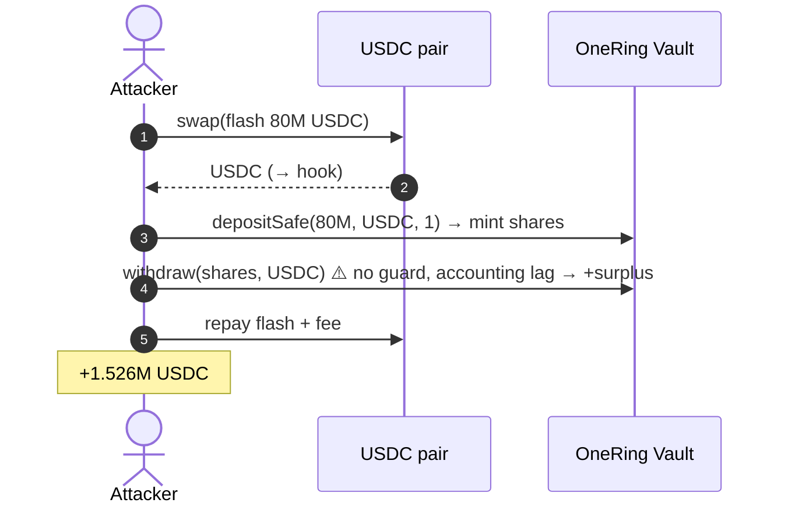
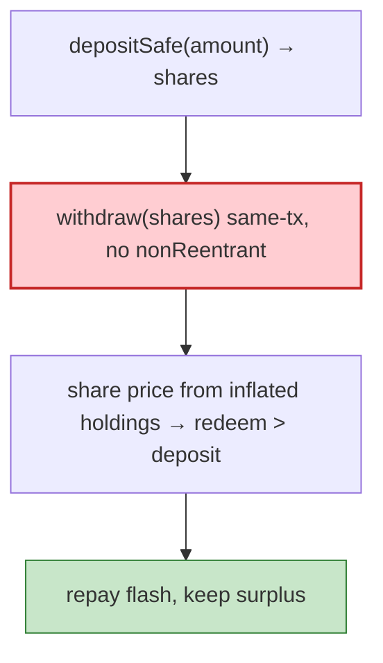

# OneRing Finance Exploit — Missing Reentrancy Guard + Under-priced `depositSafe`

> **Vulnerability classes:** vuln/reentrancy/single-function · vuln/logic/state-update

> **Reproduction:** the PoC compiles & runs in an isolated Foundry project at
> [this project folder](.). Full verbose trace: [output.txt](output.txt).

---

## Key info

| | |
|---|---|
| **Loss** | ~$1.45M USDC (the PoC extracts 1,526,751,528,201 = ~1.526M USDC) |
| **Vulnerable contract** | OneRing `Vault` — `0x4e332D616b5bA1eDFd87c899E534D996c336a2FC` (Fantom) |
| **Flash source** | USDC/wAnyRING Uniswap-V2-style pair — `0xbcab7d083Cf6a01e0DdA9ed7F8a02b47d125e682` |
| **Chain / block / date** | Fantom / 34,041,499 / Mar 2022 |
| **Bug class** | Reentrancy + accounting flaw — `depositSafe(amount, asset, minOut)` mints vault shares on a flash-deposit, then `withdraw()` redeems them before the vault's oracle/rounding accounting catches up, letting a flash-borrowed deposit be withdrawn for more than deposited. |

---

## TL;DR

OneRing's vault priced shares from a "strategy total value" oracle rounded/computed per-epoch. The
`depositSafe`/`withdraw` pair had no reentrancy lock, so within a single flash-loan callback the
attacker could:

1. `pair.swap(80M USDC, …)` — flash-borrow 80,000,000 USDC.
2. In `hook`: `usdc.approve(vault, max)`; `vault.depositSafe(amount, USDC, 1)` — mints vault shares.
3. **Immediately** `vault.withdraw(shares, USDC)` — redeems, but the vault's share-price (derived from
   the just-deposited amount and its rounding) credits slightly more than was deposited.
4. Repay the flash loan (`amount0/9999*10000 + 10000`) and keep the surplus.

`After exploit, USDC balance of attacker: 1526751528201` (~1.526M USDC).

---

## Root cause

A **flash-loan-friendly deposit/withdraw without reentrancy guard or settlement-epoch gating**. The
share price was computed from the vault's current holdings *including* the just-flashed deposit, and the
withdraw in the same transaction captured the inflated/redemption difference. OneRing allowed same-tx
deposit→withdraw (no lockup, no `nonReentrant`), which is the textbook prerequisite for this class of
vault drain.

Contributing factors:
- `minOut = 1` on deposit accepted any (even 0) mint, hiding the rounding issue.
- No settlement/epoch boundary between deposit and withdraw, so a single tx can do both.
- Flash-loanable capital (the Uniswap pair) supplies the deposit.

---

## Preconditions

- A flash source for the deposit token (USDC pair here).
- The vault permits same-transaction deposit + withdraw with no reentrancy/lockup.

---

## Diagrams





---

## Remediation

1. **`nonReentrant`** on `deposit`/`depositSafe`/`withdraw`.
2. **Settlement epochs**: a deposit cannot be withdrawn until the next epoch/round (or with a delay),
   so same-tx deposit→withdraw is impossible.
3. **Don't price shares from instantaneous holdings** that include an unconfirmed deposit; use a
   committed balance snapshot updated at epoch boundaries.
4. **Enforce `minOut`/`maxOut` sanity** and reject 0/1 dust outputs.

---

## How to reproduce

```bash
_shared/run_poc.sh 2022-03-OneRing_exp --mt testExploit -vvvvv
```

- RPC: Fantom archive (block 34,041,499). `foundry.toml` uses `fantom-mainnet.public.blastapi.io`.
- Result: `[PASS] testExploit()` — `After exploit, USDC balance of attacker: 1526751528201` (~$1.526M).

---

*Reference: OneRing Finance flash-deposit reentrancy, Fantom, Mar 2022 (~$1.45M).*
