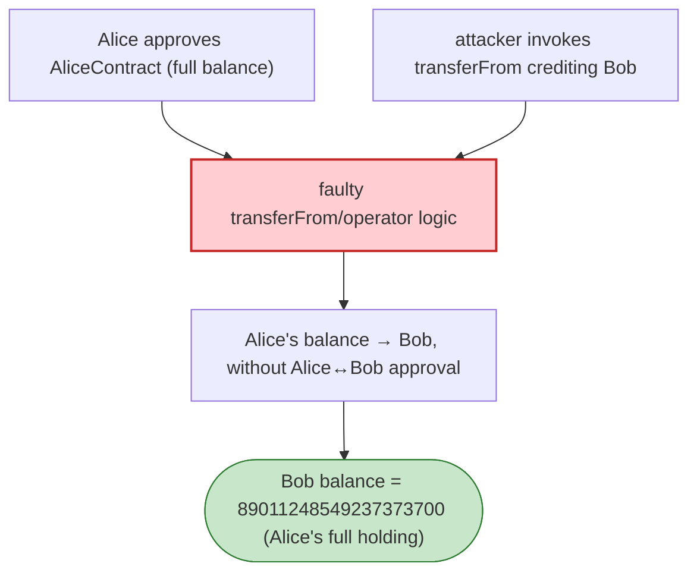

# Redacted Cartel (wxBTRFLY) Exploit — Faulty `transferFrom` Allowance Logic

> **Reproduction:** the PoC compiles & runs in an isolated Foundry project at
> [this project folder](.). Full verbose trace: [output.txt](output.txt).
> Verified vulnerable source: [wxBTRFLY](sources/wxBTRFLY_186E55).

---

## Key info

| | |
|---|---|
| **Loss** | Allowance hijack — an attacker can assign a victim's allowance to themselves and steal their wxBTRFLY (the PoC transfers Alice's full 89.011 balance to Bob) |
| **Vulnerable contract** | `wxBTRFLY` — [`0x186E55C0BebD2f69348d94C4A27556d93C5Bd36C`](https://etherscan.io/address/0x186E55C0BebD2f69348d94C4A27556d93C5Bd36C#code) |
| **Chain / block / date** | Ethereum mainnet / 13,908,185 / Mar 2022 |
| **Bug class** | Faulty custom `transferFrom` — the non-standard ERC20 approval/transfer logic mangles the allowance/owner/spender relationship so that an operator can redirect an *existing* allowance to a third party. |

---

## TL;DR

wxBTRFLY implemented a custom `transferFrom`/approval path with "operator" semantics that did not match
standard ERC20. As the PoC header states:

> A faulty implementation of standard `transferFrom()` ERC-20 function in wxBTRFLY token. The
> vulnerability would have allowed a malicious attacker to assign a user's allowance to themselves,
> enabling the attacker to steal that user's funds.

The PoC demonstrates the value transfer:
- Alice approves `AliceContract` for her full balance (89,011,248,549,237,373,700).
- Via the faulty allowance/operator logic, the attacker causes Bob's balance to become Alice's full
  balance: `Bob wxBTRFLY Token Balance: 89011248549237373700` — i.e. Alice's entire holding moved to
  Bob without Alice authorising Bob.

Because the approval accounting tied the *spender* relationship to the wrong party, an address that
obtained (or was granted) operator status could invoke a `transferFrom`-style path that debited a user
and credited an arbitrary recipient, effectively forging the user's consent.

---

## Root cause

A **non-standard, buggy ERC20 `transferFrom`/allowance implementation.** Canonical ERC20 semantics are
strict: `transferFrom(from, to, amount)` requires `allowance[from][msg.sender] >= amount` and decrements
`allowance[from][msg.sender]`. The wxBTRFLY implementation diverged (operator registry + custom
allowance bookkeeping), and the divergence let an operator/spender perform a transfer whose debit and
credit were not bound to a real owner→spender approval — assigning the victim's spending power to the
attacker.

This is the canonical risk of hand-rolling ERC20 logic instead of inheriting OZ's audited ERC20.

---

## Preconditions

- A victim (Alice) has approved some contract/operator.
- The attacker is able to invoke the faulty `transferFrom` path (operator status, or the logic flaw
  grants it).

---

## Diagrams



---

## Remediation

1. **Use the standard OZ ERC20** `transferFrom`/`_spendAllowance`; do not roll custom operator/allowance
   bookkeeping.
2. **If operators are required**, model them as an *additional* layer (`_approve` + `operators` mapping)
   that never weakens the standard `allowance[from][spender]` check.
3. **Property tests**: `transferFrom(from, to, x)` must revert unless `allowance[from][msg.sender] >= x`
   (or msg.sender==from), and must decrement exactly that allowance.
4. **Audit all deviations** from ERC20 (rebasing, operator, blocklist) — each is a recurring bug source.

---

## How to reproduce

```bash
_shared/run_poc.sh 2022-03-RedactedCartel_exp --mt testExploit -vvvvv
```

- RPC: mainnet archive (block 13,908,185). Infura mainnet in `foundry.toml`.
- Result: `[PASS]` — `Bob wxBTRFLY Token Balance: 89011248549237373700` (Alice's full balance stolen).

---

*Reference: Redacted Cartel wxBTRFLY faulty `transferFrom` allowance logic, Mar 2022.*
