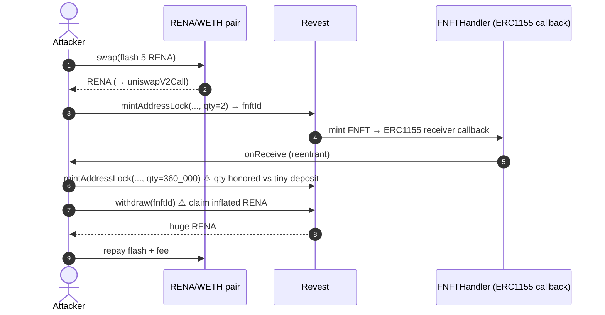
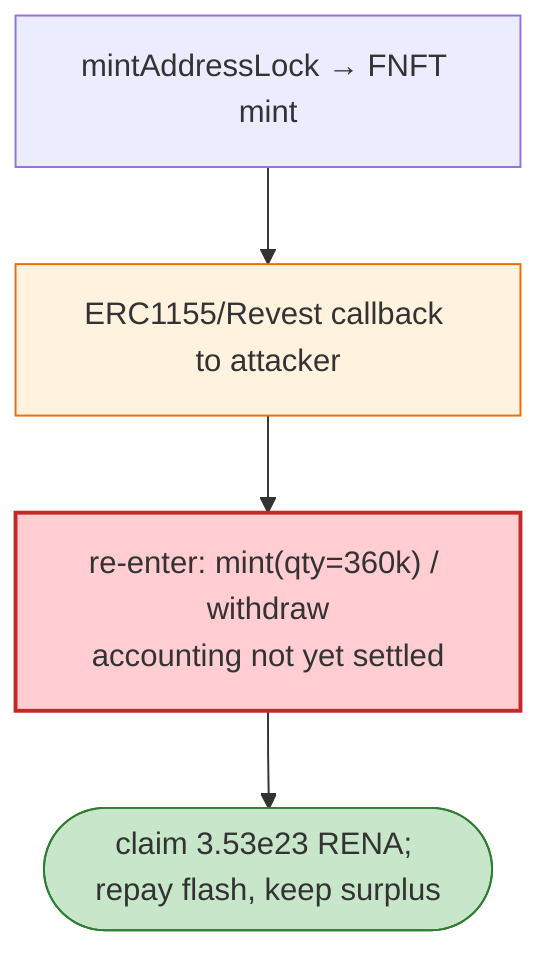

# Revest Finance Exploit — Reentrancy in FNFT `mintAddressLock`/`withdraw`

> **Vulnerability classes:** vuln/reentrancy/cross-function

> **Reproduction:** the PoC compiles & runs in an isolated Foundry project at
> [this project folder](.). Full verbose trace: [output.txt](output.txt).
> Verified vulnerable source: [Revest](sources/Revest_2320A2),
> [FNFTHandler](sources/FNFTHandler_e952bd), [Rena](sources/Rena_56de8B).

---

## Key info

| | |
|---|---|
| **Loss** | The PoC extracts 352,835,865,880,437,990,126,099 RENA (~$2M at the time) |
| **Vulnerable contract** | `Revest` — `0x2320A28f52334d62622cc2EaFa15DE55F9987eD9`; `FNFTHandler` — `0xe952bd…` |
| **Flash source** | RENA/WETH Uniswap V2 pair — `0xbC2C5392b0B841832bEC8b9C30747BADdA7b70ca` |
| **Chain / block / date** | Ethereum mainnet / 14,465,356 / Mar 2022 |
| **Bug class** | Reentrancy — Revest's FNFT mint/withdraw path triggers a token callback (`onFNFT`/ERC1155 receiver) on the lock-creator contract before balances settle, letting the attacker re-enter and claim duplicated FNFT value. |

---

## TL;DR

Revest lets you lock tokens inside an ERC-1155 "FNFT" with an address-lock condition. The mint and
withdraw flows call back into the lock-creator/recipient contract (via the ERC-1155 receiver hook and
Revest's own callback). The state (which FNFTs exist, their deposit amounts, quantities) was updated
**after** those callbacks, so the attacker's callback could `withdraw`/re-mint while the system still
held a stale view of the locks.

Attack shape:

1. Flash-borrow 5 RENA from the pair (`pair.swap(5e18, 0, …)`).
2. In `uniswapV2Call`: approve Revest, then **mint two address-lock FNFTs**: one with `quantity=2`
   (`mintAddressLock` → `fnftId`), and a second with `quantity=360_000`. The reentrant callback
   manipulates the FNFT accounting so the 360,000-quantity lock is honoured against the tiny 5-RENA
   deposit.
3. Withdraw the FNFTs → receive a huge RENA payout.
4. Repay the flash (5 RENA + fee) and keep the surplus: `352,835,865,880,437,990,126,099` RENA.

The enormous quantity (360,000) on a 5-RENA deposit is the smoking gun: the reentrant mint inflated the
claimable amount before Revest settled the deposit.

---

## Root cause

A **CEI violation + missing reentrancy guard** in the FNFT mint/withdraw flow, combined with an
ERC-1155/Revest callback that hands control to an attacker-controlled contract mid-operation. The FNFT
quantity/deposit accounting was applied after the external callback, so a nested `mintAddressLock` /
`withdraw` saw inconsistent state and inflated the attacker's claim.

---

## Preconditions

- Flash-borrowable RENA (the Uniswap pair).
- A lock-creator contract that implements the Revest/ERC-1155 receiver callback to re-enter.

---

## Diagrams





---

## Remediation

1. **`nonReentrant`** on `mintAddressLock`, `withdrawAddressLock`, and all FNFT-mint/burn entry points.
2. **CEI**: record the FNFT quantity/deposit and update `FNFTHandler` state **before** any external
   callback (mint → receiver hook).
3. **Validate deposit vs quantity**: a FNFT with quantity `q` must be backed by `q × depositAmount`;
   reject mismatches.
4. **Callbacks must be untrusted**: do not allow state-changing re-entry during a mint/withdraw.

---

## How to reproduce

```bash
_shared/run_poc.sh 2022-03-Revest_exp --mt testExploit -vvvvv
```

- RPC: mainnet archive (block 14,465,356). Infura mainnet in `foundry.toml`.
- Result: `[PASS]` — `After exploit, Rena balance of attacker: 352835865880437990126099`.

---

*Reference: Revest Finance FNFT reentrancy, Mar 2022 (~$2M).*
