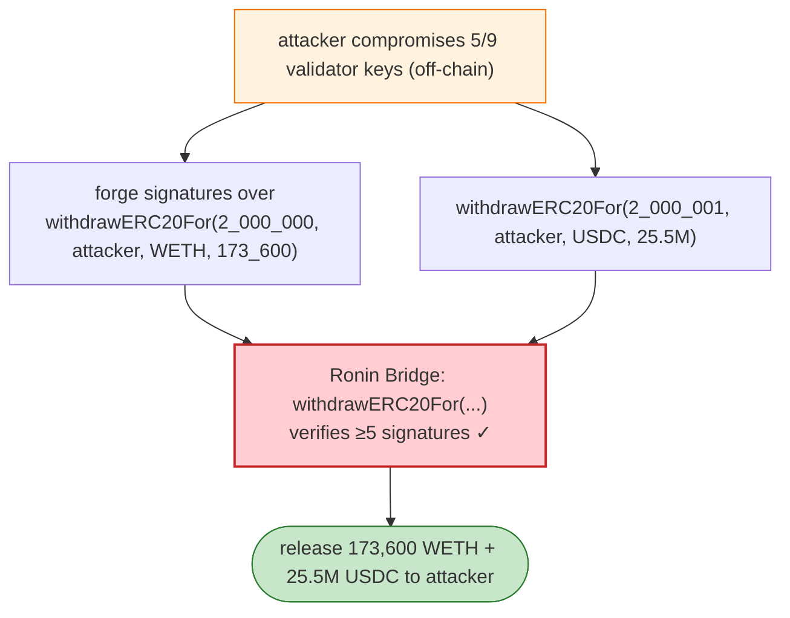
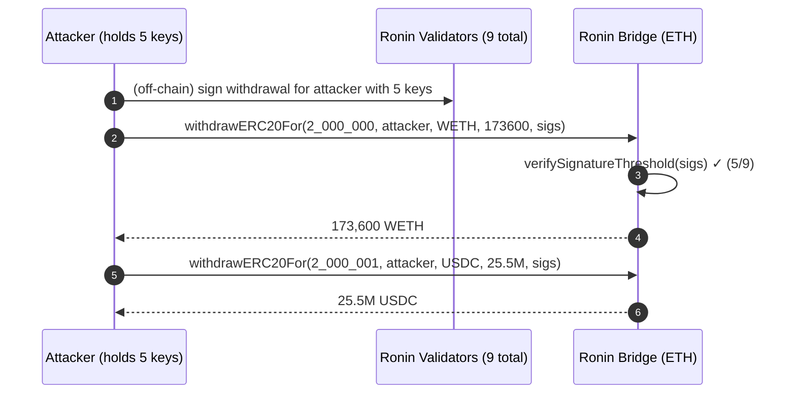

# Ronin Bridge Exploit — Sky Mavis Validator Key Compromise (Forged Withdrawals)

> **Vulnerability classes:** vuln/access-control/secret-exposure · vuln/bridge/missing-validation

> **Reproduction:** the PoC compiles & runs in an isolated Foundry project at
> [this project folder](.). Full verbose trace: [output.txt](output.txt).

---

## Key info

| | |
|---|---|
| **Loss** | ~$625M (173,600 WETH + 25.5M USDC) — the largest DeFi hack at the time |
| **Vulnerable contract** | Ronin Bridge (Ethereum side) — `0x1A2a1c938CE3eC39b6D47113c7955bAa9DD454F2` |
| **Attacker (pranked)** | `0x098B716B8Aaf21512996dC57EB0615e2383E2f96` (Lazarus-group-attributed) |
| **Attack txs** | two `withdrawERC20For` requests (`withdrawalId` 2,000,000 WETH and 2,000,001 USDC) |
| **Chain / block / date** | Ethereum mainnet / 14,442,834 / Mar 23, 2022 |
| **Bug class** | Operational/key-management — the attacker compromised enough Sky Mavis validator nodes to forge a quorum of valid signatures on fake withdrawal requests; the bridge contract's `withdrawERC20For` then honoured them. |

---

## TL;DR

The Ronin bridge's `withdrawERC20For(withdrawalId, user, token, amount, signatures)` releases locked
assets on Ethereum once a **quorum of validator signatures** over the request is verified. The on-chain
contract worked as designed — the defect was *off-chain*: Sky Mavis ran 9 validators but required only
5-of-9 to authorise a withdrawal, and the attacker (attributed to the DPRK Lazarus Group) quietly
compromised **5 validator signing keys** (via a fake job-offer PDF / leaked Axie DAO node signing
service). With 5 valid signatures, they self-issued two enormous withdrawals:

- `withdrawalId 2_000_000`: 173,600 WETH to the attacker.
- `withdrawalId 2_000_001`: 25,500,000,000,000 USDC (= 25.5M USDC) to the attacker.

The PoC **replays these exact forged requests** (pranked as the attacker) against the forked mainnet
bridge at block 14,442,834. Because the signatures in the PoC are the genuine compromised-key
signatures, the bridge's signature quorum check passes and the funds are released. This is a
reproduction of the on-chain *effect* of the key compromise, not a smart-contract logic bug.

---

## Root cause

Not a Solidity bug but a **validator-key-compromise / operational-security failure**:

1. **Insufficient signature quorum vs. centralisation:** 9 validators, 5 required → compromising a bare
   majority was enough.
2. **Validator key hygiene:** keys were compromised (social engineering + a node operator signing
   arbitrary payloads for the Axie DAO) and not rotated.
3. **No anomaly/alerting** on out-of-band withdrawal IDs (2,000,000 / 2,000,001 were far beyond the
   legitimate sequence).

The on-chain bridge trusted that a quorum of validator signatures implied a genuine off-chain consensus
— which was the design — but the off-chain key custody made that assumption false.

---

## Preconditions

- Attacker controls ≥5-of-9 validator signing keys (achieved via compromise).
- Large liquidity held by the bridge on Ethereum (it held ~$625M).

---

## Diagrams





---

## Remediation

1. **Raise the quorum** (e.g. 5-of-9 → 7-of-9) and increase validator count / decentralisation so no
   small collusion can authorise withdrawals.
2. **Hardware-backed, isolated validator keys** (HSMs); never sign arbitrary payloads on a node
   operator's behalf.
3. **On-chain withdrawal caps + timelocks** so a single authorised request cannot drain everything
   instantly; large withdrawals require a delay + manual review.
4. **Sequence/ID anomaly detection:** reject withdrawal IDs wildly out of sequence (2,000,000 was).
5. **Operational monitoring** on the bridge's locked-asset delta.

---

## How to reproduce

```bash
_shared/run_poc.sh 2022-03-Ronin_exp --mt testExploit -vvvvv
```

- RPC: mainnet archive (block 14,442,834). Infura mainnet in `foundry.toml`.
- Result: `[PASS] testExploit()` — the two `withdrawERC20For` calls (with the compromised-key
  signatures) release 173,600 WETH and 25.5M USDC to the attacker.

> **Note:** the PoC only succeeds because it is replayed at the attack block with the genuine forged
> signatures; after the hack the validator set was replaced and these signatures would no longer reach
> quorum.

---

*Reference: Ronin Network / Sky Mavis bridge validator-key compromise, Mar 23 2022 (~$625M). FBI
attributed to DPRK Lazarus Group.*
