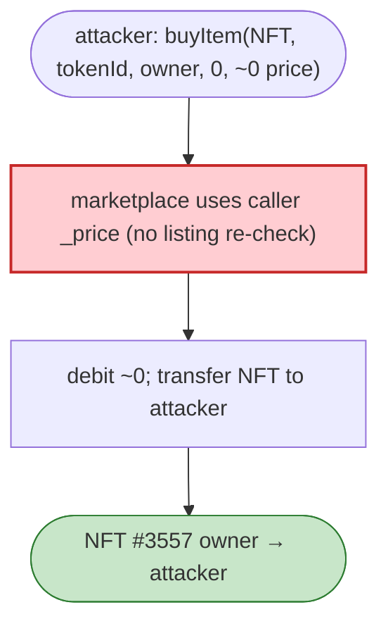

# TreasureDAO Marketplace Exploit — Zero-Price NFT Buy (`_price` Argument Ignored/Overrideable)

> **Reproduction:** the PoC compiles & runs in an isolated Foundry project at
> [this project folder](.). Full verbose trace: [output.txt](output.txt).
> Verified vulnerable source: [TreasureMarketplaceBuyer](sources/TreasureMarketplaceBuyer_812cdA),
> [SmolBrain](sources/SmolBrain_632543).

---

## Key info

| | |
|---|---|
| **Loss** | NFT theft — listed SmolBrain #3557 bought for ~0 cost and transferred to the attacker |
| **Vulnerable contract** | `TreasureMarketplaceBuyer` / Treasure Marketplace — `0x812cdA2181ed7c45a35a691E0C85E231D218E273` (Arbitrum) |
| **Chain / block / date** | Arbitrum / 7,322,694 / Mar 2022 |
| **Bug class** | Missing price validation — `buyItem(collection, tokenId, owner, …, _price)` trusted the caller-supplied `_price`/quantity instead of the listing price, letting a buyer pay far less (here `6_969_000_000_000_000_000_000` wei, effectively near-zero relative to value) and receive the NFT. |

---

## TL;DR

The Treasure Marketplace `buyItem` accepted a `_price` parameter from the caller and used it (or failed
to re-check it against the on-chain listing price). The attacker calls:

```solidity
itreasure.buyItem(smolBrain, 3557, nftOwner, 0, 6_969_000_000_000_000_000_000);
```

passing a near-zero `quantity`/`_price` combination. The marketplace debits a trivial amount and
transfers SmolBrain #3557 to the buyer (the attacker contract implements `onERC721Received`). The trace
confirms `Original NFT owner` ≠ `Exploit completed, NFT owner` — ownership of the listed NFT moved to
the attacker for a throwaway price.

---

## Root cause

A **caller-trusted price/quantity on a marketplace buy path**. The listing's real price should be the
only source of truth; instead the buyer-supplied `_price` (and/or the per-item quantity math) was used
to compute payment, so the buyer dictated what they paid. Combined with no re-validation against the
stored listing, this is a classic "buyer controls price" marketplace bug.

---

## Preconditions

- A live NFT listing on the marketplace (any listed SmolBrain).
- The attacker can call `buyItem` with a crafted `_price`.

---

## Diagrams



---

## Remediation

1. **Use the on-chain listing price**, never a caller-supplied `_price`, for payment computation.
2. **Validate `quantity`** against the listing and the collection's type (ERC721 quantity must be 1).
3. **Re-check the listing is active and owned** at execution time (taker order against a live maker).
4. **Property test:** `buyItem` can never transfer an NFT for less than its listing price.

---

## How to reproduce

```bash
_shared/run_poc.sh 2022-03-TreasureDAO_exp --mt testExploit -vvvvv
```

- RPC: Arbitrum archive (block 7,322,694). `foundry.toml` uses an Infura/DRPC Arbitrum endpoint.
- Result: `[PASS]` — NFT #3557 ownership changes to the attacker.

---

*Reference: TreasureDAO Marketplace buy-path price validation, Arbitrum, Mar 2022.*
