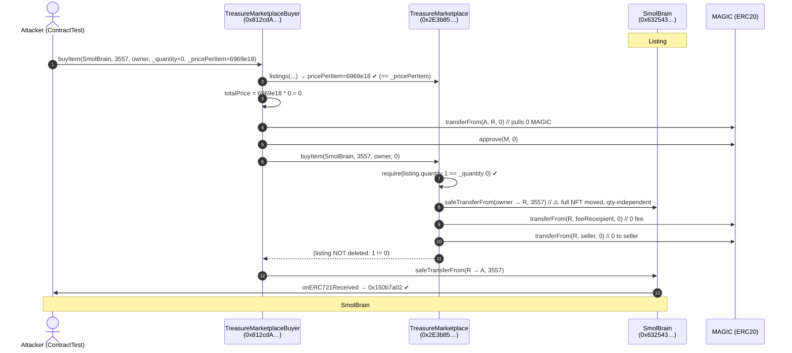
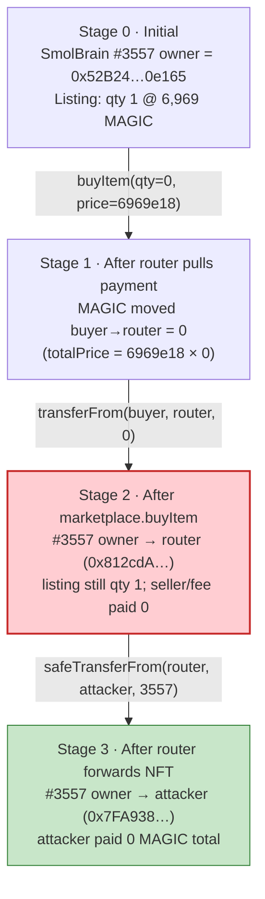
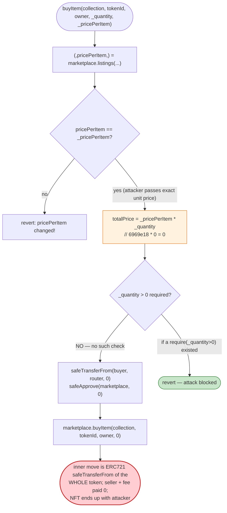

# TreasureDAO Marketplace Exploit — Zero-Quantity Buy Drains Listed NFTs for Free (`_pricePerItem * _quantity` with `_quantity = 0`)

> **Vulnerability classes:** vuln/logic/missing-check · vuln/input-validation/missing

> **Reproduction:** the PoC compiles & runs in an isolated Foundry project at
> [this project folder](.). Full verbose trace: [output.txt](output.txt).
> Verified vulnerable source:
> [TreasureMarketplaceBuyer](sources/TreasureMarketplaceBuyer_812cdA/contracts_TreasureMarketplaceBuyer.sol)
> and the marketplace it wraps,
> [TreasureMarketplace](sources/TreasureMarketplaceBuyer_812cdA/contracts_TreasureMarketplace.sol).

---

## Key info

| | |
|---|---|
| **Loss** | NFT theft — listed **SmolBrain #3557** bought for **0 MAGIC** (the buyer router pulled `pricePerItem * quantity = 6969 MAGIC * 0 = 0` payment) and transferred to the caller. The PoC reproduces the single-call theft of one token; the underlying bug lets an attacker sweep every listed ERC721 in the marketplace for free, one `buyItem` call each. |
| **Vulnerable contract** | `TreasureMarketplaceBuyer` (the public buy router) — [`0x812cdA2181ed7c45a35a691E0C85E231D218E273`](https://arbiscan.io/address/0x812cdA2181ed7c45a35a691E0C85E231D218E273#code), wrapping `TreasureMarketplace` at [`0x2E3b85F85628301a0Bce300Dee3A6B04195A15Ee`](https://arbiscan.io/address/0x2E3b85F85628301a0Bce300Dee3A6B04195A15Ee#code) (Arbitrum) |
| **Victim pool / listing** | SmolBrain collection ([`0x6325439389E0797Ab35752B4F43a14C004f22A9c`](https://arbiscan.io/address/0x6325439389E0797Ab35752B4F43a14C004f22A9c)), token #3557, listed by `0x52B24BecaE3fa1036cA0e956cd987D48A8f0e165` at **6,969 MAGIC** ([output.txt:21](output.txt)) |
| **Attacker (in PoC)** | The `ContractTest` itself at `0x7FA9385bE102ac3EAc297483Dd6233D62b3e1496` (it implements `onERC721Received` so it can receive the stolen NFT) — [output.txt:7](output.txt), [output.txt:137](output.txt). The live-attack EOA / contract / tx hash are **not recorded in the PoC header or trace** (this is a minimal DeFiHackLabs reproduction), so they are omitted rather than guessed. |
| **Chain / block / date** | Arbitrum / block **7,322,694** / March 2022 ([output.txt:11](output.txt)) |
| **Compiler / optimizer** | Solidity **v0.8.7** (`v0.8.7+commit.e28d00a7`), optimizer **enabled**, **200 runs** (both `_meta.json`) |
| **Payment token** | MAGIC — [`0x539bDe0d7Dbd336b79148AA742883198BBF60342`](https://arbiscan.io/address/0x539bDe0d7Dbd336b79148AA742883198BBF60342) ([output.txt:23](output.txt), [output.txt:33](output.txt)) |
| **Bug class** | Marketplace buy path: caller-controlled `_quantity` multiplied into the payment (`totalPrice = _pricePerItem * _quantity`), with **no `_quantity > 0` floor**, while the inner marketplace moves a full ERC721 token regardless of `_quantity`. Passing `_quantity = 0` yields zero payment but a valid sale. |

---

## TL;DR

The TreasureDAO marketplace is split across two contracts: an inner `TreasureMarketplace` (`0x2E3b85F8…`) that holds listings and actually moves NFTs, and a public, user-facing router `TreasureMarketplaceBuyer` (`0x812cdA…`) that does the payment math and then calls into the marketplace. The router's `buyItem` takes five arguments: `(collection, tokenId, owner, _quantity, _pricePerItem)`.

1. The router validates the price correctly: it reads the listing from the marketplace and requires the caller-supplied `_pricePerItem` to equal the stored `pricePerItem` ([TreasureMarketplaceBuyer.sol:33-35](sources/TreasureMarketplaceBuyer_812cdA/contracts_TreasureMarketplaceBuyer.sol#L33-L35)). So the attacker cannot lie about the unit price.
2. It then computes payment as **`totalPrice = _pricePerItem * _quantity`** ([TreasureMarketplaceBuyer.sol:37](sources/TreasureMarketplaceBuyer_812cdA/contracts_TreasureMarketplaceBuyer.sol#L37)) and pulls `totalPrice` MAGIC from the caller. There is **no check that `_quantity > 0`**.
3. The attacker passes `_quantity = 0` and `_pricePerItem = 6_969_000_000_000_000_000_000` (exactly the listed unit price, 6,969 MAGIC). `totalPrice = 6969e18 * 0 = 0`. The router pulls **0 MAGIC** from the caller ([output.txt:24](output.txt)).
4. The router then calls `marketplace.buyItem(collection, tokenId, owner, _quantity=0)` ([TreasureMarketplaceBuyer.sol:41](sources/TreasureMarketplaceBuyer_812cdA/contracts_TreasureMarketplaceBuyer.sol#L41)). The inner marketplace only requires `listedItem.quantity >= _quantity` — `1 >= 0` passes ([TreasureMarketplace.sol:240](sources/TreasureMarketplaceBuyer_812cdA/contracts_TreasureMarketplace.sol#L240)) — and then **unconditionally `safeTransferFrom`s the full ERC721 token to the buyer** ([TreasureMarketplace.sol:243-244](sources/TreasureMarketplaceBuyer_812cdA/contracts_TreasureMarketplace.sol#L243-L244)). The NFT moves even though zero was bought.
5. Because `listedItem.quantity (1) != _quantity (0)`, the listing is **not** deleted ([TreasureMarketplace.sol:249-253](sources/TreasureMarketplaceBuyer_812cdA/contracts_TreasureMarketplace.sol#L249-L253)) and the inner `_buyItem` transfers `0 * fee` and `0 - 0` to the fee recipient and seller ([TreasureMarketplace.sol:265](sources/TreasureMarketplaceBuyer_812cdA/contracts_TreasureMarketplace.sol#L265), [output.txt:85-100](output.txt)).
6. The router forwards the NFT from itself to the attacker ([TreasureMarketplaceBuyer.sol:43-44](sources/TreasureMarketplaceBuyer_812cdA/contracts_TreasureMarketplaceBuyer.sol#L43-L44)). The PoC confirms ownership of SmolBrain #3557 moves from the original owner to the attacker for **0 MAGIC paid**.

Net result: **1 SmolBrain NFT stolen per call at zero cost.** The bug is fully general — any listed ERC721 (and, by the same `_quantity` math, listed ERC1155s at sub-listing quantities) can be drained the same way.

---

## Background — what TreasureDAO's marketplace does

`TreasureMarketplace` ([source](sources/TreasureMarketplaceBuyer_812cdA/contracts_TreasureMarketplace.sol)) is an orderbook-style NFT marketplace on Arbitrum. A seller approves the marketplace and calls `createListing(collection, tokenId, quantity, pricePerItem, expirationTime)`, which stores a `Listing { quantity, pricePerItem, expirationTime }` keyed by `(collection, tokenId, owner)` ([:27-34](sources/TreasureMarketplaceBuyer_812cdA/contracts_TreasureMarketplace.sol#L27-L34), [:148-152](sources/TreasureMarketplaceBuyer_812cdA/contracts_TreasureMarketplace.sol#L148-L152)). A buyer then calls `buyItem(collection, tokenId, owner, quantity)` and the marketplace pulls `pricePerItem * quantity` of the configured ERC20 `paymentToken` from the buyer, routes the fee portion to `feeReceipient` and the rest to the seller, and moves the NFT(s).

`TreasureMarketplaceBuyer` ([source](sources/TreasureMarketplaceBuyer_812cdA/contracts_TreasureMarketplaceBuyer.sol)) is a thin wrapper that users actually call. It exists so a buyer can pass the expected unit price as an argument, have it re-checked against the on-chain listing (a slippage guard against the seller front-running by raising the price), and not have to pre-approve the marketplace directly — the router takes payment, approves the marketplace, calls `marketplace.buyItem`, then forwards the NFT to the caller ([:26-48](sources/TreasureMarketplaceBuyer_812cdA/contracts_TreasureMarketplaceBuyer.sol#L26-L48)). It inherits `ERC721Holder`/`ERC1155Holder` so it can receive NFTs in between ([:14](sources/TreasureMarketplaceBuyer_812cdA/contracts_TreasureMarketplaceBuyer.sol#L14)).

On-chain parameters at the fork block (read from the trace):

| Parameter | Value | Source |
|---|---|---|
| `paymentToken` (MAGIC) | `0x539bDe0d7Dbd336b79148AA742883198BBF60342` | [output.txt:23](output.txt) |
| Listing `quantity` for SmolBrain #3557 | **1** (ERC721, single token) | [output.txt:21](output.txt) |
| Listing `pricePerItem` | `6_969_000_000_000_000_000_000` wei = **6,969 MAGIC** | [output.txt:21](output.txt) |
| Listing `expirationTime` | `1_644_557_827_884` (far future at the fork) | [output.txt:21](output.txt) |
| Original owner / seller of #3557 | `0x52B24BecaE3fa1036cA0e956cd987D48A8f0e165` | [output.txt:6](output.txt), [output.txt:18](output.txt) |
| `feeReceipient` (fee sink) | `0xDb6Ab450178bAbCf0e467c1F3B436050d907E233` | [output.txt:85](output.txt) |
| SmolBrain supports ERC721 (`0x80ac58cd`) | `true` | [output.txt:43](output.txt), [output.txt:103](output.txt) |

MAGIC is an 18-decimal token, so `6_969e18` reads as `6969.0 MAGIC` — matching the `[6.969e21]` annotation Foundry prints next to the `buyItem` argument at [output.txt:19](output.txt).

---

## The vulnerable code

### 1. The router computes payment as `_pricePerItem * _quantity` with no zero-floor

```solidity
function buyItem(
    address _nftAddress,
    uint256 _tokenId,
    address _owner,
    uint256 _quantity,
    uint256 _pricePerItem
) external {
    (, uint256 pricePerItem,) = marketplace.listings(_nftAddress, _tokenId, _owner);

    require(pricePerItem == _pricePerItem, "pricePerItem changed!");

    uint256 totalPrice = _pricePerItem * _quantity;
    IERC20(marketplace.paymentToken()).safeTransferFrom(msg.sender, address(this), totalPrice);
    IERC20(marketplace.paymentToken()).safeApprove(address(marketplace), totalPrice);

    marketplace.buyItem(_nftAddress, _tokenId, _owner, _quantity);

    if (IERC165(_nftAddress).supportsInterface(INTERFACE_ID_ERC721)) {
        IERC721(_nftAddress).safeTransferFrom(address(this), msg.sender, _tokenId);
    } else {
        IERC1155(_nftAddress).safeTransferFrom(address(this), msg.sender, _tokenId, _quantity, bytes(""));
    }
}
```
([contracts_TreasureMarketplaceBuyer.sol:26-48](sources/TreasureMarketplaceBuyer_812cdA/contracts_TreasureMarketplaceBuyer.sol#L26-L48))

The price *re-check* is sound (L33-35) — the caller cannot under-report the unit price. The fatal gap is on L37: `totalPrice = _pricePerItem * _quantity` is allowed to be **0** because `_quantity` is never required to be `> 0`. With `_quantity = 0`, the router pulls 0 MAGIC (verified in the trace: the payment `transferFrom` carries amount `0`, [output.txt:24](output.txt)) but still proceeds to call `marketplace.buyItem` and then forwards the NFT to `msg.sender`.

### 2. The inner marketplace moves the full ERC721 token regardless of `_quantity`

```solidity
function buyItem(
    address _nftAddress,
    uint256 _tokenId,
    address _owner,
    uint256 _quantity
)
    external
    nonReentrant
    isListed(_nftAddress, _tokenId, _owner)
    validListing(_nftAddress, _tokenId, _owner)
{
    require(_msgSender() != _owner, "Cannot buy your own item");

    Listing memory listedItem = listings[_nftAddress][_tokenId][_owner];
    require(listedItem.quantity >= _quantity, "not enough quantity");

    // Transfer NFT to buyer
    if (IERC165(_nftAddress).supportsInterface(INTERFACE_ID_ERC721)) {
        IERC721(_nftAddress).safeTransferFrom(_owner, _msgSender(), _tokenId);
    } else {
        IERC1155(_nftAddress).safeTransferFrom(_owner, _msgSender(), _tokenId, _quantity, bytes(""));
    }
    ...
}
```
([contracts_TreasureMarketplace.sol:226-247](sources/TreasureMarketplaceBuyer_812cdA/contracts_TreasureMarketplace.sol#L226-L247))

For an ERC721, the transfer is `safeTransferFrom(_owner, _msgSender(), _tokenId)` — a whole token, **`_quantity`-independent**. The only quantity gate is `require(listedItem.quantity >= _quantity)` (L240), which `1 >= 0` trivially satisfies. So a `_quantity = 0` buy still hands the entire NFT to the buyer. (For ERC1155 the bug is subtler — `_quantity` *is* used — but a caller can still buy fewer items than the unit price implies; the ERC721 path shown here is the clean, zero-payment case.)

### 3. Payment to seller and fee sink is `0`, and the listing is left intact

```solidity
    if (listedItem.quantity == _quantity) {
        delete (listings[_nftAddress][_tokenId][_owner]);
    } else {
        listings[_nftAddress][_tokenId][_owner].quantity -= _quantity;
    }

    emit ItemSold(_owner, _msgSender(), _nftAddress, _tokenId, _quantity, listedItem.pricePerItem);

    TreasureNFTOracle(oracle).reportSale(_nftAddress, _tokenId, paymentToken, listedItem.pricePerItem);
    _buyItem(listedItem.pricePerItem, _quantity, _owner);
}
```
([contracts_TreasureMarketplace.sol:249-266](sources/TreasureMarketplaceBuyer_812cdA/contracts_TreasureMarketplace.sol#L249-L266))

```solidity
function _buyItem(uint256 _pricePerItem, uint256 _quantity, address _owner) internal {
    uint256 totalPrice = _pricePerItem * _quantity;        // 6969e18 * 0 = 0
    uint256 feeAmount = totalPrice * fee / BASIS_POINTS;   // 0
    IERC20(paymentToken).safeTransferFrom(_msgSender(), feeReceipient, feeAmount);          // 0
    IERC20(paymentToken).safeTransferFrom(_msgSender(), _owner, totalPrice - feeAmount);     // 0
}
```
([contracts_TreasureMarketplace.sol:268-277](sources/TreasureMarketplaceBuyer_812cdA/contracts_TreasureMarketplace.sol#L268-L277))

Two extra consequences visible in the trace: (a) the `ItemSold` event is emitted with `quantity = 0` but `pricePerItem = 6.969e21` ([output.txt:78](output.txt)), and the oracle's `reportSale` still records the *full* 6,969 MAGIC sale price ([output.txt:79-80](output.txt)) — so the price oracle is poisoned with a fake high sale even though nothing was paid; (b) because `listedItem.quantity (1) != _quantity (0)`, the `else` branch runs (`quantity -= 0`) and the listing is **not** cleared — though the NFT is already gone, so any re-buy of the same `(collection, tokenId, owner)` would later fail the `validListing` ownership check.

---

## Root cause — why it was possible

The router re-validated the **unit price** but never validated the **quantity**. Quantity was trusted to be `> 0` and to match the item being bought, yet nothing enforced either property. Because the ERC721 transfer inside `TreasureMarketplace.buyItem` is keyed on `_tokenId` alone (an ERC721 token is atomic — there is no "buy half a token"), the marketplace cannot actually honour an arbitrary `_quantity` for ERC721s; it just moves the whole token once the `quantity >= _quantity` check passes. The check was written defensively (don't oversell an ERC1155) but its `>=` semantics turn it into a wide-open door when `_quantity = 0`.

Concretely, the four decisions that compose into the bug:

1. **Caller-controlled `_quantity` multiplied into payment.** `totalPrice = _pricePerItem * _quantity` ([TreasureMarketplaceBuyer.sol:37](sources/TreasureMarketplaceBuyer_812cdA/contracts_TreasureMarketplaceBuyer.sol#L37)) trusts a user argument for the amount-due computation. Any multiplication by a caller-controlled factor needs a lower bound.
2. **No `_quantity > 0` floor anywhere.** Neither the router nor the inner marketplace requires a positive quantity. `require(_quantity > 0)` at either layer would have killed this attack instantly.
3. **ERC721 transfer is quantity-independent.** `IERC721.safeTransferFrom(_owner, _msgSender(), _tokenId)` ([TreasureMarketplace.sol:243-244](sources/TreasureMarketplaceBuyer_812cdA/contracts_TreasureMarketplace.sol#L243-L244)) moves a full token; for ERC721 the only valid `_quantity` is `1`, and the contract never enforces that.
4. **Defensive `quantity >= _quantity` check uses `>=`, not `==`.** `1 >= 0` passes. Had it required `listedItem.quantity == _quantity` for ERC721 (where the only sensible quantity is 1), the zero-quantity buy would have reverted.

The unit-price slippage guard (`pricePerItem == _pricePerItem`) gave a false sense of security: it closes the "lie about the price" attack but is orthogonal to the "lie about the quantity" attack that actually fires.

---

## Preconditions

- A **live, unexpired ERC721 listing** on the marketplace (any whitelisted collection; here SmolBrain #3557). The trace confirms `quantity = 1`, `expirationTime` far in the future, and the seller still owning the token ([output.txt:21](output.txt), [output.txt:44-45](output.txt)).
- The attacker (or a contract they call through) can receive ERC721 tokens — i.e. implements `onERC721Received`. The PoC's `ContractTest` does exactly this ([TreasureDAO_exp.sol:26-28](test/TreasureDAO_exp.sol#L26-L28), and the callback return `0x150b7a02` at [output.txt:70](output.txt) / [output.txt:126](output.txt)).
- No ERC20 balance or allowance is required: because `_quantity = 0`, the router's `safeTransferFrom(msg.sender, …, 0)` succeeds even with zero MAGIC balance and no approval. (The MAGIC token is a proxied ERC20; a zero-value `transferFrom` still emits `Transfer`/`Approval` events, visible at [output.txt:28-29](output.txt).)

---

## Attack walkthrough (with on-chain numbers from the trace)

The PoC is a single transaction with one external call. All figures are read directly from [output.txt](output.txt).

| # | Step | NFT #3557 owner | MAGIC paid by buyer | Effect / trace ref |
|---|------|-----------------|--------------------:|--------|
| 0 | **Read original owner** — `SmolBrain.ownerOf(3557)` | `0x52B24BecaE3fa1036cA0e956cd987D48A8f0e165` | — | Seller identified ([output.txt:16-17](output.txt)). |
| 1 | **Call the router** — `TreasureMarketplaceBuyer.buyItem(SmolBrain, 3557, owner, _quantity=0, _pricePerItem=6_969_000_000_000_000_000_000)` | — | — | 5-arg call logged ([output.txt:19](output.txt)); `_pricePerItem` shown as `[6.969e21]` = 6,969 MAGIC. |
| 1a | router reads listing → `pricePerItem = 6_969e18`, checks `== _pricePerItem` ✔ | — | — | Listing struct returned: `quantity=1, pricePerItem=0x0179ca4da0a7d1440000 (=6.969e21), expiration=0x017ee748ff2c` ([output.txt:21](output.txt)). |
| 1b | router computes `totalPrice = 6_969e18 * 0 = 0`, pulls 0 MAGIC from buyer | — | **0** | `transferFrom(buyer, router, 0)` ([output.txt:24](output.txt)); router approves marketplace for 0 ([output.txt:34](output.txt)). |
| 2 | **Inner `marketplace.buyItem(SmolBrain, 3557, owner, 0)`** — moves the full ERC721 token | `0x52B24…0e165 → 0x812cdA…8E273` (the router) | 0 | `safeTransferFrom(owner, router, 3557)`; `Transfer` event + ownership storage slot change ([output.txt:67-77](output.txt)). Listing *not* deleted (`1 != 0`). |
| 2a | inner `_buyItem(6969e18, 0, owner)` pays seller + fee sink | — | **0** to feeReceipient, **0** to seller | `transferFrom(router, 0xDb6A…E233, 0)` ([output.txt:85-92](output.txt)); `transferFrom(router, owner, 0)` ([output.txt:93-100](output.txt)). |
| 2b | `ItemSold(seller, router, SmolBrain, 3557, quantity=0, pricePerItem=6.969e21)` emitted; oracle `reportSale` records a fake 6,969 MAGIC sale | — | — | Events ([output.txt:78](output.txt), [output.txt:79-80](output.txt)). |
| 3 | **Router forwards the NFT to the attacker** — `safeTransferFrom(router, buyer, 3557)` | `0x812cdA…8E273 → 0x7FA938…1496` (attacker/`ContractTest`) | — | `Transfer` event + ownership storage change ([output.txt:123-133](output.txt)); `onERC721Received` returns `0x150b7a02` ([output.txt:125-126](output.txt)). |
| 4 | **Confirm** — `SmolBrain.ownerOf(3557)` now returns the attacker | `0x7FA9385bE102ac3EAc297483Dd6233D62b3e1496` | — | ([output.txt:135-136](output.txt)); log line ([output.txt:137](output.txt)). |

**Net:** ownership of SmolBrain #3557 moves from the legitimate seller `0x52B24BecaE3fa1036cA0e956cd987D48A8f0e165` to the attacker `0x7FA9385bE102ac3EAc297483Dd6233D62b3e1496` ([output.txt:6-7](output.txt)) for **0 MAGIC** in payment. The same call pattern works against every other listed ERC721 in the marketplace.

### Profit / loss accounting (MAGIC + NFT)

| Direction | Amount |
|---|---:|
| MAGIC paid by attacker (principal) | **0** |
| MAGIC paid to seller | **0** |
| MAGIC paid to `feeReceipient` | **0** |
| **SmolBrain #3557 received** | **1 NFT** (fair listing value: 6,969 MAGIC) |

The "profit" is a stolen NFT rather than a fungible-token gain, so there is no PoC-asserted wei profit line. The economic extract is one SmolBrain valued at its own listing price of **6,969 MAGIC** ([output.txt:21](output.txt)), obtained for nothing. In the live incident the same primitive was used to sweep many listings.

---

## Diagrams

### Sequence of the attack



### Listing / NFT-ownership state evolution



### The flaw inside `TreasureMarketplaceBuyer.buyItem`



---

## Why each magic number

- **`tokenId = 3557`** — an arbitrary listed SmolBrain. The bug is independent of the token id; #3557 is simply the one the PoC picks. Its listing is confirmed at [output.txt:21](output.txt).
- **`_quantity = 0`** — the exploit value. Setting quantity to zero makes `totalPrice = pricePerItem * 0 = 0` while still passing `listing.quantity (1) >= 0`. This is the entire attack.
- **`_pricePerItem = 6_969_000_000_000_000_000_000` (= 6,969 × 1e18)** — exactly the listing's stored `pricePerItem` ([output.txt:21](output.txt)), so the `require(pricePerItem == _pricePerItem)` slippage check passes. It is **not** the amount paid; the amount paid is `_pricePerItem * _quantity = 0`. The PoC must pass the real unit price (not a smaller number) precisely because the router *does* validate the unit price — the attacker lies about quantity, not price.

---

## Remediation

1. **Require `_quantity > 0` in both contracts.** Add `require(_quantity > 0, "zero quantity")` at the top of `TreasureMarketplaceBuyer.buyItem` *and* `TreasureMarketplace.buyItem`. This alone closes the zero-payment path.
2. **For ERC721, require `_quantity == 1` (and `listing.quantity == 1`).** An ERC721 "item" is atomic; any other quantity is meaningless and is the root ambiguity the attacker exploited. In `TreasureMarketplace.buyItem`, when the collection is ERC721, revert unless `_quantity == 1`.
3. **Make the payment amount authoritative, not a derived product.** The marketplace — not the router — should compute and pull `listing.pricePerItem * _quantity` from the buyer (the inner `_buyItem` already does this, but the router pre-pulls its own separately computed amount and the inner contract trusts `_msgSender()`'s allowance). Centralize the transfer in one place, against the stored listing.
4. **Delete the listing on any successful ERC721 sale.** The `listedItem.quantity == _quantity` branch that skips deletion ([:249-253](sources/TreasureMarketplaceBuyer_812cdA/contracts_TreasureMarketplace.sol#L249-L253)) is correct for ERC1155 partial fills but must not leave a sold ERC721 re-listed. Treat ERC721 sales as always consuming the whole listing.
5. **Sanity-check the `ItemSold` / `reportSale` data.** `reportSale` recorded a 6,969 MAGIC "sale" for a transaction that moved 0 MAGIC ([output.txt:79-80](output.txt)), poisoning the price oracle. Do not report a sale whose paid amount (not the nominal `pricePerItem`) is zero.
6. **Add a property test:** for any listing and any `_quantity`, `buyItem` must transfer at least `listing.pricePerItem * _quantity` of payment, and an ERC721 must only ever move when `_quantity == 1`.

---

## How to reproduce

```bash
_shared/run_poc.sh 2022-03-TreasureDAO_exp --mt testExploit -vvvvv
```

- The fork is served **offline** from the shared harness: `setUp` calls `createSelectFork("http://127.0.0.1:8547", 7_322_694)` ([TreasureDAO_exp.sol:14-16](test/TreasureDAO_exp.sol#L14-L16)), i.e. a local anvil instance replaying Arbitrum state at block **7,322,694** from `anvil_state.json`. There is no public RPC endpoint in `foundry.toml`; do not supply one.
- `foundry.toml` sets `evm_version = "cancun"` (the PoC itself is `pragma 0.8.10`, the verified on-chain sources are `0.8.7`).
- The detected test function is **`testExploit`** ([TreasureDAO_exp.sol:18](test/TreasureDAO_exp.sol#L18)) — that is the `--mt` value above.
- Result: `[PASS]` with NFT ownership flipping from the original owner to the attacker. Expected tail of [output.txt](output.txt):

```
Ran 1 test for test/TreasureDAO_exp.sol:ContractTest
[PASS] testExploit() (gas: 339919)
Logs:
  Original NFT owner of SmolBrain:: 0x52B24BecaE3fa1036cA0e956cd987D48A8f0e165
  Exploit completed, NFT owner of SmolBrain:: 0x7FA9385bE102ac3EAc297483Dd6233D62b3e1496
...
Suite result: ok. 1 passed; 0 failed; 0 skipped; finished in 80.88s (78.84s CPU time)
```

---

*Reference: TreasureDAO / Treasure Marketplace zero-quantity buy bug, Arbitrum, March 2022 — the public buy router `TreasureMarketplaceBuyer` computed payment as `_pricePerItem * _quantity` without a `_quantity > 0` floor, while the inner `TreasureMarketplace` moved full ERC721 tokens independently of `_quantity`, allowing listed NFTs (e.g. SmolBrain #3557, listed at 6,969 MAGIC) to be bought for 0 MAGIC.*
