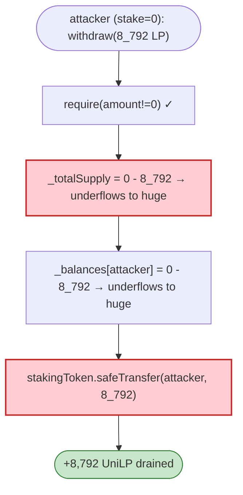

# Umbrella Network RewardPool Exploit — Integer Underflow in `withdraw`

> **Vulnerability classes:** vuln/arithmetic/underflow

> **Reproduction:** the PoC compiles & runs in an isolated Foundry project at
> [this project folder](.). Full verbose trace: [output.txt](output.txt).
> Verified vulnerable source: [StakingRewards](sources/StakingRewards_B3FB1D).

---

## Key info

| | |
|---|---|
| **Loss** | ~$700K (UniLP tokens drained from the Umbrella reward/staking pool) |
| **Vulnerable contract** | `StakingRewards` — [`0xB3FB1D01B07A706736Ca175f827e4F56021b85dE`](https://etherscan.io/address/0xB3FB1D01B07A706736Ca175f827e4F56021b85dE) |
| **Attacker** | `0x1751e3e1aaf1a3e7b973c889b7531f43fc59f7d0` (contract `0x89767960…`) |
| **Attack tx** | `0x33479bcfbc792aa0f8103ab0d7a3784788b5b0e1467c81ffbed1b7682660b4fa` |
| **Chain / block / date** | Ethereum mainnet / 14,421,983 / Mar 2022 |
| **Bug class** | Integer underflow — `_withdraw` computes `_totalSupply - amount` and `_balances[user] - amount` without SafeMath (pre-0.8 / using unchecked math), so withdrawing more than your stake **underflows** to a huge number and the contract sends you the LP tokens. |

---

## TL;DR

The vulnerable code (quoted in the PoC):

```solidity
function _withdraw(uint256 amount, address user, address recipient) internal nonReentrant updateReward(user) {
    require(amount != 0, "Cannot withdraw 0");
    // not using safe math ...
    _totalSupply = _totalSupply - amount;          // ⚠️ underflows if amount > _totalSupply
    _balances[user] = _balances[user] - amount;    // ⚠️ underflows
    IERC20(stakingToken).safeTransfer(recipient, amount);
    ...
}
```

There is **no check that the caller has actually staked `amount`**. The attacker, who staked nothing,
calls `StakingRewards.withdraw(8_792_873_290_680_252_648_282)` (8,792 LP). On a pre-0.8 contract
`0 - amount` wraps to `type(uint256).max - amount + 1`, so the arithmetic "succeeds", and
`safeTransfer(recipient, amount)` hands the attacker 8,792 UniLP tokens straight out of the staking
pool's balance.

`After exploiting, Attacker UniLP Balance: 8792873290680252648282` — the full drain.

---

## Root cause

A **missing-balance-check + unchecked subtraction** (integer underflow) on a withdrawal path. Canonical
`StakingRewards` (Synthetix) checks `require(amount > 0)` and implicitly relies on
`_balances[msg.sender] >= amount` via SafeMath's revert. This fork dropped both the SafeMath and the
balance check, so a withdraw of any `amount` from an un-staked account underflows the accounting and
pays out real stakingToken.

---

## Preconditions

- None beyond the ability to call `withdraw(amount)` with `amount` exceeding your stake. The contract
   must be compiled pre-0.8 (or use unchecked math) so the underflow does not revert.

---

## Diagrams



---

## Remediation

1. **Check `_balances[msg.sender] >= amount`** before subtracting (or use Solidity 0.8+ checked math).
2. **Use OZ SafeMath / `SafeERC20`** consistently; never hand-roll subtraction on balances.
3. **Invariant test:** withdraw must revert if `amount > stake`.
4. **Cap withdrawal to the user's actual staked balance.**

---

## How to reproduce

```bash
_shared/run_poc.sh 2022-03-Umbrella_exp --mt testExploit -vvvvv
```

- RPC: mainnet archive (block 14,421,983). Infura mainnet in `foundry.toml`.
- Result: `[PASS]` — `After exploiting, Attacker UniLP Balance: 8792873290680252648282`.

---

*Reference: Umbrella Network RewardPool integer-underflow withdraw, Mar 2022 (~$700K).*
