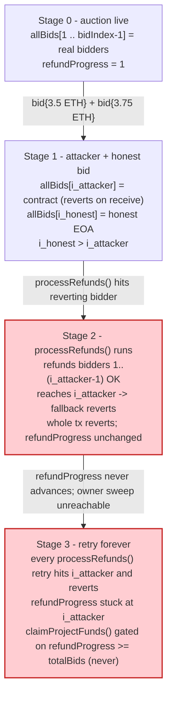
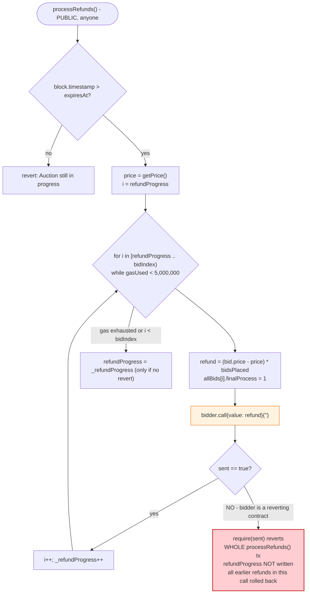
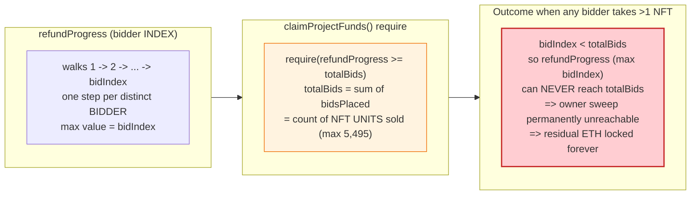

# Aku-Auction (Akutar NFT) Exploit — Push-Payment Refund DoS & Permanently Locked Funds

> **Vulnerability classes:** vuln/dos/frozen-funds · vuln/dos/griefing

> **Reproduction:** the PoC compiles & runs in an isolated Foundry project at
> [this project folder](.). Full verbose trace: [output.txt](output.txt).
> Verified vulnerable source: [AkuAuction.sol](sources/AkuAuction_F42c31/AkuAuction.sol).

---

## Key info

| | |
|---|---|
| **Loss** | Bidder ETH **permanently locked** in the Aku/Akutar auction contract (`AkuAuction.balance`). No ETH was *stolen* — the funds became unrecoverable in-protocol. Contemporary reporting placed the stranded amount in the tens of thousands of ETH; the exact figure is **not** recoverable from this PoC/trace (the PoC only simulates two local bids: 3.5 ETH + 3.75 ETH), so it is not stated here as a verified number. |
| **Vulnerable contract** | `AkuAuction` — [`0xF42c318dbfBaab0EEE040279C6a2588Fa01a961d`](https://etherscan.io/address/0xF42c318dbfBaab0EEE040279C6a2588Fa01a961d#code) |
| **Victim pool / vault** | The auction contract itself (held all bid ETH pending refunds + project-fund withdrawal) |
| **Attacker EOA** | n/a — the attack is permissionless; the PoC simulates it with the test contract as the "malicious bidder". (A real attacker would be any EOA deploying a reverting bidder contract.) |
| **Attacker contract** | `AkutarNFTExploit` (PoC: `0x7FA9385bE102ac3EAc297483Dd6233D62b3e1496` per the trace) — a bidder whose `fallback()` always reverts. |
| **Attack tx hash** | (Live trigger of `processRefunds` that reverted, blocking everyone) — PoC cites the real refund-processing tx [`0x62d280abc60f8b604175ab24896c989e6092e496ac01f2f5399b2a62e9feaacf`](https://etherscan.io/tx/0x62d280abc60f8b604175ab24896c989e6092e496ac01f2f5399b2a62e9feaacf) inside the test source. |
| **Chain / block / date** | Ethereum mainnet / fork block **14,636,844** / April 2022 |
| **Compiler / optimizer** | Solidity **v0.8.13** (`v0.8.13+commit.abaa5c0e`); optimizer **enabled** (`"optimizer":"1"`), **200 runs**; not a proxy (`proxy:"0"`). From [sources/AkuAuction_F42c31/_meta.json](sources/AkuAuction_F42c31/_meta.json). PoC test compiled with Solc 0.8.34 under `evm_version = 'cancun'`. |
| **Bug class** | (1) **Push-payment refund DoS** — `processRefunds()` loops the bidder array and `.call{value:…}("")`-pushes ETH to each bidder with no failure isolation, so one reverting contract bidder reverts the whole batch and blocks every honest bidder's refund. (2) **Unit-mismatched `require` in `claimProjectFunds()`** — compares the bidder-index cursor `refundProgress` against the NFT-count accumulator `totalBids`, so the owner can never satisfy the gate and the residual ETH is locked forever. |

---

## TL;DR

`AkuAuction` is a descending-price ("Dutch"-style) NFT dutch auction for the Akutar collection. Users bid ETH at the current `getPrice()` and are tracked in an `allBids[]` array of `bids{bidder, price, bidsPlaced, finalProcess}` structs. Losing bidders are supposed to be refunded the difference between their bid price and the final clearing price.

1. **Refunds are a push-over-loop with no failure isolation.** `processRefunds()`
   ([AkuAuction.sol:581-612](sources/AkuAuction_F42c31/AkuAuction.sol#L581-L612))
   walks `allBids[refundProgress … bidIndex]` and, for each bidder, computes their refund and calls
   `bidData.bidder.call{value: refund}("")` followed by `require(sent, "Failed to refund bidder")`.
   Because the loop body is atomic with the outer transaction, **a single bidder whose `fallback()`/`receive()` reverts bricks the entire `processRefunds()` call** — the `require(sent, …)` reverts, undoing every refund pushed earlier in the same loop, and `refundProgress` is never written forward. The honest bidders who *would* have been refunded get nothing.

2. **There is no "bidder is not a contract" check.** `bid()` / `_bid()`
   ([:493-550](sources/AkuAuction_F42c31/AkuAuction.sol#L493-L550)) accepts ETH from any address, including
   contracts. So an attacker can deploy a trivial contract that bids and then `revert()`s on every incoming ETH transfer.

3. **A second, independent logic error locks the residual ETH forever.** `claimProjectFunds()`
   ([:614-621](sources/AkuAuction_F42c31/AkuAuction.sol#L614-L621)) — the owner's only way to sweep the contract
   — gates on `require(refundProgress >= totalBids, "Refunds not yet processed")`. But `refundProgress` is a
   **bidder-index** cursor (it iterates `1 … bidIndex`), while `totalBids` is the **count of NFT units** bid
   (`sum(bidsPlaced)`, capped at `totalForAuction = 5495`). These are different units; once more than one NFT
   is sold to a single bidder (`bidsPlaced > 1`), `bidIndex < totalBids` and the `require` can **never** be
   satisfied. The owner cannot withdraw, so the ETH is stranded.

The PoC (`testDOSAttack` + `testclaimProjectFunds`) demonstrates both halves: a malicious contract bidder
(3.5 ETH) and an honest bidder (3.75 ETH) both bid; after the auction, `processRefunds()` reverts with
`"Failed to refund bidder"` (the honest bidder's balance stays 0), and `claimProjectFunds()` reverts with
`"Refunds not yet processed"` — locking the funds in-protocol.

---

## Background — what Aku-Auction does

`AkuAuction` ([source](sources/AkuAuction_F42c31/AkuAuction.sol)) is an Ownable descending-price auction
contract that sold 5,495 Akutar NFT slots ([AkuAuction.sol:443-444](sources/AkuAuction_F42c31/AkuAuction.sol#L443-L444)).

- **Dutch price.** `getPrice()` ([:485-491](sources/AkuAuction_F42c31/AkuAuction.sol#L485-L491)) linearly
  decays the price every 6 minutes: `price = startingPrice - discountRate * (elapsed/6min)`, floored at the
  auction `expiresAt`.
- **Bidding.** `bid(amount)` / `_bid(amount, value)` ([:493-550](sources/AkuAuction_F42c31/AkuAuction.sol#L493-L550))
  charges `price * amount`, refunds prior over-payment inline, caps each address at `maxBids = 3` NFTs
  ([:465](sources/AkuAuction_F42c31/AkuAuction.sol#L465)), and records each distinct bidder once in `allBids[]`
  (`bidIndex` increments per *new* bidder, `totalBids` increments by `amount`).
- **Refunds.** After `expiresAt`, anyone may call `processRefunds()` ([:581-612](sources/AkuAuction_F42c31/AkuAuction.sol#L581-L612)),
  which gas-limits-iterates bidders, refunding `(bidPrice - finalPrice) * bidsPlaced` (plus a `mintPassDiscount`),
  and marks each `finalProcess = 1`.
- **Project sweep.** `claimProjectFunds()` ([:614-621](sources/AkuAuction_F42c31/AkuAuction.sol#L614-L621)) is
  the owner's only exit for the residual ETH, gated on refunds and the NFT airdrop both being "complete".
- **Emergency self-refund.** `emergencyWithdraw()` ([:569-579](sources/AkuAuction_F42c31/AkuAuction.sol#L569-L579))
  lets a bidder pull their own bid back after `expiresAt + 3 days` — but only if `finalProcess == 0`, which the
  buggy `processRefunds` loop never consistently reaches for late bidders.

Key on-chain / source parameters (at the fork block 14,636,844):

| Parameter | Value | Source |
|---|---|---|
| `totalForAuction` | **5,495** NFTs | [:444](sources/AkuAuction_F42c31/AkuAuction.sol#L444) |
| `maxBids` (per address) | **3** | [:465](sources/AkuAuction_F42c31/AkuAuction.sol#L465) |
| `maxNFTs` | 15,000 | [:443](sources/AkuAuction_F42c31/AkuAuction.sol#L443) |
| `DURATION` | 126 minutes | [:453](sources/AkuAuction_F42c31/AkuAuction.sol#L453) |
| `mintPassDiscount` | 0.5 ether | [:459](sources/AkuAuction_F42c31/AkuAuction.sol#L459) |
| `refundProgress` (start) | 1 | [:466](sources/AkuAuction_F42c31/AkuAuction.sol#L466) |
| `gasUsed < 5_000_000` loop cap | 5,000,000 gas per `processRefunds()` call | [:591](sources/AkuAuction_F42c31/AkuAuction.sol#L591) |
| PoC fork block | **14,636,844** | [output.txt:1571](output.txt) |
| PoC warp (refunds) | `1_650_674_809` (after `expiresAt`) | [AkutarNFT_exp.sol:41](test/AkutarNFT_exp.sol#L41) |
| PoC warp (claim) | `1_650_672_435` | [AkutarNFT_exp.sol:56](test/AkutarNFT_exp.sol#L56) |

---

## The vulnerable code

### 1. The push-payment refund loop (DoS vector)

```solidity
function processRefunds() external {
  require(block.timestamp > expiresAt, "Auction still in progress");
  uint256 _refundProgress = refundProgress;
  uint256 _bidIndex = bidIndex;
  require(_refundProgress < _bidIndex, "Refunds already processed");

  uint256 gasUsed;
  uint256 gasLeft = gasleft();
  uint256 price = getPrice();

  for (uint256 i=_refundProgress; gasUsed < 5000000 && i < _bidIndex; i++) {
      bids memory bidData = allBids[i];
      if (bidData.finalProcess == 0) {
          uint256 refund = (bidData.price - price) * bidData.bidsPlaced;
          uint256 passes = mintPassOwner[bidData.bidder];
          if (passes > 0) {
              refund += mintPassDiscount * (bidData.bidsPlaced < passes ? bidData.bidsPlaced : passes);
          }
          allBids[i].finalProcess = 1;
          if (refund > 0) {
              (bool sent, ) = bidData.bidder.call{value: refund}("");
              require(sent, "Failed to refund bidder");   // ⚠️ reverts the WHOLE tx
          }
      }

      gasUsed += gasLeft - gasleft();
      gasLeft = gasleft();
      _refundProgress++;
  }

  refundProgress = _refundProgress;   // only written on success
}
```
([AkuAuction.sol:581-612](sources/AkuAuction_F42c31/AkuAuction.sol#L581-L612))

The loop `.call{value: refund}("")`-pushes ETH to each bidder with no try/catch and no per-bidder pull
fallback. `require(sent, …)` inside the loop reverts the entire outer transaction: every earlier successful
transfer in the same call is rolled back, `refundProgress` is not persisted, and the malicious bidder stays at
its slot forever — every future retry hits the same reverting address and reverts again.

### 2. No contract-bidder check on `bid()` / `_bid()`

```solidity
function bid(uint8 amount) external payable {
    _bid(amount, msg.value);
}

function _bid(uint8 amount, uint256 value) internal {
    require(block.timestamp > startAt, "Auction not started yet");
    require(block.timestamp < expiresAt, "Auction expired");
    uint80 price = getPrice();
    uint256 totalPrice = price * amount;
    if (value < totalPrice) {
        revert("Bid not high enough");
    }
    // ... no Address.isContract(msg.sender) check anywhere ...
```
([AkuAuction.sol:493-510](sources/AkuAuction_F42c31/AkuAuction.sol#L493-L510))

A contract can bid just like an EOA. (Note: even adding `require(!isContract(msg.sender))` would be a weak
defense — see Remediation; the real fix is pull-payments.)

### 3. The unit-mismatched `require` in `claimProjectFunds()` (permanent lock)

```solidity
function claimProjectFunds() external onlyOwner {
    require(block.timestamp > expiresAt, "Auction still in progress");
    require(refundProgress >= totalBids, "Refunds not yet processed");   // ⚠️ wrong unit
    require(akuNFTs.airdropProgress() >= totalBids, "Airdrop not complete");

    (bool sent, ) = project.call{value: address(this).balance}("");
    require(sent, "Failed to withdraw");
}
```
([AkuAuction.sol:614-621](sources/AkuAuction_F42c31/AkuAuction.sol#L614-L621))

`refundProgress` is a **bidder-array index** (it walks `1 … bidIndex`); `totalBids` is the **count of NFT
units** sold (`sum(bidsPlaced)`, capped at `5495`). They are not the same quantity. Whenever any bidder takes
more than one NFT (`bidsPlaced > 1`), `bidIndex < totalBids`, so `refundProgress` (max `bidIndex`) can never
reach `totalBids`. The owner's only sweep path is dead, and — combined with bug #1 stalling `processRefunds`
entirely — the residual ETH is permanently locked.

### 4. The attacker's reverting bidder (PoC)

```solidity
contract AkutarNFTExploit is Test {
    // ...
    fallback() external {
        revert("CAUSE REVERT !!!");   // ⚠️ bricks processRefunds() when reached
    }
}
```
([AkutarNFT_exp.sol:65-67](test/AkutarNFT_exp.sol#L65-L67))

---

## Root cause — why it was possible

Two independent design defects, each sufficient to strand funds:

1. **Push-over-loop without failure isolation.** The contract chose to *push* refunds to bidders inside a
   `for` loop instead of letting each bidder *pull* their own refund. In EVM, a single reverting recipient
   inside an atomic loop reverts the entire transaction. Combined with no contract-bidder check at `bid()`
   time, any attacker can pre-plant a reverting bidder anywhere in the `allBids[]` order and hold the whole
   refund process hostage. The `gasUsed < 5000000` gas-limit resumption mechanism
   ([:591](sources/AkuAuction_F42c31/AkuAuction.sol#L591)) does not help: it only resumes *forward* from
   `refundProgress`; it cannot skip a reverting bidder, so the cursor is stuck forever at the bad index.

2. **Comparing an index to a count in `claimProjectFunds()`.** `refundProgress` and `totalBids` measure
   different things (bidder-slot vs NFT-units). The `>=` is essentially never satisfiable for any real auction
   where bidders buy >1 NFT. This makes the owner's rescue path permanently unreachable, so even if
   `processRefunds` could complete, the leftover ETH could not be extracted.

The two bugs compound: bug #1 prevents `refundProgress` from advancing, and bug #2 ensures that even a
"complete" refund state would not unlock the sweep. The result — on the real Akutar auction — was that
bidder ETH sat in `AkuAuction` indefinitely and had to be recovered out-of-band (socially / via a new
contract).

---

## Preconditions

- The auction is live (between `startAt` and `expiresAt`), so the attacker can place a bid. The PoC pranks
  the malicious bidder and calls `akutarNft.bid{value: 3.5 ether}(1)`
  ([AkutarNFT_exp.sol:30-31](test/AkutarNFT_exp.sol#L30-L31)).
- The attacker's bidder is a contract whose `fallback()`/`receive()` reverts on incoming ETH
  ([AkutarNFT_exp.sol:65-67](test/AkutarNFT_exp.sol#L65-L67)).
- The attacker's bidder sits at an `allBids[]` index *before* (or interleaved with) honest bidders, so the
  loop reaches it while honest refunds are still pending in the same atomic call.
- For bug #2 to manifest: at least one bidder must have `bidsPlaced > 1`, so `totalBids > bidIndex`. (In the
  real auction, thousands of bidders took 2–3 NFTs each, so this was always true.)

---

## Attack walkthrough (with on-chain numbers from the trace)

The fork is mainnet at block **14,636,844** ([output.txt:1571](output.txt)). The "malicious user" is the test
contract itself (`AkutarNFTExploit`, `0x7FA9…1496`), and the honest user is
`0xca2eB45533a6D5E2657382B0d6Ec01E33a425BF4`. The honest user starts with **4 ETH**.

| # | Step | Effect | Trace ref |
|---|------|--------|-----------|
| 0 | **Initial state** — fork block 14,636,844; `refundProgress = 1`, auction already populated with real mainnet bidders in `allBids[1 … bidIndex-1]`. Honest user balance: **4 ETH**. | baseline | [output.txt:1571](output.txt), [output.txt:1564](output.txt) |
| 1 | **Malicious bid** — `AkutarNFTExploit` (contract bidder) calls `bid{value: 3.5 ether}(1)`; 1 NFT at the current dutch price. Appended to `allBids` at some index `i_attacker`. Bid value: **3,500,000,000,000,000,000 wei (3.5 ETH)**. | attacker planted in the bidder array | [output.txt:1578](output.txt) (`AkuAuction::bid{value: 3500000000000000000}(1)`) |
| 2 | **Honest bid** — honest user calls `bid{value: 3.75 ether}(1)`. Bid value: **3,750,000,000,000,000,000 wei (3.75 ETH)**. Contract refunds the small overpayment inline: **0.25 ETH** pushed back to the honest user (`fallback{value: 250000000000000000}`). | honest bidder appended *after* attacker | [output.txt:1590](output.txt), [output.txt:1591](output.txt) (`fallback{value: 250000000000000000}`) |
| 3 | **Honest balance logged after bid** — honest user balance: **0 ETH** (the 0.25 ETH inline refund left them with 0 integer ETH shown by the `/ 1 ether` log). | confirms 3.75 ETH is now in `AkuAuction` | [output.txt:1565](output.txt), [output.txt:1598](output.txt) |
| 4 | **Time warp** — `vm.warp(1_650_674_809)` so `block.timestamp > expiresAt`, enabling `processRefunds()`. | auction "over" | [output.txt:1600](output.txt) (`VM::warp(1650674809)`) |
| 5 | **`processRefunds()` begins** — loops from `refundProgress` forward, pushing refunds to each prior mainnet bidder. The trace shows a sequence of `fallback{value: …}` calls to real bidder addresses with refunds of **2.1 / 4.2 / 6.3 ETH** each (e.g. `6300000000000000000`, `4200000000000000000`, `2100000000000000000`). | refunds flow *until* the attacker is reached | [output.txt:1604](output.txt) (`AkuAuction::processRefunds()`), [output.txt:1605-1642](output.txt) (the refund pushes) |
| 6 | **Honest user refunded (transiently)** — the loop reaches the honest user and pushes **4,200,000,000,000,000,000 wei (4.2 ETH)** to `0xca2eB…5BF4`. At this instant *inside* the call, the honest user has their refund. | honest refund delivered — but not yet committed | [output.txt:1639](output.txt) (`0xca2eB45533…::fallback{value: 4200000000000000000}`) |
| 7 | **Attacker reached → revert** — the loop next reaches `AkutarNFTExploit::fallback{value: 2,100,000,000,000,000,000 wei (2.1 ETH)}` and the attacker's `fallback()` reverts (`[Revert] EvmError: Revert`). The `require(sent, "Failed to refund bidder")` then fires and reverts the whole `processRefunds()` tx. | **all refunds rolled back; `refundProgress` not persisted** | [output.txt:1643-1644](output.txt) (`AkutarNFTExploit::fallback{value: 2100000000000000000}` → `[Revert] EvmError: Revert`), [output.txt:1670](output.txt) (`← [Revert] Failed to refund bidder`) |
| 8 | **Caught by the PoC's try/catch** — the test logs `"processRefunds() REVERT : Failed to refund bidder"`. | confirms DoS | [output.txt:1566](output.txt), [output.txt:1671](output.txt) |
| 9 | **Honest balance post-processRefunds** — honest user balance: **0 ETH** (the 4.2 ETH refund from step 6 was rolled back). The honest user permanently lost access to their 3.75 ETH refund. | DoS confirmed on-chain | [output.txt:1567](output.txt), [output.txt:1673](output.txt) |
| 10 | **`claimProjectFunds()` (second test)** — owner warps to `1_650_672_435` and calls `claimProjectFunds()`; it reverts with **"Refunds not yet processed"** because `refundProgress` (an index) can never reach `totalBids` (an NFT count). | owner sweep permanently blocked → ETH locked | [output.txt:1692-1693](output.txt) (`AkuAuction::claimProjectFunds()` → `[Revert] Refunds not yet processed`), [output.txt:1679](output.txt) |

### Profit / loss accounting (ETH)

This is a **DoS / lock** exploit, not a value extraction — the attacker gains nothing; the victims lose
access. Accounting from the PoC:

| Item | Amount (ETH) | Notes |
|---|---:|---|
| Honest user bid (locked) | 3.75 | paid into `AkuAuction` at step 2 ([output.txt:1590](output.txt)) |
| Honest user inline refund at bid time | +0.25 | returned immediately ([output.txt:1591](output.txt)) |
| Honest user transient refund in `processRefunds` | +4.2 (then **rolled back**) | pushed at step 6 ([output.txt:1639](output.txt)), reverted at step 7 ([output.txt:1670](output.txt)) |
| **Honest user net change** | **−3.75 ETH (refund unreachable)** | balance 4 → 0 ([output.txt:1564](output.txt), [output.txt:1567](output.txt)) |
| Attacker net change | **0** | the attacker's 3.5 ETH bid is also locked, but the attacker's *goal* (griefing) is achieved |
| `AkuAuction` residual ETH | **all bids locked** | `claimProjectFunds()` unreachable; in the real incident this was the entire residual bidder ETH, which contemporary reporting placed in the tens of thousands of ETH (exact figure not verifiable from this PoC/trace) |

The PoC does not assert a numeric profit (there is none); it asserts the DoS outcome: honest balance before
= 4 ETH, after bid = 0 ETH, post-`processRefunds` = 0 ETH, and `claimProjectFunds()` reverts.

---

## Diagrams

### Sequence of the DoS

```mermaid
sequenceDiagram
    autonumber
    participant M as Malicious bidder (contract)
    participant H as Honest bidder (EOA)
    participant A as AkuAuction
    participant O as Owner

    Note over A: auction live; allBids[] pre-populated<br/>refundProgress = 1

    rect rgb(255,243,224)
    Note over M,A: Plant the reverting bidder
    M->>A: bid{value: 3.5 ETH}(1)   (no isContract check)
    Note over A: allBids[i_attacker] = M
    end

    rect rgb(232,245,233)
    Note over H,A: Honest bid lands after the attacker
    H->>A: bid{value: 3.75 ETH}(1)
    A-->>H: inline refund 0.25 ETH (bid overpayment)
    Note over A: allBids[i_honest > i_attacker] = H
    end

    rect rgb(255,235,238)
    Note over A: vm.warp(post-expiresAt); anyone calls processRefunds()
    loop loop body — atomic
        A->>A: bidder[i].call{value: refund}("")
        A->>A: require(sent, "Failed to refund bidder")
    end
    A-->>H: 4.2 ETH pushed (transient — not committed)
    A->>M: 2.1 ETH pushed -> M.fallback() reverts
    Note over A: require(sent) reverts the WHOLE processRefunds()
    A-->>H: 4.2 ETH refund rolled back
    Note over A: refundProgress NOT persisted (stuck at i_attacker)
    end

    rect rgb(243,229,245)
    Note over O,A: Owner tries to rescue residual ETH
    O->>A: claimProjectFunds()
    A-->>O: revert "Refunds not yet processed"<br/>(refundProgress[an index] &gt;= totalBids[a count] never true)
    Note over A: ETH permanently locked
    end
```

### State evolution of `refundProgress` vs the bidder array



### The flaw inside `processRefunds()`



### Why the owner's sweep is unreachable: index vs count



---

## Why each magic number

- **`3.5 ether` (malicious bid):** a single-NFT bid at the fork-block dutch price, just enough to register
  the reverting contract as a bidder in `allBids[]`. The exact amount is not load-bearing — any bid that gets
  the contract into the array works.
- **`3.75 ether` (honest bid):** a 1-NFT bid from the honest user, slightly above the malicious bid so it
  lands at a *higher* `allBids[]` index than the attacker — guaranteeing the honest refund is still pending
  when the loop reaches the attacker and reverts.
- **`4 ETH` (honest starting balance):** seeded by the fork state; large enough to place the 3.75 ETH bid
  (the contract refunds the 0.25 ETH overpayment inline at bid time).
- **`1_650_674_809` (warp for `processRefunds`):** a real-world UNIX timestamp after the auction's
  `expiresAt`, taken from the live incident timeline (the PoC links the actual refund-processing tx
  `0x62d28…eacf`). It satisfies `block.timestamp > expiresAt` so `processRefunds()` is callable.
- **`1_650_672_435` (warp for `claimProjectFunds`):** a timestamp after `expiresAt` used in the second test
  to demonstrate the owner-sweep revert; the exact value only needs to clear the expiry gate.
- **`5,000,000` gas (loop cap):** the per-call gas budget in `processRefunds()`; it limits how many bidders
  one call can process but does **not** allow skipping a reverting bidder — so it cannot rescue the DoS.
- **`refundProgress = 1` (initial):** the loop starts at index 1 (index 0 is unused), so the very first
  bidder is processed first; the attacker's position in the array determines how many honest refunds succeed
  before the revert.

---

## Remediation

1. **Use pull-payments (checks-effects-interactions).** Replace the push loop with a per-bidder
   `withdrawRefund()` that lets each bidder pull their own refund. A reverting contract then only blocks
   *itself*, never the batch. This single change eliminates bug #1 entirely. OpenZeppelin's
   `ReentrancyGuard` + a pull pattern is the canonical fix.
2. **Never `.call{value}("")` to arbitrary addresses inside a loop with `require(sent)`.** If push is
   unavoidable, isolate failures: use `try`/`catch`, or track per-bidder `owed` balances and let failed
   pushes be retried individually, so one bad recipient cannot revert the whole batch.
3. **Fix the `claimProjectFunds()` require.** Compare like units: gate on `refundProgress >= bidIndex`
   (or track a dedicated `refundsCompleted` bool) rather than against `totalBids` (an NFT count). Better:
   make the owner sweep callable after `expiresAt + grace` regardless, with accounting that any *unclaimed*
   refunds remain withdrawable by their bidders via `emergencyWithdraw()`.
4. **Make `emergencyWithdraw()` robust.** It currently trusts `finalProcess == 0`, which the buggy
   `processRefunds` may leave stuck. A bidder should always be able to pull their own refund based on
   `allBids[personalBids[msg.sender]]` alone, independent of the batch loop's progress.
5. **Optionally reject contract bidders at `bid()` time** (`require(msg.sender.code.length == 0)`), but treat
   this as defense-in-depth only — it is insufficient on its own (it can be bypassed from a constructor, it
   breaks smart-wallet composability, and it does nothing for bug #2). Pull-payments remain the real fix.

---

## How to reproduce

The PoC runs **offline** via the shared harness, replaying mainnet state from the local
`anvil_state.json` (the test's `createSelectFork("http://127.0.0.1:8545", 14_636_844)` is served by a local
anvil instance aliasing "mainnet"; no public RPC is required):

```bash
_shared/run_poc.sh 2022-04-AkutarNFT_exp -vvvvv
```

Both tests run together (no `--mt` filter needed, since the directory has exactly the two exploit tests):

- `testDOSAttack()` — plants a reverting contract bidder, then shows `processRefunds()` revert and the honest
  user's refund rolled back.
- `testclaimProjectFunds()` — warps past expiry and shows the owner sweep reverting with
  `"Refunds not yet processed"`.

Expected tail (from [output.txt:1561-1698](output.txt)):

```text
Ran 2 tests for test/AkutarNFT_exp.sol:AkutarNFTExploit
[PASS] testDOSAttack() (gas: 501482)
Logs:
  honestUser Balance before Bid:  4
  honestUser Balance after Bid:  0
  processRefunds() REVERT :  Failed to refund bidder
  honestUser Balance post processRefunds:  0

[PASS] testclaimProjectFunds() (gas: 24345)
Logs:
  claimProjectFunds() ERROR :  Refunds not yet processed

Suite result: ok. 2 passed; 0 failed; 0 skipped; finished in 17.97s (17.79s CPU time)
```

- EVM: `evm_version = 'cancun'` in `foundry.toml`; fork block **14,636,844** (Ethereum mainnet, April 2022).
- To run a single test, add `--mt testDOSAttack` or `--mt testclaimProjectFunds`.

---

*Reference: Akutar NFT / Aku-Auction refund DoS + permanently locked bidder ETH, April 2022 — DeFiHackLabs PoC
(see the @Analysis link and tx `0x62d280abc60f8b604175ab24896c989e6092e496ac01f2f5399b2a62e9feaacf` cited in
[test/AkutarNFT_exp.sol](test/AkutarNFT_exp.sol)).*
