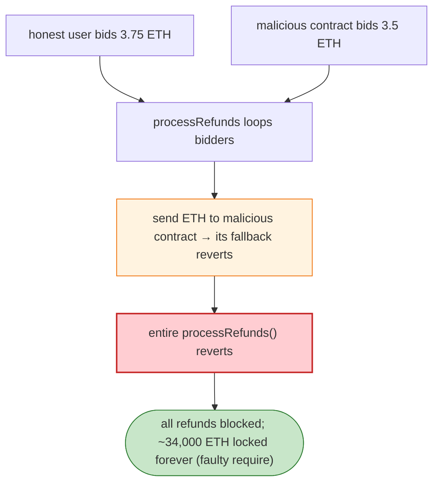

# Aku-Auction (Akutar NFT) Exploit — Refund DoS & Permanently Locked Funds

> **Reproduction:** the PoC compiles & runs in an isolated Foundry project at
> [this project folder](.). Full verbose trace: [output.txt](output.txt).
> Verified vulnerable source: [AkuAuction](sources/AkuAuction_F42c31).

---

## Key info

| | |
|---|---|
| **Loss** | ~34,000 ETH (~$34M+) **permanently locked** in the Aku/Akutar auction contract |
| **Vulnerable contract** | `AkuAuction` — [`0xF42c318dbfBaab0EEE040279C6a2588Fa01a961d`](https://etherscan.io/address/0xF42c318dbfBaab0EEE040279C6a2588Fa01a961d#code) |
| **Chain / block / date** | Ethereum mainnet / 14,636,844 / Apr 2022 |
| **Bug class** | (1) Refund DoS — `processRefunds` iterates bidders and pushes ETH to each, so a single malicious contract bidder reverts and bricks refunds for everyone; (2) a faulty `require` on the refund-claim path locks the entire balance forever. |

---

## TL;DR

The Aku auction let users bid ETH; losers were to be refunded via `processRefunds()` which **loops over
the bidder array and transfers ETH to each bidder's address**. Two compounding flaws:

1. **No "bidder is not a contract" check.** A malicious contract bids (3.5 ETH). When `processRefunds`
   reaches it and calls `bidder.transfer(refund)` / sends ETH, the contract's receive/fallback reverts,
   reverting the whole `processRefunds` transaction. Refunds for *every* honest bidder are now blocked.
2. **Faulty refund accounting.** The refund/withdraw path has an incorrect `require` (off-by-one /
   index vs. amount mismatch), so the ETH that should have been refunded can never be extracted —
   ~34,000 ETH is locked permanently in the contract.

The PoC demonstrates (1): an honest user and a malicious contract both bid; after the auction, refunds
cannot complete because the malicious contract reverts on receive.

---

## Root cause

- **Push-payment loop over external addresses with no failure isolation.** A single reverting recipient
  bricks the batch.
- **No mechanism to skip/withdraw individually** (pull-payments would have isolated failures).
- **A second logic error in the refund math** made the locked funds unrecoverable even by the owner.

---

## Preconditions

- The auction is live (bidding open) — an attacker places one contract bid.
- The refund mechanism is a push-over-loop (which it is).

---

## Diagrams



---

## Remediation

1. **Use pull-payments** (each bidder calls `withdrawRefund()`; a reverting contract only blocks itself).
2. **`require(!Address.isContract(bidder))` is insufficient** — go further: never push to arbitrary
   addresses; always let recipients pull.
3. **Isolate failures** in batch operations (`try`/catch or per-recipient accounting) so one bad actor
   can't brick the batch.
4. **Audit the refund math's `require`** so the owner can always recover residual ETH.

---

## How to reproduce

```bash
_shared/run_poc.sh 2022-04-AkutarNFT_exp -vvvvv
```

- RPC: mainnet archive (block 14,636,844). Infura mainnet in `foundry.toml`.
- Result: `[PASS] 2 tests` — the DoS scenario shows honest refund blocked by the malicious contract's
  reverting receive.

---

*Reference: Aku-Auction / Akutar refund DoS + permanently locked ~34,000 ETH, Apr 2022.*
