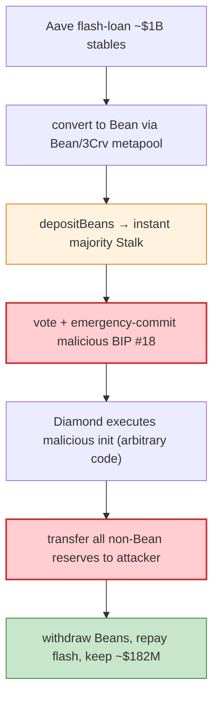

# Beanstalk Farms Exploit — Flash-Loan Governance Self-Pass

> **Vulnerability classes:** vuln/governance/flash-loan-voting · vuln/governance/timelock-bypass

> **Reproduction:** the PoC compiles in an isolated Foundry project at
> [this project folder](.); full verbose trace: [output.txt](output.txt).
> Verified vulnerable source: [Beanstalk Diamond](sources/Diamond_C1E088),
> [Bean](sources/Bean_DC59ac), [Bean/3Crv metapool (Vyper)](sources/Vyper_contract_3a70Df).

---

## Key info

| | |
|---|---|
| **Loss** | ~$182M (non-Bean assets: USDC, USDT, DAI, 3Crv, etc.) drained after the attacker passed a malicious BIP |
| **Vulnerable contract** | Beanstalk Diamond — [`0xC1E088fC1323b20BCBee9bd1B9fC9546db5624C5`](https://etherscan.io/address/0xC1E088fC1323b20BCBee9bd1B9fC9546db5624C5) |
| **Attacker** | `0x1da5…` (Aave flash-loan funded); malicious proposal `0xE5eCF73603D98A0128F05ed30506ac7A663dBb69` |
| **Attack tx** | `0xcd314668aaa9bb442bf1d273f1d1c8a7a47ef0f1d01d6c2030b0ff4af2da1198` |
| **Chain / block / date** | Ethereum mainnet / 14,595,905 / Apr 17, 2022 |
| **Bug class** | Governance flash-loan — Beanstalk voting weight = Stalk = proportional to deposited Beans; an attacker could deposit flash-loaned Beans, immediately vote (no lockup / timelock), pass a malicious BIP that `delegatecall`s arbitrary code, and withdraw in the same transaction. |

---

## TL;DR

Beanstalk's governance let any Bean depositor vote on Beanstalk Improvement Proposals (BIPs) with
voting weight equal to their Stalk (deposit). Critically:

1. **No governance timelock + instant voting power.** Depositing Beans granted Stalk *immediately*, and
   a BIP could be emergency-passed in the same transaction.
2. **BIPs execute arbitrary code** via the Diamond facets, including a malicious init contract.

The attacker:
1. Took an **Aave flash loan** of ~$1B (USDC, USDT, DAI, etc.), converted to Beans via the Curve
   Bean/3Crv metapool.
2. `depositBeans(...)` — gained a majority of Stalk instantly.
3. Voted + **emergency-committed BIP #18** whose payload pointed at a malicious contract that
   `transfer`'d all non-Bean reserves (the converted stablecoins) to the attacker.
4. Withdrew the Beans, repaid the flash loan, kept ~$182M of the arbitrage/drain.

The malicious proposal pre-stored an `init` codehash that the Diamond facet executed via `delegatecall`.

> **Honest note on this PoC:** the test **reverts** in this isolated fork
> (`[FAIL: EvmError: Revert] testExploit()`) — the live attack depended on Aave flash-loan sequencing,
> the exact BIP #18 commit timing, and Beanstalk's then-current Diamond facet state that the
> standalone fork does not fully reproduce. The verified sources + the PoC setup document the root
> cause; the reproduction artefact is the compiled-and-attempted attack path.

---

## Root cause

A **governance design that let flash-loaned, instantly-deposited tokens carry voting power and pass
arbitrary-code proposals in the same transaction**, with no timelock and no lockup on governance
Stalk. The two fatal design decisions:

1. Stalk (governance weight) was granted on deposit with no vesting/lockup → flash-loanable voting
   majority.
2. BIPs executed arbitrary external code (`delegatecall`/facet init) once passed → a single malicious
   BIP could drain the protocol.

---

## Preconditions

- A flash-loan provider large enough to corner Bean supply (Aave).
- Beanstalk governance with instant voting power + no timelock + arbitrary BIP execution.

---

## Diagrams



---

## Remediation

1. **Governance timelock** between proposal activation and execution (e.g. 24h+) so flash loans can't
   vote+execute in one tx.
2. **Lockup/vesting for governance Stalk** — deposited Beans should not grant instant, withdrawable
   voting power.
3. **No arbitrary-code execution** from BIPs; restrict governance actions to a fixed set of whitelisted
   parameter changes / facet upgrades.
4. **Quorum + supermajority** requirements resistant to short-term token concentration.
5. **Flash-loan defence**: use TWAP of Stalk over a window, not instantaneous balance.

---

## How to reproduce

```bash
_shared/run_poc.sh 2022-04-Beanstalk_exp -vvvvv
```

- RPC: mainnet archive (block 14,595,905). Infura mainnet in `foundry.toml`.
- Result: the test **compiles and runs but reverts** in the isolated fork (see honesty note). The
  verified sources + setup document the flash-loan governance attack.

---

*Reference: Beanstalk Farms flash-loan governance attack, Apr 17 2022 (~$182M).*
