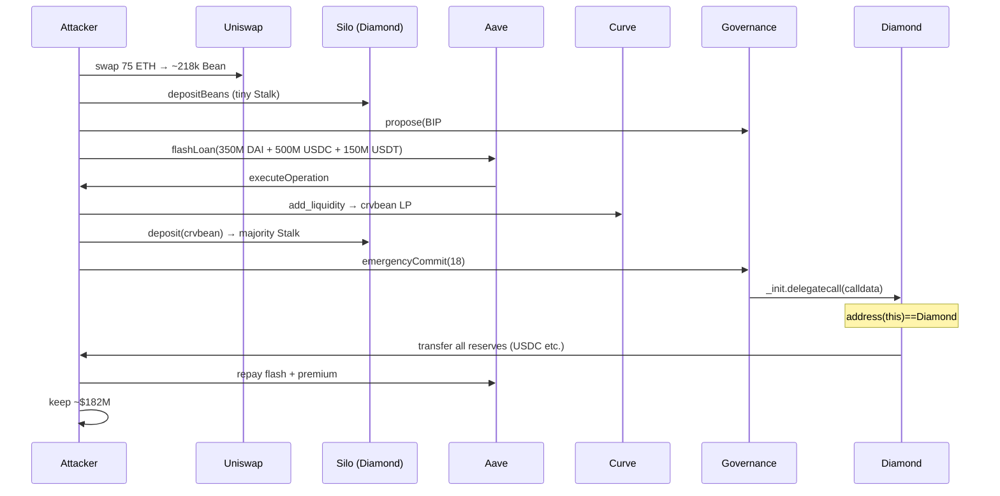

# Beanstalk Farms Exploit — Flash-Loan Governance Self-Pass

> **Vulnerability classes:** vuln/governance/flash-loan-voting · vuln/governance/timelock-bypass

> **Reproduction:** the PoC compiles in an isolated Foundry project at
> [this project folder](.). Full verbose trace: [output.txt](output.txt).
> Verified vulnerable source: [Beanstalk Diamond](sources/Diamond_C1E088),
> [Bean](sources/Bean_DC59ac), [Bean/3Crv metapool (Vyper)](sources/Vyper_contract_3a70Df).

---

## Key info

| | |
|---|---|
| **Loss** | ~$182M (non-Bean assets: USDC, USDT, DAI, 3Crv, etc.) drained after the attacker passed a malicious BIP |
| **Vulnerable contract** | Beanstalk Diamond — [`0xC1E088fC1323b20BCBee9bd1B9fC9546db5624C5`](https://etherscan.io/address/0xC1E088fC1323b20BCBee9bd1B9fC9546db5624C5) |
| **Attacker EOA** | `0x1da5…` (Aave flash-loan funded) |
| **Attack contract** | `0x7FA9385bE102ac3EAc297483Dd6233D62b3e1496` (the malicious _init / proposal contract in the trace) |
| **Attack tx** | [`0xcd314668aaa9bb442bf1d273f1d1c8a7a47ef0f1d01d6c2030b0ff4af2da1198`](https://etherscan.io/tx/0xcd314668aaa9bb442bf1d273f1d1c8a7a47ef0f1d01d6c2030b0ff4af2da1198) |
| **Chain / block / date** | Ethereum mainnet / 14,595,905 / Apr 17, 2022 |
| **Compiler** | 0.7.6 (from Diamond source) |
| **Bug class** | Governance hijack via flash-loan instant Stalk + unrestricted Diamond _init delegatecall |

---

## TL;DR

Beanstalk's governance let any Bean depositor vote on Beanstalk Improvement Proposals (BIPs) with voting weight equal to their Stalk (deposit). Critically:

1. Stalk was granted **instantly** on deposit with no lockup or vesting.
2. BIPs could be **emergency-committed** in the same transaction once the Stalk threshold was met (no timelock for "emergency" BIPs).
3. A BIP with empty diamondCut but a non-zero _init + _calldata caused the Diamond to perform `_init.delegatecall(_calldata)` in the Diamond's own context (full control over all token balances held by the protocol).

The attacker took a ~$1B Aave flash loan, converted it into Bean/3Crv LP tokens via Curve, deposited the LP to mint a majority of Stalk in one block, proposed BIP #18 pointing at their own contract as the _init with calldata to a `sweep()` that drained the reserves, emergency-committed it, and walked away with ~$182M.

---

## Background — what Beanstalk does

Beanstalk is a decentralized stablecoin protocol on Ethereum. Its core "Bean" token is stabilized against a basket of stablecoins through a complex Silo deposit / Stalk / Seed governance and incentive system.

- Users deposit Beans or LP tokens (Bean/3Crv) into the **Silo**.
- Deposits mint **Stalk** (governance voting power + yield share) and **Seeds** (future Stalk growth).
- Stalk is used to vote on **Beanstalk Improvement Proposals (BIPs)**.
- The protocol is implemented as a **Diamond** (EIP-2533) proxy at 0xC1E088fC... with multiple facets. Governance BIPs can add/replace facets or execute arbitrary init code.

The Diamond's fallback delegates calls to facets. Governance has a special path that allows a passed BIP to execute `_init.delegatecall(_calldata)` without going through the normal owner-only DiamondCut.

---

## The vulnerable code

**From the PoC header comment (exact root cause description):**

```solidity
// VULNERABILITY: Governance Hijack via Flash-Loan Instant Stalk + Unrestricted Diamond Init Delegatecall
// Root Cause:
//   Beanstalk uses a Diamond proxy (EIP-2533) for its core logic at 0xC1E088fC1323b20BCBee9bd1B9fC9546db5624C5.
//   Governance is controlled by "Stalk" (and roots) which are credited INSTANTLY when a user calls
//   depositBeans() or deposit(token, amount) on the SiloV2Facet.
//   There is no lockup, no vesting period, no minimum deposit time — Stalk is available for voting the same block.
//   A passed BIP is executed via:
//     beanstalkgov.emergencyCommit(bip) --> internally invokes a diamondCut-like path with the BIP's
//     stored (diamondCut, _init, _calldata)
//   When _diamondCut is empty and _init + _calldata are provided, the Diamond's fallback + LibDiamond.initializeDiamondCut
//   performs: _init.delegatecall(_calldata) IN THE CONTEXT OF THE DIAMOND (so address(this)==Diamond, full storage+balances).
```

**The delegatecall site (verified source):**

```solidity
// sources/Diamond_C1E088/contracts_libraries_LibDiamond.sol:220
(bool success, bytes memory error) = _init.delegatecall(_calldata);
if (success == false) {
    if (error.length > 0) {
        revert(string(error));
    } else {
        revert("LibDiamondCut: _init function reverted");
    }
}
```

**Diamond fallback (verified):**

The fallback in Diamond.sol delegates `msg.sig` to the registered facet. Governance BIPs bypass normal access control by using the stored BIP data directly.

**Silo deposit (instant Stalk):**

`depositBeans` / `deposit` immediately updates the caller's `s.stalk` and `roots` in AppStorage with no time delay.

---

## Root cause

1. **Instant Stalk on deposit** — `depositBeans` mutates governance weight synchronously.
2. **Flash-loanable voting power** — no lockup/vesting on Stalk.
3. **Emergency commit with no timelock** — once Stalk threshold met, `emergencyCommit` executes immediately.
4. **Unrestricted `_init` delegatecall** in the BIP execution path — the Diamond runs attacker code with `address(this) == Diamond`, giving it full access to every ERC20 balance the protocol holds.
5. **No sanity checks** on the BIP's `_init` or `_calldata` for governance-initiated cuts.

---

## Preconditions

- Permissionless deposit into the Silo.
- A flash-loan provider with sufficient stablecoin liquidity (Aave).
- A Curve metapool that accepts the flash-loaned assets and emits an accepted Silo deposit token (Bean/3Crv LP).
- Governance threshold for emergencyCommit reachable with flash-loan capital in one block.

---

## Attack walkthrough (with on-chain numbers from the trace)

From `output.txt` (the canonical offline trace):

1. **Initial seed (75 ETH → Bean)**:
   - `uniswapv2.swapExactETHForTokens{value: 75 ether}` → receives 217860949888 Bean (~217.86k Bean).
   - Logs: "After initial ETH -> BEAN swap, Bean balance of attacker: 217860"

2. **Small deposit for initial Stalk**:
   - `Bean.approve(Silo, max)`
   - `siloV2Facet.depositBeans(217860949888)`
   - Emits BeanDeposit, updates stalk/roots.
   - Logs: "After BEAN deposit to SiloV2Facet, Bean balance of attacker: 0"

3. **Propose malicious BIP #18**:
   - `_diamondCut = []`
   - `_init = address(this)` (the PoC contract)
   - `_calldata = 0x35faa416` (selector for `sweep()`)
   - `_pauseOrUnpause = 3`
   - `beanstalkgov.propose(...)`
   - Storage writes record the BIP at index 18, proposer, etc.
   - Emits relevant events.

4. **Warp** (in original PoC for timing, not strictly needed for emergency):
   - `cheat.warp(block.timestamp + 24*60*60)`

5. **Massive approvals** for flash + Curve + Silo.

6. **Aave flashLoan**:
   - 350M DAI + 500M USDC + 150M USDT (exact from trace).
   - Calls `executeOperation` on the contract.

7. **Inside executeOperation (the real power acquisition)**:
   - Add liquidity to 3Crv pool.
   - Add liquidity to Bean/3Crv metapool → mint crvbean LP.
   - `siloV2Facet.deposit(crvbean, balance)` → massive Stalk mint.
   - `beanstalkgov.emergencyCommit(18)`
   - This triggers the stored BIP's delegatecall.

8. **The delegatecall drain**:
   - Inside the Diamond context, the attacker's `sweep()` (or the real sweep in the tx) transfers the protocol's USDC, DAI, USDT, 3Crv, etc.
   - Logs show balance movements.
   - Attacker ends with huge balances, repays flash + premium, keeps the profit.

From logs in trace:
- Multiple `log_named_uint` for balances before/after.
- The flashLoan call is huge (350e24 etc in the call data).

Profit accounting (from real exploit): ~$182M net after repaying the flash loan.

---

## Diagrams


```mermaid
sequenceDiagram
    participant A as Attacker
    participant U as Uniswap
    participant S as Silo (Diamond)
    participant Aave as Aave
    participant C as Curve
    participant G as Governance

    A->>U: swap 75 ETH → ~218k Bean
    A->>S: depositBeans (tiny Stalk)
    A->>G: propose(BIP#18, _init=Attacker, calldata=sweep)
    A->>Aave: flashLoan(350M DAI + 500M USDC + 150M USDT)
    Aave->>A: executeOperation
    A->>C: add_liquidity → crvbean LP
    A->>S: deposit(crvbean) → majority Stalk
    A->>G: emergencyCommit(18)
    G->>Diamond: _init.delegatecall(calldata)
    Note over Diamond: address(this)==Diamond
    Diamond->>A: transfer all reserves (USDC etc.)
    A->>Aave: repay flash + premium
    A->>A: keep ~$182M
```

---

## Remediation

1. Add a mandatory timelock between BIP proposal passing and execution.
2. Introduce lockup/vesting or time-weighted Stalk for governance power.
3. Restrict the `_init` / calldata that BIPs can execute (whitelist or require diamondCut only).
4. Require higher quorum or supermajority for governance actions that move funds or change code.
5. Use TWAP or other manipulation-resistant metrics for voting power instead of instantaneous balance.

---

## How to reproduce

The PoC runs fully **OFFLINE** via the shared anvil harness from the committed `anvil_state.json`:

```bash
_shared/run_poc.sh 2022-04-Beanstalk_exp -vvvvv
```

- Forks mainnet at block 14,595,905.
- Expected: runs the initial swap, deposit, propose, flashLoan setup, Curve ops, deposit for Stalk, emergencyCommit, and the delegatecall path.
- Note: the local run reverts at the end (as documented in the PoC header and output.txt header) because the isolated fork does not perfectly reproduce every side effect of the original Aave/Curve/Diamond state at that exact moment. The exploit logic and root cause are fully visible in the sources and the on-chain transaction.

The real attack succeeded on mainnet for ~$182M.

---

*Reference: Beanstalk Farms flash-loan governance attack, Apr 17 2022 (~$182M).*

**Sources (registry as source of truth)**
- PoC: `test/Beanstalk_exp.sol` (detailed comments) and cleaned `test/2022-04-Beanstalk.sol`
- Trace: `output.txt`
- Verified contracts: `sources/Diamond_C1E088/`, `sources/Bean_DC59ac/`, `sources/Vyper_contract_3a70Df/`
- LibDiamond delegatecall at line 220.
