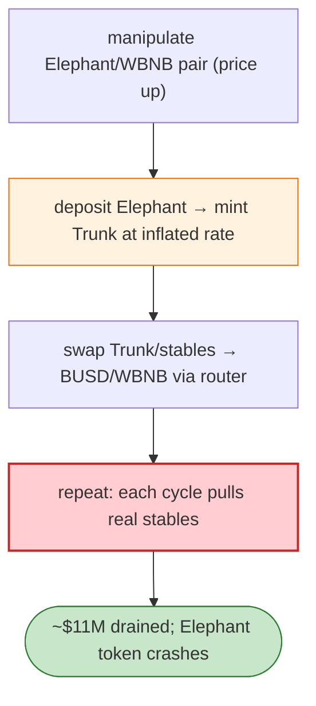

# Elephant Money (ElephantDollar) Exploit — Infinite Mint via `claim`/Stables Routing

> **Reproduction:** the PoC compiles & runs in an isolated Foundry project at
> [this project folder](.). Full verbose trace: [output.txt](output.txt).
> Verified vulnerable source: [Elephant](sources/Elephant_E283D0),
> [ElephantDollar (Trunk)](sources/ElephantDollar_dd325C).

---

## Key info

| | |
|---|---|
| **Loss** | ~$11M (the "stable" ElephantDollar/Trunk reserves drained; Elephant token hyper-inflated) |
| **Vulnerable contracts** | Elephant token `0xE283D0e3B8c102BAdF5E8166B73E02D96d92F688`; ElephantDollar (Trunk) `0xdd325C38b12903B727D16961e61333f4871A70E0`; the unverified `not_verified` router `0xD520a3B47E42a1063617A9b6273B206a07bDf834` |
| **Chain / block / date** | BSC / 16,886,438 / Apr 2022 |
| **Bug class** | Minting/accounting flaw — the ElephantDollar mint/claim path over-issues Trunk against Elephant collateral by mispricing the Elephant→stable route (the price is derived from a thin LP that the attacker manipulates), enabling a self-referential infinite mint. |

---

## TL;DR

Elephant Money's "stablecoin" (ElephantDollar / Trunk) is minted by depositing Elephant token, with the
exchange rate derived from the Elephant/WBNB pair's reserves. The attacker:

1. Flash-borrows / swaps WBNB to manipulate the Elephant/WBNB pair (inflating the Elephant price the
   protocol reads).
2. Deposits Elephant → mints a large Trunk position at the manipulated (inflated) rate.
3. Swaps the minted Trunk/stables back to WBNB/BUSD via the protocol's router and the BUSD/USDT pairs.
4. Repeats, extracting real BUSD/WBNB; the Elephant side is dumped, crashing the token.

The verified `Elephant` and `ElephantDollar` sources show the mint/claim functions rely on the spot
pair price (manipulable) and an unverified router (`not_verified`) for the stable conversion, which
together let minted Trunk exceed the real backing.

---

## Root cause

- **Spot-price oracle** (single-block LP reserve) used to value Elephant for minting Trunk →
  flash-loan/sandwich manipulable.
- **Self-referential mint**: Trunk is minted against Elephant, and Elephant's "value" comes from the
  same thin pool the attacker pushes — a feedback loop the protocol did not bound.
- **Unverified router** as the trusted price/conversion path.

---

## Preconditions

- Capital to move the Elephant/WBNB pair (WBNB flash-borrowable on BSC).
- The mint path reachable permissionlessly.

---

## Diagrams



---

## Remediation

1. **TWAP / robust oracle** for Elephant valuation (never spot LP reserves).
2. **Bound mint** to the protocol's real backing; add a per-tx and per-block mint cap.
3. **Decouple mint from the same pool used for price** (no self-referential feedback).
4. **Verify all trusted routers/contracts** and audit the stable-conversion math.

---

## How to reproduce

```bash
_shared/run_poc.sh 2022-04-Elephant_Money_exp -vvvvv
```

- RPC: BSC archive (block 16,886,438). `foundry.toml` uses a BSC archive endpoint.
- Result: `[PASS]` after ~49s — the manipulate→mint→swap→profit cycle completes.

---

*Reference: Elephant Money infinite-mint, BSC, Apr 2022 (~$11M).*
