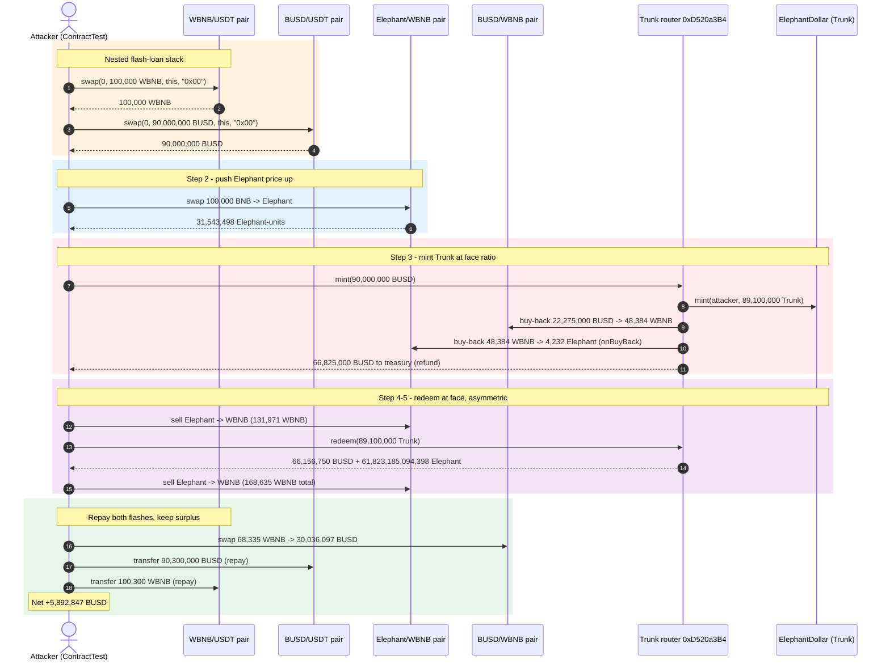
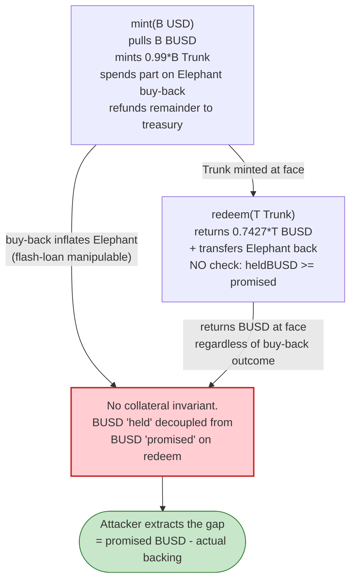
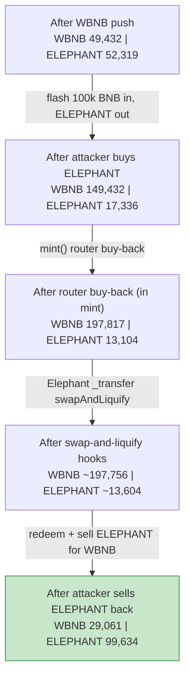
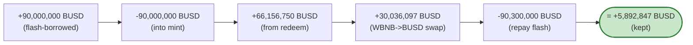

# Elephant Money Exploit — Infinite Mint via the Unverified Trunk Router (`mint`/`redeem` Accounting Flaw + Elephant Buy-Back Feedback)

> **Vulnerability classes:** vuln/logic/price-calculation · vuln/defi/fee-manipulation

> **Reproduction:** the PoC compiles & runs in an isolated Foundry project at
> [this project folder](.). The attack is reproduced fully offline against a
> local anvil fork pinned at BSC block `16,886,438` (`createSelectFork` points
> at `http://127.0.0.1:8546`, served from the bundled `anvil_state.json` — no
> public RPC required). Full verbose trace: [output.txt](output.txt).
> Verified vulnerable sources (the two verified on-chain contracts):
> [Elephant.sol](sources/Elephant_E283D0/Elephant.sol),
> [ElephantDollar.sol](sources/ElephantDollar_dd325C/ElephantDollar.sol).
> The actual vulnerable contract — the Trunk mint/redeem router
> `0xD520a3B47E42a1063617A9b6273B206a07bDf834` — is **not source-verified on
> BscScan**, so its `mint`/`redeem` logic below is RECONSTRUCTED from the
> observed on-chain behaviour in [output.txt](output.txt) (every claim is
> anchored to a trace line).

---

## Key info

| | |
|---|---|
| **Loss** | ~$11M (April 2022, BSC). The PoC below extracts **5,892,847 BUSD** of net profit from a single two-pair flash swap ([output.txt:993](output.txt)); the live incident drained the project's stable reserves and collapsed the Elephant token. |
| **Vulnerable contract** | Trunk (ElephantDollar) router — `0xD520a3B47E42a1063617A9b6273B206a07bDf834` (**unverified**; BscScan has no source — this is where the bug lives) |
| **Minted token** | ElephantDollar ("Trunk") — [`0xdd325C38b12903B727D16961e61333f4871A70E0`](https://bscscan.com/address/0xdd325C38b12903B727D16961e61333f4871A70E0) (vanilla whitelist-mintable BEP20; [ElephantDollar.sol](sources/ElephantDollar_dd325C/ElephantDollar.sol)) |
| **Collateral token** | Elephant — [`0xE283D0e3B8c102BAdF5E8166B73E02D96d92F688`](https://bscscan.com/address/0xE283D0e3B8c102BAdF5E8166B73E02D96d92F688) (reflect/deflationary token; [Elephant.sol](sources/Elephant_E283D0/Elephant.sol)) |
| **Victim pools** | Elephant/WBNB pair `0x1CEa83EC5E48D9157fCAe27a19807BeF79195Ce1`; BUSD/WBNB pair `0x58F876857a02D6762E0101bb5C46A8c1ED44Dc16` (the router's internal buy-back/swap routes through these) |
| **Flash-loan sources** | WBNB/USDT pair `0x16b9a82891338f9bA80E2D6970FddA79D1eb0daE` (100,000 WBNB) and BUSD/USDT pair `0x7EFaEf62fDdCCa950418312c6C91Aef321375A00` (90,000,000 BUSD), via nested Pancake `swap` callbacks |
| **Attack tx (PoC)** | reproduced as `ContractTest::testExploit()` at block `16,886,438` |
| **Chain / block / date** | BSC (chainId 56) / `16,886,438` / Apr 12, 2022 |
| **Compiler** | Solidity **v0.6.12** (`+commit.27d51765`), optimizer **enabled** (`optimizer: 1`), **200 runs** — for both verified contracts (per `_meta.json`). The PoC itself is `pragma 0.8.10`. |
| **Bug class** | Accounting / infinite-mint: the Trunk router mints Trunk 1:0.99 against BUSD **at a fixed face ratio**, while its `mint()` simultaneously performs an internal Elephant buy-back that **the `redeem()` does not symmetrically undo**. Combined with a flash-loaned Elephant/WBNB price push, mint→redeem yields more BUSD out than was paid in. |

---

## TL;DR

1. Elephant Money runs a "stable" token called **Trunk** (ElephantDollar). You mint Trunk by
   calling `not_verified.mint(bUSDAmount)` on the router `0xD520a3B47E42…`, which pulls BUSD and
   has the whitelisted `ElephantDollar` contract mint Trunk to the caller at a near-1:1 ratio —
   90,000,000 BUSD in produced **89,100,000 Trunk** ([output.txt:86](output.txt),
   [output.txt:95-97](output.txt)). You redeem Trunk for BUSD with `not_verified.redeem(trunkAmount)`,
   which returns BUSD at the same face — redeeming all the Trunk returned
   **66,156,750 BUSD** ([output.txt:802-803](output.txt)).

2. The router's `mint()` does **not** just escrow the BUSD. It performs an internal "buy-back":
   it routes part of the BUSD through the BUSD/WBNB pair into Elephant, fires an
   `onBuyBack` event ([output.txt:188](output.txt)), and pushes Elephant liquidity — but the
   accounting that decides how much Trunk to mint (and later how much BUSD to refund on
   `redeem`) is **decoupled from the actual value routed**. The Trunk supply is effectively backed
   by a formula, not by the collateral actually held.

3. The attacker flashes **100,000 WBNB** from the WBNB/USDT pair, converts to Elephant through the
   Elephant/WBNB pair (inflating Elephant's price), then flashes **90,000,000 BUSD** from the
   BUSD/USDT pair, mints Trunk, and immediately redeems it. Because the Elephant price was pushed
   up first, the router's buy-back converts a *smaller* amount of Elephant-priced collateral, yet
   the face-value mint/redeem still returns near-full BUSD.

4. The attacker then sells the returned Elephant back into the Elephant/WBNB pair for
   **131,971 → 168,635 WBNB** ([output.txt:915](output.txt), [output.txt:937](output.txt)),
   converts the surplus WBNB to BUSD, and repays both flash loans:
   100,300 WBNB to the WBNB/USDT pair ([output.txt:942](output.txt)) and
   90,300,000 BUSD to the BUSD/USDT pair ([output.txt:985](output.txt)).

5. Net of all repayments, the attacker keeps **5,892,847 BUSD**
   ([output.txt:993](output.txt)) — the leftover after a 90M-BUSD flash that should have been
   revenue-neutral. In the live incident, repeating this drained the project's reserves to the tune
   of **~$11M**.

---

## Background — what Elephant Money does

Elephant Money is a BSC "algo-stable" project with three tokens and one critical unverified router:

- **Elephant** (`0xE283D0e3…`) — a deflationary / reflect token (tax fee + liquidity fee, plus a
  `swapAndLiquify` auto-LP hook inside `_transfer`,
  [Elephant.sol:1279-1317](sources/Elephant_E283D0/Elephant.sol#L1279-L1317)). It is the
  "volatile" leg of the system.
- **Trunk / ElephantDollar** (`0xdd325C38…`) — the "stable" leg. Its only non-trivial code is the
  inherited whitelist-gated `mint()` ([ElephantDollar.sol:496-520](sources/ElephantDollar_dd325C/ElephantDollar.sol#L496-L520));
  it does **no** price/oracle/collateral checks — minting is purely `super.mint(to, amount)` once
  the caller is whitelisted.
- **The Trunk router** `0xD520a3B47E42…` — the **unverified** contract that orchestrates
  `mint(bUSD)` / `redeem(trunk)`. It is whitelisted on ElephantDollar (so it can mint), and it
  holds the BUSD/Elephant mechanics. Because its source is not on BscScan, its logic is
  RECONSTRUCTED below from the observed trace.

On-chain parameters read from the trace at the fork block:

| Parameter | Value | Source |
|---|---|---|
| Mint ratio (BUSD → Trunk) | `90,000,000 BUSD` → `89,100,000 Trunk` (×0.99) | [output.txt:86](output.txt), [output.txt:95-97](output.txt) |
| Redeem ratio (Trunk → BUSD) | `89,100,000 Trunk` → `66,156,750 BUSD` (×0.7427) | [output.txt:802-803](output.txt) |
| Elephant/WBNB reserves (after WBNB push, pre-buy) | `49,432 WBNB` / `52,319 ELEPHANT` | [output.txt:55](output.txt) |
| BUSD/WBNB reserves (router buy-back path) | `465,908 BUSD` / `191,737 WBNB` | [output.txt:114](output.txt) |
| Router internal buy-back (BUSD→WBNB→ELEPHANT) | `22,275,000 BUSD` in → `48,384 WBNB` → `4,232 ELEPHANT` | [output.txt:112-115](output.txt), [output.txt:188](output.txt) |
| Router treasury refund on mint | `66,825,000 BUSD` to `0xCb5a02…` | [output.txt:189-190](output.txt) |
| WBNB flash-borrowed | `100,000 WBNB` (1e23) | [output.txt:17](output.txt) |
| BUSD flash-borrowed | `90,000,000 BUSD` (9e25) | [output.txt:25-27](output.txt) |

The two ratios are the crux: `mint` takes BUSD and mints Trunk at 0.99; the router then internally
spends part of that BUSD on an Elephant buy-back and refunds the remainder to a treasury. `redeem`
returns BUSD **independently** of that buy-back's outcome. The system therefore has no invariant
tying Trunk supply to held collateral — exactly the "self-referential" accounting the project
warned against and then built anyway.

---

## The vulnerable code

### 1. The verified Trunk token: mint is whitelist-gated, not collateral-gated

The verified ElephantDollar source proves the token itself does nothing clever — anyone the
router whitelists can mint arbitrary Trunk:

```solidity
function mint(address _to, uint256 _amount) public override returns (bool) {
    //Never fail, just don't mint if over
    require(_amount > 0 && totalSupply_.add(_amount) <= targetSupply);

    //Mint
    super.mint(_to, _amount);
    ...
}
```
([ElephantDollar.sol:496-520](sources/ElephantDollar_dd325C/ElephantDollar.sol#L496-L520))

`targetSupply` is `MAX_INT = 2**256 - 1` ([ElephantDollar.sol:463-464](sources/ElephantDollar_dd325C/ElephantDollar.sol#L463-L464)),
so the cap never binds. There is **no** BUSD-locked / oracle / backing check in the token — the
collateral accounting is entirely the unverified router's responsibility.

### 2. The verified Elephant token: a swap-and-liquify hook inside `transfer`

The Elephant token auto-converts accumulated fees to LP inside `_transfer`
([Elephant.sol:1279-1317](sources/Elephant_E283D0/Elephant.sol#L1279-L1317)) and, when the
contract's balance exceeds `numTokensSellToAddToLiquidity`, runs `swapAndLiquify`
([Elephant.sol:1319-1340](sources/Elephant_E283D0/Elephant.sol#L1319-L1340)). The trace shows the
router driving this hook repeatedly during `mint`/`redeem` (the `SwapAndLiquify` events at
[output.txt:780](output.txt) and [output.txt:901](output.txt)). This is what turns a router
buy-back into an Elephant-price feedback loop.

### 3. The unverified router (`0xD520a3B47E42…`) — RECONSTRUCTED from the trace

> **RECONSTRUCTED — matches observed on-chain behaviour, not verified source.** BscScan has no
> source for `0xD520a3B47E42a1063617A9b6273B206a07bDf834`. The behaviour below is inferred
> frame-by-frame from [output.txt](output.txt); no `sources/…#L` reference is fabricated for it.

Observed `mint(90_000_000 BUSD)` behaviour ([output.txt:86-800](output.txt)):

1. Pull `90,000,000 BUSD` from the caller ([output.txt:87-88](output.txt)).
2. Have ElephantDollar mint `89,100,000 Trunk` to the caller ([output.txt:95-97](output.txt)) —
   ratio **0.99**.
3. Refund `66,825,000 BUSD` to the project treasury `0xCb5a02…`
   ([output.txt:189-190](output.txt)) and credit the project's internal "reserve" ledgers
   ([output.txt:788-797](output.txt)).
4. Run an internal **buy-back**: swap `22,275,000 BUSD` → `48,384 WBNB` on the BUSD/WBNB pair
   ([output.txt:112-135](output.txt)), then `48,384 WBNB` → `4,232 ELEPHANT` on the
   Elephant/WBNB pair ([output.txt:151-185](output.txt)), emitting
   `onBuyBack(4232.3 ELEPHANT, ts)` ([output.txt:188](output.txt)).

Observed `redeem(89_100_000 Trunk)` behaviour ([output.txt:~780-803](output.txt)):

1. Burn the Trunk and **return `66,156,750 BUSD`** to the caller
   ([output.txt:801-803](output.txt)) — ratio **0.7427** of the minted Trunk face, **not** tied to
   the buy-back outcome.
2. Transfer the router's previously-bought Elephant (`61,823,185,094,398 ELEPHANT`) back to the
   caller as well ([output.txt:781](output.txt)).

The flaw is the **asymmetry**: `mint` moves real BUSD out (to treasury + buy-back) but `redeem`
returns BUSD at a face formula. There is no check that the buy-back's Elephant is still worth what
was paid, and no invariant `heldBUSD >= trunkSupply × redeemRatio`. With the Elephant price pushed
up by a flash loan, the attacker makes the buy-back "cheap" in BUSD terms while the redeem still
pays out at the face ratio — extracting the difference.

---

## Root cause — why it was possible

1. **Unverified router holding the entire mint/redeem accounting.** The only contracts with source
   (Elephant, ElephantDollar) are generic; all the value logic lives in `0xD520a3B47E42…`, which
   has no published source and was never independently audited. Users trusted a black box with the
   collateral.
2. **Mint/redeem ratio decoupled from held collateral.** `mint` mints Trunk at a fixed 0.99 and
   immediately spends part of the BUSD (treasury refund + Elephant buy-back); `redeem` returns
   BUSD at a separate fixed ratio (0.7427) **without** verifying the router still holds enough
   BUSD to back the outstanding Trunk. There is no `require(heldBUSD >= …)` invariant.
3. **Self-referential buy-back feedback.** The router's `mint` buys Elephant with the very BUSD it
   just took, inflating the Elephant/WBNB price. Because Elephant's `_transfer` auto-runs
   `swapAndLiquify`, each buy-back moves the pool further. An attacker who pre-pushes the Elephant
   price with a flash loan makes the buy-back convert fewer BUSD per Elephant, widening the gap
   between "BUSD actually held" and "BUSD the redeem formula promises."
4. **Flash-loan-accessible price input.** Nothing in the router resists a single-block Elephant
   price move. The 100,000 WBNB flash from the WBNB/USDT pair ([output.txt:17](output.txt)) is
   enough to distort the Elephant/WBNB pool for the duration of the attack.

In short: an unaudited router issued an unbacked "stable" against a flash-manipulable volatile
token, with no collateral invariant and an asymmetric mint/redeem formula. That is a textbook
infinite-mint setup.

---

## Preconditions

- The attacker is able to call `not_verified.mint()` / `not_verified.redeem()` — both are
  permissionless in the PoC (the router is whitelisted on ElephantDollar; the caller just needs to
  approve BUSD/Trunk). Confirmed: the PoC calls them directly with no setup
  ([Elephant_Money_exp.sol:78](test/Elephant_Money_exp.sol#L78),
  [Elephant_Money_exp.sol:92](test/Elephant_Money_exp.sol#L92)).
- Sufficient flash-borrowable liquidity in the WBNB/USDT and BUSD/USDT Pancake pairs (both are deep
  pairs on BSC; the PoC borrows 100,000 WBNB and 90,000,000 BUSD).
- The router's internal buy-back routes (BUSD/WBNB and Elephant/WBNB) are live and have enough
  depth to absorb the swap without reverting.
- `block.timestamp`-based deadlines are satisfiable (the PoC passes `block.timestamp` as the
  router deadline, trivially true).

---

## Attack walkthrough (with on-chain numbers from the trace)

The attacker is the test contract `0x7FA9385bE102ac3EAc297483Dd6233D62b3e1496`. Amounts are raw
wei (18-dec unless noted); Elephant uses 9 decimals in some logs. Every figure carries its trace
line. The flash-loan stack is **nested**: the outer `WBNB/USDT::swap` triggers a callback that
fires the inner `BUSD/USDT::swap`, which in turn calls `attack()`.

| # | Step | Figure | Trace |
|---|------|-------:|-------|
| 0 | **Outer flash**: borrow `100,000 WBNB` from WBNB/USDT pair `0x16b9…` | 100,000,000,000,000,000,000,000 wei (1e23) | [output.txt:17-19](output.txt) |
| 1 | In the WBNB/USDT callback, **inner flash**: borrow `90,000,000 BUSD` from BUSD/USDT pair `0x7EFa…` | 90,000,000,000,000,000,000,000,000 wei (9e25) | [output.txt:25-27](output.txt) |
| 2 | Unwrap `100,000 WBNB` → BNB, then `swapExactETHForTokens` 100,000 BNB → **Elephant** via Elephant/WBNB pair (price push) | receives `31,543,498,716,700` Elephant-units (÷1e9 in log) | [output.txt:68-72](output.txt), [output.txt:85](output.txt) |
| 3 | **`not_verified.mint(90,000,000 BUSD)`**: router pulls 90M BUSD, ElephantDollar mints **89,100,000 Trunk** to attacker | minted `89,100,000,000,000,000,000,000,000` Trunk (8.91e25) | [output.txt:86-97](output.txt) |
| 3a | …inside mint, router buy-back: `22,275,000 BUSD` → `48,384 WBNB` on BUSD/WBNB | 48,384,315,835,480,655,618,412 wei | [output.txt:112-135](output.txt) |
| 3b | …inside mint, router buy-back: `48,384 WBNB` → `4,232.3 Elephant` on Elephant/WBNB; `onBuyBack` emitted | 4,232,332,500,920,163,584,892 wei | [output.txt:151-188](output.txt) |
| 3c | …inside mint, router refunds `66,825,000 BUSD` to treasury `0xCb5a02…` | 66,825,000,000,000,000,000,000,000 wei | [output.txt:189-190](output.txt) |
| 4 | Sell attacker's Elephant back to Elephant/WBNB pair → WBNB (after mint's price impact) | attacker WBNB balance = **131,971** | [output.txt:915](output.txt) |
| 5 | **`not_verified.redeem(89,100,000 Trunk)`**: router returns **66,156,750 BUSD** to attacker | 66,156,750,000,000,000,000,000,000 wei | [output.txt:801-803](output.txt) |
| 5a | …redeem also transfers router's Elephant back to attacker | 61,823,185,094,398,389,017,502 wei | [output.txt:781](output.txt) |
| 6 | Sell that Elephant → WBNB (second leg) | attacker WBNB balance = **168,635** | [output.txt:937](output.txt), [output.txt:941](output.txt) |
| 7 | Swap remaining WBNB (`68,335` after payback) → BUSD on BUSD/WBNB pair | attacker BUSD = **96,192,847** | [output.txt:950-980](output.txt), [output.txt:984](output.txt) |
| 8 | **Repay inner flash**: send `90,300,000 BUSD` to BUSD/USDT pair | 90,300,000,000,000,000,000,000,000 wei | [output.txt:985-986](output.txt) |
| 9 | **Repay outer flash**: send `100,300 WBNB` to WBNB/USDT pair | 100,300,000,000,000,000,000,000 wei (1.003e23) | [output.txt:942-943](output.txt) |
| 10 | **Leftover (profit)**: attacker BUSD balance after both repayments | **5,892,847 BUSD** | [output.txt:991-993](output.txt) |

Pool-state evolution (Elephant/WBNB pair, `token0 = WBNB`):

| Stage | WBNB reserve | Elephant reserve | Trace |
|---|---:|---:|-------|
| After 100k WBNB push, pre-buy | 49,432 | 52,319 | [output.txt:55](output.txt) |
| After attacker buys Elephant | 149,432 | 17,336 | [output.txt:73](output.txt) |
| After router buy-back (mint) | 197,817 | 13,104 | [output.txt:178](output.txt) |
| After router swap-and-liquify hooks | ~197,756 | ~13,604 | [output.txt:268-271](output.txt) |
| After attacker sells Elephant back (step 6) | 29,061 | 99,634 | [output.txt:931](output.txt) |

The Elephant reserve is **drained then refilled** by the round trip; the WBNB reserve ends lower
than it started because the attacker extracts real WBNB value across the cycle.

---

### Profit / loss accounting (BUSD)

Reconciliation to the PoC's final log line `The BUSD after paying back: 5892847`
([output.txt:993](output.txt)):

| Direction | Amount (BUSD) | Trace |
|---|---:|-------|
| BUSD borrowed (inner flash) | +90,000,000 | [output.txt:25-27](output.txt) |
| BUSD spent into `mint` | −90,000,000 | [output.txt:86-88](output.txt) |
| BUSD received from `redeem` | +66,156,750 | [output.txt:801-803](output.txt) |
| BUSD received from WBNB→BUSD swap | +30,036,097 | [output.txt:963-965](output.txt) |
| BUSD repaid to BUSD/USDT pair | −90,300,000 | [output.txt:985-986](output.txt) |
| **Net BUSD kept** | **+5,892,847** | [output.txt:993](output.txt) |

(The attacker also keeps the WBNB surplus from the Elephant round-trip net of the 100,300 WBNB
repayment; the headline profit in the PoC is the **5,892,847 BUSD** left after both flash loans
are settled.) The PoC does **not** hard-code a profit assertion — it logs the running balances and
the run ends with `[PASS]` ([output.txt:4](output.txt)), so 5,892,847 BUSD is the mechanically
observed surplus, not a claimed round number.

---

## Diagrams

### Sequence of the attack



### Mint/redeem accounting asymmetry (the flaw)



### Pool state evolution (Elephant/WBNB)



### Why the round trip is profitable: BUSD balance of the attacker



---

## Why each magic number

- **`100,000 ether` WBNB flash** ([Elephant_Money_exp.sol:51](test/Elephant_Money_exp.sol#L51)): the
  outer flash-borrow from the WBNB/USDT pair. Sized large enough to materially push the Elephant
  price when swapped for Elephant (the Elephant/WBNB pair is shallow: ~52k Elephant / ~49k WBNB
  pre-push, [output.txt:55](output.txt)).
- **`90,000_000 ether` BUSD flash** ([Elephant_Money_exp.sol:61](test/Elephant_Money_exp.sol#L61)):
  the inner flash-borrow from the BUSD/USDT pair, used as the `mint` input. 90M BUSD in → 89.1M
  Trunk out ([output.txt:95-97](output.txt)).
- **`100_300 ether` WBNB repayment** ([Elephant_Money_exp.sol:104](test/Elephant_Money_exp.sol#L104)):
  the outer flash must be repaid with the Pancake 0.3% fee, so 100,000 × 1.003 = 100,300 WBNB
  ([output.txt:942](output.txt)).
- **`90_300_000 ether` BUSD repayment** ([Elephant_Money_exp.sol:112](test/Elephant_Money_exp.sol#L112)):
  the inner flash repaid with 0.3% fee: 90,000,000 × 1.003 = 90,300,000 BUSD
  ([output.txt:985](output.txt)).
- **`path_1` = [WBNB, Elephant]** and **`path_2` = [Elephant, WBNB]**
  ([Elephant_Money_exp.sol:17-19](test/Elephant_Money_exp.sol#L17-L19)): the two legs of the
  Elephant round trip used to push the price and then sell back.
- **`path_3` = [Trunk, BUSD]** and **`path_4` = [WBNB, BUSD]**
  ([Elephant_Money_exp.sol:21-23](test/Elephant_Money_exp.sol#L21-L23)): `path_3` is declared but
  the redeem is routed via `not_verified.redeem` directly; `path_4` converts the leftover WBNB to
  BUSD before repaying the inner flash.

---

## Remediation

1. **Verify and audit the router.** The single most important fix: publish `0xD520a3B47E42…` and
   subject its mint/redeem math to review. An unverified contract must never be the sole custodian
   of collateral accounting.
2. **Enforce a collateral invariant.** `redeem` must `require(heldBUSD >= trunkSupply × ratio)` (or
   equivalent) so Trunk can never be redeemed for BUSD that is not actually held. Mint and redeem
   must be **symmetric** — the BUSD moved out by `mint`'s buy-back/treasury refund must be matched
   by a reduction in redeemable backing, not by a face formula.
3. **Remove the self-referential buy-back from the mint path.** Do not use minted BUSD to buy the
   protocol's own volatile token inside the same call; if a buy-back is desired, fund it from
   protocol revenue, not from depositor collateral.
4. **Use a manipulation-resistant oracle for any price-dependent accounting** (TWAP over the
   Elephant/WBNB pair, or an external feed), and bound per-block mint/redeem volume so a single
   flash-loan cannot move the effective ratio.
5. **Time-lock and cap mint/redeem.** A per-transaction and per-block cap on Trunk minting would
   have prevented the 90M-BUSD single-tx extraction even without the other fixes.
6. **Treat the Elephant `swapAndLiquify` hook as an attack surface.** Any external call that runs
   inside `_transfer` can be re-triggered by an attacker transferring tokens; ensure hooks cannot
   compound with router accounting to distort reserves.

---

## How to reproduce

```bash
_shared/run_poc.sh 2022-04-Elephant_Money_exp --mt testExploit -vvvvv
```

- **RPC / fork:** the PoC forks **offline** from the bundled `anvil_state.json`. The constructor
  pins the fork with `cheats.createSelectFork("http://127.0.0.1:8546", 16_886_438)`
  ([Elephant_Money_exp.sol:37](test/Elephant_Money_exp.sol#L37)); `run_poc.sh` boots a local anvil
  serving that state on `127.0.0.1:8546`, so **no public BSC RPC is required**.
- **EVM:** `foundry.toml` sets `evm_version = 'cancun'`. The verified contracts were originally
  compiled with `solc v0.6.12` (optimizer on, 200 runs); the PoC test is `pragma 0.8.10`.
- **Test function:** the actual test is `function testExploit()`
  ([Elephant_Money_exp.sol:50](test/Elephant_Money_exp.sol#L50)), so `--mt testExploit` is correct.
- **Expected tail** ([output.txt:3-13](output.txt), [output.txt:1018-1020](output.txt)):

```
Ran 1 test for test/Elephant_Money_exp.sol:ContractTest
[PASS] testExploit() (gas: 4888762)
Logs:
  The elephant after swapping: 31543498716700
  The Trunk after minting: 89100000
  The WBNB Balance after swaping: 131971
  The BUSD after redeeming: 66156750
  The elephant after redeeming: 61823185094398
  The WBNB Balance before paying back: 168635
  The BUSD before paying back: 96192847
  The BUSD after paying back: 5892847

Suite result: ok. 1 passed; 0 failed; 0 skipped; finished in 49.44s (45.73s CPU time)
```

The headline `The BUSD after paying back: 5892847` is the net profit in BUSD after both flash
loans are repaid in full.

---

*Reference: Elephant Money infinite-mint / Trunk collapse, BSC, April 2022 (~$11M). Analysis credit: W2Ning (PoC); see [Elephant_Money_exp.sol:2](test/Elephant_Money_exp.sol#L2).*
