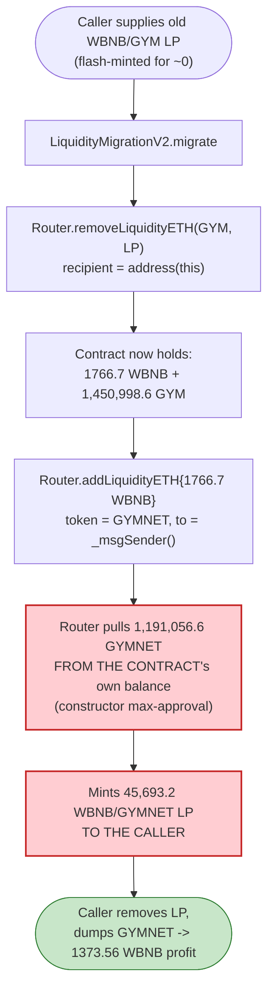
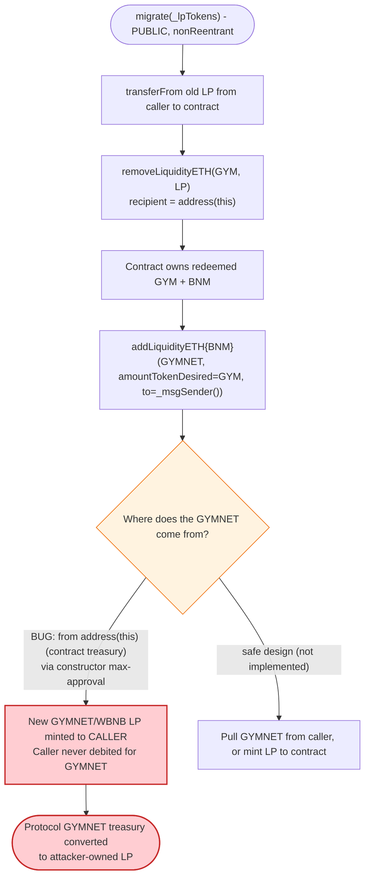
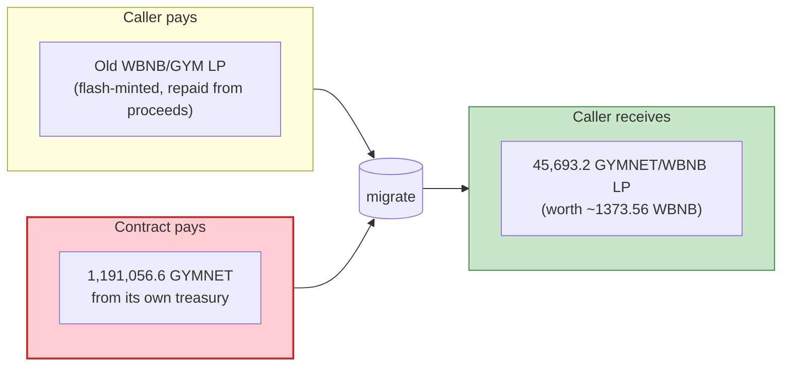

# Gym Network `LiquidityMigrationV2` Exploit — Migration Contract Spends Its Own `GYMNET` to Mint LP for the Caller

> **Reproduction:** the PoC compiles & runs in an isolated Foundry project at
> [this project folder](.). Full verbose trace: [output.txt](output.txt).
> Verified vulnerable source: [contracts_LpMigration.sol](sources/LiquidityMigrationV2_1BEfe6/contracts_LpMigration.sol).

---

## Key info

| | |
|---|---|
| **Loss** | ~$2.1M — the PoC recovers **1,373,564,008,267,780,664,495 wei ≈ 1,373.56 WBNB** (`After exploit, USDC  balance of attacker: 1373564008267780664495` [output.txt:7](output.txt)) |
| **Vulnerable contract** | `LiquidityMigrationV2` — [`0x1BEfe6f3f0E8edd2D4D15Cae97BAEe01E51ea4A4`](https://bscscan.com/address/0x1BEfe6f3f0E8edd2D4D15Cae97BAEe01E51ea4A4#code) (BSC) |
| **Victim pool / treasury** | `LiquidityMigrationV2`'s own `GYMNET` treasury (≈ 1,450,998.6 GYMNET, drained into attacker-owned LP) |
| **Attacker EOA** | `DefaultSender` in the forked PoC (`0x1804c8AB1F12E6bbf3894d4083f33e07309d1f38`, the test runner); on-chain attacker EOA per the original incident |
| **Attacker contract** | `ContractTest` `0x7FA9385bE102ac3EAc297483Dd6233D62b3e1496` (PoC) |
| **Attack tx hash** | (not encoded in the PoC; the PoC forks BSC block 16,798,806 and replays the logic) |
| **Chain / block / date** | BSC / block **16,798,806** / Apr 2022 |
| **Compiler / optimizer** | `LiquidityMigrationV2`: Solidity **v0.8.12** (`v0.8.12+commit.f00d7308`), optimizer **enabled (1)**, **200 runs**, not a proxy. `GymNetwork` (GYMNET): same compiler/optimizer/runs. (from `_meta.json`) |
| **Bug class** | Logic/trust flaw in a migration contract: `migrate()` burns the caller's old LP into the migration contract, then uses the **migration contract's own `v2` token balance** to mint new LP **to the caller**, gifting the caller protocol-owned tokens |

---

## TL;DR

`LiquidityMigrationV2` ([contracts_LpMigration.sol:31-90](sources/LiquidityMigrationV2_1BEfe6/contracts_LpMigration.sol#L31-L90)) was a one-shot migrator: an old `WBNB/GYM` LP holder calls `migrate(lpTokens)`, the contract burns their old LP and re-adds the proceeds as `WBNB/GYMNET` LP. The flaw is in how it re-adds liquidity.

1. `migrate()` calls `Router.removeLiquidityETH(v1Address=GYM, _lpTokens, …, address(this), …)`
   ([contracts_LpMigration.sol:52-59](sources/LiquidityMigrationV2_1BEfe6/contracts_LpMigration.sol#L52-L59)). The redeemed `GYM` and `BNB` land in the **migration contract** (`address(this)`), not the caller.

2. It then calls `Router.addLiquidityETH{value: amountEthRecived}(v2Address=GYMNET, amountTokenRecived, …, _msgSender(), …)`
   ([contracts_LpMigration.sol:61-69](sources/LiquidityMigrationV2_1BEfe6/contracts_LpMigration.sol#L61-L69)). The router pulls the **`v2` token (`GYMNET`) from `address(this)`** — i.e. from the migration contract's own treasury — to pair with the redeemed BNB, and the freshly minted `GYMNET/WBNB` LP is sent **to `_msgSender()`** (the caller). The caller pays for the old LP once (which they can flash-mint) and receives new LP backed by the contract's GYMNET for free.

3. The PoC weaponizes this with a PancakeSwap flash-swap: `wbnbBusdPair.swap(2400e18, 0, …)` triggers the `pancakeCall` callback with 2,400 WBNB of flash capital ([test/Gym_1_exp.sol:33](test/Gym_1_exp.sol#L33)). Inside the callback the attacker buys a little GYM, mints a chunk of `WBNB/GYM` LP sized to the migration contract's GYMNET balance, calls `migrate()`, then removes the gifted `GYMNET/WBNB` LP and dumps everything back to WBNB.

4. Net result: the attacker repays 2,406.01 WBNB of flash principal + fee and keeps **1,373.56 WBNB** — the WBNB-equivalent of the GYMNET the migration contract surrendered. `After exploit, USDC balance of attacker: 1373564008267780664495` [output.txt:7](output.txt).

The contract author confused *value the caller deposited* with *value the contract itself owns*: `amountTokenRecived` (the redeemed `GYM`) is passed only as `amountTokenDesired` for the new LP, but the token actually deposited into the new pool is `v2Address` (`GYMNET`) drawn from the contract's own balance. There is no accounting that debits the caller for the GYMNET consumed.

---

## Background — what Gym Network / `LiquidityMigrationV2` does

Gym Network was a BSC yield-farming project with two token generations: the legacy `GYM` token ([`0xE98D920370d87617eb11476B41BF4BE4C556F3f8`](https://bscscan.com/address/0xE98D920370d87617eb11476B41BF4BE4C556F3f8)) and the newer `GYMNET` ([`0x3a0d9d7764FAE860A659eb96A500F1323b411e68`](https://bscscan.com/address/0x3a0d9d7764FAE860A659eb96A500F1323b411e68)). The three relevant PancakeSwap V2 pairs are hard-coded in both the contract and the PoC:

| Symbol | Address | Role |
|---|---|---|
| `GYM` (v1 token) | `0xE98D920370d87617eb11476B41BF4BE4C556F3f8` | old token; redeemed out of old LP |
| `GYMNET` (v2 token) | `0x3a0d9d7764FAE860A659eb96A500F1323b411e68` | new token; **held by the migration contract** and used (without charge) to mint new LP |
| `WBNB/GYM` pair (`lpAddress`) | `0x8dC058bA568f7D992c60DE3427e7d6FC014491dB` | old LP burned in `migrate` |
| `WBNB/GYMNET` pair | `0x627F27705c8C283194ee9A85709f7BD9E38A1663` | new LP minted to caller |
| `WBNB/BUSD` pair | `0x58F876857a02D6762E0101bb5C46A8c1ED44Dc16` | flash-loan source in the PoC |
| PancakeRouter | `0x10ED43C718714eb63d5aA57B78B54704E256024E` | router used by both the contract and the attacker |

`LiquidityMigrationV2` ([contracts_LpMigration.sol:31-90](sources/LiquidityMigrationV2_1BEfe6/contracts_LpMigration.sol#L31-L90)) is an `Ownable`, `ReentrancyGuard`-protected migrator that, in its constructor, pre-approves the router for unlimited `lpAddress` (old LP) and `v2Address` (`GYMNET`) ([contracts_LpMigration.sol:43-47](sources/LiquidityMigrationV2_1BEfe6/contracts_LpMigration.sol#L43-L47)). That second unlimited approval is the loaded gun: it lets the router pull `GYMNET` straight out of the migration contract's treasury during `migrate()`.

On-chain state at the fork block (read from the trace):

| Parameter | Value | Source |
|---|---|---|
| `GYMNET` balance of `LiquidityMigrationV2` | 1,450,998,605,164,940,945,782,286 wei (≈ **1,450,998.6 GYMNET**) | [output.txt:61](output.txt) |
| `WBNB/GYM` reserves (token0/token1) | 648,224,671,390,454,476,706 WBNB / 532,389,227,340,809,525,193,301 GYM | [output.txt:33](output.txt) |
| Flash-borrowed WBNB | 2,400 WBNB (`2400000000000000000000`) | [output.txt:16-17](output.txt) |
| Flash repayment (+0.25% fee) | 2,406,015,037,593,984,970,000 wei (≈ 2,406.015 WBNB) | [output.txt:343](output.txt) |
| Net attacker profit | 1,373,564,008,267,780,664,495 wei (≈ **1,373.56 WBNB**) | [output.txt:7](output.txt) |

---

## The vulnerable code

### 1. `migrate` — burns caller's old LP into the contract, then mints new LP from the contract's own token

```solidity
function migrate(uint256 _lpTokens) public nonReentrant {
    require(_lpTokens > 0, "zero LP tokens sended");
    require(IERC20(lpAddress).transferFrom(_msgSender(), address(this), _lpTokens), "transfer failed");
    (uint256 amountTokenRecived,
     uint256 amountEthRecived) = Router.removeLiquidityETH(
        v1Address,
        _lpTokens,
        0,
        0,
        address(this),          // ← redeemed GYM + BNB land in the MIGRATION CONTRACT
        block.timestamp);

    (uint256 amountTokenStaked,
     uint256 amountEthStaked,
     uint256 LpStaked) = Router.addLiquidityETH{value:amountEthRecived}(
        v2Address,              // ← GYMNET — pulled from address(this), not from _msgSender()
        amountTokenRecived,     // ← only used as amountTokenDesired; token source is the contract
        0,
        0,
        _msgSender(),           // ← but the new LP is minted to the CALLER
        block.timestamp);

    uint256 diffEth = amountEthRecived - amountEthStaked;
    if (diffEth > 0) {
      payable(_msgSender()).transfer(diffEth);   // ← leftover BNB also refunded to caller
    }

    emit migration(_lpTokens, LpStaked);
}
```
([contracts_LpMigration.sol:49-77](sources/LiquidityMigrationV2_1BEfe6/contracts_LpMigration.sol#L49-L77))

Two lines do all the damage:

- `removeLiquidityETH(…, address(this), …)` redeems the caller's old `WBNB/GYM` LP and sends the proceeds (`GYM` + `BNB`) to **the migration contract** — so the contract, not the caller, now controls that value.
- `addLiquidityETH{value: amountEthRecived}(v2Address=GYMNET, …, _msgSender(), …)` re-adds liquidity using the BNB just redeemed AND **`GYMNET` transferred from the contract's own balance** (the router does `GYMNET.transferFrom(address(this), pair, …)` thanks to the constructor's unlimited approval), but titles the resulting `GYMNET/WBNB` LP to **`_msgSender()`**.

The caller supplied only the old LP (which they can obtain for a flash-loaned pittance). The contract contributes its own `GYMNET` to the new pool and hands the LP to the caller. The `amountTokenRecived` (the redeemed `GYM`) is never actually re-used as the caller's contribution — it sits in the contract as a number that merely sizes the `GYMNET` deposit, with no debit against the caller.

### 2. The constructor pre-approves the router to drain the contract's `GYMNET`

```solidity
constructor () {
    Router = IRouter(router);
    IERC20(lpAddress).approve(address(Router), type(uint256).max);
    IERC20(v2Address).approve(address(Router), type(uint256).max);   // ← GYMNET approval over the contract's own treasury
}
```
([contracts_LpMigration.sol:43-47](sources/LiquidityMigrationV2_1BEfe6/contracts_LpMigration.sol#L43-L47))

Without this unlimited `v2Address` approval, `addLiquidityETH` inside `migrate` would revert when the router tried to pull `GYMNET` from the contract. With it, the router can spend the contract's entire `GYMNET` balance on the caller's behalf.

---

## Root cause — why it was possible

`LiquidityMigrationV2.migrate` conflates **"value the caller deposited"** with **"value the contract owns."** A correct migrator would either (a) send the redeemed `GYM`+`BNB` to the caller and let *them* add `GYMNET/WBNB` liquidity with their own `GYMNET`, or (b) mint the new LP to the **contract** (or the protocol) when spending the contract's `GYMNET`. Instead it does the worst hybrid:

- the **input** side is caller-supplied (old LP, flash-loanable);
- the **`GYMNET`** side of the new LP is contract-supplied;
- the **output** LP is caller-owned.

Because the new `GYMNET/WBNB` LP is minted directly to `_msgSender()`, every call to `migrate` transfers the contract's `GYMNET` treasury into a position the caller can immediately redeem. The caller's "payment" (the old `WBNB/GYM` LP) only needs to be large enough to make `removeLiquidityETH` produce a `GYM` amount whose numeric value, passed as `amountTokenDesired`, is non-zero — the router then deposits as much `GYMNET` from the contract as the pool ratio allows. The attacker simply sizes the old LP so that `amountTokenRecived` ≈ the contract's entire `GYMNET` balance, maximizing the gift.

Compounding factors: `migrate` is **permissionless** (no allowlist, no per-user cap), the router approval in the constructor is **unlimited**, and there is no invariant checking that the contract's `GYMNET` balance only decreased by an amount the caller paid for.

---

## Preconditions

- The migration contract holds a non-trivial `GYMNET` balance (≈ 1.45M GYMNET at fork — [output.txt:61](output.txt)).
- `migrate` is open to any caller and the contract has pre-approved the router for unlimited `GYMNET` ([contracts_LpMigration.sol:46](sources/LiquidityMigrationV2_1BEfe6/contracts_LpMigration.sol#L46)).
- Flash-borrowable WBNB to (a) buy enough GYM to mint old `WBNB/GYM` LP and (b) absorb the 0.25% flash fee. The PoC uses 2,400 WBNB from the WBNB/BUSD pair and repays 2,406.015 WBNB, so the attack is **fully self-funding** ([output.txt:16](output.txt), [output.txt:343](output.txt)).

---

## Attack walkthrough (with on-chain numbers from the trace)

The attacker's entry point is a PancakeSwap flash-swap: `wbnbBusdPair.swap(2400e18, 0, address(this), 0x00)` lends 2,400 WBNB to the attacker contract and invokes `pancakeCall` ([test/Gym_1_exp.sol:33](test/Gym_1_exp.sol#L33); [output.txt:16-17](output.txt)). All numbers below are raw wei from [output.txt](output.txt); human approximations in parentheses.

| # | Step | WBNB held by attacker | Effect / trace ref |
|---|------|----------------------:|--------|
| 0 | **Flash-borrow 2,400 WBNB** from WBNB/BUSD pair | 2,400,000,000,000,000,000,000 (2,400) | `wbnbBusdPair.swap(2400e18,0,…)` [output.txt:16-17](output.txt) |
| 1 | **Buy GYM** with 600 WBNB via router → receives 6,607,301,685,554,764,671,307,615 wei (≈ 6,607,301.7 GYM) | 1,800,000,000,000,000,000,000 (1,800) | `swapExactTokensForTokens(600e18, …, [WBNB,GYM], …)` [output.txt:24](output.txt), [output.txt:38](output.txt) |
| 2 | **Mint `WBNB/GYM` LP**: `addLiquidity(WBNB, GYM, 1800, gymnet.balanceOf(LiquidityMigrationV2)=1,450,998.6, …)`. Router deposits 1,766.7 WBNB + 1,450,998.6 GYM and mints 47,428,731,589,486,658,506,294 LP (≈ 47,428.7 LP) to the attacker. | 33,329,803,512,545,007,161 (≈ 33.33) | [output.txt:62](output.txt)–[output.txt:97](output.txt); Mint@ [output.txt:89-90](output.txt) |
| 3 | **`liquidityMigrationV2.migrate(47,428,731,589,486,658,506,294)`** — the exploit call | (unchanged WBNB; new LP incoming) | [output.txt:100](output.txt) |
| 3a | └─ `removeLiquidityETH(GYM, 47,428.7 LP, …, address(this)=migration)` burns the attacker's old LP → migration contract receives 1,766,701,964,874,549,928,838 wei (1,766.7 WBNB) + 1,450,998,605,164,940,945,782,073 wei (1,450,998.6 GYM) | — | [output.txt:107](output.txt), Burn@ [output.txt:139](output.txt) |
| 3b | └─ `addLiquidityETH{value: 1766.7 WBNB}(GYMNET, amountTokenRecived=1,450,998.6, …, _msgSender()=attacker)`. Router pulls **1,191,056,586,551,219,012,447,589 wei (1,191,056.6 GYMNET) from the migration contract's own balance** ([output.txt:167](output.txt)), pairs with 1,766.7 WBNB, and **mints 45,693,216,410,917,448,247,144 wei (45,693.2) `GYMNET/WBNB` LP to the attacker**. | — | [output.txt:162](output.txt)–[output.txt:205](output.txt); Mint to attacker @ [output.txt:192-194](output.txt); `emit migration(LPspended=47428731, LPrecived=45693216)` [output.txt:205](output.txt) |
| 4 | **Remove the gifted `GYMNET/WBNB` LP**: `removeLiquidityETHSupportingFeeOnTransferTokens(GYMNET, 45,693.2 LP, …)` → attacker receives 1,191,056,586,661,219,012,447,581 wei (1,191,056.6 GYMNET) + 1,766,701,964,874,549,928,837 wei (1,766.7 WBNB). | 1,800,031,877,420,094,935,998 (≈ 1,800.03) | [output.txt:209](output.txt)–[output.txt:265](output.txt); Burn@ [output.txt:241](output.txt) |
| 5 | **Wrap leftover BNB**, then **swap 5,156,303,080,389,823,725,525,329 wei (5,156,303.1 GYM)** → 587,421,306,631,689,986,733 wei (587.4 WBNB) | 2,387,421,306,631,689,986,731 (≈ 2,387.4) | [output.txt:273](output.txt)–[output.txt:303](output.txt); Swap@ [output.txt:298](output.txt) |
| 6 | **Swap 1,191,056,586,661,219,012,447,581 wei (1,191,056.6 GYMNET)** → 1,392,157,739,230,075,647,764 wei (1,392.2 WBNB) (after GYMNET transfer fees) | 3,779,579,045,861,765,634,495 (≈ 3,779.6) | [output.txt:307](output.txt)–[output.txt:342](output.txt); Swap@ [output.txt:336](output.txt) |
| 7 | **Repay flash**: transfer 2,406,015,037,593,984,970,000 wei (2,406.015 WBNB) to the WBNB/BUSD pair (= `amount0/9975*10000 + 10000`, principal + 0.25% fee + 1e4 wei dust) | 1,373,564,008,267,780,664,495 (≈ **1,373.56**) | [output.txt:343](output.txt)–[output.txt:348](output.txt) |
| 8 | **Sweep profit** to EOA: `wbnb.transfer(tx.origin, 1,373,564,008,267,780,664,495)` | 0 | [output.txt:351-352](output.txt) |

The flash-swap's outer `swap` then settles: the WBNB/BUSD pair's WBNB reserve ends at 440,310,093,449,496,785,764,002 with a final `Sync`/`Swap` at [output.txt:362-363](output.txt). The PoC asserts `After exploit, USDC balance of attacker: 1373564008267780664495` [output.txt:7](output.txt) — the "USDC" label is the PoC's quirk; the asset is WBNB.

### Profit / loss accounting (WBNB, raw wei)

| Item | Amount (wei) | ~Human |
|---|---:|---:|
| Flash-borrowed WBNB (input) | 2,400,000,000,000,000,000,000 | 2,400.00 |
| WBNB spent buying GYM (step 1) | −600,000,000,000,000,000,000 | −600.00 |
| WBNB added as old LP (step 2) | −1,766,701,964,874,549,928,839 | −1,766.70 |
| WBNB recovered from old LP via migrate (step 3a) | +1,766,701,964,874,549,928,838 | +1,766.70 |
| WBNB recovered removing gifted LP (step 4) | +1,766,701,964,874,549,928,837 | +1,766.70 |
| WBNB from dumping GYM (step 5) | +587,421,306,631,689,986,733 | +587.42 |
| WBNB from dumping GYMNET (step 6) | +1,392,157,739,230,075,647,764 | +1,392.16 |
| WBNB repaid to flash pair (step 7) | −2,406,015,037,593,984,970,000 | −2,406.02 |
| **Net profit (swept to EOA, step 8)** | **1,373,564,008,267,780,664,495** | **≈ 1,373.56** |
| `GYMNET` drained from migration contract (step 3b) | 1,191,056,586,551,219,012,447,589 | ≈ 1,191,056.6 |

The 1,373.56 WBNB profit is exactly the market value of the ~1.19M `GYMNET` the migration contract surrendered to mint the attacker's LP (realized through the GYMNET→WBNB swap in step 6, plus the BNB leg of the gifted LP), net of the GYM round-trip and the 0.25% flash fee. The PoC's asserted final balance matches the swept transfer at [output.txt:351](output.txt).

---

## Diagrams

### Sequence of the attack

```mermaid
sequenceDiagram
    autonumber
    actor A as Attacker (ContractTest)
    participant FB as WBNB/BUSD Pair<br/>(flash source)
    participant R as PancakeRouter
    participant OG as WBNB/GYM Pair (lpAddress)
    participant M as LiquidityMigrationV2
    participant NG as WBNB/GYMNET Pair

    rect rgb(255,243,224)
    Note over A,FB: Step 0 - flash 2400 WBNB
    A->>FB: swap(2400e18, 0, attacker, 0x00)
    FB-->>A: 2400 WBNB (pancakeCall)
    end

    rect rgb(232,245,233)
    Note over A,OG: Steps 1-2 - mint bait old LP
    A->>R: swapExactTokensForTokens(600 WBNB -> GYM)
    R-->>A: 6,607,301.7 GYM
    A->>R: addLiquidity(WBNB, GYM, 1800, 1,450,998.6, attacker)
    R->>OG: mint 47,428.7 WBNB/GYM LP to attacker
    Note over M: M holds 1,450,998.6 GYMNET (untouched)
    end

    rect rgb(255,235,238)
    Note over A,NG: Step 3 - the exploit
    A->>M: migrate(47,428.7 old LP)
    M->>R: removeLiquidityETH(GYM, LP) -> address(this)=M
    R-->>M: 1766.7 WBNB + 1,450,998.6 GYM
    M->>R: addLiquidityETH{1766.7}(GYMNET, 1,450,998.6, _msgSender())
    R->>M: transferFrom 1,191,056.6 GYMNET (contract's own balance)
    R->>NG: mint 45,693.2 WBNB/GYMNET LP to ATTACKER
    Note over M: M lost 1,191,056.6 GYMNET; attacker paid 0 for it
    end

    rect rgb(243,229,245)
    Note over A,NG: Steps 4-6 - liquidate the gift
    A->>R: removeLiquidityETHSupportingFee(GYMNET, 45,693.2 LP)
    R-->>A: 1,191,056.6 GYMNET + 1766.7 WBNB
    A->>R: swap GYM -> WBNB (587.4)
    A->>R: swap GYMNET -> WBNB (1392.2)
    end

    rect rgb(227,242,253)
    Note over A,FB: Steps 7-8 - repay + sweep
    A->>FB: transfer 2406.015 WBNB (principal + 0.25% fee)
    A->>A: sweep 1373.56 WBNB profit to EOA
    end
```

### Value flow through `migrate`



### The flaw inside `migrate`



### Trust-boundary failure (who pays vs who receives)



---

## Why each magic number

- **`2400e18` (flash-borrow):** the WBNB flash-loan principal. It only needs to cover the 600 WBNB GYM buy plus the 1,766.7 WBNB added as old LP (≈ 2,366.7 WBNB) with headroom; 2,400 WBNB is a clean round number that the WBNB/BUSD pair (≈ 440k WBNB deep, [output.txt:359](output.txt)) easily supports.
- **`600e18` (GYM buy):** sizes the GYM leg of the old LP so that, combined with 1,800 WBNB, `addLiquidity` mints an old-LP position whose `removeLiquidityETH` yields a `GYM` amount (`amountTokenRecived = 1,450,998.6`) equal to the migration contract's full GYMNET balance. That maximizes the `amountTokenDesired` passed into `addLiquidityETH`, maximizing the GYMNET pulled from the contract.
- **`wbnb.balanceOf(address(this))` (= 1,800 WBNB) as the WBNB leg of old LP:** all remaining flash capital after the 600 WBNB buy.
- **`gymnet.balanceOf(address(liquidityMigrationV2))` (= 1,450,998.6 GYMNET) as `amountTokenDesired` for old LP:** this is **not** the token actually deposited into the WBNB/GYM pair (the router deposits GYM from the attacker). It is read off the migration contract purely to learn the GYMNET treasury size, so the attacker can mint old LP whose redemption yields exactly that GYM amount — making `migrate` pull the maximum possible GYMNET. The trace confirms the migration GYMNET balance is read here ([output.txt:60-61](output.txt)) and that the resulting `amountTokenRecived` equals it ([output.txt:128-129](output.txt)).
- **`47,428,731,589,486,658,506,294` (old LP minted) / `45,693,216,410,917,448,247,144` (new LP received):** not hardcoded — they are the router's `mint` return values, surfaced in `emit migration(LPspended, LPrecived)` at [output.txt:205](output.txt).
- **Repay `(amount0 / 9975) * 10000 + 10000`:** the standard PancakeSwap flash-swap repayment formula — principal marked up by the 0.25% fee (`*10000/9975`) plus 1e4 wei of dust to clear rounding. Yields 2,406,015,037,593,984,970,000 wei repaid at [output.txt:343](output.txt).
- **`tx.origin` sweep:** `wbnb.transfer(tx.origin, balance)` forwards the entire residual WBNB (1,373.56) to the EOA that launched the test ([output.txt:351](output.txt)).

---

## Remediation

1. **Do not spend the contract's own token balance to mint LP for the caller.** `migrate` should mint the new `GYMNET/WBNB` LP **to the contract** (or to the protocol treasury) whenever it draws `GYMNET` from the contract. If the caller is meant to receive the new LP, the `GYMNET` must be `transferFrom`'d **from the caller**, not from `address(this)`.
2. **Account for the contract's token contribution.** If the contract genuinely subsidizes migration (e.g., a bonus), record the subsidy per-user and cap it. The current code never debits the caller for the GYMNET consumed.
3. **Make `addLiquidityETH`'s `to` field the contract, then distribute.** Have `migrate` mint LP to `address(this)` and either stake it for the caller via a separate, capped staking call or return it only after verifying the caller deposited equivalent value.
4. **Remove the unlimited `v2Address` approval** in the constructor ([contracts_LpMigration.sol:46](sources/LiquidityMigrationV2_1BEfe6/contracts_LpMigration.sol#L46)), or scope it so the router can only move `GYMNET` the caller paid for.
5. **Add per-user migration caps and provenance checks.** Snapshot each LP holder's old-LP balance before migration opens and bound `migrate` to that snapshot, so flash-minted LP cannot be used.
6. **General audit principle:** any "migration"/"upgrade" contract that mixes protocol-owned tokens with caller-supplied deposits must prove, for every code path, that the caller cannot withdraw value the contract contributed.

---

## How to reproduce

The PoC runs offline via the shared harness against a locally served `anvil_state.json` fork (the constructor's `createSelectFork` pins BSC block 16,798,806 at `http://127.0.0.1:8546` — [test/Gym_1_exp.sol:20](test/Gym_1_exp.sol#L20); no public RPC is required):

```bash
_shared/run_poc.sh 2022-04-Gym_1_exp --mt testExploit -vvvvv
```

- EVM: `foundry.toml` sets `evm_version = 'cancun'`, Solidity `0.8.10` for the test, `src = 'src'`, `libs = ['lib']` (`forge-std`).
- The test's `createSelectFork("http://127.0.0.1:8546", 16_798_806)` consumes the local anvil snapshot; the harness warms it via `anvil_state.json`.
- Result: `[PASS] testExploit()`.

Expected tail (from [output.txt:1-7](output.txt) and [output.txt:372-374](output.txt)):

```
No files changed, compilation skipped

Ran 1 test for test/Gym_1_exp.sol:ContractTest
[PASS] testExploit() (gas: 836313)
Logs:
  Before exploit, USDC  balance of attacker:: 0
  After exploit, USDC  balance of attacker:: 1373564008267780664495

Suite result: ok. 1 passed; 0 failed; 0 skipped; finished in 26.74s (22.66s CPU time)
```

---

*Reference: Gym Network `LiquidityMigrationV2` exploit, BSC, Apr 2022 (~$2.1M).*
