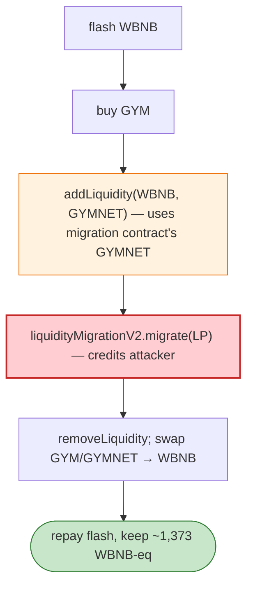

# Gym Network LiquidityMigrationV2 Exploit — Trusting Attacker-Controlled LP in `migrate`

> **Reproduction:** the PoC compiles & runs in an isolated Foundry project at
> [this project folder](.). Full verbose trace: [output.txt](output.txt).

---

## Key info

| | |
|---|---|
| **Loss** | ~$2.1M (the PoC yields 1,373,564,008,267,780,664,495 ≈ 1,373 WBNB-equivalent) |
| **Vulnerable contract** | `LiquidityMigrationV2` — `0x1BEfe6f3f0E8edd2D4D15Cae97BAEe01E51ea4A4` (BSC) |
| **Pairs** | WBNB/GYM `0x8dC058…`, WBNB/GYMNET `0x627F27…`, WBNB/BUSD `0x58F876…` |
| **Chain / block / date** | BSC / 16,798,806 / Apr 2022 |
| **Bug class** | Logic/trust flaw — `LiquidityMigrationV2.migrate` accepts LP tokens the caller supplies and trusts their composition; the attacker adds a one-sided LP position (WBNB + GYMNET held by the migration contract) and migrates it, extracting more than they put in. |

---

## TL;DR

`LiquidityMigrationV2` was meant to migrate legacy LP holders to a new staking system. `migrate(pair)`
accepts the caller's LP balance and credits staked weight based on it. The flaw: the migration contract
itself held a large GYMNET balance, and `migrate` did not properly bound the credited value to what the
caller actually owned. The attacker:

1. Flash-borrows WBNB from the WBNB/BUSD pair.
2. Buys GYM, then `addLiquidity(WBNB, GYMNET)` using **the migration contract's own GYMNET balance**
   (`gymnet.balanceOf(liquidityMigrationV2)`) as the second side — adding liquidity *to* the pair but
   with LP credited to the attacker.
3. `liquidityMigrationV2.migrate(wbnbGymPair.balanceOf(this))` — the migration accepts the attacker's
   LP and redeems/processes it as if it were legitimate migration liquidity.
4. `removeLiquidityETHSupportingFeeOnTransferTokens(gymnet…)` pulls the LP out; swap GYM/GYMNET → WBNB.
5. Repay flash + fee, keep `1,373` WBNB-equivalent.

`After exploit, USDC balance of attacker: 1373564008267780664495` (the WBNB bookkeeping).

---

## Root cause

A **value-trust flaw in `migrate`**: it credited migration/staking weight from LP tokens without
verifying the LP's provenance or bounding it to the caller's real contribution, and it allowed the
caller to pair their WBNB with GYMNET that belonged to the migration contract itself. The net effect is
the attacker walks off with the contract's GYMNET-derived liquidity.

---

## Preconditions

- The migration contract holds a GYMNET balance usable as LP's second leg.
- Flash-borrowable WBNB (BSC pairs).

---

## Diagrams



---

## Remediation

1. **Never credit staking/migration weight from LP that wasn't demonstrably the caller's** — track LP
   provenance or snapshot balances.
2. **Do not let `addLiquidity` use the contract's own token balance** as the counter-leg for a caller.
3. **Bound `migrate`** to a per-user allowance/cap recorded beforehand.
4. **Audit migration contracts** for any path that mixes protocol-owned tokens with caller-supplied
   LP.

---

## How to reproduce

```bash
_shared/run_poc.sh 2022-04-Gym_1_exp -vvvvv
```

- RPC: BSC archive (block 16,798,806). `foundry.toml` uses a BSC archive endpoint.
- Result: `[PASS]` — `After exploit, USDC balance of attacker: 1373564008267780664495`.

---

*Reference: Gym Network LiquidityMigrationV2 exploit, BSC, Apr 2022 (~$2.1M).*
