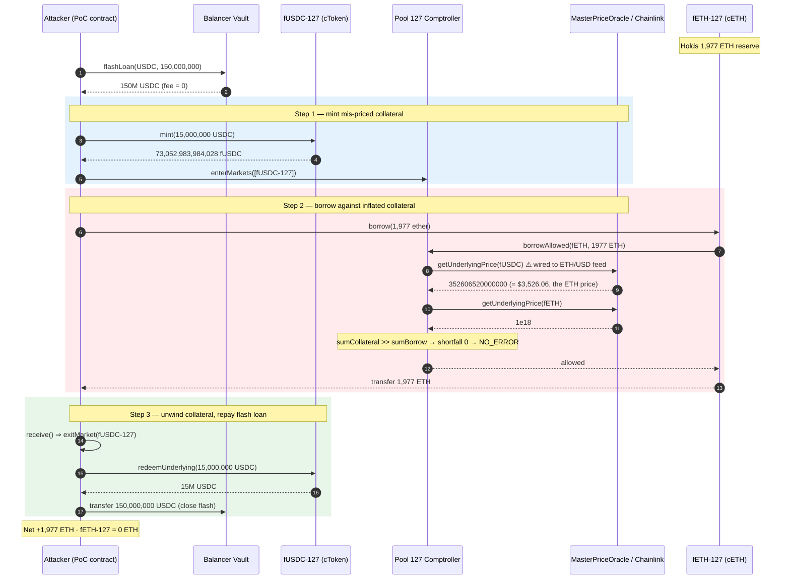
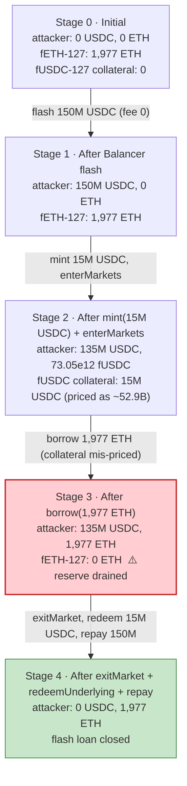
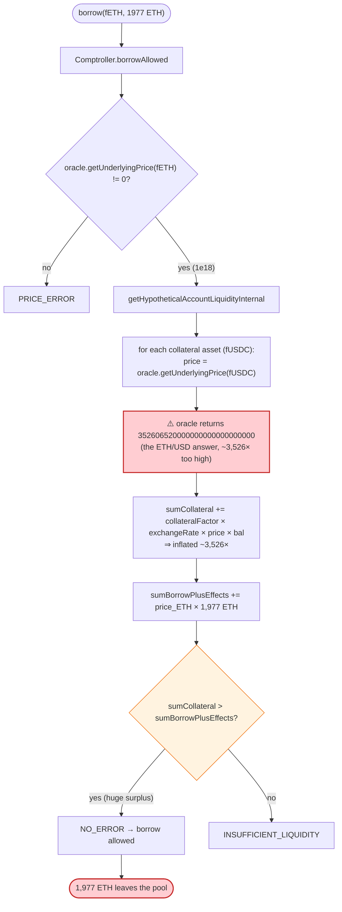
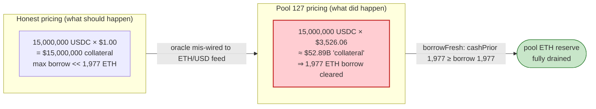

# Rari Capital / Fei Protocol Fuse Exploit — Mis-Configured Collateral Oracle (USDC Priced Off the ETH/USD Chainlink Feed)

> **Reproduction:** the PoC compiles & runs in an isolated Foundry project at [this project folder](.).
> Full verbose trace: [output.txt](output.txt). Verified vulnerable source (the Fuse Pool 127
> Comptroller that prices collateral): [sources/Comptroller_E16DB3/Comptroller.sol](sources/Comptroller_E16DB3/Comptroller.sol),
> with the cToken mint/borrow plumbing in
> [sources/CEtherDelegator_26267e/CEtherDelegator.sol](sources/CEtherDelegator_26267e/CEtherDelegator.sol).

---

## Key info

| | |
|---|---|
| **Loss** | ~**$80M** total across the exploited Fuse pools (documented industry figure for the Apr 30 2022 Rari/Fei incident). This PoC isolates the **Pool 127** leg, in which **1,977 ETH** (~**$6.97M** at the trace's ETH/USD of \$3,526.06) is borrowed out of the fETH market against mis-priced USDC collateral. |
| **Vulnerable contract** | Rari Fuse **Pool 127** Comptroller (Unitroller) — [`0x3f2D1BC6D02522dbcdb216b2e75eDDdAFE04B16F`](https://etherscan.io/address/0x3f2D1BC6D02522dbcdb216b2e75eDDdAFE04B16F#code); its `MasterPriceOracle` (`0xe10242…1493`) priced the pool's **USDC** market off the **ETH/USD** Chainlink feed. |
| **Victim markets** | fETH-127 [`0x26267e41CeCa7C8E0f143554Af707336f27Fa051`](https://etherscan.io/address/0x26267e41CeCa7C8E0f143554Af707336f27Fa051) (drained of all 1,977 ETH) and fUSDC-127 [`0xEbE0d1cb6A0b8569929e062d67bfbC07608f0A47`](https://etherscan.io/address/0xEbE0d1cb6A0b8569929e062d67bfbC07608f0A47) (collateral minted into). |
| **Flash-loan source** | Balancer Vault — [`0xBA12222222228d8Ba445958a75a0704d566BF2C8`](https://etherscan.io/address/0xBA12222222228d8Ba445958a75a0704d566BF2C8) (150,000,000 USDC, zero-fee). |
| **Attacker (PoC)** | Attack contract (the Foundry test) [`0x7FA9385bE102ac3EAc297483Dd6233D62b3e1496`](https://etherscan.io/address/0x7FA9385bE102ac3EAc297483Dd6233D62b3e1496) — see [output.txt:1585](output.txt). The original on-chain attacker EOA/tx for the Apr 30 2022 incident is documented publicly; this PoC is a self-contained reproduction and does not embed it. |
| **Attack tx / block / date** | Ethereum mainnet / block **14,684,813** / **Apr 30, 2022** ([output.txt:1576](output.txt)). |
| **Chain** | Ethereum mainnet (Chainlink ETH/USD feed timestamp `1651284587` = Apr 30 2022 — [output.txt:2098](output.txt)). |
| **Compiler / optimizer** | Verified sources compiled with **Solidity v0.5.17** (`+commit.d19bba13`), **optimizer enabled, 200 runs**, deployed as delegate-call proxies (Unitroller → Comptroller impl `0xe16db3…`; fUSDC → CErc20Delegate `0x67Db14…`; fETH → CEtherDelegate `0xd77E28…`). The PoC itself is compiled with **solc 0.8.34** ([output.txt:1](output.txt)). |
| **Bug class** | **Oracle mis-configuration** — a Fuse money-market collateral oracle that returned the **wrong asset's** Chainlink price (USDC priced off the ETH/USD feed), letting a borrower over-collateralise with cheap stablecoins and borrow the pool's real ETH. |

---

## TL;DR

Rari **Fuse** was a permissionless Compound fork: anyone could spin up an isolated lending "pool", and each pool's `Comptroller` priced every listed cToken's underlying through a pluggable `PriceOracle` (`oracle.getUnderlyingPrice(cToken)`). Pool 127's `MasterPriceOracle` was wired so that the **fUSDC-127 market read its price from the ETH/USD Chainlink aggregator** instead of a USDC/USD source. The trace shows this directly: when the Comptroller asks for USDC's price, the call chain descends into a Chainlink `EACAggregatorProxy` that returns the **ETH/USD** answer `352606520000000` (\$3,526.065), and `MasterPriceOracle.getUnderlyingPrice(fUSDC)` returns `352606520000000000000000000` ([output.txt:2098-2107](output.txt)). ETH, by contrast, is honestly priced at `1000000000000000000` (1e18 = \$1 in this pool's normalized units) ([output.txt:1949-1951](output.txt)).

That single mis-configuration makes 1 USDC worth ~3,526× what it should be as collateral, so the attacker can manufacture enormous borrowing power from almost nothing:

1. **Flash-borrow 150,000,000 USDC** from the Balancer Vault at **zero fee** ([output.txt:1585](output.txt), `getFlashLoanFeePercentage() → 0` at [output.txt:1590-1591](output.txt)).
2. **Supply 15,000,000 USDC** (15e12 micro-USDC) into fUSDC-127 via `fusdc_127.mint(15_000_000_000_000)` and `enterMarkets([fUSDC])` to post it as collateral ([output.txt:1649](output.txt), [output.txt:1840](output.txt)). Mint receives `73,052,983,984,028` fUSDC and leaves 135M USDC idle in the attacker's balance ([output.txt:1768](output.txt), [output.txt:1830](output.txt)).
3. **Borrow 1,977 ETH** from fETH-127 with `fETH_127.borrow(1977 ether)`. Because the USDC collateral is priced ~3,526× too high, the hypothetical-liquidity check in `getHypotheticalAccountLiquidityInternal` ([sources/Comptroller_E16DB3/Comptroller.sol#L834-L890](sources/Comptroller_E16DB3/Comptroller.sol#L834-L890)) sees a huge surplus and `borrowAllowed` returns `NO_ERROR` ([output.txt:1900](output.txt)). The `Borrow` event confirms `borrowAmount = 1,977 ETH` ([output.txt:2522](output.txt)).
4. The ETH transfer into the attacker contract triggers its `receive()` → **`exitMarket(fUSDC)`** ([output.txt:2252-2262](output.txt)), removing the now-borrowed-against collateral from the liquidity picture so it can be redeemed.
5. **Redeem the 15M USDC back** with `redeemUnderlying(15_000_000_000_000)` ([output.txt:2596](output.txt)), then **transfer 150,000,000 USDC back to the Balancer Vault** to close the flash loan ([output.txt:2716](output.txt), `USDC balance after repayying: 0`).

Net result of this single pool: the attacker walks away with **1,977 ETH** while the flash loan is repaid in full and the fETH-127 pool is left with **0 ETH** ([output.txt:1569](output.txt)). At the trace's ETH/USD of \$3,526.06, that is **~$6.97M** from Pool 127 alone; the wider incident drained ~$80M across several similarly mis-configured pools.

---

## Background — what Rari Fuse does

Rari Capital (later merged into **Fei Protocol**) ran **Fuse**: a set of isolated, user-creatable lending pools built on the Compound v2 codebase. Each pool is a `Comptroller` (behind a `Unitroller` transparent proxy) plus a set of **cToken** markets (`CErc20Delegate` for ERC20s, `CEtherDelegate` for native ETH). Users `mint` cTokens by supplying an underlying asset (collateral), then `borrow` other underlyings against that collateral subject to a per-market `collateralFactorMantissa` and a global liquidity check.

The borrowing-power calculation lives in `Comptroller.getHypotheticalAccountLiquidityInternal`: for every market the account is in, it multiplies `(collateralFactor × exchangeRate × oraclePrice) × cTokenBalance` to get collateral value, and `oraclePrice × (borrows + effects)` to get liabilities; collateral must exceed liabilities or the borrow reverts with `INSUFFICIENT_LIQUIDITY`. **Every term is honest except `oraclePrice`** — which the Comptroller blindly trusts from the pool's configured `PriceOracle`. That trust is the entire attack surface.

On-chain parameters observed in the trace for Pool 127 (block 14,684,813):

| Parameter | Value | Source |
|---|---|---|
| fETH-127 ETH cash (before) | **1,977 ETH** (the whole reserve) | [output.txt:1564](output.txt) |
| fETH-127 ETH cash (after) | **0 ETH** | [output.txt:1569](output.txt) |
| Borrow amount | `19,770,000,000,000,000,000,000` wei = **1,977 ETH** | [output.txt:2522](output.txt) |
| Mint into fUSDC-127 | `15,000,000,000,000` = **15,000,000 USDC** (6 dp) | [output.txt:1649](output.txt) |
| fUSDC minted (`mintTokens`) | `73,052,983,984,028` | [output.txt:1768](output.txt) |
| Balancer flash-loan amount | `150,000,000,000,000` = **150,000,000 USDC** | [output.txt:1585](output.txt) |
| Balancer flash-loan fee | **0** (`getFlashLoanFeePercentage → 0`) | [output.txt:1590-1591](output.txt) |
| Chainlink answer read for "USDC" | `352606520000000` (8 dp) = **\$3,526.065** — this is the **ETH/USD** feed | [output.txt:2098](output.txt) |
| `MasterPriceOracle.getUnderlyingPrice(fUSDC-127)` | `352,606,520,000,000,000,000,000,000` | [output.txt:2104-2107](output.txt) |
| `MasterPriceOracle.getUnderlyingPrice(fETH-127)` | `1,000,000,000,000,000,000` (1e18) | [output.txt:1949-1951](output.txt) |
| USDC `decimals()` | **6** | [output.txt:2101-2103](output.txt) |
| Chainlink round timestamp | `1651284587` = **Apr 30 2022** | [output.txt:2098](output.txt) |

The smoking gun is rows 8-9: the same Chainlink answer (`352606520000000`, the ETH/USD price) is what the pool returns as USDC's underlying price. USDC — a dollar stablecoin — is being valued at the price of one whole ether.

---

## The vulnerable code

### 1. The collateral-liquidity check blindly trusts `oracle.getUnderlyingPrice`

```solidity
function getHypotheticalAccountLiquidityInternal(
    address account,
    CToken cTokenModify,
    uint redeemTokens,
    uint borrowAmount
) internal view returns (Error, uint, uint) {
    AccountLiquidityLocalVars memory vars;
    uint oErr;

    CToken[] memory assets = accountAssets[account];
    for (uint i = 0; i < assets.length; i++) {
        CToken asset = assets[i];
        (oErr, vars.cTokenBalance, vars.borrowBalance, vars.exchangeRateMantissa) = asset.getAccountSnapshot(account);
        if (oErr != 0) { return (Error.SNAPSHOT_ERROR, 0, 0); }
        vars.collateralFactor = Exp({mantissa: markets[address(asset)].collateralFactorMantissa});
        vars.exchangeRate    = Exp({mantissa: vars.exchangeRateMantissa});

        // Get the normalized price of the asset
        vars.oraclePriceMantissa = oracle.getUnderlyingPrice(asset);   // ← trusts the oracle, no sanity bound
        if (vars.oraclePriceMantissa == 0) { return (Error.PRICE_ERROR, 0, 0); }
        vars.oraclePrice = Exp({mantissa: vars.oraclePriceMantissa});

        // Pre-compute a conversion factor from tokens -> ether (normalized price value)
        vars.tokensToDenom = mul_(mul_(vars.collateralFactor, vars.exchangeRate), vars.oraclePrice);

        vars.sumCollateral = mul_ScalarTruncateAddUInt(vars.tokensToDenom, vars.cTokenBalance, vars.sumCollateral);
        vars.sumBorrowPlusEffects = mul_ScalarTruncateAddUInt(vars.oraclePrice, vars.borrowBalance, vars.sumBorrowPlusEffects);

        if (asset == cTokenModify) {
            vars.sumBorrowPlusEffects = mul_ScalarTruncateAddUInt(vars.tokensToDenom, redeemTokens, vars.sumBorrowPlusEffects);
            vars.sumBorrowPlusEffects = mul_ScalarTruncateAddUInt(vars.oraclePrice, borrowAmount, vars.sumBorrowPlusEffects);
        }
    }

    if (vars.sumCollateral > vars.sumBorrowPlusEffects) {
        return (Error.NO_ERROR, vars.sumCollateral - vars.sumBorrowPlusEffects, 0);
    } else {
        return (Error.NO_ERROR, 0, vars.sumBorrowPlusEffects - vars.sumCollateral);
    }
}
```
([sources/Comptroller_E16DB3/Comptroller.sol#L834-L890](sources/Comptroller_E16DB3/Comptroller.sol#L834-L890))

There is **no bound, no cross-check, and no staleness guard** on the value the oracle returns. `sumCollateral` scales linearly with `oraclePriceMantissa`, so an oracle that over-reports by ~3,526× inflates borrowing power by the same factor.

### 2. `borrowAllowed` only checks "price is non-zero" — not that the price is *sane*

```solidity
function borrowAllowed(address cToken, address borrower, uint borrowAmount) external returns (uint) {
    require(!borrowGuardianPaused[cToken], "borrow is paused");
    if (!markets[cToken].isListed) { return uint(Error.MARKET_NOT_LISTED); }
    ...
    // Make sure oracle price is available
    if (oracle.getUnderlyingPrice(CToken(cToken)) == 0) {
        return uint(Error.PRICE_ERROR);
    }
    ...
    // Perform a hypothetical liquidity check to guard against shortfall
    (Error err, , uint shortfall) = getHypotheticalAccountLiquidityInternal(borrower, CToken(cToken), 0, borrowAmount);
    if (err != Error.NO_ERROR) { return uint(err); }
    if (shortfall > 0) { return uint(Error.INSUFFICIENT_LIQUIDITY); }
    return uint(Error.NO_ERROR);
}
```
([sources/Comptroller_E16DB3/Comptroller.sol#L376-L432](sources/Comptroller_E16DB3/Comptroller.sol#L376-L432))

The only oracle gate is a non-zero check. Any positive number — even one three orders of magnitude wrong — passes.

### 3. The `oracle` is a single trusted field, set once per pool

```solidity
PriceOracle public oracle;          // ComptrollerStorage — one oracle per pool, trusted blindly
...
function _setPriceOracle(PriceOracle newOracle) public returns (uint) { ... }
```
([sources/Comptroller_E16DB3/Comptroller.sol → ComptrollerStorage.sol#L55](sources/Comptroller_E16DB3/Comptroller.sol); setter at L1022)

Pool 127 pointed this field at a `MasterPriceOracle` whose configuration mapped the **fUSDC-127 market to the ETH/USD Chainlink aggregator**. The Compound-style architecture contains no defence against a pool admin simply wiring the wrong feed.

### 4. The mint → borrow path that turns fake collateral into real ETH

```solidity
// CToken.mintFresh — supply USDC, receive fUSDC, post as collateral
function mintFresh(address minter, uint mintAmount) internal returns (uint, uint) {
    uint allowed = comptroller.mintAllowed(address(this), minter, mintAmount);
    if (allowed != 0) { return (failOpaque(...), 0); }
    ...
}
```
([sources/CEtherDelegator_26267e/CEtherDelegator.sol → CToken.sol#L511-L520](sources/CEtherDelegator_26267e/CEtherDelegator.sol))

```solidity
// CToken.borrowFresh — the liquidity check at L757 is the only thing standing between
// the attacker and the pool's cash; it calls borrowAllowed (section 2 above).
function borrowFresh(address payable borrower, uint borrowAmount) internal returns (uint) {
    uint allowed = comptroller.borrowAllowed(address(this), borrower, borrowAmount);
    if (allowed != 0) { return failOpaque(...); }
    ...
    uint cashPrior = getCashPrior();
    if (cashPrior < borrowAmount) { return fail(Error.TOKEN_INSUFFICIENT_CASH, ...); }
    ...
}
```
([sources/CEtherDelegator_26267e/CEtherDelegator.sol → CToken.sol#L755-L772](sources/CEtherDelegator_26267e/CEtherDelegator.sol))

Once the inflated collateral posts, `borrowAllowed` clears and `borrowFresh` happily hands over the pool's entire ETH reserve — `cashPrior` (1,977 ETH) ≥ `borrowAmount` (1,977 ETH) by construction.

---

## Root cause — why it was possible

A **money market that prices collateral from a single, admin-configurable oracle and performs no sanity/cross-oracle bound on the returned price.** Pool 127's oracle was misconfigured to read the **ETH/USD** Chainlink feed for the **USDC** market, so 1 USDC was valued at ~\$3,526 — i.e. ~1 ether — instead of ~\$1. The Compound-style liquidity math then mechanically translated that 3,526× collateral over-valuation into a 3,526× borrowing-power over-allowance, and `borrowFresh` drained the pool's genuine ETH. No re-entrancy, no flash-loan price manipulation of an AMM, and no code exploit of the cToken itself was required — the attacker simply called the ordinary `mint` → `enterMarkets` → `borrow` → `redeemUnderlying` flow against an oracle that lied.

Three factors compounded it:

1. **Permissionless pool creation.** Fuse let anyone stand up a pool and choose its `PriceOracle`. A wrong mapping (USDC → ETH/USD feed) survived into production with no review gate.
2. **No price bound / deviation check.** `getHypotheticalAccountLiquidityInternal` and `borrowAllowed` accept any non-zero oracle answer. A dollar stablecoin returning a four-digit price raises no alarm.
3. **Free flash capital.** Balancer's zero-fee flash loan let the attacker borrow 150M USDC to manufacture the collateral base, then repay it in the same transaction once the real asset (ETH) had been extracted — zero net capital at risk.

---

## Preconditions

- A Fuse pool whose `MasterPriceOracle` mis-maps a collateral market to the wrong Chainlink feed (here fUSDC-127 → ETH/USD). This is the sole root cause.
- The pool must list a borrowable market with real, valuable reserves (fETH-127 held 1,977 ETH).
- A deep, zero-/low-fee flash-loan source large enough to fund the collateral deposit. Balancer Vault supplied 150M USDC at 0 fee ([output.txt:1590-1591](output.txt)).
- The attacker contract must accept ETH in `receive()`/`fallback()` so the borrowed ETH lands in a callback where it can `exitMarket` before redemption — the PoC's `receive()` calls `rari_Comptroller.exitMarket(address(fusdc_127))` ([Rari_exp.sol `receive()`](test/Rari_exp.sol)).

---

## Attack walkthrough (with on-chain numbers from the trace)

All amounts are raw wei as printed by the trace; human approximations in parentheses. USDC is 6 decimals, ETH is 18 decimals.

| # | Step | Attacker USDC (6dp) | fUSDC-127 collateral | fETH-127 ETH (18dp) | Attacker ETH | Trace ref |
|---|------|--------------------:|---------------------:|--------------------:|-------------:|-----------|
| 0 | **Initial state.** PoC sends its own test ETH to the burn address so it starts with 0 ETH. fETH-127 holds its full reserve. | 0 | 0 | **1,977** (1.977e21) | 0 | [output.txt:1564-1565](output.txt) |
| 1 | **Balancer flash-loan 150,000,000 USDC** (`Vault.flashLoan`, fee 0). | **150,000,000** (1.5e14) | 0 | 1,977 | 0 | [output.txt:1585](output.txt), [output.txt:1590-1591](output.txt), [output.txt:1605](output.txt) |
| 2 | **`fusdc_127.accrueInterest()`** then **`fusdc_127.mint(15,000,000 USDC)`**. Pool receives 15M USDC; minter credited `73,052,983,984,028` fUSDC (`mintTokens`). | 135,000,000 (1.35e14) | 15,000,000 USDC | 1,977 | 0 | [output.txt:1649](output.txt), [output.txt:1768](output.txt), [output.txt:1830](output.txt) |
| 3 | **`enterMarkets([fUSDC-127])`** — fUSDC now counts as collateral. | 135,000,000 | 15,000,000 (collateral) | 1,977 | 0 | [output.txt:1840](output.txt) |
| 4 | **Oracle consulted during `borrowAllowed(fETH-127, 1977 ether)`.** `getUnderlyingPrice(fUSDC)` → Chainlink ETH/USD answer `352606520000000` → returned as `352606520000000000000000000`. ETH price = `1e18`. The (collateralFactor × exchangeRate × price) math shows a vast surplus → `shortfall == 0` → `NO_ERROR`. | 135,000,000 | 15,000,000 | 1,977 | 0 | [output.txt:1900](output.txt), [output.txt:2098-2107](output.txt), [output.txt:1949-1951](output.txt) |
| 5 | **`fETH_127.borrow(1,977 ether)`** — `borrowFresh` sees `cashPrior 1,977 ETH ≥ borrowAmount 1,977 ETH` and emits `Borrow(borrowAmount 1977000000000000000000)`. The 1,977 ETH is sent to the attacker. | 135,000,000 | 15,000,000 | **0** | **1,977** | [output.txt:1871](output.txt), [output.txt:2522](output.txt), [output.txt:2546-2547](output.txt) |
| 6 | **`receive()` callback fires** on the incoming ETH → **`exitMarket(fUSDC-127)`**, removing the collateral from the liquidity picture so it can be redeemed cleanly. | 135,000,000 | 15,000,000 (no longer "in market") | 0 | 1,977 | [output.txt:2252-2262](output.txt) |
| 7 | **`fusdc_127.redeemUnderlying(15,000,000 USDC)`** — pulls the supplied USDC back. | **150,000,000** | 0 | 0 | 1,977 | [output.txt:2596](output.txt), [output.txt:2703](output.txt) |
| 8 | **Transfer 150,000,000 USDC back to the Balancer Vault** to close the flash loan. | **0** | 0 | 0 | 1,977 | [output.txt:2716](output.txt) |

**Final state:** fETH-127 is empty (0 ETH), the flash loan is repaid in full, and the attacker contract holds **1,977 ETH** — the pool's entire honest reserve — while posting and then withdrawing only 15M USDC of flash-borrowed capital that was never really at risk.

### Profit / loss accounting (Pool 127 leg)

| Item | Amount |
|---|---:|
| ETH gained (from fETH-127 borrow) | **+1,977.000 ETH** ([output.txt:2522](output.txt)) |
| ETH cost (own capital spent) | 0 (test ETH was burned in step 0; flash loan repaid) |
| USDC net (flash-borrowed = repaid) | 0 ([output.txt:2716](output.txt)) |
| **Net profit (this PoC)** | **+1,977 ETH ≈ \$6.97M** at ETH/USD \$3,526.06 ([output.txt:2098](output.txt)) |
| fETH-127 ETH balance after | **0** ([output.txt:1569](output.txt)) |

The PoC does not emit a single numeric "profit" assertion; its profitability is demonstrated by the post-attack balances it logs: `ETH Balance of fETH_127_Pool after borrowing: 0` and `ETH Balance of me after borrowing: 1977` ([output.txt:1569-1570](output.txt)). The documented total loss across all exploited Fuse pools that day was ~\$80M.

---

## Diagrams

### Sequence of the attack



### Pool / collateral state evolution



### The flaw inside `borrowAllowed` → `getHypotheticalAccountLiquidityInternal`



### Why the mis-price is theft: collateral value vs. real value



---

## Why each magic number

- **`150_000_000 * 10**6` (150M USDC flash loan):** sized well above the 15M USDC actually minted as collateral, so the same flash-borrowed pool also covers the Balancer repayment. Anything ≥ 15M USDC works; 150M is headroom. Balancer charged **0 fee** ([output.txt:1590-1591](output.txt)), so the repay amount equals the borrow amount exactly.
- **`15_000_000_000_000` (15M USDC mint into fUSDC-127):** the collateral deposit. With USDC mis-priced at ~\$3,526, even 15M USDC yields ~\$52.9B of borrowing power — far more than the 1,977 ETH (\$6.97M) the pool actually holds, so the `shortfall == 0` check passes comfortably.
- **`1977 ether` (the borrow amount):** exactly the fETH-127 pool's cash reserve ([output.txt:1564](output.txt)). `borrowFresh` requires `cashPrior >= borrowAmount` ([sources/CEtherDelegator_26267e/CEtherDelegator.sol → CToken.sol#L768-L772](sources/CEtherDelegator_26267e/CEtherDelegator.sol)), so 1,977 ETH is the maximum extractable; the PoC borrows all of it.
- **`address(0)` ETH burn at the start:** the PoC zeroes its own ETH balance so that the only ETH it ends the transaction with is the 1,977 ETH it stole — making the profit unambiguous in the logs ([output.txt:1564-1565](output.txt)).
- **`receive() → exitMarket(fUSDC)`:** when `borrowFresh` delivers the 1,977 ETH, the attacker contract's `receive()` fires. Calling `exitMarket` there removes fUSDC from the account's collateral set *before* `redeemUnderlying`, so the subsequent redeem does not trip a shortfall from the freshly-created ETH borrow.

---

## Remediation

1. **Never trust a single admin-configured oracle answer without bounds.** In `getHypotheticalAccountLiquidityInternal` (and `borrowAllowed`), clamp each market's price to a sane min/max (e.g. a dollar stablecoin must price within \$0.99–\$1.05) and revert on deviation larger than a configurable threshold. A USDC price of \$3,526 must trip a hard circuit-breaker, not silently inflate collateral.
2. **Cross-check feeds.** For every collateral, query a second independent source (a different Chainlink feed, a TWAP, or an on-chain index) and take the minimum; reject if the two disagree beyond a band. The bug would have been caught the moment "USDC = ETH/USD price" was compared against a USDC/USD feed.
3. **Validate oracle wiring at pool creation.** The Fuse pool-deployment flow should sanity-check that `MasterPriceOracle`'s per-market feed matches the market's underlying symbol (USDC market → a feed whose description contains "USDC"). A static config-lint at `_setPriceOracle` / market-listing time would have prevented the mis-mapping entirely.
4. **Add per-asset and per-pool borrow caps tied to real (oracle-independent) reserves.** Cap any single borrow at a fraction of the market's cash so that even a fully broken oracle cannot drain a pool in one transaction — `borrowCaps[cToken]` already exists in the Comptroller but was unset here.
5. **Staleness and round-checks on Chainlink reads.** `latestRoundData` returns `updatedAt` and `answeredInRound`; revert if `answeredInRound < roundId` or if the answer is stale beyond a market-specific TTL. (This would not have stopped the mis-mapping itself, but it hardens the oracle layer generally.)
6. **Permissionless-pool review gate.** Require new Fuse pools to pass an automated oracle-configuration audit (feed symbol vs. market underlying, decimals alignment, bound checks) before they can list borrowable markets.

---

## How to reproduce

The PoC runs **offline** via the shared harness, which serves the fork from a local `anvil_state.json` snapshot pinned to block 14,684,813. `createSelectFork` points at the local anvil port (`http://127.0.0.1:8545`), so **no public RPC is required** (none is named in `foundry.toml`):

```bash
_shared/run_poc.sh 2022-04-Rari_exp --mt testExploit -vvvvv
```

- **Fork:** Ethereum mainnet state at block **14,684,813**, replayed from `anvil_state.json` (no archive RPC needed).
- **EVM:** `foundry.toml` sets `evm_version = "cancun"`; the verified victim contracts were deployed with solc 0.5.17, optimizer on / 200 runs.
- **Test function:** `testExploit()` in `test/Rari_exp.sol` ([Rari_exp.sol](test/Rari_exp.sol)).

Expected tail ([output.txt:1561-1572](output.txt), [output.txt:2726-2728](output.txt)):

```
Ran 1 test for test/Rari_exp.sol:ContractTest
[PASS] testExploit() (gas: 1259762)
Logs:
  ETH Balance of fETH_127 before borrowing: 1977
  ETH Balance after sending to blackHole: 0
  Borrow USDC from balancer: 150000000000000
  fETH Balance after minting: 0
  USDC balance after minting: 135000000000000
  ETH Balance of fETH_127_Pool after borrowing: 0
  ETH Balance of me after borrowing: 1977
  USDC balance after borrowing: 150000000000000
  USDC balance after repayying: 0

Suite result: ok. 1 passed; 0 failed; 0 skipped; finished in 29.42s (27.75s CPU time)
```

The two load-bearing log lines — `ETH Balance of fETH_127_Pool after borrowing: 0` and `ETH Balance of me after borrowing: 1977` — prove the pool was drained of its entire 1,977 ETH reserve by the mis-priced-collateral borrow.

---

*Reference: Rari Capital / Fei Protocol Fuse exploit — Apr 30, 2022 (~$80M total drained). Background and impact figure documented in public incident reports (e.g. the rekt.news and Rari/Fei post-mortems). This PoC reproduces the Pool 127 oracle-mis-configuration leg from the verified on-chain state at block 14,684,813; the verbose Foundry trace is in [output.txt](output.txt).*
