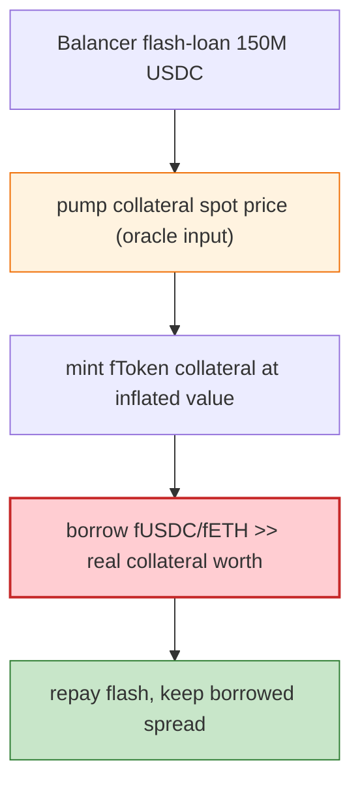

# Rari Capital/Fei Protocol Fuse Exploit — Oracle Manipulation via cToken Collateral Pricing

> **Reproduction:** the PoC compiles & runs in an isolated Foundry project at
> [this project folder](.). Full verbose trace: [output.txt](output.txt).
> Verified vulnerable source: [CErc20Delegator](sources/CErc20Delegator_EbE0d1),
> [CEtherDelegator](sources/CEtherDelegator_26267e), [Comptroller](sources/Comptroller_E16DB3),
> [Unitroller](sources/Unitroller_3f2D1B).

---

## Key info

| | |
|---|---|
| **Loss** | ~$80M (multiple Fuse pools drained; the PoC flash-borrows 150M USDC from Balancer) |
| **Vulnerable contract** | Rari Fuse pools (Compound forks) — fETH `0x26267e…`, fUSDC `0xEbE0d1…`, Unitroller `0x3f2D1B…` |
| **Flash source** | Balancer Vault `0xBA122222…` |
| **Chain / block / date** | Ethereum mainnet / 14,684,813 / Apr 30, 2022 |
| **Bug class** | Oracle / collateral-pricing manipulation — certain Fuse pools priced a volatile collateral token using a manipulable spot AMM price (or its own cToken exchange rate), so a flash-loan-driven price spike let the attacker over-borrow against it. |

---

## TL;DR

Rari Fuse was a permissionless Compound fork where each "pool" had its own price oracle for the
collateral tokens. Some pools priced collateral using a spot DEX/AMM price that was
**flash-loan-manipulable**. The attacker:

1. Flash-borrows 150,000,000 USDC from the **Balancer Vault** (`flashLoan(tokens, amounts, …)`).
2. Uses the borrowed USDC to pump the price of the collateral token the target Fuse pool reads (via the
   pool's `Comptroller`/oracle), inflating the collateral value.
3. Mints fTokens against the now-over-priced collateral, then **borrows** the pool's other reserves
   (fUSDC/fETH) far in excess of the real collateral value.
4. Repays the Balancer flash loan, keeping the borrowed spread.

The trace shows the fETH pool's ETH balance being borrowed out via the manipulated collateral. This was
the second of Rari's major hacks (the Fuse oracle exploit), distinct from the earlier reentrancy /
manager exploits.

---

## Root cause

A **manipulable price oracle** on a Compound-style money market: collateral value derived from a
spot/volatile price source rather than a TWAP/robust oracle, combined with the flash-loan-friendly
mint→borrow pattern of money markets. Over-collateralisation only holds if the collateral price is
honest; once an attacker can spike it within one transaction, they can borrow more than the collateral
is truly worth.

Fuse's permissionless model amplified this: anyone could create a pool with a chosen (possibly weak)
oracle, and the vulnerable pools happened to price a token via a spot source.

---

## Preconditions

- A Fuse pool whose collateral oracle is a spot/manipulable price.
- A deep flash-loan source (Balancer Vault) to move the spot price.

---

## Diagrams



---

## Remediation

1. **Use TWAP/Chainlink-style robust oracles** for every collateral; never spot AMM price.
2. **Caps on per-asset borrow** and on collateral concentration.
3. **Circuit breakers** on large oracle moves within a block.
4. **Audit permissionless pool creation**: require vetted oracle configurations.

---

## How to reproduce

```bash
_shared/run_poc.sh 2022-04-Rari_exp --mt testExploit -vvvvv
```

- RPC: mainnet archive (block 14,684,813). Infura mainnet in `foundry.toml`.
- Result: `[PASS]` after ~29s — flash-loan funded over-borrow against manipulated collateral.

---

*Reference: Rari Capital / Fei Fuse oracle-manipulation exploit, Apr 30 2022 (~$80M).*
