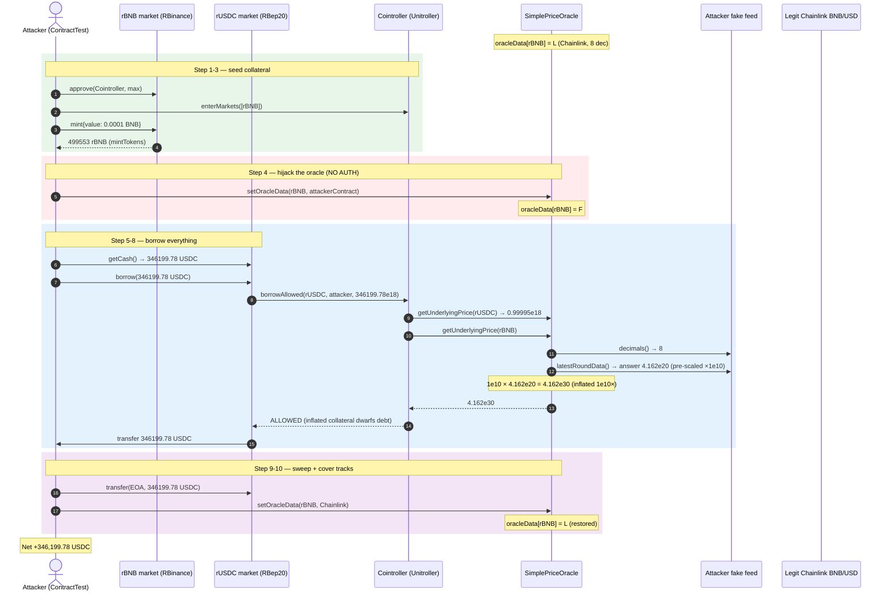
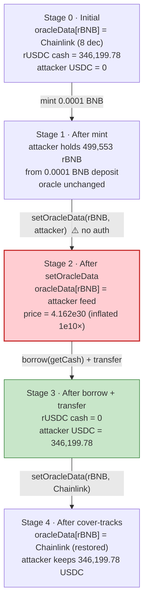
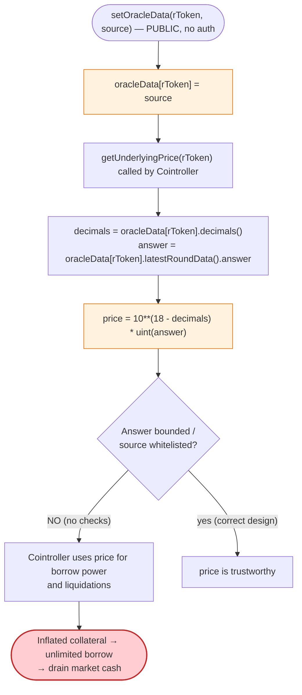

# Rikkei Finance Exploit — Permissionless `setOracleData()` Oracle Hijack on a Compound-style Money Market

> **Vulnerability classes:** vuln/access-control/missing-auth · vuln/oracle/price-manipulation

> **Reproduction:** the PoC compiles & runs in an isolated Foundry project at
> [this project folder](.) (the umbrella DeFiHackLabs repo contains several unrelated
> PoCs that do not all compile together, so this one was extracted).
> Full verbose trace: [output.txt](output.txt).
> Verified vulnerable source: [SimplePriceOracle](sources/SimplePriceOracle_D55f01/contracts_SimplePriceOracle.sol),
> [Cointroller](sources/Cointroller_00aa3a/contracts_Cointroller.sol) (logic behind the
> [Unitroller](sources/Unitroller_4f3e80/contracts_Unitroller.sol) proxy),
> [RBep20Delegate](sources/RBep20Delegate_74D4b7/contracts_RBep20Delegate.sol) (rUSDC logic),
> [RBinance](sources/RBinance_157822/contracts_RBinance.sol) (rBNB logic).

---

## Key info

| | |
|---|---|
| **Loss** | ~$270K — **346,199.780826500224370302 rUSDC** (~346,199.78 USDC) drained from the rUSDC market on BSC ([output.txt:7](output.txt), [output.txt:246](output.txt)) |
| **Vulnerable contract** | Rikkei `SimplePriceOracle` — [`0xD55f01B4B51B7F48912cD8Ca3CDD8070A1a9DBa5`](https://bscscan.com/address/0xD55f01B4B51B7F48912cD8Ca3CDD8070A1a9DBa5#code) |
| **Victim pool / vault** | rUSDC market — [`0x916e87d16B2F3E097B9A6375DC7393cf3B5C11f5`](https://bscscan.com/address/0x916e87d16B2F3E097B9A6375DC7393cf3B5C11f5) (collateral rBNB [`0x157822aC5fa0Efe98daa4b0A55450f4a182C10cA`](https://bscscan.com/address/0x157822aC5fa0Efe98daa4b0A55450f4a182C10cA)) |
| **Risk engine** | Cointroller logic [`0x00aa3A4cF3F7528b2465e39AF420Bb3fb1474b7B`](https://bscscan.com/address/0x00aa3A4cF3F7528b2465e39AF420Bb3fb1474b7B) behind Unitroller proxy [`0x4f3e801Bd57dC3D641E72f2774280b21d31F64e4`](https://bscscan.com/address/0x4f3e801Bd57dC3D641E72f2774280b21d31F64e4) |
| **Attacker EOA** | PoC test contract `ContractTest` (`0x7FA9385bE102ac3EAc297483Dd6233D62b3e1496`) — the live attacker is the EOA that deployed the equivalent logic |
| **Attacker contract** | same — the attacker's contract impersonates a Chainlink-style feed (`decimals()`/`latestRoundData()`) |
| **Attack tx** | BSC mainnet attack tx against Rikkei Finance, April 2022 (the offline PoC forks the pre-attack state at block 16,956,474) |
| **Chain / block / date** | BSC (chainId 56) / fork block **16,956,474** / April 2022 |
| **Compiler / optimizer** | Solidity **v0.5.16+commit.9c3226ce**, optimizer **enabled (1)**, **200 runs** (`SimplePriceOracle`, `Cointroller`, `RBep20Delegate`); Unitroller proxy |
| **Bug class** | Missing access control on the price-oracle setter — `SimplePriceOracle.setOracleData(asset, source)` lets **anyone** redirect a market's price feed to an attacker-controlled address, inflating collateral value and enabling an unlimited borrow |

---

## TL;DR

1. Rikkei Finance is a Compound V1 fork on BSC. Its `Cointroller` (risk engine) prices
   every market's collateral through a single `SimplePriceOracle`, which resolves each
   rToken's USD price by calling `decimals()` and `latestRoundData()` on whatever address
   is stored in `oracleData[rToken]` ([contracts_SimplePriceOracle.sol:29-37](sources/SimplePriceOracle_D55f01/contracts_SimplePriceOracle.sol#L29-L37)).

2. The setter `setOracleData(address rToken, oracleChainlink _oracle)` writes that mapping
   with **no access control at all** — no `onlyAdmin`, no `onlyOwner`, no timelock
   ([contracts_SimplePriceOracle.sol:29-31](sources/SimplePriceOracle_D55f01/contracts_SimplePriceOracle.sol#L29-L31)).
   Anyone can point any market's feed at any contract.

3. The attacker enters the rBNB market, mints a **tiny** 0.0001 BNB rBNB deposit
   (`rbnb.mint{value: 100_000_000_000_000}()`, [output.txt:35](output.txt)), then calls
   `simplePriceOracle.setOracleData(rbnb, address(this))` to make the attacker's own
   contract the rBNB price source ([output.txt:61](output.txt)).

4. The attacker's fake feed returns `decimals() = 8` (real Chainlink) but a
   `latestRoundData().answer` that is pre-multiplied by `1e10`. The oracle then applies
   its own `10**(18-decimals) = 1e10` scaling **again**, so the on-chain rBNB price is
   inflated **10¹⁰×** to ~`4.162e30` (1e18-base) instead of the correct ~`4.162e20`
   ([output.txt:111-112](output.txt)).

5. With rBNB collateral booked at a fictitious ~4.16e12 USD/BNB, the attacker's 0.0001 BNB
   "covers" the entire rUSDC cash. The attacker calls `rusdc.borrow(rusdc.getCash())` and
   borrows **346,199.78 USDC** — every token in the market ([output.txt:74-75](output.txt),
   [output.txt:157](output.txt)).

6. The attacker sweeps the borrowed rUSDC to the EOA (`rusdc.transfer(...)`,
   [output.txt:149-151](output.txt)), then **resets the oracle** to the legitimate Chainlink
   BNB/USD feed to cover its tracks ([output.txt:238-240](output.txt)).

7. Net result: **+346,199.780826500224370302 USDC** for a 0.0001 BNB (~$0.04) outlay
   ([output.txt:246](output.txt)). The rUSDC market is left with zero cash and an
   uncollateralized borrow.

---

## Background — what Rikkei does

Rikkei Finance is a fork of Compound V1 (the "Rifi" protocol family). Users supply an
asset to an `RBep20`/`RBinance` (Compound "cToken") market, receive interest-bearing
rTokens, and may then borrow other listed assets up to a collateral-factor limit enforced
by the `Cointroller`. The Cointroller lives behind a `Unitroller` proxy
([contracts_Unitroller.sol](sources/Unitroller_4f3e80/contracts_Unitroller.sol)) that
`delegatecall`s to the Cointroller logic
([contracts_Cointroller.sol](sources/Cointroller_00aa3a/contracts_Cointroller.sol)).

Every borrowing/liquidation decision flows through one function:
`SimplePriceOracle.getUnderlyingPrice(rToken)`, which returns the USD value of one unit of
the underlying, scaled to 1e18. The Cointroller multiplies each account's supplied
`rToken` balance by that price and by the market's collateral factor to derive borrowing
power. If the oracle lies, the entire risk model lies with it.

At the fork block (16,956,474), read directly from the trace:

| Parameter | Value | Source |
|---|---|---|
| rBNB market (`RBinance`) | `0x157822aC5fa0Efe98daa4b0A55450f4a182C10cA` | PoC |
| rUSDC market (`RBep20Delegator`) | `0x916e87d16B2F3E097B9A6375DC7393cf3B5C11f5` | PoC; impl `RBep20Delegate` `0x74D4b7...` ([output.txt:76](output.txt)) |
| Underlying USDC (Binance-Peg) | `0x8AC76a51cc950d9822D68b83fE1Ad97B32Cd580d` (18 decimals) | PoC |
| Cointroller (Unitroller proxy → logic) | `0x4f3e80...` → `0x00aa3A...` ([output.txt:26-27](output.txt)) | |
| `SimplePriceOracle` | `0xD55f01B4B51B7F48912cD8Ca3CDD8070A1a9DBa5` | |
| Legitimate rBNB feed (Chainlink BNB/USD) | `0x0567F2323251f0Aab15c8dFb1967E4e8A7D42aeE` (8 decimals, answer `41624753868` ≈ $416.25 at fork) | [output.txt:109](output.txt) |
| Legitimate rUSDC price (oracle) | `999951040000000000` (≈ 0.99995 USDC, 1e18-base) | [output.txt:96](output.txt) |
| rUSDC market cash (`getCash`) | `346199780826500224370302` (≈ 346,199.78 USDC) | [output.txt:74](output.txt) |
| Attacker deposit | `100_000_000_000_000` wei = 0.0001 BNB | [output.txt:35](output.txt); PoC L27 |

The prize is the rUSDC `getCash()` balance. With a correct oracle, 0.0001 BNB (~$0.04) of
collateral could borrow at most a few cents of USDC. The exploit makes the oracle report
that same 0.0001 BNB as worth ~4.16e12 USD.

---

## The vulnerable code

### 1. `SimplePriceOracle.setOracleData` — no access control

```solidity
contract SimplePriceOracle is PriceOracle {
    mapping(address => uint) prices;

    event PricePosted(address asset, uint previousPriceMantissa, uint requestedPriceMantissa, uint newPriceMantissa);

    mapping(address => oracleChainlink) public oracleData;

    constructor() public {
    }
    function setOracleData(address rToken, oracleChainlink _oracle) external {
        oracleData[rToken] = _oracle;
    }
    ...
}
```
([contracts_SimplePriceOracle.sol:20-31](sources/SimplePriceOracle_D55f01/contracts_SimplePriceOracle.sol#L20-L31))

The setter is `external` with **no modifier**. The trace confirms a bare externally-owned
account (the test contract) writes the mapping directly: the storage slot for
`oracleData[rBNB]` flips from the Chainlink feed `0x0567f23...` to the attacker
`0x7FA938...` in a single unprivileged call ([output.txt:61-63](output.txt)).

### 2. `getUnderlyingPrice` trusts the configured feed blindly

```solidity
function getUnderlyingPrice(RToken rToken) public view returns (uint) {
    uint decimals = oracleData[address(rToken)].decimals();
    (uint80 roundId,int256 answer,uint256 startedAt,uint256 updatedAt,uint80 answeredInRound) =
        oracleData[address(rToken)].latestRoundData();
    return 10 ** (18 - decimals) * uint(answer);
}
```
([contracts_SimplePriceOracle.sol:33-37](sources/SimplePriceOracle_D55f01/contracts_SimplePriceOracle.sol#L33-L37))

Two independent problems:

- It does **not** validate that `oracleData[rToken]` is a known, governance-pinned
  Chainlink aggregator — it just calls whatever address is stored there.
- It does **not** sanity-bound the returned `answer` (no deviation/staleness/heartbeat
  checks), so an attacker-controlled feed can return any value.

The decimal handling is also fragile. With a correct 8-decimal Chainlink answer of
`41624753868`, the formula `10**(18-8) * answer = 1e10 * 41624753868 = 4.162e20` yields the
correct ~416.25 USD price in 1e18 base ([output.txt:109](output.txt)). The attacker exploits
the lack of input validation: its fake `latestRoundData()` returns an `answer` that is
**already** pre-scaled by `1e10`, so the oracle's own `1e10` factor double-counts the
scaling and inflates the price 10¹⁰×.

### 3. The attacker's fake feed (from the PoC)

```solidity
function decimals() external view returns (uint8) {
    return chainlinkBNBUSDPriceFeed.decimals();   // 8 — keeps the oracle's 1e10 factor active
}

function latestRoundData()
    external
    view
    returns (uint80 roundId, int256 answer, uint256 startedAt, uint256 updatedAt, uint80 answeredInRound)
{
    (roundId, answer, startedAt, updatedAt, answeredInRound) = chainlinkBNBUSDPriceFeed.latestRoundData();
    answer = answer * 1e10;                        // ⚠️ pre-scale so the oracle double-applies 1e10
}
```
([test/Rikkei_exp.sol:35-46](test/Rikkei_exp.sol#L35-L46))

The trace shows this contract returning `answer = 416247538680000000000` (~4.162e20,
[output.txt:111](output.txt)); the oracle then computes
`1e10 * 416247538680000000000 = 4162475386800000000000000000000` (~4.162e30,
[output.txt:112](output.txt)) — the inflated rBNB price the Cointroller uses for
borrow-power.

### 4. The Compound-style borrow path that consumes the bad price

The `RBep20Delegate.borrow` flow delegates into `borrowAllowed` on the Cointroller, which
calls `getUnderlyingPrice` for both the collateral (rBNB) and the borrowed asset (rUSDC)
to compute the account's liquidity:

```solidity
0xD55f01B4B51B7F48912cD8Ca3CDD8070A1a9DBa5::getUnderlyingPrice(0x157822...rBNB)
  → 4162475386800000000000000000000   [4.162e30]   (inflated 1e10×)
0xD55f01B4B51B7F48912cD8Ca3CDD8070A1a9DBa5::getUnderlyingPrice(0x916e87...rUSDC)
  → 999951040000000000                [9.999e17]   (unchanged, correct)
```
([output.txt:99-112](output.txt), [output.txt:123-132](output.txt))

Because rBNB's price is 10¹⁰× too high, the 0.0001 BNB deposit
(`mintTokens = 499553304430711102439309` rBNB, [output.txt:51](output.txt)) registers as
enough borrowing power to take the **entire** rUSDC cash in one `borrow()` call.

---

## Root cause — why it was possible

The root cause is a single missing access-control modifier on the most security-critical
state-changing function in the system. A money market's price oracle is the input that
every borrowing, liquidation, and collateral decision is derived from; making its setter
user-writable turns borrowing into a self-authorized infinite-borrow.

Three compounding design flaws make the bug catastrophic rather than cosmetic:

1. **No auth on `setOracleData`.** Compare with Compound's `PriceOracleProxy.setAdmin` /
   `setDirectPrice`, which are `onlyAdmin` / `onlyOwner`. Rikkei's setter is bare
   `external` — a single transaction rewrites any market's price source.
2. **No validation of the configured source.** `getUnderlyingPrice` does not whitelist
   known Chainlink aggregators, does not check `updatedAt` for staleness, and does not
   bound the answer against a prior value or a heartbeat. Whatever `oracleData[rToken]`
   returns is trusted verbatim.
3. **Decimal re-scaling is attacker-influenceable.** Because the oracle derives the scale
   factor from the *feed's own* `decimals()`, and the attacker controls both `decimals()`
   and `latestRoundData()`, the attacker can engineer any price magnitude. Here it keeps
   `decimals = 8` (so the `1e10` factor stays) and pre-multiplies the answer by `1e10`,
   netting a 10¹⁰× inflation.

The attacker also resets the oracle to the legitimate Chainlink feed at the end
([output.txt:238-240](output.txt)), which is why on-chain post-mortems can show "the oracle
looks fine" — the malicious state only existed for the duration of the attack transaction.

---

## Preconditions

- The rUSDC market holds positive cash to borrow (`getCash = 346199780826500224370302`,
  [output.txt:74](output.txt)).
- A tiny amount of BNB (0.0001 BNB, ~$0.04 at the fork block) to mint the rBNB collateral
  and pay gas. No flash loan is needed — the capital requirement is effectively zero.
- The `SimplePriceOracle` is the Cointroller's active oracle and its `setOracleData` is
  unguarded (verified from the on-chain verified source,
  [contracts_SimplePriceOracle.sol:29-31](sources/SimplePriceOracle_D55f01/contracts_SimplePriceOracle.sol#L29-L31)).

---

## Attack walkthrough (with on-chain numbers from the trace)

All figures are read directly from the `Logs` and `Traces` sections of
[output.txt](output.txt). Raw wei are shown with a human approximation in parentheses.
USDC and rUSDC use 18 decimals on BSC; BNB/rBNB use 18.

| # | Step | Value (raw wei) | ~Human | Effect | Source |
|---|------|----------------:|-------:|--------|--------|
| 0 | **Initial** — attacker USDC balance | `0` | 0 USDC | Clean start. | [output.txt:6](output.txt) |
| 1 | **Approve** rBNB to the Cointroller (max) | `1.157e77` | type(uint256).max | Allows the market to move rBNB collateral. | [output.txt:21-22](output.txt) |
| 2 | **`enterMarkets([rBNB])`** — register rBNB as collateral | — | — | `MarketEntered(rBNB, attacker)`; account now has rBNB in its portfolio. | [output.txt:26-28](output.txt) |
| 3 | **`rbnb.mint{value: 1e14}`** — supply 0.0001 BNB, receive rBNB | mintAmount `100000000000000` (BNB in) → mintTokens `499553304430711102439309` rBNB | 0.0001 BNB in; ~499,553 rBNB credited | Tiny deposit recorded as collateral. | [output.txt:35](output.txt), [output.txt:51-52](output.txt) |
| 4 | **`setOracleData(rBNB, attacker)`** — hijack the price feed | slot `oracleData[rBNB]`: `0x0567f23...` → `0x7FA938...` (attacker) | — | rBNB price now read from the attacker's fake feed. **No access control.** | [output.txt:61-63](output.txt) |
| 5 | **`getUnderlyingPrice(rUSDC)`** during borrow check | `999951040000000000` | ~0.99995 USDC (1e18) | rUSDC priced correctly (unchanged feed). | [output.txt:96](output.txt) |
| 6 | **`getUnderlyingPrice(rBNB)`** during borrow check (via fake feed) | attacker `latestRoundData` returns answer `416247538680000000000` (~4.162e20); oracle returns `4162475386800000000000000000000` | **~4.162e12 USD/BNB (1e18-base)** — inflated 1e10× | Collateral booked at 10 billion× its real value. | [output.txt:111-112](output.txt) |
| 7 | **`rusdc.getCash()`** — total borrowable | `346199780826500224370302` | ~346,199.78 USDC | Identifies the entire market cash as the borrow target. | [output.txt:74](output.txt) |
| 8 | **`rusdc.borrow(346199780826500224370302)`** | borrowAmount `346199780826500224370302`; `accountBorrows` same; totalBorrows `677052957836773179671494` (~6.77e23) | borrow ~346,199.78 USDC; account now owes the full amount | `borrowAllowed` passes because inflated rBNB collateral dwarfs the debt. rUSDC transferred to the borrower. | [output.txt:75](output.txt), [output.txt:149-157](output.txt) |
| 9 | **`rusdc.transfer(msg.sender, balance)`** — sweep to EOA | `346199780826500224370302` USDC moved rUSDC market → attacker | ~346,199.78 USDC | Borrowed USDC leaves the market to the attacker EOA. | [output.txt:149-151](output.txt) |
| 10 | **`setOracleData(rBNB, chainlinkBNBUSD)`** — cover tracks | slot `oracleData[rBNB]`: `0x7FA938...` → `0x0567f23...` | — | Oracle restored to the legitimate Chainlink feed. | [output.txt:238-240](output.txt) |
| 11 | **Final** — attacker USDC balance | `346199780826500224370302` | ~346,199.78 USDC | Full market cash drained. | [output.txt:246](output.txt) |

### Why the inflated price passes `borrowAllowed`

The Cointroller computes account liquidity as
`Σ (supplyBalance × collateralFactor × price) − Σ (borrowBalance × price)`. With rBNB
price inflated 1e10×, the attacker's 0.0001 BNB deposit contributes a fictitious borrowing
power on the order of `499553 rBNB × 4.162e30 ≈ 2.08e36`, which dwarfs the requested
`346199 USDC × 1e18` debt. The liquidity check passes trivially
([output.txt:84-143](output.txt)).

### Profit / loss accounting (USDC, raw wei, 18 decimals)

| Direction | Amount (wei) | ~Human |
|---|---:|---:|
| USDC before attack | `0` | 0 |
| BNB spent (mint deposit) | `100_000_000_000_000` (BNB, 18 dec) | 0.0001 BNB (~$0.04) |
| USDC borrowed & received | `346199780826500224370302` | 346,199.78 |
| **Net profit (USDC)** | **`346199780826500224370302`** | **~346,199.78 USDC** |
| rUSDC market cash after | `0` | 0 (fully drained) |

The PoC asserts the exact post-balance via `log_named_uint`:
`After exploit, USDC balance of attacker: 346199780826500224370302`
([output.txt:7](output.txt), [output.txt:246](output.txt)). The market's `getCash` is
drained to zero (the entire cash was borrowed and transferred out,
[output.txt:149-151](output.txt)).

---

## Diagrams

### Sequence of the attack



### State evolution of the oracle and the rUSDC market



### The flaw inside `getUnderlyingPrice` / `setOracleData`



---

## Why each magic number

- **`100_000_000_000_000` wei (0.0001 BNB)** — the mint deposit. It only needs to be
  non-zero so the market credits *some* rBNB collateral (`mintTokens = 499553...`,
  [output.txt:51](output.txt)); after the 1e10× oracle inflation, even a single wei of BNB
  would technically suffice. 0.0001 BNB was chosen for tidiness. Total outlay ≈ $0.04.
- **`decimals() == 8`** (returned by both the real Chainlink feed and the attacker fake
  feed, [output.txt:101-105](output.txt)) — keeps the oracle's `10**(18-8) = 1e10` scale
  factor live. If the attacker returned a different decimal count, the inflation factor
  would change but the attack still works; `8` matches Chainlink so the pre-multiplication
  by `1e10` compounds cleanly into a 1e10× inflation.
- **`answer * 1e10`** in the fake `latestRoundData()` ([test/Rikkei_exp.sol:45](test/Rikkei_exp.sol#L45))
  — converts the real 8-dec Chainlink answer (`41624753868`) into an 18-dec value
  (`416247538680000000000`, [output.txt:111](output.txt)). The oracle then applies its own
  `1e10` factor again, producing `4.162e30` ([output.txt:112](output.txt)) — 10¹⁰× the
  correct `4.162e20`.
- **`rusdc.getCash()`** as the borrow amount ([output.txt:74](output.txt)) — borrowing
  exactly the market's entire cash drains it to zero in one call. No need to compute a
  collateral-constrained maximum; the inflated oracle makes the limit effectively infinite.
- **Final `setOracleData(rBNB, chainlinkBNBUSDPriceFeed)`** ([output.txt:238](output.txt))
  — restores the legitimate feed so the protocol's post-attack monitoring sees a "normal"
  oracle, slowing detection. Cosmetic to the exploit itself.

---

## Remediation

1. **Gate `setOracleData` behind admin/governance + a timelock.** This is the primary fix.
   Add `onlyAdmin` (or `onlyOwner`) and route changes through the project's timelock so
   users can react. A money-market oracle setter must never be permissionless.
2. **Whitelist oracle sources at deployment; never accept an arbitrary address.** Store the
   canonical Chainlink aggregator per market in immutable/governance storage and have
   `getUnderlyingPrice` read only from those — eliminate the indirection mapping entirely.
3. **Sanity-check oracle outputs.** Enforce a maximum deviation per update, reject stale
   answers (`updatedAt` within a heartbeat), reject non-positive or absurdly large answers,
   and ideally cross-check against a secondary feed or a TWAP. A 1e10× jump should never
   be accepted silently.
4. **Use canonical Chainlink feeds directly.** Rikkei's indirection through a
   `mapping(address => oracleChainlink)` adds an attack surface (the setter) with no
   benefit over calling the known aggregator addresses directly.
5. **Harden the decimal handling.** Derive the scale from a per-market configured decimal
  constant, not from the feed's self-reported `decimals()`, so a malicious feed cannot
  manipulate the magnitude of the price via its `decimals()` return.
6. **Add a circuit breaker on the money market.** A per-market borrow cap and a global
   anomalous-withdrawal pause would bound the worst-case loss even if the oracle is
   compromised.

---

## How to reproduce

The PoC was extracted into a standalone Foundry project (the umbrella DeFiHackLabs repo
has unrelated PoCs that do not all compile under one `forge build`). It runs **fully
offline** via the shared harness, which serves the fork from the bundled
`anvil_state.json`; the test's `createSelectFork` points at the local anvil on port 8546
([test/Rikkei_exp.sol:18](test/Rikkei_exp.sol#L18)).

```bash
_shared/run_poc.sh 2022-04-Rikkei_exp --mt testExploit -vvvvv
```

- No public RPC is required: `run_poc.sh` boots `anvil` on the per-chain port with the
  project's `anvil_state.json` and the test forks `http://127.0.0.1:8546` at block
  16,956,474.
- `evm_version = "cancun"` in `foundry.toml` (the test itself is `^0.7.0`-era Solidity and
  is compatible).
- The test function is **`testExploit`** ([test/Rikkei_exp.sol:21](test/Rikkei_exp.sol#L21)).

Expected tail (verbatim from [output.txt:3-7](output.txt) and
[output.txt:249-251](output.txt)):

```
Ran 1 test for test/Rikkei_exp.sol:ContractTest
[PASS] testExploit() (gas: 736167)
Logs:
  Before exploit, USDC balance of attacker:: 0
  After exploit, USDC balance of attacker:: 346199780826500224370302

Suite result: ok. 1 passed; 0 failed; 0 skipped; finished in 1.75s (17.68ms CPU time)

Ran 1 test suite in 1.75s (1.75s CPU time): 1 tests passed, 0 failed, 0 skipped (1 total tests)
```

---

*Reference: Rikkei Finance `SimplePriceOracle.setOracleData` access-control vulnerability, BSC, April 2022 (~$270K). PeckShield incident analysis — https://twitter.com/PeckShieldAlert/status/1514134374120165377 .*
