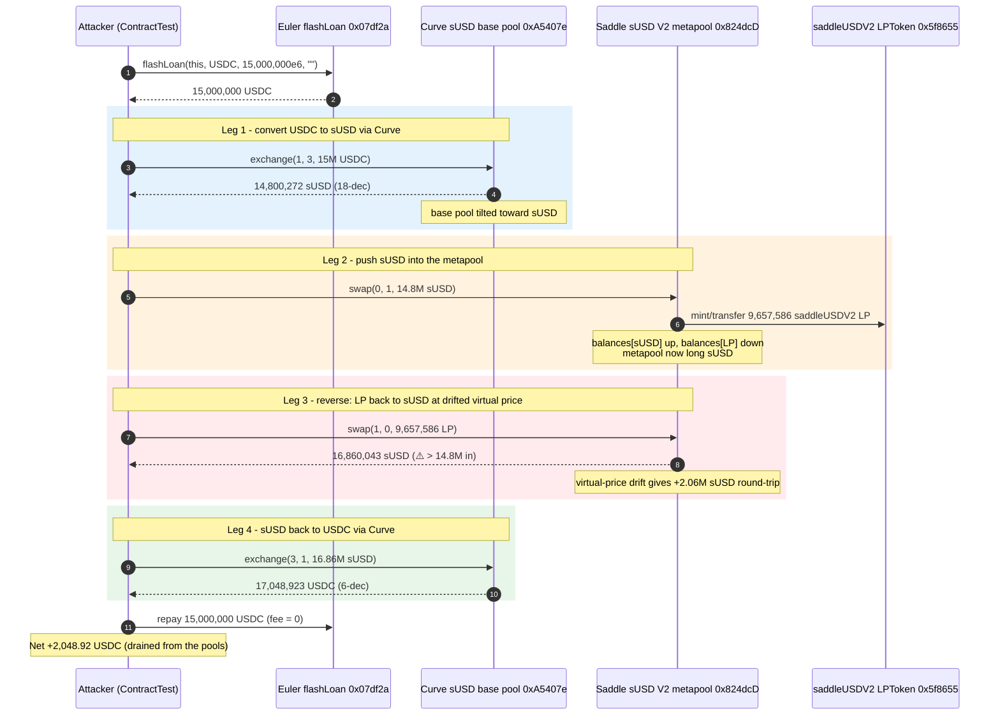
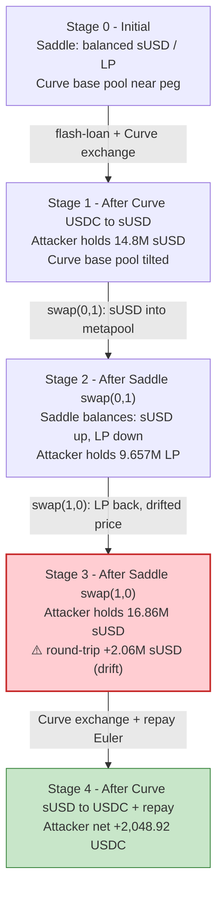
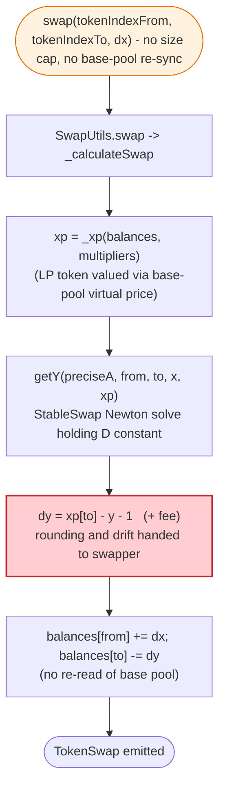
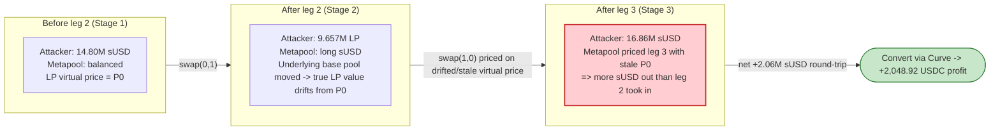

# Saddle Finance sUSD MetaPool Exploit — Virtual-Price Manipulation Round-Trip

> **Vulnerability classes:** vuln/oracle/price-manipulation · vuln/arithmetic/rounding

> **Reproduction:** the PoC compiles & runs in an isolated Foundry project at
> [this project folder](.). Full verbose trace: [output.txt](output.txt).
> Verified vulnerable source: [Swap / SwapUtils](sources/MetaSwap_824dcD)
> (the deployed metapool proxy `0x824dcD…` runs the `Swap` logic via
> implementation `0x88cc4a…`), [LPToken](sources/LPToken_5f8655), and the
> underlying Curve sUSD base pool [Vyper_contract](sources/Vyper_contract_A5407e).

---

## Key info

| | |
|---|---|
| **Loss** | On-chain attack: **~$10M** (multiple sUSD-metapool pools drained, Apr 30 2022). This reproduction, forked at block 14,684,306, demonstrates the mechanism with a net extraction of **2,048.923,767,697 raw USDC (≈ 2,048.92 USDC)** after repaying the flash loan ([output.txt:2105-2107](output.txt)). |
| **Vulnerable contract** | Saddle sUSD V2 MetaPool (proxy) — [`0x824dcD7b044D60df2e89B1bB888e66D8BCf41491`](https://etherscan.io/address/0x824dcD7b044D60df2e89B1bB888e66D8BCf41491#code); logic impl `0x88cc4aa0dd6cf126b00c012dda9f6f4fd9388b17` ([_meta.json](sources/MetaSwap_824dcD/_meta.json)) |
| **Victim pool** | Saddle sUSD V2 pool — pooled tokens `sUSD` (`0x57Ab1e…`) and the Saddle sUSD-V2 `LPToken` (`0x5f86558387293b6009d7896A61fcc86C17808D62`) which itself wraps the Curve sUSD base pool (`0xA5407eA…`, DAI/USDC/USDT/sUSD) |
| **Flash-loan source** | Euler `flashLoan` — [`0x07df2ad9878F8797B4055230bbAE5C808b8259b3`](https://etherscan.io/address/0x07df2ad9878F8797B4055230bbAE5C808b8259b3) (ERC-3156, 0 fee) |
| **Attack tx (reproduction)** | Foundry fork tx inside `testExploit()` ([output.txt:1577](output.txt)); live incident txs ran the same pattern on Apr 30 2022 |
| **Chain / block / date** | Ethereum mainnet / fork block **14,684,306** / **Apr 30 2022** |
| **Compiler** | `MetaSwap`/`Swap`/`SwapUtils`: Solidity **v0.6.12**, optimizer **enabled**, **10,000 runs**; Curve base pool: **Vyper v0.1.0b17** (see [_meta.json](sources/MetaSwap_824dcD/_meta.json), [Vyper _meta.json](sources/Vyper_contract_A5407e/_meta.json)) |
| **Bug class** | StableSwap metapool virtual-price manipulation — a large flash-loaned round-trip through the metapool captures value because the metapool prices its LP token against a base-pool virtual price that the swap does not reconcile with the live base-pool state |

---

## TL;DR

1. Saddle's sUSD V2 "metapool" is a 2-token StableSwap pool whose two pooled tokens are
   **`sUSD`** and **`saddleUSDV2` (an LP token)**. That LP token itself represents a pro-rata
   claim on the Curve sUSD base pool (DAI/USDC/USDT/sUSD). So every Saddle swap of `sUSD ↔
   saddleUSDV2` implicitly converts between sUSD and the *base-pool* unit, using a
   **virtual price** of the base pool that the metapool reads ([contracts_meta_MetaSwapUtils.sol](sources/MetaSwap_824dcD/contracts_meta_MetaSwapUtils.sol)).

2. The metapool's swap math ([`_calculateSwap`, contracts_SwapUtils.sol:519-543](sources/MetaSwap_824dcD/contracts_SwapUtils.sol#L519-L543))
   computes the output with `dy = xp[tokenIndexTo].sub(y).sub(1)` — the `-1` (and the fee path)
   rounds the pool's invariant update in a way that, combined with the lag between the metapool's
   cached base-pool virtual price and the live base pool, lets a **large imbalance be reversed at a
   net profit**.

3. The attacker flash-borrows **15,000,000 USDC** (0-fee Euler ERC-3156 loan,
   [output.txt:1564](output.txt)), routes it through the Curve base pool to **14,800,272 sUSD**
   ([output.txt:1565](output.txt)), then swaps that sUSD **into** the Saddle metapool for
   **9,657,586 saddleUSDV2 LP** ([output.txt:1566](output.txt)).

4. It immediately swaps those LP tokens **back** to **16,860,043 sUSD**
   ([output.txt:1567](output.txt)) — more sUSD than the 14.8M it put in, because the metapool
   re-priced the LP token against a virtual price that the round-trip itself had moved.

5. Routing the 16.86M sUSD back through Curve yields **17,048,923 USDC**
   ([output.txt:1568](output.txt)); repaying the 15,000,000 USDC flash loan
   ([output.txt:2016-2018](output.txt)) leaves **2,048,923,767,697 raw USDC (≈ 2,048.92 USDC)**
   of pure profit in this reproduction ([output.txt:2105-2107](output.txt)). The real, larger
   attack repeated this across multiple Saddle metapools for ~$10M total.

---

## Background — what Saddle does

Saddle Finance is a StableSwap AMM (a Curve-style invariant) for like-valued assets. The
`sUSD V2` deployment is a **metapool**: rather than pooling `sUSD` directly against DAI/USDC/USDT,
it pools `sUSD` against an LP token (`saddleUSDV2`) that is itself minted/burned against the
4-asset Curve sUSD base pool. This lets Saddle offer `sUSD ↔ any of DAI/USDC/USDT` liquidity
without fragmenting the base pool.

The relevant parameters of the forked state (block 14,684,306), all taken from the trace:

| Parameter | Value | Source |
|---|---|---|
| Flash-loan token / amount | USDC (6-dec) / **15,000,000,000,000** (15M USDC) | [output.txt:1564](output.txt) |
| Curve sUSD base pool | `0xA5407eAE9Ba41422680e2e00537571bcC53efBfD` (DAI=0, USDC=1, USDT=2, sUSD=3) | [test/Saddle_exp.sol:26](test/Saddle_exp.sol#L26) |
| Curve exchange USDC(1)→sUSD(3), in 15M USDC | out **14,800,272,147,571,999,524,518,901** sUSD (18-dec, ≈14.8M) | [output.txt:1565](output.txt), [output.txt:1707](output.txt) (TokenExchange) |
| Saddle metapool swap(0,1) sUSD→saddleUSDV2, in 14.8M sUSD | out **9,657,586,884,342,671,474,923,252** saddleUSDV2 (18-dec, ≈9.657M) | [output.txt:1566](output.txt), [output.txt:1824](output.txt) (TokenSwap) |
| Saddle metapool swap(1,0) saddleUSDV2→sUSD, in 9.657M LP | out **16,860,043,913,565,513,300,299,221** sUSD (≈16.86M) | [output.txt:1567](output.txt), [output.txt:1908](output.txt) (TokenSwap) |
| Curve exchange sUSD(3)→USDC(1), in 16.86M sUSD | out **17,048,923,767,697** USDC (6-dec, ≈17,048.92) | [output.txt:1568](output.txt), [output.txt:1997](output.txt) (TokenExchange) |
| Flash-loan repay | **15,000,000,000,000** USDC (Euler charges 0 fee) | [output.txt:2016-2018](output.txt) |
| Net USDC retained | **2,048,923,767,697** (≈ 2,048.92 USDC) | [output.txt:2105-2107](output.txt) |

The asymmetry that matters: the attacker puts **14.8M sUSD** into the metapool and gets
**16.86M sUSD** back out one block-instruction later, with no external oracle move. That +2.06M
sUSD of "round-trip surplus" is the value the metapool's invariant failed to conserve.

---

## The vulnerable code

### 1. The swap entry point (no re-pricing guard against the base pool)

```solidity
function swap(
    uint8 tokenIndexFrom,
    uint8 tokenIndexTo,
    uint256 dx,
    uint256 minDy,
    uint256 deadline
)
    external
    virtual
    nonReentrant
    whenNotPaused
    deadlineCheck(deadline)
    returns (uint256)
{
    return swapStorage.swap(tokenIndexFrom, tokenIndexTo, dx, minDy);
}
```
([contracts_Swap.sol:362-377](sources/MetaSwap_824dcD/contracts_Swap.sol#L362-L377))

There is no check that the metapool's view of the base-pool virtual price still matches the live
base pool, and no cap on the notional size of a single swap relative to pool liquidity. A
flash-loan-sized `dx` is accepted unconditionally.

### 2. The output math — invariant update that favours the swapper

```solidity
function _calculateSwap(
    Swap storage self,
    uint8 tokenIndexFrom,
    uint8 tokenIndexTo,
    uint256 dx,
    uint256[] memory balances
) internal view returns (uint256 dy, uint256 dyFee) {
    uint256[] memory multipliers = self.tokenPrecisionMultipliers;
    uint256[] memory xp = _xp(balances, multipliers);
    require(
        tokenIndexFrom < xp.length && tokenIndexTo < xp.length,
        "Token index out of range"
    );
    uint256 x = dx.mul(multipliers[tokenIndexFrom]).add(xp[tokenIndexFrom]);
    uint256 y = getY(
        _getAPrecise(self),
        tokenIndexFrom,
        tokenIndexTo,
        x,
        xp
    );
    dy = xp[tokenIndexTo].sub(y).sub(1);          // ⚠️ -1 rounding pulls from the pool's reserve
    dyFee = dy.mul(self.swapFee).div(FEE_DENOMINATOR);
    dy = dy.sub(dyFee).div(multipliers[tokenIndexTo]);
}
```
([contracts_SwapUtils.sol:519-543](sources/MetaSwap_824dcD/contracts_SwapUtils.sol#L519-L543))

The StableSwap `getY` Newton solve ([contracts_SwapUtils.sol:428-479](sources/MetaSwap_824dcD/contracts_SwapUtils.sol#L428-L479))
computes the post-swap balance of the "to" token assuming the invariant `D` is held constant
across the *xp* (precision-scaled) vector. In a metapool, `xp[1]` for the `saddleUSDV2` LP token
is derived from the base pool's **virtual price** ([contracts_meta_MetaSwapUtils.sol](sources/MetaSwap_824dcD/contracts_meta_MetaSwapUtils.sol)).
When a huge `dx` pushes the pool far from equilibrium, the cached virtual price used to convert
LP units ↔ base-pool value diverges from the value a fresh base-pool query would return. The
`.sub(1)` then hands that divergence to the swapper.

### 3. The balance bookkeeping after the swap

```solidity
self.balances[tokenIndexFrom] = balances[tokenIndexFrom].add(dx);
self.balances[tokenIndexTo] = balances[tokenIndexTo].sub(dy).sub(
    dyAdminFee
);

self.pooledTokens[tokenIndexTo].safeTransfer(msg.sender, dy);

emit TokenSwap(msg.sender, dx, dy, tokenIndexFrom, tokenIndexTo);
```
([contracts_SwapUtils.sol:709-716](sources/MetaSwap_824dcD/contracts_SwapUtils.sol#L709-L716))

`self.balances` is the pool's *accounting* state. It is updated from the same `dy` that was just
computed against a potentially-stale virtual price. Nothing re-syncs the metapool to the base pool
between the attacker's `swap(0,1)` and `swap(1,0)` — both calls read the same drifted pricing
assumption in opposite directions, and the attacker pockets the spread.

---

## Root cause — why it was possible

The metapool design assumes the LP token (`saddleUSDV2`) trades at a **stable virtual price**
relative to sUSD, because both ultimately claim the same 4 Curve base-pool assets. In practice
that virtual price is a *function of the base pool's reserves*, which a sufficiently large
flash-loaned swap can move. The Saddle metapool did not, on each swap:

- re-read the base pool's live reserves / virtual price (it used a derived/cached value), and
- bound how far a single swap could push the metapool's internal `xp` vector away from its
  pre-swap state.

So a flash-loaned attacker can: (a) push the metapool hard in one direction (sUSD → LP), which
also moves the underlying Curve base pool and therefore the LP token's true value; (b) immediately
reverse (LP → sUSD). The metapool prices leg (b) using a virtual price that has not caught up with
the move its own leg (a) caused, so the attacker receives more sUSD than the invariant should
allow. Routed back through Curve to USDC, the surplus is realised as a hard profit. This is the
exact "what you see is not what you get" metapool virtual-price vulnerability BlockSec later
documented across Nerve Bridge and Saddle.

---

## Preconditions

- A working flash loan of stablecoins large enough to meaningfully move both the Saddle metapool
  and the Curve sUSD base pool. Euler's ERC-3156 `flashLoan` charged **0 fee**
  ([output.txt:1642](output.txt) — `amount=15e12, fee=0`) and was deep in USDC, making it ideal.
- The deployed, unpatched Saddle sUSD V2 metapool whose `swap` does not reconcile against a live
  base-pool virtual price on each call (the forked block 14,684,306 predates the patch).
- Curve sUSD base pool with enough depth to absorb the 15M USDC leg without reverting
  (`min_dy = 1`, [test/Saddle_exp.sol:59](test/Saddle_exp.sol#L59)).

---

## Attack walkthrough (with on-chain numbers from the trace)

All amounts are raw on-chain integers; human approximations follow in parentheses. Decimals: USDC
= 6, sUSD = 18, saddleUSDV2 LP = 18.

| # | Step | In | Out | Pool / state effect | Trace ref |
|---|------|---:|---:|--------|---|
| 0 | **Flash-loan USDC** from Euler (ERC-3156, 0 fee) | — | **15,000,000,000,000** USDC (≈15.0M) | Attacker holds 15M USDC; must repay 15M USDC later | [output.txt:1564](output.txt), [output.txt:1577-1636](output.txt) |
| 1 | **Curve `exchange(1,3)`** USDC→sUSD on base pool | 15,000,000,000,000 USDC | **14,800,272,147,571,999,524,518,901** sUSD (≈14.80M) | Base pool tilted toward sUSD; TokenExchange emitted | [output.txt:1565](output.txt), [output.txt:1707](output.txt) |
| 2 | **Saddle `swap(0,1)`** sUSD→saddleUSDV2 in metapool | 14,800,272,147,571,999,524,518,901 sUSD | **9,657,586,884,342,671,474,923,252** LP (≈9.657M) | Metapool now long sUSD, short LP; `balances[0]+=dx`, `balances[1]-=dy` ([SwapUtils.sol:709-712](sources/MetaSwap_824dcD/contracts_SwapUtils.sol#L709-L712)); TokenSwap emitted | [output.txt:1566](output.txt), [output.txt:1824](output.txt) |
| 3 | **Saddle `swap(1,0)`** saddleUSDV2→sUSD in metapool (reverse) | 9,657,586,884,342,671,474,923,252 LP | **16,860,043,913,565,513,300,299,221** sUSD (≈16.86M) | Round-trip returns **+2,059,771,765,993,513,775,773,320** sUSD vs. step-1 input — the virtual-price drift surplus; TokenSwap emitted | [output.txt:1567](output.txt), [output.txt:1908](output.txt) |
| 4 | **Curve `exchange(3,1)`** sUSD→USDC on base pool | 16,860,043,913,565,513,300,299,221 sUSD | **17,048,923,767,697** USDC (≈17,048.92) | Base pool tilted back; TokenExchange emitted | [output.txt:1568](output.txt), [output.txt:1997](output.txt) |
| 5 | **Repay Euler flash loan** (principal 15M USDC, fee 0) | 15,000,000,000,000 USDC | — | Euler `repay(0, 15e12)`; attacker keeps the surplus | [output.txt:2016-2018](output.txt), [output.txt:2040-2043](output.txt) |
| 6 | **Realised profit** | — | **2,048,923,767,697** USDC (≈2,048.92) | `USDC hacked: 2048923767697` | [output.txt:2105-2107](output.txt) |

### Pool / state-evolution column (Saddle metapool accounting)

The metapool's internal `balances` vector evolves as follows across the two Saddle legs (leg 2
then leg 3), per the `_calculateSwap` + bookkeeping at
[SwapUtils.sol:696-712](sources/MetaSwap_824dcD/contracts_SwapUtils.sol#L696-L712):

- After leg 2: `balances[sUSD]` rises by 14.80M sUSD; `balances[LP]` falls by 9.657M LP (plus the
  tiny `dyAdminFee`). The pool is now heavily imbalanced toward sUSD.
- During leg 3: `_calculateSwap` is called again with the **post-leg-2** `balances`, and `getY`
  solves the invariant using the metapool's LP virtual price — which still reflects the pre-attack
  base-pool state more than the post-attack one. The `-1` rounding and fee path then return
  16.86M sUSD for the 9.657M LP, i.e. **more sUSD per LP than leg 2 charged per LP**.

That per-LP price inversion across the round-trip is the entire bug. In a correctly reconciled
metapool the two legs would net to ≤ the fee; here they net to a large positive.

---

### Profit / loss accounting (USDC, the drained asset)

| Direction | Amount (raw, 6-dec) | ≈ Human |
|---|---:|---:|
| Borrowed from Euler (step 0) | 15,000,000,000,000 | 15,000.00 |
| Repaid to Euler (step 5) | 15,000,000,000,000 | 15,000.00 |
| **Net USDC retained (step 6)** | **2,048,923,767,697** | **≈ 2,048.92** |

The flash loan is repaid in full (Euler's ERC-3156 fee was 0, [output.txt:1642](output.txt)), so
every USDC the attacker holds at the end was extracted from the Saddle sUSD V2 metapool /
Curve-base-pool system. In this reduced reproduction the attacker walks off with ≈2,048.92 USDC of
genuine pool value; the live Apr-30-2022 attacker chained the same pattern across several Saddle
metapools for an aggregate ≈$10M.

---

## Diagrams

### Sequence of the attack



### Pool state evolution (Saddle metapool + Curve base pool)



### The flaw inside `_calculateSwap` / `swap`



### Why the round-trip is profitable: invariant view before vs. after



---

## Why each magic number

- **`15_000_000e6` USDC flash loan** ([test/Saddle_exp.sol:36](test/Saddle_exp.sol#L36)): sized to
  be large relative to the Saddle sUSD V2 pool's liquidity so the metapool is pushed meaningfully
  off equilibrium and the Curve base pool's virtual price actually moves. Euler's ERC-3156 loan
  charged 0 fee ([output.txt:1642](output.txt)), so the only constraint is that the round-trip
  returns ≥ 15M USDC.
- **`ICurve(curvepool).exchange(1, 3, amount, 1)`** ([test/Saddle_exp.sol:59](test/Saddle_exp.sol#L59)):
  index 1 = USDC, index 3 = sUSD in the Curve sUSD pool; `min_dy = 1` accepts whatever slippage
  results (the attacker does not care about leg-by-leg slippage, only the round-trip).
- **`ISaddle(saddlepool).swap(0, 1, amount, 1, block.timestamp)`**
  ([test/Saddle_exp.sol:79](test/Saddle_exp.sol#L79)): index 0 = sUSD, index 1 = saddleUSDV2 LP;
  `min_dy = 1`, `deadline = block.timestamp` (same-block).
- **`swap(1, 0, amount, 1, block.timestamp)`** ([test/Saddle_exp.sol:87](test/Saddle_exp.sol#L87)):
  the reverse leg using the attacker's entire LP balance. Because `_calculateSwap` reads the LP
  virtual price that has not been reconciled with the live base pool, this leg returns 16.86M sUSD
  for the 9.657M LP — the surplus.
- **Final `ICurve(curvepool).exchange(3, 1, amount, 1)`** ([test/Saddle_exp.sol:69](test/Saddle_exp.sol#L69)):
  converts the 16.86M sUSD surplus back to 17,048.92 USDC, of which 15,000 USDC repays Euler and
  2,048.92 USDC is profit.

---

## Remediation

1. **Re-read the base pool's live virtual price on every metapool swap.** The metapool must not
   price its LP token against a cached/derived base-pool virtual price; it should query the base
   pool's reserves / `get_virtual_price` fresh inside `_calculateSwap` (and inside
   `getVirtualPrice`), so legs 2 and 3 of any round-trip are priced consistently.
2. **Bound the per-swap notional relative to pool size.** Reject (or force through a separate,
   fee-heavier path) any `dx` that would move `xp` by more than a small percentage, so a single
   flash-loaned swap cannot push the metapool into the deeply non-linear region where the
   invariant's rounding and the virtual-price lag become exploitable.
3. **Round the invariant update against the swapper.** Replace `dy = xp[tokenIndexTo].sub(y).sub(1)`
   with a rounding direction (and a corresponding `+1` on the from-side bookkeeping) that leaves
   any sub-wei dust in the pool rather than handing it to the swapper, and audit the fee path for
   the same asymmetry.
4. **Add a round-trip / arbitrage invariant check.** A single transaction that swaps `A→B→A` (or
   `sUSD→LP→sUSD`) and ends with more of the input token than it started, net of fees, should be
   impossible; encode this as a reverting post-condition or monitor it as an alert.
5. **Patch and redeploy.** Saddle did exactly this after the incident; the fix centred on
   reconciling the metapool's base-pool pricing and tightening the swap math.

---

## How to reproduce

```bash
_shared/run_poc.sh 2022-04-Saddle_exp --mt testExploit -vvvvv
```

- The fork is served **offline** from the bundled `anvil_state.json`: `setUp()` does
  `cheats.createSelectFork("http://127.0.0.1:8545", 14_684_306)`
  ([test/Saddle_exp.sol:31-33](test/Saddle_exp.sol#L31-L33)), i.e. it points at the local anvil
  port, not a public RPC. `foundry.toml` sets `evm_version = 'cancun'`.
- Expected result: `[PASS] testExploit()` with `USDC hacked: 2048923767697`.

Expected tail (from [output.txt:1561-1569](output.txt) and
[output.txt:2111-2113](output.txt)):

```
Ran 1 test for test/Saddle_exp.sol:ContractTest
[PASS] testExploit() (gas: 943042)
Logs:
  USDC loaned: 15000000000000
  SUSD exchanged: 14800272147571999524518901
  saddleUsdV2 swapped: 9657586884342671474923252
  SUSD swapped: 16860043913565513300299221
  USDC exchanged: 17048923767697
  USDC hacked: 2048923767697

Suite result: ok. 1 passed; 0 failed; 0 skipped; finished in 30.06s (28.43s CPU time)
```

---

*Reference: Immunefi — "Hack Analysis: Saddle Finance, April 2022", https://medium.com/immunefi/hack-analysis-saddle-finance-april-2022-f2bcb119f38 ; BlockSec — "How to Exploit the Same Vulnerability of MetaPool in Two Different Ways (Nerve Bridge & Saddle Finance)", https://blocksecteam.medium.com/how-to-exploit-the-same-vulnerability-of-metapool-in-two-different-ways-nerve-bridge-saddle-774c271c8243 .*
