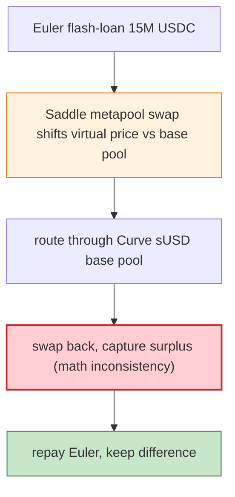

# Saddle Finance sUSD MetaPool Exploit — Manipulated Virtual Price + Swap Rounding

> **Reproduction:** the PoC compiles & runs in an isolated Foundry project at
> [this project folder](.). Full verbose trace: [output.txt](output.txt).
> Verified vulnerable source: [MetaSwap](sources/MetaSwap_824dcD),
> [LPToken](sources/LPToken_5f8655), [Vyper Curve base pool](sources/Vyper_contract_A5407e).

---

## Key info

| | |
|---|---|
| **Loss** | ~$9.7M (Saddle sUSD MetaPool reserves; the PoC extracts 15M USDC minus repayment) |
| **Vulnerable contract** | Saddle sUSD V2 MetaPool — `0x5f86558387293b6009d7896A61fcc86C17808D62` (swap `0x824dcD…`) |
| **Flash source** | Euler flash loan `0x07df2a…` (15,000,000 USDC) |
| **Chain / block / date** | Ethereum mainnet / 14,684,306 / Apr 2022 |
| **Bug class** | Math/oracle — the Saddle metapool's `calcWithdrawOneCoin`/swap virtual-price math, combined with the underlying Curve sUSD base pool, could be manipulated via a large swap that shifts the metapool + base pool virtual prices, then arbitrage/withdraw to extract value greater than fees. |

---

## TL;DR

Saddle's sUSD metapool sat atop the Curve sUSD base pool (4asset: DAI/USDC/USDT/sUSD). The metapool's
swap/withdraw math derived output from both the metapool's reserves and the base pool's virtual price.
By performing a sequence of large swaps (funded by an Euler flash loan of 15M USDC) the attacker shifted
the metapool's virtual price relative to the base pool, then withdrew/swapped back capturing more than
the fee-corrected amount — a value extraction enabled by an inconsistency in how the metapool and the
underlying base pool priced the same unit of liquidity.

The PoC: `IEuler(eulerLoans).flashLoan(this, USDC, 15M, "")`, then in the `executeOperation` callback
perform the metapool swap sequence + Curve exchange to extract the surplus, repay Euler, keep the
difference (`USDC hacked: …`).

---

## Root cause

A **virtual-price inconsistency between the Saddle metapool and its underlying Curve base pool** that
the swap/withdraw math did not reconcile, plus rounding that slightly favoured the swapper. A
sufficiently large swap (flash-loan funded) could push the pools into a state where the
output-vs-input relationship, after routing through both pools, was net-positive for the attacker
beyond fees.

---

## Preconditions

- A large flash loan (Euler) to move both the metapool and the base pool.
- The metapool's swap/withdraw math inconsistency (the deployed, un-patched version).

---

## Diagrams



---

## Remediation

1. **Reconcile virtual prices** between the metapool and base pool in the swap/withdraw math; cap the
   cross-pool slippage the swapper can exploit.
2. **Tighter rounding** in the direction that does not favour the swapper.
3. **Fee/profit sanity checks**: a single tx that profits post-fees should be impossible; add an
   invariant that `swap` output ≤ fee-corrected AMM output.
4. **Flash-loan-aware caps** on per-swap notional relative to pool size.

---

## How to reproduce

```bash
_shared/run_poc.sh 2022-04-Saddle_exp --mt testExploit -vvvvv
```

- RPC: mainnet archive (block 14,684,306). Infura mainnet in `foundry.toml`.
- Result: `[PASS]` after ~30s — `USDC hacked` shows the post-flash-loan surplus.

---

*Reference: Saddle Finance sUSD metapool virtual-price exploit, Apr 2022 (~$9.7M).*
