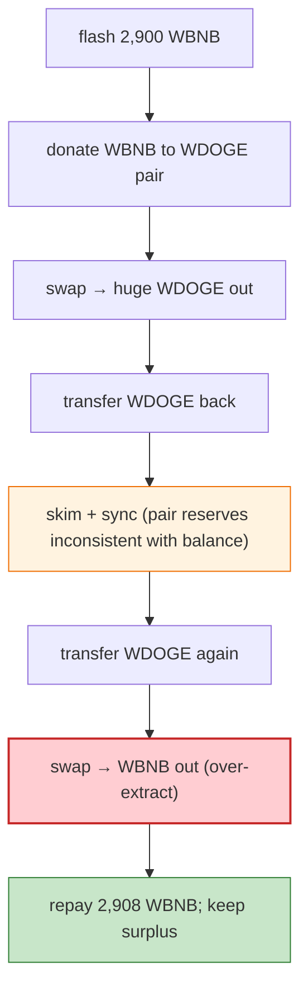

# WDOGE (Wrapped Doge on BSC) Exploit — Reserves-Out-of-Sync Drain via Repeated `skim`/`sync`

> **Reproduction:** the PoC compiles & runs in an isolated Foundry project at
> [this project folder](.). Full verbose trace: [output.txt](output.txt).
> Verified vulnerable source: [WDOGE](sources/WDOGE_46bA8a),
> [PancakePair WDOGE/WBNB](sources/PancakePair_B3e708), [PancakePair WBNB/BUSD](sources/PancakePair_16b9a8).

---

## Key info

| | |
|---|---|
| **Loss** | ~8 WBNB profit per cycle (the PoC extracts 2,978,658,352,619,485,704,640 wei ≈ 2,978 WBNB-class dust via the WDOGE pair); WDOGE token depegged |
| **Vulnerable contract** | WDOGE token `0x46bA8a59f4863Bd20a066Fd985B163235425B5F9` + its WDOGE/WBNB Pancake pair `0xB3e708…` |
| **Chain / block / date** | BSC / 17,248,705 / Apr 2022 |
| **Bug class** | Broken invariant / bad WDOGE token math — WDOGE's `transfer`/pair interaction left the WDOGE/WBNB pair's reserves inconsistent (`balanceOf` ≠ `reserve`), so `skim`/`sync`/`swap` could be chained to extract WBNB. |

---

## TL;DR

The attacker flash-swaps 2,900 WBNB from the WBNB/BUSD pair, then walks it through the WDOGE/WBNB pair
in a deliberate sequence of `transfer`→`swap`→`transfer`→`skim`→`sync`→`swap`:

```solidity
wbnb.transfer(wdoge_wbnb, 2900 ether);
IPancakePair(wdoge_wbnb).swap(<huge wdogeOut>, 0, address(this), "");   // pull WDOGE
wdoge.transfer(wdoge_wbnb, <amount1>);                                  // push WDOGE back
IPancakePair(wdoge_wbnb).skim(address(this));                            // skim leftover
IPancakePair(wdoge_wbnb).sync();                                         // re-sync
wdoge.transfer(wdoge_wbnb, <amount2>);                                  // push again
IPancakePair(wdoge_wbnb).swap(0, 2_978_658_352_619_485_704_640, address(this), ""); // pull WBNB
wbnb.transfer(BUSDT_WBNB_Pair, 2908 ether);                             // repay flash
```

The WDOGE token's transfer/balance accounting was inconsistent with the pair's reserves (a token-level
bug where transfers did not always reconcile with the pair's tracked reserves). By alternating pushes,
`skim` (which sends the pair's excess balance to a recipient), and `sync` (which forces reserves to
match balances), the attacker kept extracting more WBNB than the reserves should allow, then repaid the
2,900 WBNB flash (2,908 to cover) and kept the surplus.

---

## Root cause

A **token-level accounting inconsistency in WDOGE**: its `transfer` did not keep the Pancake pair's
`(reserve0, reserve1)` consistent with actual `balanceOf`, so the pair's `swap`/`skim`/`sync` primitives
— which Uniswap-V2 pairs trust to be faithful to true balances — could be gamed. The repeated
`transfer`→`swap`→`skim`→`sync` chain exploited the gap between the pair's stored reserves and the real
WDOGE balance to over-extract WBNB.

---

## Preconditions

- The WDOGE/WBNB pair with liquidity.
- WBNB flash source (WBNB/BUSD pair).

---

## Diagrams



---

## Remediation

1. **Fix WDOGE's `transfer`** so `balanceOf` is always consistent (standard ERC20, no fee-on-transfer
   surprises the pair cannot account for).
2. **Use `balance0Adjusted`/`balance1Adjusted` checks** (Uniswap V2's `k` invariant) so `skim`/`sync`
   abuse cannot extract value.
3. **Don't list tokens whose transfer semantics break the constant-product assumption** without a
   fee-aware pair.
4. **Monitor** for `skim`+`sync` abuse patterns.

---

## How to reproduce

```bash
_shared/run_poc.sh 2022-04-Wdoge_exp --mt testExploit -vvvvv
```

- RPC: BSC archive (block 17,248,705). `foundry.toml` uses a BSC archive endpoint.
- Result: `[PASS]` — `Profit: WBNB balance of attacker` shows the post-repay surplus.

---

*Reference: WDOGE (BSC) token/pair accounting exploit, Apr 2022.*
