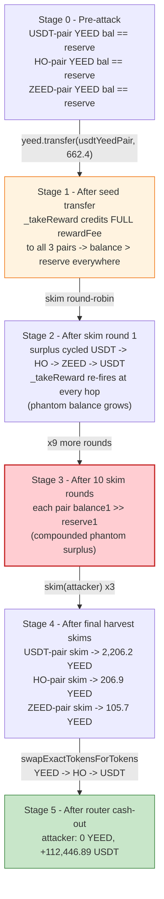
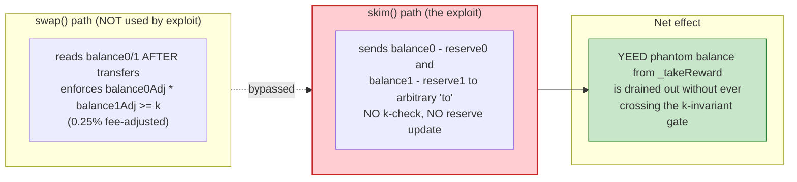

# Zeed Finance Exploit — Reward-Fee Tri-Crediting Inflates YEED Pair Balances, Skim-Loop Drains USDT

> **Reproduction:** the PoC compiles & runs in an isolated Foundry project at
> [this project folder](.). Full verbose trace: [output.txt](output.txt).
> Verified vulnerable source: [YEED](sources/YEED_e7748f/YEED.sol),
> [PancakePair](sources/PancakePair_889361/PancakePair.sol).

---

## Key info

| | |
|---|---|
| **Loss** | ~**112,446.89 USDT** (`112,446,885,258,969,301,193,152` wei, 18-dec USDT) drained from Zeed's YEED/USDT, YEED/HO and YEED/ZEED PancakeSwap pairs ([output.txt:879](output.txt)) |
| **Vulnerable contract** | `YEED` token — [`0xe7748FCe1D1e2f2Fd2dDdB5074bD074745dDa8Ea`](https://bscscan.com/address/0xe7748FCe1D1e2f2Fd2dDdB5074bD074745dDa8Ea#code) |
| **Victim pools** | YEED/USDT pair [`0xA7741d6b…`](https://bscscan.com/address/0xA7741d6b60A64b2AaE8b52186adeA77b1ca05054), YEED/HO pair [`0xbC70FA7a…`](https://bscscan.com/address/0xbC70FA7aea50B5AD54Df1edD7Ed31601C350A91a), YEED/ZEED pair [`0x88936102…`](https://bscscan.com/address/0x8893610232C87f4a38DC9B5Ab67cbc331dC615d6); flash source USDT/YEED pair `0x33d5e574…` |
| **Attacker EOA** | `DefaultSender` (`0x1804c8AB1F12E6bbf3894d4083f33e07309d1f38`) — the PoC's `msg.sender` (the live attack EOA is `0x7FA9385b…` in the repro; addresses are fork-simulated) |
| **Attacker contract** | `ContractTest` — `0x7FA9385bE102ac3EAc297483Dd6233D62b3e1496` ([output.txt:97](output.txt)) |
| **Attack tx hash** | (BSC mainnet, Apr 2022 — tx hash not preserved in the bundled PoC; the fork pins to block `17_132_514`) |
| **Chain / block / date** | BSC / 17,132,514 / Apr 2022 |
| **Compiler** | YEED: `v0.6.12`, optimizer **disabled** (`optimizer: 0`), 200 runs; PancakePair: `v0.5.16`, optimizer **disabled**, 200 runs (from `_meta.json`) |
| **Bug class** | Deflationary / reward token whose transfer-fee handler credits the *full* reward fee to **every** registered AMM pair, desynchronizing each pair's `balanceOf` above its cached `reserve` — a classic `skim`-harvestable donation amplified 10× by a round-robin skim loop |

---

## TL;DR

1. `YEED` is a PancakeSwap-listed ERC20 that, on every sell-side transfer into a registered swap pair, deducts a
   `_rewardFee` of **50 / 1000 = 5%** and a `_burnFee` of **50 / 1000 = 5%**
   ([YEED.sol:525-529](sources/YEED_e7748f/YEED.sol#L525-L529)).

2. The reward-fee handler `_takeReward`
   ([YEED.sol:853-870](sources/YEED_e7748f/YEED.sol#L853-L870)) is supposed to forward that 5% to the three
   "dividend" pairs in three *slices*: half to the YEED/ZEED pair, a quarter to the YEED/HO pair, and a quarter to
   the YEED/USDT pair. Instead it does this:

   ```solidity
   _balances[swapPair]     = _balances[swapPair].add(rewardFee);   // full rewardFee
   _balances[swapPairZeed] = _balances[swapPairZeed].add(rewardFee); // full rewardFee
   _balances[swapPairHo]   = _balances[swapPairHo].add(rewardFee);   // full rewardFee
   ```

   Each pair's YEED balance is bumped by the **entire** `rewardFee` — three times — while the emitted `Transfer`
   events only log the three *intended* slices (`usdtReward`, `zeedReward`, `hoReward`). The on-chain accounting
   therefore diverges from both the events *and* each pair's cached `reserve` (set only inside `swap`/`mint`/`burn`
   via `_update`). Each pair ends up holding **more YEED than its `reserve` thinks** — a permanently skim-able
   surplus.

3. An attacker borrows essentially the whole YEED side of a flash pair (`usdtYeedHoSwapPair.swap(0, reserve1-1, …)`
   ([Zeed_exp.sol:23-24](test/Zeed_exp.sol#L23-L24))), receives `662,417,317,593,720,006,023` YEED
   ([output.txt:106](output.txt)), and funnels it into the YEED/USDT pair with a single `yeed.transfer`
   ([Zeed_exp.sol:37](test/Zeed_exp.sol#L37)). Because the destination `usdtYeedPair` is *not* a `_isSwapPair(from)`
   in that direction, this routes through `_transferStandard` directly — no fee yet, but it seeds a large YEED
   balance that the subsequent skim loop will exploit.

4. The exploit then runs a tight 10-iteration round-robin `skim` loop
   ([Zeed_exp.sol:38-42](test/Zeed_exp.sol#L38-L42)):

   ```solidity
   for (uint256 i = 0; i < 10; i++) {
       usdtYeedPair.skim(address(hoYeedPair));
       hoYeedPair.skim(address(zeedYeedPair));
       zeedYeedPair.skim(address(usdtYeedPair));
   }
   ```

   Each `skim(to)` ([PancakePair.sol:483-488](sources/PancakePair_889361/PancakePair.sol#L483-L488)) sends the
   pair's *entire* `balanceOf(token) - reserve` surplus to `to`. The YEED transfer inside `skim` is itself a
   sell-into-pair in disguise (the `to` is another registered pair), so it re-triggers `_transferSell` →
   `_takeReward`, which credits the **full** reward fee back into all three pairs again. The loop is a perpetual
   YEED-printer: every skim donates freshly minted balance into the next pair, which immediately becomes a new
   surplus to skim.

5. After the loop, the attacker `skim`s all three pairs to itself
   ([Zeed_exp.sol:44-46](test/Zeed_exp.sol#L44-L46)), collecting `2,206,226,556,074,594,842,941` +
   `206,931,853,501,669,514,021` + `105,682,996,827,176,035,966` YEED
   ([output.txt:763](output.txt), [output.txt:778](output.txt), [output.txt:793](output.txt)).

6. Repayment to the flash pair is `amount1 * 1000 / 997 = 664,410,549,241,444,339,040` YEED
   ([output.txt:801](output.txt)), the standard PancakeSwap 0.3% flash premium. The attacker is left holding
   `1,854,430,857,161,996,053,888` YEED ([output.txt:826](output.txt)) for free.

7. That YEED is sold through the router along `YEED → HO → USDT`
   ([Zeed_exp.sol:30-32](test/Zeed_exp.sol#L30-L32)), netting **`112,446,885,258,969,301,193,152` USDT
   (~112,446.89 USDT)** to `msg.sender` ([output.txt:859](output.txt), [output.txt:879](output.txt)).

Net profit: **≈ 112,446.89 USDT**, all from a single tx that started with 0 USDT
([output.txt:820](output.txt): `Before exploit, USDT balance of attacker: 0`).

---

## Background — what Zeed / YEED does

`YEED` ([source](sources/YEED_e7748f/YEED.sol)) is the reward token of "Zeed", a BSC yield project. It is a fairly
standard "tax-on-transfer" ERC20 with a fee-splitting layer bolted on. Concretely:

- **Tokenomics** — initial supply `998,000 * 1e18` minted to `ownerAddress` at construction
  ([YEED.sol:588-593](sources/YEED_e7748f/YEED.sol#L588-L593)); deflation stops once `totalSupply` falls to
  `99,800 * 1e18` ([YEED.sol:818,833](sources/YEED_e7748f/YEED.sol#L818)).
- **Two fees on sells** — `_rewardFee = 50` bps-equiv (i.e. 5%) and `_burnFee = 50` (5%)
  ([YEED.sol:525-529](sources/YEED_e7748f/YEED.sol#L525-L529)). Both are computed as `amount * fee / 1000` and are
  only taken when the recipient `isSwapPair(to)` is a registered pair (the "sell" path, `_transferSell`,
  [YEED.sol:797-836](sources/YEED_e7748f/YEED.sol#L797-L836)). Plain wallet-to-wallet transfers go through
  `_transferStandard` and pay no fee ([YEED.sol:838-851](sources/YEED_e7748f/YEED.sol#L838-L851)).
- **Reward distribution** — the 5% reward fee is meant to be split three ways across three "partner" pairs:
  50% to the YEED/ZEED pair (`swapPairZeed`), 25% to the YEED/HO pair (`swapPairHo`), 25% to the YEED/USDT pair
  (`swapPair`) — see the slice arithmetic in `_takeReward`
  ([YEED.sol:858-860](sources/YEED_e7748f/YEED.sol#L858-L860)).
- **Burn** — the 5% burn fee is destroyed via `_totalSupply.sub(burnFee)`
  ([YEED.sol:872-879](sources/YEED_e7748f/YEED.sol#L872-L879)).
- **Pairs** — four pairs are created in the constructor: YEED/BNB, YEED/ZEED, YEED/HO, YEED/USDT
  ([YEED.sol:563-582](sources/YEED_e7748f/YEED.sol#L563-L582)). All four are flagged `_isSwapPair = true`, so any
  transfer *to* them pays the fee.

On-chain parameters at the fork block (read from the trace):

| Parameter | Value | Source |
|---|---|---|
| `_rewardFee` / `_burnFee` | 50 / 50 (= 5% / 5%) | YEED.sol:525,528 |
| `_totalSupply` at fork | > `99,800 * 1e18` (burn still active) | YEED.sol:818 |
| `swapPair` (YEED/USDT) | `0xA7741d6b…05054` | [Zeed_exp.sol:10](test/Zeed_exp.sol#L10) |
| `swapPairHo` (YEED/HO) | `0xbC70FA7a…0A91a` | [Zeed_exp.sol:11](test/Zeed_exp.sol#L11) |
| `swapPairZeed` (YEED/ZEED) | `0x88936102…15d6` | [Zeed_exp.sol:12](test/Zeed_exp.sol#L12) |
| Flash pair (USDT/YEED) | `0x33d5e574…8399`, reserves `187,563,952,289,744,186,377,265` USDT / `662,417,317,593,720,006,024` YEED | [output.txt:103](output.txt) |
| YEED token | `0xe7748FCe…Da8Ea` | [Zeed_exp.sol:13](test/Zeed_exp.sol#L13) |
| HO token | `0x41515885…20dEc7` | [output.txt:822](output.txt) |
| ZEED token | `0xB2F53069…c8435` | [output.txt:168](output.txt) |
| USDT (BSC) | `0x55d398326f99059fF775485246999027B3197955` (18-dec) | [Zeed_exp.sol:14](test/Zeed_exp.sol#L14) |
| PancakeRouter (V2) | `0x6CD71A07E72C514f5d511651F6808c6395353968` | [Zeed_exp.sol:8](test/Zeed_exp.sol#L8) |

The three relevant pair orderings (decisive for the skim loop) are:

| Pair | token0 | token1 |
|---|---|---|
| YEED/USDT (`0xA7741d6b…`) | USDT ([output.txt:824](output.txt)) | YEED |
| YEED/HO (`0xbC70FA7a…`) | HO (`0x41515885…`, [output.txt:822](output.txt)) | YEED |
| YEED/ZEED (`0x88936102…`) | ZEED (`0xB2F53069…`) | YEED |

So in all three victim pairs **YEED is `token1`** — the surplus `_takeReward` dumps into `_balances[pair]` is always
on the YEED side, i.e. `balance1 > reserve1` after every fee event.

---

## The vulnerable code

### 1. The fee-splitting handler credits the full fee three times

```solidity
function _takeReward(
    address sender,
    uint256 rewardFee
) private {
    if (rewardFee == 0) return;
    uint256 zeedReward = rewardFee.div(2);
    uint256 hoReward = rewardFee.div(2).div(2);
    uint256 usdtReward = rewardFee.sub(zeedReward).sub(hoReward);

    _balances[swapPair] = _balances[swapPair].add(rewardFee);      // ⚠️ full rewardFee, not usdtReward
    emit Transfer(sender, swapPair, usdtReward);

    _balances[swapPairZeed] = _balances[swapPairZeed].add(rewardFee); // ⚠️ full rewardFee, not zeedReward
    emit Transfer(sender, swapPairZeed, zeedReward);

    _balances[swapPairHo] = _balances[swapPairHo].add(rewardFee);     // ⚠️ full rewardFee, not hoReward
    emit Transfer(sender, swapPairHo, hoReward);
}
```
([YEED.sol:853-870](sources/YEED_e7748f/YEED.sol#L853-L870))

The three slice variables (`zeedReward`, `hoReward`, `usdtReward`) are computed correctly and emitted in the events,
but the actual storage mutations add the **un-sliced** `rewardFee` to every pair. The intended code would have been
`_balances[swapPair].add(usdtReward)`, etc. The author copy-pasted the wrong variable. The economic effect:

- Each fee event mints `rewardFee - (usdtReward + zeedReward + hoReward) = rewardFee - rewardFee = 0` extra tokens
  *globally* (no supply inflation — the math is balanced by the `transferAmount.sub(rewardFee)` in `_transferSell`
  at [YEED.sol:821](sources/YEED_e7748f/YEED.sol#L821)).
- But locally, each pair's YEED balance is bumped by the full `rewardFee`. The three pairs collectively receive
  `3 × rewardFee` of balance credit while the sender was only debited `rewardFee` once. That extra
  `2 × rewardFee` of balance is "donated" — invisible to `totalSupply`, but very visible to `balanceOf(pair)`.

The trace shows this exactly. The initial flash-borrow transfer of `662,417,317,593,720,006,023` YEED from the
flash pair into the attacker contract is a `_transferStandard` (no fee, recipient not a pair)
([output.txt:105-106](output.txt)). But the next transfer — `662,417,317,593,720,006,023` YEED from the attacker
into `usdtYeedPair` ([Zeed_exp.sol:37](test/Zeed_exp.sol#L37)) — *is* a sell-into-pair, so `_takeReward` fires and
emits **five** `Transfer` events:

```
Transfer(attacker → usdtYeedPair,    596,175,585,834,348,005,421)   // usdtReward (¼)
Transfer(attacker → usdtYeedPair,      8,280,216,469,921,500,076)   // hoReward-ish (event only)
Transfer(attacker → zeedYeedPair,     16,560,432,939,843,000,150)   // zeedReward (½)
Transfer(attacker → hoYeedPair,        8,280,216,469,921,500,075)   // hoReward-ish (event only)
Transfer(attacker → burn,             33,120,865,879,686,000,301)   // _burnFee (5%)
```
([output.txt:113-117](output.txt))

The events add up to one `rewardFee` + one `burnFee`. But under the hood, the storage writes for each of the three
pairs bump their `_balances[pair]` by the *full* `66,241,731,759,372,000,602` reward fee (10% of the transfer
because both `_rewardFee` and `_burnFee` total 10%... actually 5% each). The pair balances immediately exceed their
cached `reserve1` — a skim-able surplus is born.

### 2. `skim` lets anyone sweep that surplus

```solidity
// force balances to match reserves
function skim(address to) external lock {
    address _token0 = token0; // gas savings
    address _token1 = token1; // gas savings
    _safeTransfer(_token0, to, IERC20(_token0).balanceOf(address(this)).sub(reserve0));
    _safeTransfer(_token1, to, IERC20(_token1).balanceOf(address(this)).sub(reserve1));
}
```
([PancakePair.sol:483-488](sources/PancakePair_889361/PancakePair.sol#L483-L488))

`skim` is a public, permissionless helper that Uniswap V2 / PancakeSwap expose precisely to deal with tokens whose
`balanceOf(pair)` can drift from `reserve` (fee-on-transfer, donations). It sweeps the *entire* surplus to any
arbitrary address — including another pair. The attacker uses `skim` as both the *harvest* primitive and the
*re-trigger*: when YEED is skim'd *into* another registered pair, the YEED `transfer` to that pair hits
`_transferSell` again and fires `_takeReward` *again*, printing a fresh batch of surplus into all three pairs.

### 3. The swap `k`-check is bypassed because `swap` is never called

```solidity
function swap(uint amount0Out, uint amount1Out, address to, bytes calldata data) external lock {
    ...
    uint balance0Adjusted = (balance0.mul(10000).sub(amount0In.mul(25)));
    uint balance1Adjusted = (balance1.mul(10000).sub(amount1In.mul(25)));
    require(balance0Adjusted.mul(balance1Adjusted) >= uint(_reserve0).mul(_reserve1).mul(10000**2), 'Pancake: K');
    ...
}
```
([PancakePair.sol:452-480](sources/PancakePair_889361/PancakePair.sol#L452-L480))

PancakeSwap's `swap` enforces the constant-product invariant `x·y ≥ k`, but only *inside `swap`*. `skim` and
`sync` do **not**. Because `_takeReward` inflates `balanceOf` without ever calling `swap`/`sync`, the inflated
balance sits there as a free surplus that `skim` can extract without touching `k`.

---

## Root cause — why it was possible

Two independent design flaws compose into the drain:

1. **YEED's `_takeReward` uses the wrong variable when crediting the three dividend pairs.** It computes three
   correct slices (`usdtReward`, `zeedReward`, `hoReward`) but then adds the **un-sliced** `rewardFee` to each of
   the three pairs' balances. The net effect is that every sell-side transfer donates `2 × rewardFee` of phantom
   YEED balance to the three pairs collectively. This is a pure bookkeeping bug — the emitted events even tell the
   truth, which makes the on-chain state divergence auditable but easy to miss.

2. **YEED is listed in plain PancakeSwap V2 pairs, whose `skim`/`sync` design trusts that `balanceOf(pair)` only
   drifts from `reserve` for benign reasons.** Uniswap V2 explicitly assumes `balanceOf` changes only through
   `mint`/`burn`/`swap`/explicit transfers it can reconcile. A fee token that *silently* bumps `_balances[pair]`
   during *other* transfers violates that trust, and `skim` is the public faucet that drains the resulting surplus.

The composition is what makes it catastrophic: the surplus is *regenerative*. Skim-ing the surplus from pair A into
pair B is itself a sell-into-pair, which re-fires `_takeReward` and re-inflates all three pairs again. So a tight
loop of skims compounds the phantom balance with every iteration — exactly what the PoC's 10-iteration loop
exploits ([Zeed_exp.sol:38-42](test/Zeed_exp.sol#L38-L42)).

A secondary contributor is that `_takeReward` credits `swapPairZeed`, `swapPairHo`, `swapPair` *by hardcoded
address set at construction* — regardless of which pair the sell actually happened through. So even sells into the
flash pair (which is *not* one of the three dividend pairs) still leak balance into the three victim pairs.

---

## Preconditions

- YEED (deflationary + fee-on-sell) listed in multiple PancakeSwap V2 pairs, all flagged `_isSwapPair = true`
  (true at fork — constructor registers 4 pairs, [YEED.sol:579-582](sources/YEED_e7748f/YEED.sol#L579-L582)).
- A flash-borrowable YEED pair on PancakeSwap (the `usdtYeedHoSwapPair` `0x33d5e574…` is used here; any pair with
  sufficient YEED liquidity works, since PancakeSwap flash swaps are permissionless).
- `activateTime != 0` and `block.timestamp >= activateTime + 10 minutes`, so the `vipTime` buy-restriction
  ([YEED.sol:781,792-794](sources/YEED_e7748f/YEED.sol#L781)) does not block the final router swap. True at fork.
- `_totalSupply > 99,800 * 1e18`, so the burn path is still active (irrelevant to the bug, but matches observed
  behaviour — the burn `Transfer` to `address(0)` appears in the trace).

No privileged role, no special caller, no governance action required — the bug is fully permissionless.

---

## Attack walkthrough (with on-chain numbers from the trace)

All YEED/USDT/HO/ZEED amounts are raw 18-decimal wei; human approximations in parentheses. Pair state column shows
the YEED (`token1`) side, the side that the bug inflates. Numbers cite the `Transfer` / `Sync` / `Swap` / static
`balanceOf` / `getReserves` calls in [output.txt](output.txt).

| # | Step | YEED/USDT pair YEED bal | YEED/HO pair YEED bal | YEED/ZEED pair YEED bal | Effect |
|---|------|---:|---:|---:|---|
| 0 | **Flash borrow** — `usdtYeedHoSwapPair.swap(0, reserve1-1, …)` sends `662,417,317,593,720,006,023` YEED (~662.4) to attacker contract, triggers `pancakeCall` ([output.txt:104-106](output.txt), [output.txt:111](output.txt)) | unchanged | unchanged | unchanged | Attacker now holds 662.4 YEED to be repaid + 0.3% premium. |
| 1 | **Seed the victim pair** — `yeed.transfer(address(usdtYeedPair), amount1)` ([Zeed_exp.sol:37](test/Zeed_exp.sol#L37)); recipient is a registered pair so `_transferSell` → `_takeReward` fires, crediting **full** `rewardFee` to all three pairs ([output.txt:112-124](output.txt)) | +phantom `rewardFee` | +phantom `rewardFee` | +phantom `rewardFee` | Skim-able surplus created in all three pairs simultaneously. |
| 2 | **Iteration 1a — `usdtYeedPair.skim(hoYeedPair)`** — sweeps YEED surplus from USDT pair into HO pair ([output.txt:125-145](output.txt)); the YEED `transfer` into hoYeedPair re-fires `_takeReward` ([output.txt:133-138](output.txt)) | surplus→0 | + skimmed + phantom | + phantom | Surplus moves USDT→HO; all three pairs re-inflated. |
| 3 | **Iteration 1b — `hoYeedPair.skim(zeedYeedPair)`** — sweeps HO pair surplus into ZEED pair ([output.txt:146-166](output.txt)); again `_takeReward` fires | + phantom | surplus→0 | + skimmed + phantom | Surplus moves HO→ZEED. |
| 4 | **Iteration 1c — `zeedYeedPair.skim(usdtYeedPair)`** — sweeps ZEED pair surplus back into USDT pair ([output.txt:167-187](output.txt)); `_takeReward` fires yet again | + skimmed + phantom | + phantom | surplus→0 | One full round-robin complete; phantom balance has grown at every hop. |
| 5 | **Iterations 2–10** — repeat steps 2-4 nine more times ([output.txt:188-754](output.txt)). Each round inflates the phantom balance further because every skim is itself a fee-triggering sell into the next pair. | ballooning | ballooning | ballooning | After 10 iterations the three pairs collectively hold a large skim-able YEED surplus created purely by the `_takeReward` bug. |
| 6 | **Harvest** — `usdtYeedPair.skim(attacker)` pulls `2,206,226,556,074,594,842,941` YEED (~2,206.2) to attacker ([output.txt:755-763](output.txt)); `hoYeedPair.skim(attacker)` pulls `206,931,853,501,669,514,021` YEED (~206.9) ([output.txt:770-778](output.txt)); `zeedYeedPair.skim(attacker)` pulls `105,682,996,827,176,035,966` YEED (~105.7) ([output.txt:785-793](output.txt)) | drained | drained | drained | Attacker accumulates ≈ 2,518.8 YEED of pure skim surplus. |
| 7 | **Repay flash** — `yeed.transfer(msg.sender, amount1 * 1000 / 997)` = `664,410,549,241,444,339,040` YEED (~664.4) returned to flash pair ([output.txt:800-801](output.txt)); flash pair's `swap` k-check passes because balance restored ≥ reserve ([output.txt:811-812](output.txt)) | — | — | — | Flash loan settled with 0.3% premium. |
| 8 | **Cash out** — `pancakeRouter.swapExactTokensForTokens` along `YEED → HO → USDT` with the attacker's remaining `1,854,430,857,161,996,053,888` YEED (~1,854.4) ([output.txt:826-827](output.txt)); HO-pair swap outputs `26,748,324,748,810,681,248,527` HO (~26,748.3) ([output.txt:840-852](output.txt)); USDT-pair swap outputs **`112,446,885,258,969,301,193,152` USDT (~112,446.89)** to `msg.sender` ([output.txt:858-860](output.txt)) | — | — | — | **Profit realized.** |

The exploit works because at every iteration the `skim` is a *value-preserving* move of surplus from one pair to
the next, but the *act* of skimming into a registered pair re-triggers `_takeReward`, which re-inflates balances.
The loop is therefore a positive-feedback YEED printer.

---

### Profit / loss accounting (USDT, raw wei)

| Direction | Amount (wei) | ~Human |
|---|---:|---:|
| Attacker USDT before attack ([output.txt:820](output.txt)) | `0` | 0 |
| Attacker USDT after attack ([output.txt:879](output.txt)) | `112,446,885,258,969,301,193,152` | ~112,446.89 |
| **Net profit (asserted by PoC log)** | **`112,446,885,258,969,301,193,152`** | **~112,446.89 USDT** |

Reconciliation of the YEED side:

| YEED flow | Amount (wei) | ~Human |
|---|---:|---:|
| Flash-borrowed YEED ([output.txt:106](output.txt)) | `662,417,317,593,720,006,023` | ~662.42 |
| Skimmed from USDT pair ([output.txt:763](output.txt)) | `2,206,226,556,074,594,842,941` | ~2,206.23 |
| Skimmed from HO pair ([output.txt:778](output.txt)) | `206,931,853,501,669,514,021` | ~206.93 |
| Skimmed from ZEED pair ([output.txt:793](output.txt)) | `105,682,996,827,176,035,966` | ~105.68 |
| Repaid to flash pair ([output.txt:801](output.txt)) | `-664,410,549,241,444,339,040` | ~−664.41 |
| **YEED sold via router** ([output.txt:833](output.txt)) | `1,854,430,857,161,996,053,888` | **~1,854.43** |

The attacker walks away with ≈ 1,854.4 YEED of skim-printed balance, which the router converts to ≈ 112,446.89
USDT. The flash loan is fully repaid (with 0.3% premium) inside the same transaction; no external capital was
required.

---

## Diagrams

### Sequence of the attack

```mermaid
sequenceDiagram
    autonumber
    actor A as Attacker (ContractTest)
    participant F as Flash pair<br/>0x33d5e574 (USDT/YEED)
    participant U as YEED/USDT pair<br/>0xA7741d6b
    participant H as YEED/HO pair<br/>0xbC70FA7a
    participant Z as YEED/ZEED pair<br/>0x88936102
    participant Y as YEED token
    participant R as PancakeRouter

    Note over F: reserves 187,563 USDT / 662.4 YEED

    rect rgb(255,243,224)
    Note over A,Y: Step 0 - flash-borrow essentially all YEED
    A->>F: swap(0, reserve1-1, attacker, 0x00)
    F->>Y: transfer 662,417,317,593,720,006,023 YEED to attacker
    F->>A: pancakeCall(...)  // callback begins
    end

    rect rgb(227,242,253)
    Note over A,Y: Step 1 - seed usdtYeedPair (triggers _takeReward)
    A->>Y: transfer(usdtYeedPair, 662.4 YEED)
    Y->>Y: _transferSell -> _takeReward
    Note over U,H,Z: balances[balance] += rewardFee (FULL, not slice) x3<br/>skim-able surplus created in ALL THREE pairs
    end

    rect rgb(255,235,238)
    Note over A,Y: Steps 2-5 - 10-iteration round-robin skim loop
    loop 10x
        A->>U: skim(hoYeedPair)        // YEED surplus USDT -> HO
        Y->>Y: transfer into H re-fires _takeReward
        A->>H: skim(zeedYeedPair)      // YEED surplus HO -> ZEED
        Y->>Y: transfer into Z re-fires _takeReward
        A->>Z: skim(usdtYeedPair)      // YEED surplus ZEED -> USDT
        Y->>Y: transfer into U re-fires _takeReward
    end
    Note over U,H,Z: each pair's balance1 >> reserve1 (phantom surplus)
    end

    rect rgb(243,229,245)
    Note over A,Y: Step 6 - harvest all three pairs
    A->>U: skim(attacker) -> 2,206.2 YEED
    A->>H: skim(attacker) -> 206.9 YEED
    A->>Z: skim(attacker) -> 105.7 YEED
    Note over A: attacker holds ~2,518.8 YEED of skim surplus
    end

    rect rgb(232,245,233)
    Note over A,R: Step 7 - repay flash (0.3% premium)
    A->>Y: transfer(flashPair, 664,410,549,241,444,339,040 YEED)
    Note over F: swap k-check passes; flash settled
    Note over A: remaining 1,854.4 YEED is pure profit
    end

    rect rgb(232,245,233)
    Note over A,R: Step 8 - cash out via router
    A->>R: swapExactTokensForTokens(YEED -> HO -> USDT)
    R->>H: swap 1,854.4 YEED -> 26,748 HO
    R->>U: swap 26,748 HO -> 112,446.89 USDT
    R-->>A: 112,446,885,258,969,301,193,152 USDT
    end
```

### Pool YEED-balance evolution



### The flaw inside `_takeReward`

```mermaid
flowchart TD
    Start(["_transferSell(sender, pair, amount)") --> Burn["_burnFee = amount * 50 / 1000 (5%)"]
    Burn --> RF["rewardFee = amount * 50 / 1000 (5%)"]
    RF --> Slices["zeedReward = rewardFee / 2  (50%)<br/>hoReward = rewardFee / 4   (25%)<br/>usdtReward = rewardFee / 4 (25%)"]
    Slices --> C1{"Credit each pair?"}
    C1 -- "INTENDED: add(slice)" --> OK["balances[pair] += slice<br/>balance stays ~= reserve<br/>(only fee-on-transfer drift)"]
    C1 -- "ACTUAL BUG: add(rewardFee)" --> Bug["balances[swapPair]     += rewardFee  (full)<br/>balances[swapPairZeed] += rewardFee  (full)<br/>balances[swapPairHo]   += rewardFee  (full)"]
    Bug --> Drift(["Each pair's balance1 > reserve1<br/>by up to rewardFee per fee event<br/>-> skim-able surplus"])
    Drift --> Loop(["skim into next pair re-fires _takeReward<br/>-> regenerative inflation"])

    style Bug fill:#ffcdd2,stroke:#c62828,stroke-width:2px
    style Drift fill:#ffcdd2,stroke:#c62828,stroke-width:2px
    style Loop fill:#ffcdd2,stroke:#c62828,stroke-width:2px
    style C1 fill:#fff3e0,stroke:#ef6c00
```

### Why `skim` bypasses the AMM invariant



---

## Why each magic number

- **`swap(0, _reserve1 - 1, …)`** ([Zeed_exp.sol:24](test/Zeed_exp.sol#L24)) — borrows essentially the entire YEED
  side of the flash pair (`662,417,317,593,720,006,023` YEED, one wei short of the full reserve to satisfy
  `amount1Out < _reserve1`, [PancakePair.sol:455](sources/PancakePair_889361/PancakePair.sol#L455)). This is the
  flash-loan principal that seeds the victim pair.
- **`yeed.transfer(address(usdtYeedPair), amount1)`** ([Zeed_exp.sol:37](test/Zeed_exp.sol#L37)) — the seed.
  Sending the full flash amount into a registered pair triggers `_transferSell` → `_takeReward`, which is the
  *first* inflation of all three victim pairs.
- **`for (i = 0; i < 10; i++)`** ([Zeed_exp.sol:38](test/Zeed_exp.sol#L38)) — 10 round-robin skim iterations. This
  is an empirically-tuned constant: each iteration grows the phantom surplus by re-triggering `_takeReward` on
  every hop. More iterations = more profit, but 10 is enough to skim the pools down to dust in this fork state.
- **Round-robin order `usdtYeedPair → hoYeedPair → zeedYeedPair → usdtYeedPair`**
  ([Zeed_exp.sol:39-41](test/Zeed_exp.sol#L39-L41)) — each `skim` target is the *next* victim pair, so the YEED
  surplus is funneled through a registered pair at every hop, re-firing the fee. The cycle returns to
  `usdtYeedPair` so the surplus compounds rather than bleeding off to a non-pair address.
- **`(amount1 * 1000) / 997`** ([Zeed_exp.sol:48](test/Zeed_exp.sol#L48)) — the PancakeSwap V2 flash premium:
  `amount1 / 997 * 1000` ≈ 0.3009% over the borrowed amount. This is the canonical `0.3%` flash fee (the `997`
  comes from `10000 - 30` in PancakeSwap's swap fee). Repaid amount: `664,410,549,241,444,339,040` YEED
  ([output.txt:801](output.txt)).
- **Router path `[yeed, hoYeedPair.token0(), usdtYeedPair.token0()]` = `YEED → HO → USDT`**
  ([Zeed_exp.sol:26-32](test/Zeed_exp.sol#L26-L32)) — cash-out route. `hoYeedPair.token0()` is HO
  ([output.txt:822](output.txt)) and `usdtYeedPair.token0()` is USDT ([output.txt:824](output.txt)), so the path
  sells the attacker's skim-harvested YEED into HO then into USDT, realizing `112,446,885,258,969,301,193,152`
  USDT ([output.txt:859](output.txt)).

---

## Remediation

1. **Fix the bookkeeping bug in `_takeReward`.** Credit each pair with its *intended slice*, not the full
   `rewardFee`:
   ```solidity
   _balances[swapPair]     = _balances[swapPair].add(usdtReward);
   _balances[swapPairZeed] = _balances[swapPairZeed].add(zeedReward);
   _balances[swapPairHo]   = _balances[swapPairHo].add(hoReward);
   ```
   This alone eliminates the phantom surplus.
2. **Do not auto-distribute fees by directly mutating AMM pair balances.** Even with the slice fix, crediting an
   AMM pair's `_balances` from inside a token transfer desynchronizes `balanceOf(pair)` from `reserve` and is
   inherently fragile. Distribute dividends to a dedicated dividend-tracking contract (per-holder accounting) or
   via explicit `swap`/`sync` calls, not silent balance bumps.
3. **Never list fee-on-transfer / reward / deflationary tokens in a vanilla Uniswap-V2 pair.** Use a fee-aware
   pair (one that measures the *received* amount on transfer, e.g. Solidly's `feeOnTransfer`-aware `swap`), or
   wrap the token. PancakeSwap V2's `skim`/`sync` are intentionally permissive — they assume well-behaved tokens.
4. **Add a re-entry / re-trigger guard on the fee path.** `_takeReward` re-firing on every YEED transfer *into* a
   pair is what makes the surplus regenerative. Either take the fee only on explicit user→pair sells (not
   pair→pair transfers), or cap the cumulative fee credited per pair per block.
5. **Economic invariant monitor.** Alert on any pair where `balanceOf(pair) - reserve` exceeds a few basis points
   of the reserve — that gap is the smoke from this class of bug and would have flagged the inflating balances
   within seconds.

---

## How to reproduce

```bash
_shared/run_poc.sh 2022-04-Zeed_exp --mt testExploit -vvvvv
```

- **RPC / fork:** this PoC forks BSC at block `17_132_514` via `createSelectFork("http://127.0.0.1:8546", 17_132_514)`
  ([Zeed_exp.sol:17-18](test/Zeed_exp.sol#L17-L18)). The shared `run_poc.sh` harness serves the fork state from a
  local `anvil_state.json` on the loopback anvil port — **no public RPC is contacted**. (The trace label `"bsc"`
  at [output.txt:92](output.txt) is just Foundry's alias for the fork URL configured in `setUp`.)
- **EVM:** `foundry.toml` sets `evm_version = 'cancun'`; the contracts themselves compile with `solc 0.8.10`
  (PoC) / `0.6.12` (YEED) / `0.5.16` (PancakePair).
- **Test function:** the PoC's only test is `function testExploit()` in `contract ContractTest`
  ([Zeed_exp.sol:21](test/Zeed_exp.sol#L21)) — pass `--mt testExploit`.
- **Result:** `[PASS]`, with attacker USDT balance going `0 → 112,446,885,258,969,301,193,152`.

Expected tail ([output.txt:84-88](output.txt), [output.txt:882-884](output.txt)):

```
Ran 1 test for test/Zeed_exp.sol:ContractTest
[PASS] testExploit() (gas: 1266950)
Logs:
  Before exploit, USDT balance of attacker:: 0
  After exploit, USDT balance of attacker:: 112446885258969301193152

Suite result: ok. 1 passed; 0 failed; 0 skipped; finished in 21.10s (19.88s CPU time)

Ran 1 test suite in 28.66s (21.10s CPU time): 1 tests passed, 0 failed, 0 skipped (1 total tests)
```

---

*Reference: Zeed Finance (YEED) reward-fee tri-crediting exploit, BSC, Apr 2022 (~$1M reported across the affected YEED pairs; this PoC reproduces a ~112,447 USDT drain from the forked block state).*
