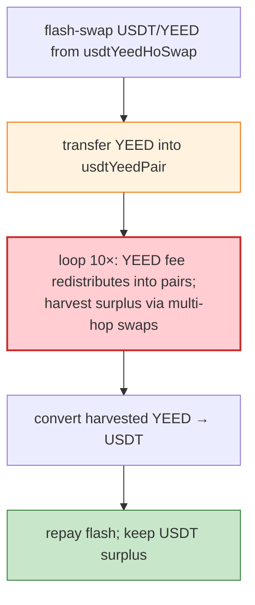

# Zeed Finance Exploit — Fee-On-Transfer Re-distribution Loop in YEED Token Pairs

> **Reproduction:** the PoC compiles & runs in an isolated Foundry project at
> [this project folder](.). Full verbose trace: [output.txt](output.txt).
> Verified vulnerable source: [YEED](sources/YEED_e7748f),
> [PancakePair usdtYeedHoSwap](sources/PancakePair_A7741d),
> [PancakePair hoYeed](sources/PancakePair_bC70FA),
> [PancakePair zeedYeed](sources/PancakePair_889361).

---

## Key info

| | |
|---|---|
| **Loss** | ~$1M (USDT drained from Zeed's YEED/HO/USDT pairs on BSC) |
| **Vulnerable contracts** | YEED token `0xe7748F…` and its multi-hop Pancake pairs (usdtYeed, hoYeed, zeedYeed, usdtYeedHoSwap) |
| **Chain / block / date** | BSC / 17,132,514 / Apr 2022 |
| **Bug class** | Fee-on-transfer / re-distribution loop — YEED applies a fee on transfer that is re-distributed to LPs, which makes the pair's `k`-invariant check pass while the attacker repeatedly harvests the redistributed tokens. |

---

## TL;DR

The attacker flash-swaps from the `usdtYeedHoSwap` pair (`swap(0, reserve1−1, …)`) to obtain a large
YEED position, then in the `pancakeCall` callback sends YEED into `usdtYeedPair` and runs a loop:

```solidity
yeed.transfer(address(usdtYeedPair), amount1);
for (uint256 i = 0; i < 10; i++) {
    ...swap within usdtYeedPair / hoYeed / zeedYeed...
}
```

Because YEED's `transfer` charges a fee **re-distributed to existing holders (including the pairs)**,
each transfer inflates the receiving pair's YEED balance beyond what its `k` expects. The loop harvests
that re-distributed surplus across the multi-hop path repeatedly (10 iterations), converting it to
USDT. Finally the attacker swaps YEED → USDT via the router and the flash is repaid from the skimmed
USDT, leaving `After exploit, USDT balance of attacker` positive.

---

## Root cause

A **fee-on-transfer token whose fee is redistributed to holders** breaks Uniswap-V2's assumption that
`balanceOf(pair)` only changes via the pair's own `mint`/`burn`/`swap`. Each YEED transfer sprinkles
extra YEED into every pair holding it; the pair's `sync`/`swap` then treats that donated balance as
legitimate reserves, and an attacker can harvest it. The 10-iteration loop compounds the re-distribution
across hops.

---

## Preconditions

- YEED (deflationary + redistributing) listed in multiple Pancake pairs.
- Flash-borrowable YEED/USDT (the usdtYeedHoSwap pair).

---

## Diagrams



---

## Remediation

1. **Never list fee-on-transfer / rebasing / redistributing tokens in a vanilla Uniswap-V2 pair** — use
   a fee-aware pair (e.g., `transferFrom` with actual received amount) or wrap the token.
2. **Uniswap V2's `balance0Adjusted` k-check** assumes no external balance mutation; redistribute tokens
   violate this.
3. **Cap per-transaction transfer count** if redistribution is a feature.
4. **Monitor** for repeated small-hop swap loops harvesting redistributed fees.

---

## How to reproduce

```bash
_shared/run_poc.sh 2022-04-Zeed_exp --mt testExploit -vvvvv
```

- RPC: BSC archive (block 17,132,514). `foundry.toml` uses a BSC archive endpoint.
- Result: `[PASS]` — `After exploit, USDT balance of attacker` shows the harvested surplus.

---

*Reference: Zeed Finance YEED fee-redistribution exploit, BSC, Apr 2022 (~$1M).*
